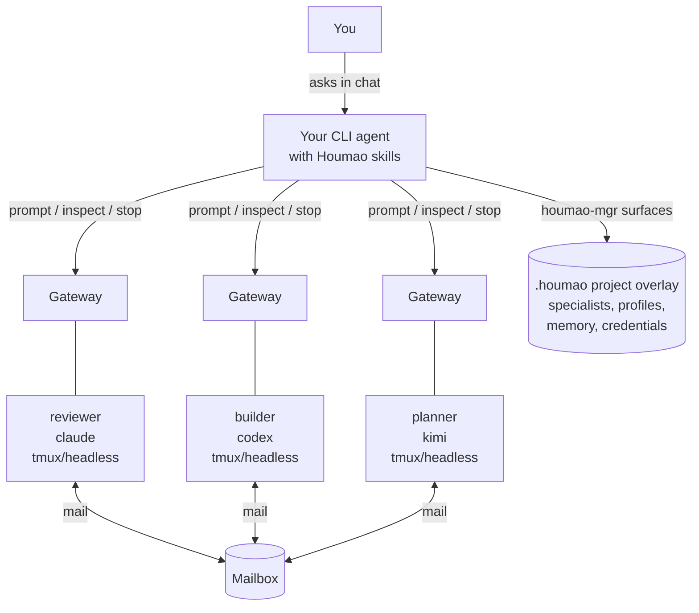

# Houmao
> A framework and CLI toolkit for orchestrating teams of loosely-coupled AI agents.

Project docs: [https://igamenovoer.github.io/houmao/](https://igamenovoer.github.io/houmao/)

## What It Is

`Houmao` builds and runs teams of CLI-based AI agents. Launch-capable agents use real provider CLIs such as `claude`, `codex`, and `kimi`; `copilot` is supported as a system-skill installation target. Each managed agent is a real process with its own tmux session, disk state, memory, native TUI or headless turn evidence, optional gateway sidecar, and mailbox identity. You define reusable **specialists**, launch them as managed agents, and coordinate them through prompts, gateways, mailboxes, and structured loop plans.

> **Name Origin:** `Houmao` (猴毛, "monkey hair") is inspired by the classic tale *Journey to the West*. Just as Sun Wukong (The Monkey King) plucks strands of his magical hair to create independent, capable clones of himself, this framework allows you to multiply your capabilities by spinning up numerous autonomous helpers.

## Why This Design

- **Use agents like teammates.** A specialist is a named role with tool, credentials, skills, and launch defaults. A managed agent is that specialist alive in a real CLI session.
- **Let your CLI agent operate the system.** Install Houmao skills into Claude, Codex, Kimi, or Copilot, then ask that agent to create specialists, launch agents, inspect state, send prompts, manage gateways, and run loops.
- **Avoid central fragile orchestration.** Agents coordinate through per-agent gateways and shared mailboxes instead of one in-process object graph.
- **Keep full provider capability.** Houmao does not replace the underlying CLI; it gives you lifecycle, memory, gateway, mailbox, and team-control structure around it.
- **Scale from one helper to generated teams.** Start with one reviewer, add a second specialist, then ask `$houmao-admin-entrypoint agent-loop-pro ...` to prepare and run the team.

## Architecture at a Glance



The normal user experience is conversational: your current CLI agent reads Houmao system skills and drives the supported `houmao-mgr` surfaces for you. Direct CLI use remains supported and documented, but the README assumes the user usually drives Houmao through an agent.

## Quick Start

```bash
uv tool install houmao
command -v tmux
houmao-mgr system-skills install --tool codex --pack admin
```

`tmux` is required because managed agents run inside tmux-backed sessions. Replace `codex` with `claude`, `copilot`, `kimi`, or `universal` for another supported skill host. The complete admin pack installs `houmao-admin-welcome` and `houmao-admin-entrypoint` together.

Use `--home` only when you need to override the target's normal home. Repeat `--pack` to install both actor packs, and use `system-skills upgrade` when migrating an older flat installation:

```bash
houmao-mgr system-skills install --tool claude,codex,kimi,copilot,universal --pack admin
houmao-mgr system-skills install --tool codex --home ~/.codex --pack admin --pack agent
houmao-mgr system-skills upgrade --tool codex --home ~/.codex --pack admin
```

The welcome and both entrypoints support read-only help. Ask `$houmao-admin-welcome help` for orientation, `$houmao-admin-entrypoint help` for human-operator execution routes, or `$houmao-agent-entrypoint help` from a managed-agent session. Skill help is separate from the `houmao-mgr system-skills` lifecycle CLI.

Now start your CLI agent from the project directory and ask:

```text
$houmao-admin-welcome start-guided-tour
```

The tour walks through beginner setup, intermediate live operation, and advanced coordination. For exact install flags and home-resolution behavior, see the [System Skills Overview](docs/getting-started/system-skills-overview.md) and [System Skills CLI reference](docs/reference/cli/system-skills.md).

> **Kimi Code role-prompt note:** Maintained Kimi Code 0.23.x launches deliver Houmao role context through managed bootstrap or auto-skill workflows. Houmao projects `houmao-auto-system-prompt` into managed Kimi homes; invoke it before substantive chat if the role prompt is not confirmed loaded.

## Agent-Driven Examples

### First Managed Agent

```text
You: Create a Codex backend reviewer specialist for this repo, make a reusable easy launch profile, launch it, and ask it to review the last commit.

AI: Done.
    - initialized or inspected the Houmao project overlay
    - created or selected specialist `backend-reviewer`
    - prepared project profile `backend-reviewer-default`
    - launched managed agent `reviewer-1`
    - attached or discovered its gateway
    - sent the review prompt through the maintained messaging surface
```

Behind that exchange, the agent may use commands such as `houmao-mgr project init`, `houmao-mgr project specialist ...`, `houmao-mgr project profile ...`, and `houmao-mgr agents prompt ...`. You do not need those command shapes for the first experience. They are documented in the [Easy Specialists guide](docs/getting-started/easy-specialists.md), [Launch Profiles guide](docs/getting-started/launch-profiles.md), and [`houmao-mgr` CLI reference](docs/reference/cli/houmao-mgr.md).

### Gateway Interaction

```text
You: Ask reviewer-1 whether the migration is safe, then show me its current state.

AI: Sent the prompt through reviewer-1's gateway and inspected the managed-agent state.
    It is running, the last turn is complete, and the response is ready.
```

Gateway-backed interaction gives your user agent a stable way to prompt, interrupt, inspect, queue work, watch TUI state, and use mailbox facades without taking over the provider CLI by hand. See the [Gateway CLI reference](docs/reference/cli/agents-gateway.md) and [managed memory guide](docs/getting-started/managed-memory-dirs.md) when you want the direct surfaces.

## Core Concepts

| Concept | Mental model |
|---|---|
| User CLI agent | The agent you are talking to now. It has Houmao skills installed and can operate Houmao for you. |
| Specialist | A reusable role/tool/credential definition: "backend reviewer", "story writer", "researcher", "release engineer". |
| Project profile | Reusable launch defaults over one specialist: managed-agent name, working directory, credential lane, mailbox posture, prompt mode, and optional skill policy. |
| Managed agent | A live agent launched or adopted by Houmao, backed by tmux/headless runtime state and visible through `agents list`, gateway, mail, memory, and inspection surfaces. |
| Gateway | A per-agent sidecar for prompt delivery, interrupts, request queues, TUI/headless state, reminders, and mailbox facades. |
| Mailbox | A shared async communication layer so agents can send structured work, replies, and wakeup messages without a central orchestrator. |
| Loop | A generated multi-agent operating plan. The user agent stays outside the execution loop and uses loop skills to author, validate, launch, observe, pause, resume, recover, or stop it. |

Project state lives under a `.houmao/` overlay with specialists, profiles, credentials, projected content, mailbox roots, memory, and catalog metadata. The admin welcome can explain that overlay, while concrete work routes through `$houmao-admin-entrypoint project-mgr ...`; direct details live in the [getting-started docs](docs/getting-started/quickstart.md).

## Agent Loops

This is where Houmao starts to feel different from a wrapper around one CLI. Invoke the public `$houmao-agent-loop-pro` skill with a complex multi-agent plan, and your CLI agent can turn it into a runnable team workflow:

```text
You: $houmao-agent-loop-pro create a loop for this plan:
     three agents should design, implement, and review a migration.
     The planner decomposes the work, the builder edits code, the reviewer checks behavior,
     and the team should stop only after tests and review notes are complete.

AI: I created the loop intention, clarified the topology, generated the execplan, prepared specialists and launch profiles, checked workspace and mailbox/gateway posture, launched the participants, started the run, and I will report status from outside the execution loop.
```

The top-level `houmao-agent-loop-pro` skill owns the schema-rich path: intention clarification, `tree-loop` versus `generic-loop` topology choice, generated process and contract artifacts, harness/state contracts, generated skills, workspace readiness, validation, launch, run control, and recovery. The public `houmao-agent-loop-lite` sibling is the lighter Markdown/direct-SQL path for smaller generated loops that still use the same intention/execplan/runs spine without JSON schemas, Jinja2, or generated harnesses. Both loops require explicit manual invocation and an explicit `<loop-dir>` before filesystem work.

The reusable [`examples/writer-team/`](examples/writer-team/) template shows a three-agent story-writing team with prompt files, a tree loop plan, start charter, local setup commands, and artifact directories. It is the team shown here: a **story-writer** drafts and finalizes chapters, a **character-designer** builds profiles, and a **story-reviewer** checks logic and pacing while the human operator watches from outside the loop.

https://github.com/user-attachments/assets/6cff608a-8b5b-4dcd-96fb-f2f0208a18b6

For the full current loop-authoring workflow, see the [Loop Authoring Guide](docs/getting-started/loop-authoring.md) and the [System Skills Overview](docs/getting-started/system-skills-overview.md).

## Typical Use Cases

- **Multi-agent execution loops:** turn a complex plan into a generated team run with explicit participants, workspace posture, mail/gateway readiness, status, pause, resume, recovery, and stop controls.
- **Project-local specialist teams:** define reusable specialists with different roles and tools, then launch them into the same project with shared mailbox and gateway posture.
- **Parallel review and build flows:** run a builder and reviewer side by side on the same repository while your user agent coordinates prompts and inspections.
- **Research or writing teams:** create non-coding specialists for outlining, drafting, critique, synthesis, and artifact production.
- **Bring your own provider mix:** combine Claude, Codex, and Kimi agents while keeping the workflow and Houmao control surfaces stable.

## System Skills: Static Actor-Aware Collection

Houmao ships six complete, host-discoverable system skills. Each directory works at rest and can be copied or installed with a standard Agent Skills tool; Houmao does not assemble skill Markdown at runtime.

| Standalone skill | Pack Membership | Role |
|---|---|---|
| `houmao-admin-welcome` | `admin` | Explicit manual, read-only first-use orientation with five guided paths. Start with `$houmao-admin-welcome start-guided-tour`. |
| `houmao-admin-entrypoint` | `admin` | Implicit human-operator router for any semantically Houmao-related request. Informational requests stay local; operational work keeps the admin frame and requires explicit targets. |
| `houmao-agent-entrypoint` | `agent` | Implicit managed-session router for any semantically Houmao-related request. Informational requests stay local; operational work requires fresh identity before routing. |
| `houmao-shared-routines` | `admin`, `agent` | Public advanced router that owns sixteen parent-scoped ordinary routines. Direct calls default to admin posture; leading `as-agent` requires fresh managed-self verification. |
| `houmao-agent-loop-pro` | `admin`, `agent` | Explicit manual entrypoint for schema-rich loop authoring and run control. |
| `houmao-agent-loop-lite` | `admin`, `agent` | Explicit manual entrypoint for Markdown/direct-SQL loop authoring and run control. |

The complete admin pack installs five roots: welcome, admin entrypoint, shared routines, pro loop, and lite loop. The complete agent pack installs four roots: agent entrypoint, shared routines, pro loop, and lite loop. The two actor entrypoints are the only implicit public roots. Explicit `$houmao-*` handles still select the named installed skill. Welcome, shared routines, and both loops remain explicit-only initial roots. Actor entrypoints route operational ordinary work to the shared sibling and explicitly distinguished loop work to the two top-level loop siblings. The shared router loads one child such as `houmao-shared-routines->houmao-agent-inspect`; its sixteen `SKILL-MAIN.md` children are parent-scoped routines, not separately installed peers.

Use Houmao's receipt-aware manager for the normal installation path:

```bash
houmao-mgr system-skills install --tool codex --pack admin
houmao-mgr system-skills install --tool codex --pack agent
houmao-mgr system-skills doctor --tool codex --pack agent
```

Omitting `--pack` on the external install command selects `admin`. Managed launch, relaunch, rebuild, and join select `agent`. The manager resolves full pack membership, records shared owners, and preserves shared roots until their final owning pack is removed.

The static collection also supports ordinary Skills CLI installation. Standard installers select independent directories and do not resolve Houmao pack dependencies, so include every sibling explicitly. From a source checkout:

```bash
npx skills add ./src/houmao/agents/assets/system_skills/public --list
npx skills add ./src/houmao/agents/assets/system_skills/public --agent codex --skill '*' --yes

# Five-member admin surface
npx skills add ./src/houmao/agents/assets/system_skills/public --agent codex --skill houmao-admin-welcome --skill houmao-admin-entrypoint --skill houmao-shared-routines --skill houmao-agent-loop-pro --skill houmao-agent-loop-lite --yes

# Four-member agent surface
npx skills add ./src/houmao/agents/assets/system_skills/public --agent codex --skill houmao-agent-entrypoint --skill houmao-shared-routines --skill houmao-agent-loop-pro --skill houmao-agent-loop-lite --yes
```

For copy-paste installation, copy the same five admin directories or four agent directories into the host's skill root. Copying all six is also valid. These installations have no Houmao ownership receipt.

Natural Houmao requests select the actor entrypoint that matches the execution context: a raw human-operator session uses admin, while a genuine managed session uses agent. Prompt wording alone cannot switch actors when both packs are installed. Normal human work may also use `$houmao-admin-entrypoint agent-inspect ...`; managed self may use `$houmao-agent-entrypoint agent-email-comms ...`. Advanced users may bypass entrypoint route selection with `$houmao-shared-routines agent-inspect ...` or `$houmao-shared-routines as-agent agent-inspect ...`; target and identity checks still apply. Invoke welcome and loops manually as `$houmao-admin-welcome ...`, `$houmao-agent-loop-pro <operation> <loop-dir>`, or `$houmao-agent-loop-lite <operation> <loop-dir>`.

Stored specialist and profile policy uses `packs: [admin|agent]`; individual skill and `core`/`extensions`/`all` selectors are removed. The `specialist-mgr` route remains a compatibility alias for `agent-definition`, and the old touring surface maps to `houmao-admin-welcome`. `houmao-auto-system-prompt` remains a separate managed auto skill and never enters the public collection or a pack receipt. See the [System Skills Overview](docs/getting-started/system-skills-overview.md) for the route matrix and the [System Skills CLI reference](docs/reference/cli/system-skills.md) for release metadata, doctor, receipts, v3 upgrade, status, and uninstall.

## Subsystems at a Glance

| Subsystem | Description | Docs |
|---|---|---|
| Gateway | Per-agent sidecar for session control, request queue, TUI/headless state, reminders, and mail facade | [Gateway Reference](docs/reference/gateway/index.md) |
| Mailbox | Unified async message transport through filesystem and Stalwart JMAP backends | [Mailbox Reference](docs/reference/mailbox/index.md) |
| TUI Tracking | State machine, detectors, and replay engine for tracking provider TUI state | [TUI Tracking Reference](docs/reference/tui-tracking/state-model.md) |
| Passive Server | Registry-driven stateless server for distributed agent discovery, observation, and management | [Passive Server Reference](docs/reference/cli/houmao-passive-server.md) |

## Demos and Examples

- [`examples/writer-team/`](examples/writer-team/) - Complete tree-loop template for the three-agent story-writing team shown above.
- [`scripts/demo/minimal-agent-launch/`](scripts/demo/minimal-agent-launch/) - Recipe-backed headless launch with Claude or Codex.
- [`scripts/demo/single-agent-mail-wakeup/`](scripts/demo/single-agent-mail-wakeup/) - Specialist plus gateway and mailbox-notifier wakeup.
- [`scripts/demo/single-agent-gateway-wakeup-headless/`](scripts/demo/single-agent-gateway-wakeup-headless/) - Headless specialist with gateway wakeup and turn evidence.
- [`scripts/demo/shared-tui-tracking-demo-pack/`](scripts/demo/shared-tui-tracking-demo-pack/) - Standalone tracked-TUI capture, watch, and replay validation.

## CLI Entry Points

| Entrypoint | Purpose | Status |
|---|---|---|
| `houmao-mgr` | Primary operator CLI for project setup, specialists/profiles, launch, prompt, gateway, mailbox, memory, credentials, and local workflow control | **Active** |
| `houmao-passive-server` | Maintained registry-driven API server for discovering, observing, and managing running agents | **Active** |

Detailed command syntax lives in the [`houmao-mgr` CLI reference](docs/reference/cli/houmao-mgr.md), [System Skills CLI reference](docs/reference/cli/system-skills.md), [agents mail reference](docs/reference/cli/agents-mail.md), [agents gateway reference](docs/reference/cli/agents-gateway.md), and [internals graph reference](docs/reference/cli/internals.md). If you already have a provider TUI running and want Houmao management on top, use the documented `agents join` adoption path rather than treating it as the default first-run flow.

```bash
houmao-mgr --help
houmao-mgr --version
houmao-passive-server --help
```

## Full Documentation

Complete reference, guides, and developer docs are published at **[igamenovoer.github.io/houmao](https://igamenovoer.github.io/houmao/)**.

## Development

```bash
pixi run format
pixi run lint
pixi run typecheck
pixi run test-runtime
pixi run docs-serve
```

---

> **Legacy note:** Houmao was originally inspired by [CAO (CLI Agent Orchestrator)](https://github.com/awslabs/cli-agent-orchestrator). Legacy `houmao-cli`, standalone `houmao-server`, and `cao_rest` backend paths are retired. Use `houmao-mgr`, `houmao-passive-server`, and local/headless managed-agent workflows instead.
