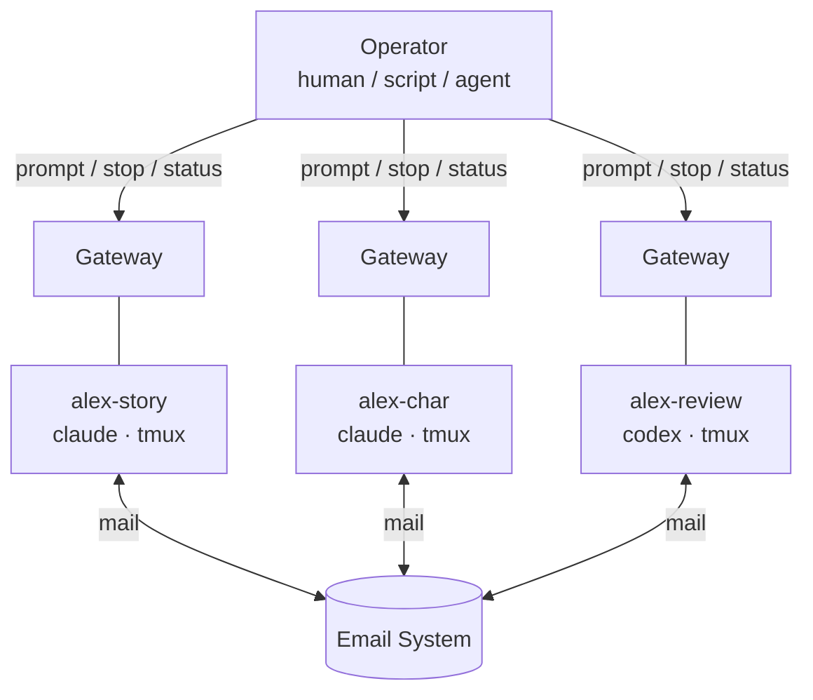
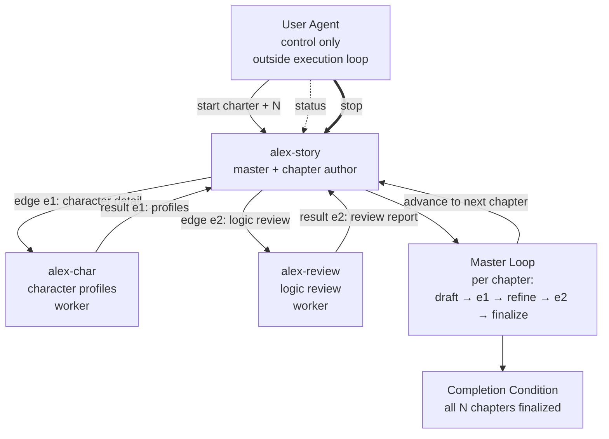
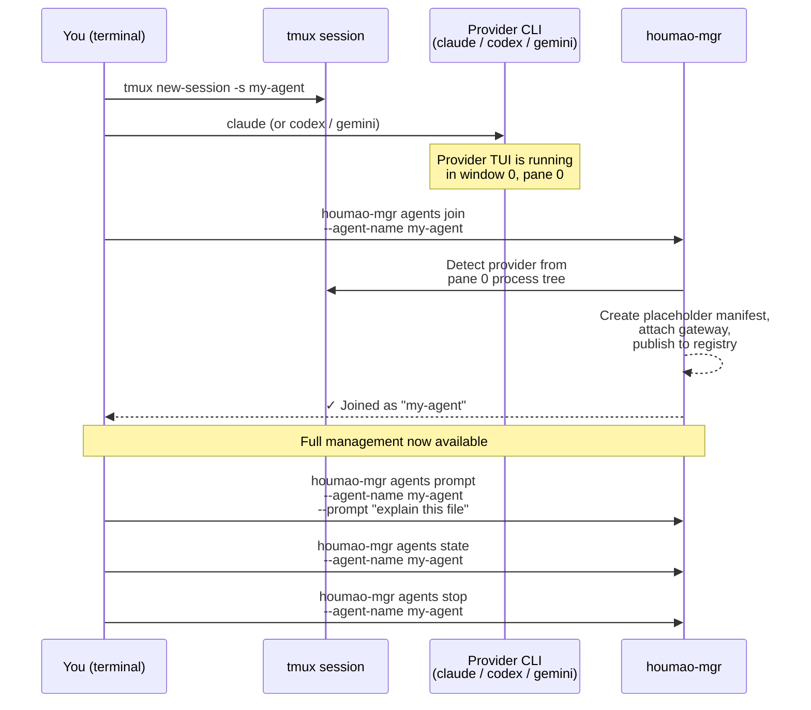

# Houmao
> A framework and CLI toolkit for orchestrating teams of loosely-coupled AI agents.

Project docs: [https://igamenovoer.github.io/houmao/](https://igamenovoer.github.io/houmao/)

## What It Is

`Houmao` is a framework and CLI toolkit for building and running **teams of CLI-based AI agents** (`claude`, `codex`, `gemini`). Every agent is a real CLI process with its own isolated disk state, memory, and native TUI — not an in-process object graph. You define agents as **specialists** with roles and credentials, and coordinate them through mailbox-based messaging, per-agent gateways, and structured **loop plans**.

> **Name Origin:** `Houmao` (猴毛, "monkey hair") is inspired by the classic tale *Journey to the West*. Just as Sun Wukong (The Monkey King) plucks strands of his magical hair to create independent, capable clones of himself, this framework allows you to multiply your capabilities by spinning up numerous autonomous helpers.

### See it in action

A team of three agents writing a sci-fi novel chapter by chapter: a **story-writer** (Claude) drafts and finalizes each chapter, a **character-designer** (Claude) details character profiles, and a **story-reviewer** (Codex) reviews for logic and pacing. The story-writer master drives the loop — the human operator just starts it and watches.

<!-- TODO: Replace this URL with the user-attachments URL after uploading via GitHub web UI.
     To get the URL: edit this README on github.com, drag-drop the .mp4 into the editor,
     GitHub will generate a https://github.com/user-attachments/assets/... URL.
     Replace the entire video tag below with that URL on its own line. -->
https://github.com/user-attachments/assets/6cff608a-8b5b-4dcd-96fb-f2f0208a18b6

## Why This Design

**Manage agents like people.** Each agent is a standalone individual — not a function in someone else's call graph. Give it a role, point it at a task, and it figures out how to get it done. If one agent crashes, the rest keep working. Replace or restart it without tearing down the team. In hard-coded orchestration (LangGraph, AutoGen, CrewAI), a single agent failure crashes the pipeline, adding an agent means writing code, and the team only exists while the orchestrator runs.

**No code required.** Specialists are defined by a role prompt. Loop plans are plain Markdown. Agents interpret and execute plans using their native reasoning — no graph DSL, no state machine code, no framework boilerplate.

- **Fully distributed, no central server.** Each agent has its own gateway sidecar. Agents coordinate through email, not a central orchestrator. No single point of failure.
- **Fault-isolated.** One agent crashing does not affect others. Stop, restart, or swap any agent while the team continues.
- **Fluid team topology.** Agents join and leave at any time. New specialists can be created mid-workflow.
- **Seamless manual/automated switching.** Attach to any agent's tmux session, take over, detach — same process, no restart.
- **Full native capabilities.** Every feature, plugin, and MCP server of the underlying CLI works. Houmao doesn't wrap or restrict the tool.
- **Mix providers.** Combine Claude, Codex, and Gemini agents in one team, each managed through the same interface.


## Architecture at a Glance



Each agent is an independent process with its own gateway sidecar — there is no central server that all traffic must flow through. The operator can be a human running CLI commands, a shell script, or another Houmao-managed agent acting as the team coordinator. Agents communicate through a shared mailbox; any agent can be stopped, replaced, or added without disrupting the others.

## Quick Start

### 0. Install & Prerequisites

```bash
# Install Houmao
uv tool install houmao

# Verify tmux is available (required — agents run inside tmux sessions)
command -v tmux
```

### 1. Drive with Your CLI Agent (Recommended)

Houmao is designed to be driven from inside a CLI agent. Install system skills, start your agent, and let it handle everything — project setup, specialist creation, agent launching, and coordination all happen through conversation.

```bash
houmao-mgr system-skills install --tool claude
# Or install into user home: houmao-mgr system-skills install --tool claude --home ~/.claude
```

Skills are installed to `<cwd>/.claude/skills/` (or `.codex/`, `.gemini/` for other tools). Now start your agent from the same directory and ask it to invoke the `houmao-touring` skill — it will guide you through the rest.

> The remaining steps below show the manual CLI equivalents for reference. You don't need them if you're working through your agent.

For development from source:

```bash
pixi install
pixi shell
```

### 2. Initialize a Project

```bash
houmao-mgr project init
```

This creates a `.houmao/` overlay in your project directory. The overlay holds:
- **agents/** — specialist definitions, roles, recipes, launch profiles
- **content/** — projected credentials, prompts, setups, skills
- **mailbox/** — filesystem mailbox root for inter-agent messaging
- **catalog.sqlite** — specialist and profile catalog
- **houmao-config.toml** — project configuration

All subsequent specialist, credential, and launch-profile commands operate within this project overlay.

### 3. Create Specialists & Launch Agents

This is the primary path for setting up agents. A **specialist** bundles a role prompt, tool choice, and credentials into one named definition.

```bash
# Create a specialist
houmao-mgr project easy specialist create \
  --name my-coder --tool claude \
  --api-key sk-ant-... \
  --system-prompt "You are a Python backend developer."

# Launch an instance
houmao-mgr project easy instance launch \
  --specialist my-coder --name my-coder

# Use the full management surface
houmao-mgr agents prompt --agent-name my-coder --prompt "explain main.py"
houmao-mgr agents state  --agent-name my-coder
houmao-mgr agents stop   --agent-name my-coder
```

For reusable birth-time defaults (fixed agent name, working directory, mailbox, auth lane), create an **easy profile** over a specialist with `houmao-mgr project easy profile create --specialist my-coder --name my-coder-default ...`. See the [Easy Specialists guide](docs/getting-started/easy-specialists.md) for the full easy lane and the [Launch Profiles guide](docs/getting-started/launch-profiles.md) for the shared conceptual model.

### 4. Agent Loop: Multi-Agent Coordination

A **pairwise loop** lets multiple agents collaborate on a structured task. One agent is the **master** — it owns liveness, drives pairwise edges to workers, evaluates completion, and handles stop. The **user agent stays outside the execution loop**: you plan, start, check status, and stop — the master does the rest.

The `houmao-agent-loop-pairwise` system skill helps you author a loop plan and operate it through `start`, `status`, and `stop`.

> This example uses creative-writing specialists to show Houmao isn't limited to coding agents. The same pattern works for code review, optimization, or any multi-agent pipeline.

**Example: collaborative story writing with 3 specialists**

Set up the project and create three specialists:

```bash
houmao-mgr project init
houmao-mgr system-skills install --tool claude

# Story writer (master) — drafts and finalizes chapters
houmao-mgr project easy specialist create \
  --name story-writer --tool claude \
  --api-key sk-ant-... \
  --system-prompt-file ./prompts/story-writer.md

# Character designer — details character profiles from chapter drafts
houmao-mgr project easy specialist create \
  --name character-designer --tool claude \
  --api-key sk-ant-... \
  --system-prompt-file ./prompts/character-designer.md

# Story reviewer — reviews chapters for logic, pacing, continuity
houmao-mgr project easy specialist create \
  --name story-reviewer --tool codex \
  --api-key sk-... \
  --system-prompt-file ./prompts/story-reviewer.md
```

Launch all three with mailbox-enabled profiles:

```bash
houmao-mgr project easy instance launch --specialist story-writer --name alex-story
houmao-mgr project easy instance launch --specialist character-designer --name alex-char
houmao-mgr project easy instance launch --specialist story-reviewer --name alex-review
```

**Author a loop plan** using the `houmao-agent-loop-pairwise` skill. The plan follows the single-file template:

```markdown
---
plan_id: story-chapter-loop
run_id: <assigned-at-start>
master: alex-story
participants:
  - alex-story
  - alex-char
  - alex-review
delegation_policy: delegate_to_named
default_stop_mode: interrupt-first
---

# Objective
Produce N sequential chapters of a science-fiction story. Each chapter goes
through a three-phase pairwise pipeline: draft → character detail edge
(master ⇄ alex-char) → refine → review edge (master ⇄ alex-review) → finalize.

# Completion Condition
All N chapters finalized, character profiles written for every mentioned
character, review reports on file for every chapter.

# Participants
- `alex-story`: master, chapter author, pipeline orchestrator
- `alex-char`: character profile worker (no delegation authority)
- `alex-review`: logic/pacing review worker (no delegation authority)

# Delegation Policy
`delegate_to_named` — master may delegate only to alex-char and alex-review.
Workers may not delegate further or communicate with each other directly.

# Stop Policy
Default: `interrupt-first`. Master stops new work, interrupts in-flight edges,
preserves all on-disk artifacts.

# Reporting Contract
Status: run phase, current chapter, active edge, finalized artifacts, next action.
Completion: final chapter list, profile list, review list, coherence attestation.

# Mermaid Control Graph
```



**Operate the run** through the skill lifecycle:
1. **Plan** — author or revise the loop plan (as above)
2. **Start** — send a normalized start charter to the master with `N=10`
3. **Status** — poll on demand: `status <run_id>` → current phase, chapter progress, active edges
4. **Stop** — end the run early if needed (default: `interrupt-first`)

**Produced artifacts** from an actual run (N=10, Mars arrival sci-fi premise):

```
story/chapters/
  01-red-threshold.md
  02-first-ground.md
  03-the-ridge.md
  04-what-came-back.md
  05-nominal.md
  ...

story/characters/
  elena-vasquez.md
  priya-anand.md
  diego-reyes.md
  kofi-asante.md
  james-holt.md

story/review/
  20260410T021511Z-chapter-01-red-threshold.md
  20260410T022549Z-chapter-02-first-ground.md
  20260410T023530Z-chapter-03-the-ridge.md
  20260410T031213Z-chapter-04-what-came-back.md
  ...
```

For the full loop-planning vocabulary, plan templates, and operating pages, see the [`houmao-agent-loop-pairwise` skill](src/houmao/agents/assets/system_skills/houmao-agent-loop-pairwise/SKILL.md) and the [System Skills Overview](docs/getting-started/system-skills-overview.md).

### 5. Adopt an Existing Session (`agents join`)

If you already have a coding agent running in tmux and just want management on top — no project setup, no specialist definition — use `agents join`. This is the lightweight, ad-hoc path.



**Step-by-step:**

```bash
# 1. Create a tmux session and start your CLI tool normally
tmux new-session -s my-agent
claude                          # or: codex, gemini

# 2. From a second terminal pane (inside the SAME tmux session), join
houmao-mgr agents join --agent-name my-agent

# 3. Now you can use the full management surface:
houmao-mgr agents state   --agent-name my-agent   # transport-neutral summary state
houmao-mgr agents prompt  --agent-name my-agent --prompt "explain this repo"
houmao-mgr agents stop    --agent-name my-agent   # graceful shutdown
```

> **Tip:** `agents join` auto-detects the provider (`claude_code`, `codex`, or `gemini_cli`) from the process tree in window 0 / pane 0. If detection fails, pass `--provider <name>` explicitly.

#### What You Get After Joining

Once `agents join` completes, the adopted session has the same management capabilities as a fully managed `agents launch` session:

| Capability | Command |
|---|---|
| Query transport-neutral summary state | `houmao-mgr agents state --agent-name <name>` |
| Inspect raw gateway-owned TUI tracking (when attached) | `houmao-mgr agents gateway tui state --agent-name <name>` |
| Send a semantic prompt | `houmao-mgr agents prompt --agent-name <name> --prompt "…"` |
| Interrupt a running turn | `houmao-mgr agents interrupt --agent-name <name>` |
| Attach to a gateway | `houmao-mgr agents gateway attach --agent-name <name>` |
| Send / receive mailbox messages | `houmao-mgr agents mail send --agent-name <name>` |
| Stop the agent | `houmao-mgr agents stop --agent-name <name>` |

The only difference: a joined agent has a *placeholder* brain manifest (no skills/configs were projected), and relaunch support depends on whether you provided `--launch-args` at join time.

> **Managed prompt header.** Both `agents launch` and `agents join` prepend a short Houmao-owned prompt header to the managed agent's effective prompt by default. The header identifies the agent as Houmao-managed, names `houmao-mgr` as the canonical interface, and tells the model to prefer supported Houmao workflows for managed-runtime tasks. The behavior is per-launch opt-out via `--no-managed-header` and is also persisted in stored launch profiles. See the [Managed Launch Prompt Header](docs/reference/run-phase/managed-prompt-header.md) reference for the full content, the prompt composition order, and the precedence rules.

### 6. Full Recipes and Launch Profiles

For teams that need full control over roles, skills, recipes, and tool configurations, use the recipe-backed launch path. Add explicit launch profiles when you want reusable birth-time defaults that stay separate from the recipe itself. See [Agent Definitions](docs/getting-started/agent-definitions.md) for the complete agent-definition-directory layout, the [Launch Profiles guide](docs/getting-started/launch-profiles.md) for the shared semantic model and the precedence chain, and the canonical `project agents recipes ...` and `project agents launch-profiles ...` authoring commands. `project agents presets ...` remains the compatibility alias for recipes.

```bash
# Launch directly from a recipe selector
houmao-mgr agents launch --agents gpu-kernel-coder --provider claude_code

# Or resolve a saved explicit launch profile
houmao-mgr agents launch --launch-profile gpu-kernel-coder-default
houmao-mgr agents prompt --agent-name <runtime-name> --prompt "Review the latest commit"
houmao-mgr agents stop --agent-name <runtime-name>
```

For a runnable end-to-end example, see [`scripts/demo/minimal-agent-launch/`](scripts/demo/minimal-agent-launch/).

## Typical Use Cases

- **Multi-agent loops**: author a pairwise loop plan with a master and workers — the master drives the pipeline while you monitor from outside. Use for story generation, code review pipelines, optimization loops, or any structured multi-step workflow.
- **Project-local specialist teams**: define multiple specialists under `.houmao/` with different roles and tools, launch them with mailbox-enabled profiles, and let them collaborate through structured messaging.
- **Parallel specialist agents**: run a "coder" agent and a "reviewer" agent side by side on the same repo — each with a different role and tool — so one writes while the other critiques.
- **Team agent recipes**: give every team member the same pre-configured agent lineup (same models, skills, and roles) checked into the repo, without sharing anyone's API keys.
- **Swap the AI, keep the workflow**: change which model or CLI tool an agent uses without touching its role prompt or the task it is working on.

## System Skills: Agent Self-Management

Houmao installs packaged skills into agent tool homes so that agents themselves can drive management tasks through their native skill interface without the operator manually invoking `houmao-mgr`. This means an agent can take a user through a guided Houmao tour, initialize or inspect project overlays, explain `.houmao/` layout and project-aware behavior, create specialists, manage credentials, inspect definitions, inspect live managed agents, manage mailbox roots and mailbox registrations, message other managed agents, control live runtime workflows, and process shared mailboxes autonomously.

| Skill | What it enables |
|---|---|
| `houmao-touring` | Manual guided tour for first-time or re-orienting users; branches across project setup, mailbox setup, specialist/profile authoring, launches, live-agent operations, and lifecycle follow-up. Use it only when the user explicitly asks for the tour |
| `houmao-project-mgr` | Initialize or inspect project overlays, explain `.houmao/` layout and project-aware effects, manage explicit launch profiles, and inspect or stop project easy instances |
| `houmao-specialist-mgr` | Create, list, inspect, remove, launch, and stop easy specialist/profile-backed project-local workflows |
| `houmao-credential-mgr` | Add, update, inspect, and remove project-local tool auth bundles |
| `houmao-agent-definition` | List, inspect, initialize, update, and remove roles and recipes |
| `houmao-agent-instance` | Launch, join, list, stop, relaunch, and clean up managed agent instances |
| `houmao-agent-inspect` | Inspect live managed-agent liveness, screen posture, mailbox posture, logs, runtime artifacts, and bounded local tmux backing through read-only supported surfaces |
| `houmao-agent-messaging` | Prompt, interrupt, queue gateway work, send raw input, route mailbox work, and reset context for already-running managed agents |
| `houmao-agent-gateway` | Attach, detach, discover, and inspect live gateways, use gateway-only control surfaces, schedule ranked reminders, and manage gateway mail-notifier behavior |
| `houmao-mailbox-mgr` | Create, inspect, repair, and clean filesystem mailbox roots; manage mailbox registrations; and manage late filesystem mailbox binding for existing local managed agents |
| `houmao-agent-email-comms` | Ordinary shared-mailbox operations and the no-gateway fallback path; the canonical mailbox-operations skill paired with `houmao-mgr agents mail` |
| `houmao-process-emails-via-gateway` | Round-oriented workflow for processing notifier-driven unread shared-mailbox emails through a prompt-provided gateway base URL |
| `houmao-adv-usage-pattern` | Supported advanced mailbox and gateway workflow compositions layered on top of the direct-operation skills, starting with self-wakeup through self-mail plus notifier-driven rounds |
| `houmao-agent-loop-pairwise` | Author master-owned pairwise loop plans and operate accepted runs through `start`, `status`, and `stop`, keeping the user agent outside the execution loop while routing execution through the existing messaging, gateway, and mailbox skills |
| `houmao-agent-loop-pairwise-v2` | Enriched pairwise workflow: author plans, run `initialize`, and operate accepted runs through `start`, `peek`, `ping`, `pause`, `resume`, `stop`, and `hard-kill` |
| `houmao-agent-loop-generic` | Decompose generic multi-agent loop graphs into typed pairwise and relay components, render the final graph, and operate accepted root-owned runs through `start`, `status`, and `stop` |

`agents join` and `agents launch` auto-install every packaged skill except the lifecycle-only `houmao-agent-instance` into managed homes by default — that is the `mailbox-full`, `advanced-usage`, `touring`, `user-control`, `agent-inspect`, `agent-messaging`, and `agent-gateway` set list defined in `src/houmao/agents/assets/system_skills/catalog.toml`. Because `user-control` includes `houmao-project-mgr`, `houmao-specialist-mgr`, `houmao-credential-mgr`, `houmao-agent-definition`, `houmao-agent-loop-pairwise`, `houmao-agent-loop-pairwise-v2`, and `houmao-agent-loop-generic`, managed homes gain the project-management front door plus the stable pairwise, enriched pairwise-v2, and generic loop graph-planning skills by default, `houmao-agent-inspect` is available there as the generic read-only inspection entrypoint, and `houmao-touring` is installed there as a manual-only guided entrypoint. To prepare an *external* tool home with the broader CLI-default selection, which also adds `houmao-agent-instance`, run:

```bash
houmao-mgr system-skills install --tool claude
```

For the 5-minute walkthrough of every packaged skill, when each one fires, and how managed-home auto-install differs from explicit CLI-default install, see the [System Skills Overview](docs/getting-started/system-skills-overview.md) getting-started guide. For the per-flag reference, see the [System Skills CLI reference](docs/reference/cli/system-skills.md).

## Subsystems at a Glance

| Subsystem | Description | Docs |
|---|---|---|
| Gateway | Per-agent FastAPI sidecar for session control, request queue, and mail facade | [Gateway Reference](docs/reference/gateway/index.md) |
| Mailbox | Unified async message transport — filesystem and Stalwart JMAP backends | [Mailbox Reference](docs/reference/mailbox/index.md) |
| TUI Tracking | State machine, detectors, and replay engine for tracking agent TUI state | [TUI Tracking Reference](docs/reference/tui-tracking/state-model.md) |
| Passive Server | Registry-driven stateless server for distributed agent coordination — no child-process supervision | [Passive Server Reference](docs/reference/cli/houmao-passive-server.md) |

## Runnable Demos

The repository ships four maintained runnable demos under `scripts/demo/`:

- **[`minimal-agent-launch/`](scripts/demo/minimal-agent-launch/)** — Recipe-backed headless launch with Claude or Codex. Shows the full build → launch → prompt → stop cycle and records reproducible outputs.

  ```bash
  scripts/demo/minimal-agent-launch/scripts/run_demo.sh --provider claude_code
  ```

- **[`single-agent-mail-wakeup/`](scripts/demo/single-agent-mail-wakeup/)** — Easy specialist + gateway + mailbox-notifier wake-up. Creates a specialist, attaches a gateway, enables mail-notifier polling, and verifies the agent wakes up on incoming mail. See the [demo README](scripts/demo/single-agent-mail-wakeup/README.md) for stepwise commands.

  ```bash
  single-agent-mail-wakeup/run_demo.sh auto --tool claude
  ```

- **[`single-agent-gateway-wakeup-headless/`](scripts/demo/single-agent-gateway-wakeup-headless/)** — Project-local gateway wake-up demo for one headless specialist. Imports a Claude, Codex, or Gemini fixture auth bundle, launches a headless easy instance, attaches a live gateway in a separate watchable tmux window, enables mail-notifier polling, and verifies headless turn evidence alongside artifact creation. See the [demo README](scripts/demo/single-agent-gateway-wakeup-headless/README.md) for stepwise commands.

  ```bash
  scripts/demo/single-agent-gateway-wakeup-headless/run_demo.sh auto --tool claude
  ```

- **[`shared-tui-tracking-demo-pack/`](scripts/demo/shared-tui-tracking-demo-pack/)** — Standalone shared tracked-TUI demo for live tmux observation, optional recorder-backed watch runs, scenario-driven recorded capture, strict replay validation, and cadence sweeps. See the [demo README](scripts/demo/shared-tui-tracking-demo-pack/README.md) for the full guide.

  ```bash
  scripts/demo/shared-tui-tracking-demo-pack/run_demo.sh
  ```

## CLI Entry Points

| Entrypoint | Purpose | Status |
|---|---|---|
| `houmao-mgr` | Primary operator CLI — build, launch, prompt, stop, credential management, server control | **Active** |
| `houmao-server` | Houmao-owned REST server for managed-agent session lifecycle | **Stabilizing — usable for the documented surfaces** |
| `houmao-passive-server` | Registry-driven stateless server for distributed agent coordination | **Stabilizing — usable for the documented surfaces** |
| `houmao-cli` | Legacy build/start/prompt/stop entrypoint | Deprecated — use `houmao-mgr` |
| `houmao-cao-server` | Legacy CAO server launcher | Deprecated — exits with migration guidance |

`houmao-mgr` exposes a dedicated top-level `credentials` command group for Claude, Codex, and Gemini credential CRUD, alongside the project-scoped `project credentials` wrapper. See the [`credentials`](docs/reference/cli/houmao-mgr.md#credentials-dedicated-credential-management) section of the CLI reference for the full surface.

```bash
houmao-mgr --help
houmao-mgr --version          # prints the packaged Houmao version and exits
houmao-server --help
```

## Full Documentation

Complete reference, guides, and developer docs are published at **[igamenovoer.github.io/houmao](https://igamenovoer.github.io/houmao/)**.

## Development

```bash
pixi run format              # ruff format
pixi run lint                # ruff check
pixi run typecheck           # mypy --strict
pixi run test-runtime        # runtime-focused test suites
pixi run docs-serve          # local docs site with live reload
```

---

> **Legacy note:** Houmao was originally inspired by [CAO (CLI Agent Orchestrator)](https://github.com/awslabs/cli-agent-orchestrator). Legacy `houmao-cli`, `houmao-cao-server`, and `cao_rest` backend paths are deprecated — use `houmao-mgr`, `houmao-server`, and `local_interactive` instead.
