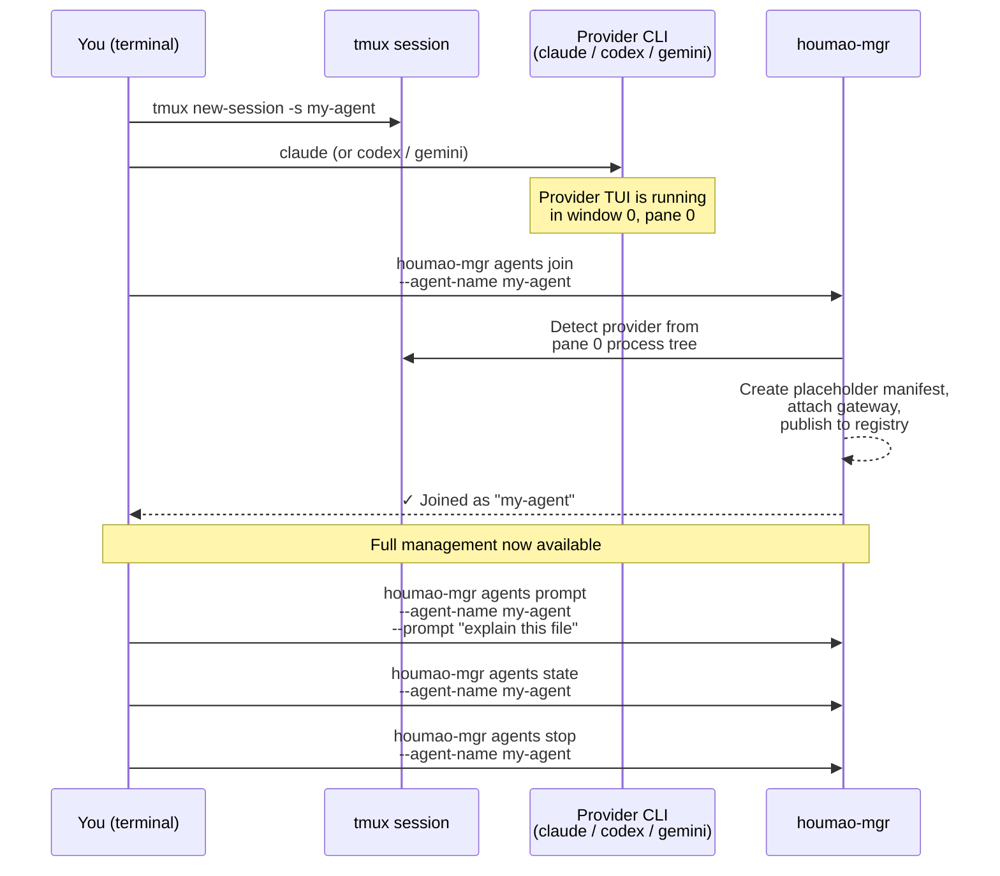

# Houmao
> A framework and CLI toolkit for orchestrating teams of loosely-coupled AI agents.

## Current Status

Houmao is under active development. The operator-facing workflow is stabilizing around the `houmao-mgr` + `houmao-server` pair, with `local_interactive` (tmux-backed) as the primary backend. Expect interface changes while the core runtime, gateway, and mailbox contracts continue to harden.

## Project Introduction

Project docs: [https://igamenovoer.github.io/houmao/](https://igamenovoer.github.io/houmao/)

### What It Is

`Houmao` is a framework and CLI toolkit designed to orchestrate **teams of loosely-coupled, CLI-based AI agents**.

> **Name Origin:** `Houmao` (猴毛, "monkey hair") is inspired by the classic tale *Journey to the West*. Just as Sun Wukong (The Monkey King) plucks strands of his magical hair to create independent, capable clones of himself, this framework allows you to multiply your capabilities by spinning up numerous autonomous helpers.

Unlike traditional orchestration models where an "agent" is merely an in-process object graph, `Houmao` treats each agent as a first-class citizen. Every agent is a dedicated, real CLI process (such as `codex`, `claude`, or `gemini`) operating with its own isolated disk state, memory, and native user experience.

### The Core Idea (What We Avoid)

The core idea is to **avoid a hard-coded orchestration model**.

Instead of shipping a fixed “agent graph” runtime (LangGraph / AutoGen-style orchestration), `Houmao` treats a team as a set of **independently runnable CLI agents** and provides lightweight primitives to construct, start, and manage them, while keeping “how the team coordinates” **flexible and context-driven**.

### What The Framework Provides

- **Zero-setup adoption**: wrap any running `claude`, `codex`, or `gemini` session with `houmao-mgr agents join` — no configuration, no restart. You keep your familiar coding-agent workflow and gain management, coordination, and team features on top.
- **Construction** (when you need it): build agent runtimes from tool setups + skills + roles, with reusable recipes and optional launch profiles, for reproducible declarative agent setups.
- **Management**: start/resume/prompt/stop agents with `houmao-mgr` (typically tmux-backed so you can attach and interact).
- **Team communication**: a shared gateway and mailbox plane for groups of agents (built on Houmao's own gateway service).

### Why This Is Useful (Benefits)

- **Near-zero learning curve**: `agents join` lets you start with what you already know — your familiar coding agent in a terminal — and add Houmao's management layer only when you need it.
- **Low barrier to composition**: assemble new agent teams from human-like instruction packages (skills + roles) and tool profiles, without designing rigid contracts up front.
- **Flexible team contracts**: coordination choices can change with context because the framework does not impose a fixed graph or flow.
- **Transparent per-agent UX**: each agent is a real CLI process; you can attach to its tmux window/session to see what it’s doing and interact with its native TUI when needed.
- **Full tool surface area**: the system operates the same terminal/TUI interface you do, so every native capability remains usable (and you can always take over manually if automation hits an unexpected prompt).

### Typical Use Cases

- **Parallel specialist agents**: run a "coder" agent and a "reviewer" agent side by side on the same repo — each with a different role and tool — so one writes while the other critiques.
- **Optimization loops**: set up a coder agent that implements changes and a profiler agent that benchmarks them, iterating back and forth without manual handoff.
- **Team agent recipes**: give every team member the same pre-configured agent lineup (same models, skills, and roles) checked into the repo, without sharing anyone's API keys.
- **Swap the AI, keep the workflow**: change which model or CLI tool an agent uses without touching its role prompt or the task it is working on.

### How Agents Join Your Workflow

- **Adopt an existing session (recommended):** start your CLI tool (`claude`, `codex`, or `gemini`) in a tmux session the way you normally would, then run `houmao-mgr agents join --agent-name <name>` from inside that session. Houmao wraps the running process with its management envelope — registry, gateway, prompt/interrupt, mailbox — without restarting the tool. Zero agent-definition setup required. This is the recommended starting point because there is nothing new to learn: you keep your familiar coding-agent workflow and layer Houmao management on top.
- **Managed launch (full control):** for teams that need reproducible, declarative agent setups, construct from tool setups + skills + roles/recipes or resolve a saved launch profile, then start/resume/prompt/stop via `houmao-mgr agents launch`. This path builds an isolated runtime home with projected configs, skills, and credentials.
- **Bring-your-own process with launch options:** you can also start the underlying CLI tool manually (for example via the generated `launch_helper_path` from `build-brain`) and then use `agents join` with `--launch-args` and `--launch-env` to record enough state for later `agents relaunch`.

## Installation

```bash
uv tool install houmao
```

For development from source:

```bash
pixi install
pixi shell
```

### tmux (required)

The primary backend (`local_interactive`) runs each agent CLI inside a tmux session. Ensure tmux is installed:

```bash
command -v tmux
```

## Usage Guide

> **Recommended starting point:** if you already use a coding agent (`claude`, `codex`, or `gemini`) in a terminal, jump to [Section 1 — Quick Start: `agents join`](#1-quick-start-adopt-an-existing-session-agents-join). It takes about 30 seconds and requires no agent-definition setup.

### CLI Entry Points

| Entrypoint | Purpose | Status |
|---|---|---|
| `houmao-mgr` | Primary operator CLI — build, launch, prompt, stop, server control | **Active** |
| `houmao-server` | Houmao-owned REST server for multi-agent coordination | **In development — not ready for use** |
| `houmao-passive-server` | Registry-driven stateless server for distributed agent coordination | **In development — not ready for use** |
| `houmao-cli` | Legacy build/start/prompt/stop entrypoint | Deprecated — use `houmao-mgr` |
| `houmao-cao-server` | Legacy CAO server launcher | Deprecated — exits with migration guidance |

```bash
houmao-mgr --help
houmao-server --help
```

### 1. Quick Start: Adopt an Existing Session (`agents join`)

The fastest way to bring an agent under Houmao management. No agent-definition directory, no brain build, no config projection — just wrap a running CLI tool with the full management envelope.



**Step-by-step:**

```bash
# 1. Create a tmux session and start your CLI tool normally
tmux new-session -s my-agent
claude                          # or: codex, gemini

# 2. From a second terminal pane (inside the SAME tmux session), join
houmao-mgr agents join --agent-name my-agent

# 3. Now you can use the full management surface:
houmao-mgr agents state   --agent-name my-agent   # transport-neutral summary state
houmao-mgr agents prompt  --agent-name my-agent --prompt "explain this repo"
houmao-mgr agents stop    --agent-name my-agent   # graceful shutdown
```

> **Tip:** `agents join` auto-detects the provider (`claude_code`, `codex`, or `gemini_cli`) from the process tree in window 0 / pane 0. If detection fails, pass `--provider <name>` explicitly.

#### What You Get After Joining

Once `agents join` completes, the adopted session has the same management capabilities as a fully managed `agents launch` session:

| Capability | Command |
|---|---|
| Query transport-neutral summary state | `houmao-mgr agents state --agent-name <name>` |
| Inspect raw gateway-owned TUI tracking (when attached) | `houmao-mgr agents gateway tui state --agent-name <name>` |
| Send a semantic prompt | `houmao-mgr agents prompt --agent-name <name> --prompt "…"` |
| Interrupt a running turn | `houmao-mgr agents interrupt --agent-name <name>` |
| Attach to a gateway | `houmao-mgr agents gateway attach --agent-name <name>` |
| Send / receive mailbox messages | `houmao-mgr agents mail send --agent-name <name>` |
| Stop the agent | `houmao-mgr agents stop --agent-name <name>` |

The only difference: a joined agent has a *placeholder* brain manifest (no skills/configs were projected), and relaunch support depends on whether you provided `--launch-args` at join time.

### 2. Easy Specialists (`project easy`)

For a reusable, named agent without learning the full agent-definition-directory layout, use the easy specialist workflow. This is the natural next step after `agents join`.

```bash
# Initialize a project overlay (one-time)
houmao-mgr project init

# Create a specialist (bundles role + tool + auth into one named definition)
houmao-mgr project easy specialist create \
  --name my-coder --tool claude \
  --api-key sk-ant-... \
  --system-prompt "You are a Python backend developer."

# Launch an instance
houmao-mgr project easy instance launch \
  --specialist my-coder --name my-coder

# Use the full management surface
houmao-mgr agents prompt --agent-name my-coder --prompt "explain main.py"
houmao-mgr project easy instance get --name my-coder
houmao-mgr project easy instance stop --name my-coder
```

Specialists persist under `.houmao/` and survive across sessions. For reusable specialist-backed birth-time defaults, use `houmao-mgr project easy profile ...`. See the [Easy Specialists guide](docs/getting-started/easy-specialists.md) for the full easy lane (specialists, easy profiles, lifecycle, storage layout, management commands) and the [Launch Profiles guide](docs/getting-started/launch-profiles.md) for the shared conceptual model that ties easy profiles to explicit recipe-backed launch profiles.

### 3. Full Recipes and Launch Profiles

For teams that need full control over roles, skills, recipes, and tool configurations, use the recipe-backed launch path. Add explicit launch profiles when you want reusable birth-time defaults that stay separate from the recipe itself. See [Agent Definitions](docs/getting-started/agent-definitions.md) for the complete agent-definition-directory layout, the [Launch Profiles guide](docs/getting-started/launch-profiles.md) for the shared semantic model and the precedence chain, and the canonical `project agents recipes ...` and `project agents launch-profiles ...` authoring commands. `project agents presets ...` remains the compatibility alias for recipes.

```bash
# Launch directly from a recipe selector
houmao-mgr agents launch --agents gpu-kernel-coder --provider claude_code

# Or resolve a saved explicit launch profile
houmao-mgr agents launch --launch-profile gpu-kernel-coder-default
houmao-mgr agents prompt --agent-name <runtime-name> --prompt "Review the latest commit"
houmao-mgr agents stop --agent-name <runtime-name>
```

For a runnable end-to-end example, see [`scripts/demo/minimal-agent-launch/`](scripts/demo/minimal-agent-launch/).

### Runnable Demos

The repository ships two maintained runnable demos under `scripts/demo/`:

- **[`minimal-agent-launch/`](scripts/demo/minimal-agent-launch/)** — Recipe-backed headless launch with Claude or Codex. Shows the full build → launch → prompt → stop cycle and records reproducible outputs.

  ```bash
  scripts/demo/minimal-agent-launch/scripts/run_demo.sh --provider claude_code
  ```

- **[`single-agent-mail-wakeup/`](scripts/demo/single-agent-mail-wakeup/)** — Easy specialist + gateway + mailbox-notifier wake-up. Creates a specialist, attaches a gateway, enables mail-notifier polling, and verifies the agent wakes up on incoming mail. See the [demo README](scripts/demo/single-agent-mail-wakeup/README.md) for stepwise commands.

  ```bash
  scripts/demo/single-agent-mail-wakeup/run_demo.sh auto --tool claude
  ```

### Subsystems at a Glance

| Subsystem | Description | Docs |
|---|---|---|
| Gateway | Per-agent FastAPI sidecar for session control, request queue, and mail facade | [Gateway Reference](docs/reference/gateway/index.md) |
| Mailbox | Unified async message transport — filesystem and Stalwart JMAP backends | [Mailbox Reference](docs/reference/mailbox/index.md) |
| TUI Tracking | State machine, detectors, and replay engine for tracking agent TUI state | [TUI Tracking Reference](docs/reference/tui-tracking/state-model.md) |

### System Skills: Agent Self-Management

Houmao installs packaged skills into agent tool homes so that agents themselves can drive management tasks through their native skill interface without the operator manually invoking `houmao-mgr`. This means an agent can create specialists, manage credentials, inspect definitions, message other managed agents, and control live runtime workflows autonomously.

The packaged mailbox skill surface is currently two-part: `houmao-process-emails-via-gateway` for notifier-driven unread-mail rounds, and `houmao-agent-email-comms` for ordinary shared-mailbox operations plus no-gateway fallback guidance.

| Skill | What it enables |
|---|---|
| `houmao-manage-specialist` | Create, list, inspect, remove, launch, and stop easy specialist/profile-backed project-local workflows |
| `houmao-manage-credentials` | Add, update, inspect, and remove project-local tool auth bundles |
| `houmao-manage-agent-definition` | List, inspect, initialize, update, and remove roles and recipes |
| `houmao-manage-agent-instance` | Launch, list, inspect, stop, and clean up managed agent instances |
| `houmao-agent-messaging` | Prompt, interrupt, queue gateway work, send raw input, route mailbox work, and reset context for already-running managed agents |
| `houmao-agent-gateway` | Attach, detach, discover, and inspect live gateways, use gateway-only control surfaces, schedule wakeups, and manage gateway mail-notifier behavior |

`agents join` and `agents launch` auto-install the packaged mailbox skills plus `user-control`, `agent-messaging`, and `agent-gateway` into managed homes by default. To prepare an external tool home with the broader CLI-default selection, which also adds the separate lifecycle-only `houmao-manage-agent-instance` skill, run:

```bash
houmao-mgr system-skills install --tool claude --home ~/.claude
```

See the [System Skills reference](docs/reference/cli/system-skills.md) for the full catalog, named sets, managed-home versus external-home defaults, and install options.

## Full Documentation

Complete reference, guides, and developer docs are published at **[igamenovoer.github.io/houmao](https://igamenovoer.github.io/houmao/)**.

## Development

```bash
pixi run format              # ruff format
pixi run lint                # ruff check
pixi run typecheck           # mypy --strict
pixi run test-runtime        # runtime-focused test suites
pixi run docs-serve          # local docs site with live reload
```

---

> **Legacy note:** Houmao was originally inspired by [CAO (CLI Agent Orchestrator)](https://github.com/awslabs/cli-agent-orchestrator). Legacy `houmao-cli`, `houmao-cao-server`, and `cao_rest` backend paths are deprecated — use `houmao-mgr`, `houmao-server`, and `local_interactive` instead.
