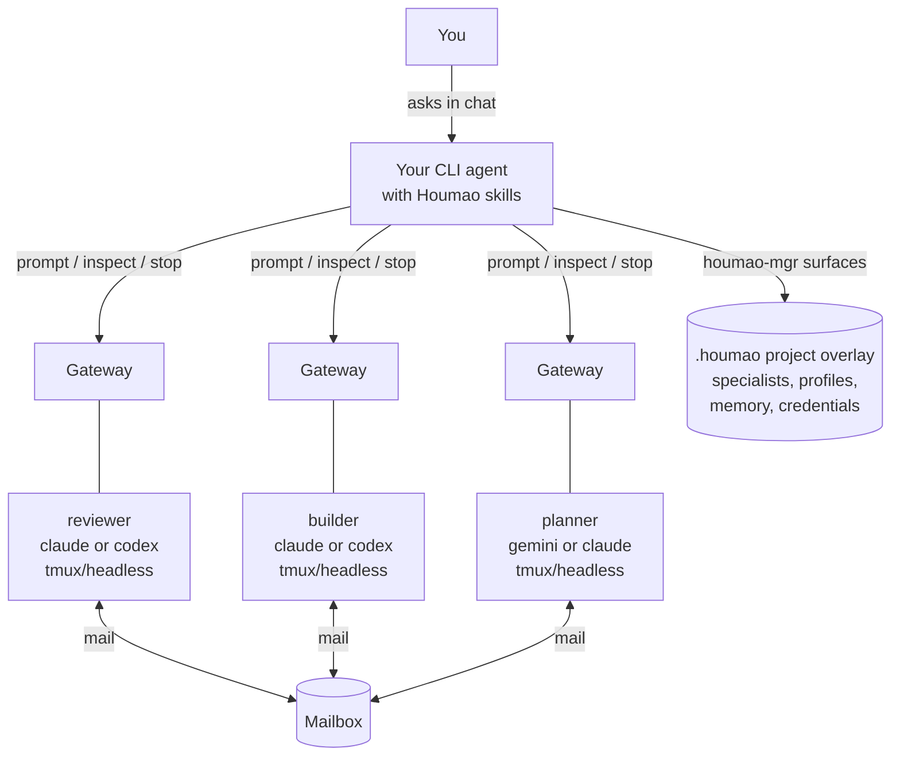

# Houmao
> A framework and CLI toolkit for orchestrating teams of loosely-coupled AI agents.

Project docs: [https://igamenovoer.github.io/houmao/](https://igamenovoer.github.io/houmao/)

## What It Is

`Houmao` builds and runs teams of CLI-based AI agents. Launch-capable agents use real provider CLIs such as `claude`, `codex`, and `gemini`; `copilot` is also supported as a system-skill installation target. Each managed agent is a real process with its own tmux session, disk state, memory, native TUI or headless turn evidence, optional gateway sidecar, and mailbox identity. You define reusable **specialists**, launch them as managed agents, and coordinate them through prompts, gateways, mailboxes, and structured loop plans.

> **Name Origin:** `Houmao` (猴毛, "monkey hair") is inspired by the classic tale *Journey to the West*. Just as Sun Wukong (The Monkey King) plucks strands of his magical hair to create independent, capable clones of himself, this framework allows you to multiply your capabilities by spinning up numerous autonomous helpers.

## Why This Design

- **Use agents like teammates.** A specialist is a named role with tool, credentials, skills, and launch defaults. A managed agent is that specialist alive in a real CLI session.
- **Let your CLI agent operate the system.** Install Houmao skills into Claude, Codex, Gemini, or Copilot, then ask that agent to create specialists, launch agents, inspect state, send prompts, manage gateways, and run loops.
- **Avoid central fragile orchestration.** Agents coordinate through per-agent gateways and shared mailboxes instead of one in-process object graph.
- **Keep full provider capability.** Houmao does not replace the underlying CLI; it gives you lifecycle, memory, gateway, mailbox, and team-control structure around it.
- **Scale from one helper to generated teams.** Start with one reviewer, add a second specialist, then hand a complex plan to `houmao-agent-loop-pro` and let the system prepare and run the team.

## Architecture at a Glance



The normal user experience is conversational: your current CLI agent reads Houmao system skills and drives the supported `houmao-mgr` surfaces for you. Direct CLI use remains supported and documented, but the README assumes the user usually drives Houmao through an agent.

## Quick Start

```bash
uv tool install houmao
command -v tmux
npx skills add igamenovoer/tool-skills/houmao
```

`tmux` is required because managed agents run inside tmux-backed sessions. Recommended when `npx` is available and the target machine has internet access: point the Skills CLI at the small release-synced tool-skills repo, then choose which packaged skill(s) to install from the prompt.

Use Houmao's installer when `npx` is unavailable, when working offline from an installed Houmao package, or when you need customization such as named sets, subset skills, explicit homes, symlink/copy projection, or retired-skill cleanup:

```bash
houmao-mgr system-skills install --tool claude,codex,gemini
houmao-mgr system-skills install --tool claude --home ~/.claude
```

Each installed Houmao system skill also supports explicit read-only help before it performs a workflow; for example, ask `$houmao-touring help` or `$houmao-agent-email-comms help` to see what that skill can do. Skill help is separate from the `houmao-mgr system-skills install` CLI surface that installs or projects the skill packages.

Now start your CLI agent from the project directory and ask:

```text
$houmao-touring start a guided tour
```

The tour walks through beginner setup, intermediate live operation, and advanced coordination. For exact install flags and home-resolution behavior, see the [System Skills Overview](docs/getting-started/system-skills-overview.md) and [System Skills CLI reference](docs/reference/cli/system-skills.md).

## Agent-Driven Examples

### First Managed Agent

```text
You: Create a Codex backend reviewer specialist for this repo, make a reusable easy launch profile, launch it, and ask it to review the last commit.

AI: Done.
    - initialized or inspected the Houmao project overlay
    - created or selected specialist `backend-reviewer`
    - prepared project profile `backend-reviewer-default`
    - launched managed agent `reviewer-1`
    - attached or discovered its gateway
    - sent the review prompt through the maintained messaging surface
```

Behind that exchange, the agent may use commands such as `houmao-mgr project init`, `houmao-mgr project specialist ...`, `houmao-mgr project profile ...`, and `houmao-mgr agents prompt ...`. You do not need those command shapes for the first experience. They are documented in the [Easy Specialists guide](docs/getting-started/easy-specialists.md), [Launch Profiles guide](docs/getting-started/launch-profiles.md), and [`houmao-mgr` CLI reference](docs/reference/cli/houmao-mgr.md).

### Gateway Interaction

```text
You: Ask reviewer-1 whether the migration is safe, then show me its current state.

AI: Sent the prompt through reviewer-1's gateway and inspected the managed-agent state.
    It is running, the last turn is complete, and the response is ready.
```

Gateway-backed interaction gives your user agent a stable way to prompt, interrupt, inspect, queue work, watch TUI state, and use mailbox facades without taking over the provider CLI by hand. See the [Gateway CLI reference](docs/reference/cli/agents-gateway.md) and [managed memory guide](docs/getting-started/managed-memory-dirs.md) when you want the direct surfaces.

## Core Concepts

| Concept | Mental model |
|---|---|
| User CLI agent | The agent you are talking to now. It has Houmao skills installed and can operate Houmao for you. |
| Specialist | A reusable role/tool/credential definition: "backend reviewer", "story writer", "researcher", "release engineer". |
| Project profile | Reusable launch defaults over one specialist: managed-agent name, working directory, credential lane, mailbox posture, prompt mode, and optional skill policy. |
| Managed agent | A live agent launched or adopted by Houmao, backed by tmux/headless runtime state and visible through `agents list`, gateway, mail, memory, and inspection surfaces. |
| Gateway | A per-agent sidecar for prompt delivery, interrupts, request queues, TUI/headless state, reminders, and mailbox facades. |
| Mailbox | A shared async communication layer so agents can send structured work, replies, and wakeup messages without a central orchestrator. |
| Loop | A generated multi-agent operating plan. The user agent stays outside the execution loop and uses loop skills to author, validate, launch, observe, pause, resume, recover, or stop it. |

Project state lives under a `.houmao/` overlay with specialists, profiles, credentials, projected content, mailbox roots, memory, and catalog metadata. The tour and project-management skills can initialize or inspect that overlay; direct details live in the [getting-started docs](docs/getting-started/quickstart.md).

## Agent Loops

This is where Houmao starts to feel different from a wrapper around one CLI. Give `houmao-agent-loop-pro` a complex multi-agent plan, and your CLI agent can turn it into a runnable team workflow:

```text
You: Use houmao-agent-loop-pro for this plan:
     three agents should design, implement, and review a migration.
     The planner decomposes the work, the builder edits code, the reviewer checks behavior,
     and the team should stop only after tests and review notes are complete.

AI: I created the loop intention, clarified the topology, generated the execplan, prepared specialists and launch profiles, checked workspace and mailbox/gateway posture, launched the participants, started the run, and I will report status from outside the execution loop.
```

`houmao-agent-loop-pro` owns the schema-rich path: intention clarification, `tree-loop` versus `generic-loop` topology choice, generated process and contract artifacts, harness/state contracts, generated skills, workspace readiness, validation, launch, run control, and recovery. `houmao-agent-loop-lite` is the lighter Markdown/direct-SQL path for smaller generated loops that still use the same intention/execplan/runs spine without JSON schemas, Jinja2, or generated harnesses.

The reusable [`examples/writer-team/`](examples/writer-team/) template shows a three-agent story-writing team with prompt files, a tree loop plan, start charter, local setup commands, and artifact directories. It is the team shown here: a **story-writer** drafts and finalizes chapters, a **character-designer** builds profiles, and a **story-reviewer** checks logic and pacing while the human operator watches from outside the loop.

https://github.com/user-attachments/assets/6cff608a-8b5b-4dcd-96fb-f2f0208a18b6

For the full current loop-authoring workflow, see the [Loop Authoring Guide](docs/getting-started/loop-authoring.md), the [`houmao-agent-loop-lite` skill](src/houmao/agents/assets/system_skills/houmao-agent-loop-lite/SKILL.md), and the [`houmao-agent-loop-pro` skill](src/houmao/agents/assets/system_skills/houmao-agent-loop-pro/SKILL.md).

## Typical Use Cases

- **Multi-agent execution loops:** turn a complex plan into a generated team run with explicit participants, workspace posture, mail/gateway readiness, status, pause, resume, recovery, and stop controls.
- **Project-local specialist teams:** define reusable specialists with different roles and tools, then launch them into the same project with shared mailbox and gateway posture.
- **Parallel review and build flows:** run a builder and reviewer side by side on the same repository while your user agent coordinates prompts and inspections.
- **Research or writing teams:** create non-coding specialists for outlining, drafting, critique, synthesis, and artifact production.
- **Bring your own provider mix:** combine Claude, Codex, and Gemini agents while keeping the workflow and Houmao control surfaces stable.

## System Skills: Agent Self-Management

Houmao installs packaged skills into agent tool homes so the agent itself can drive management tasks through its native skill interface without the operator manually invoking every `houmao-mgr` command. Those skills cover guided touring, project setup, specialist and profile authoring, credentials, live-agent lifecycle, prompt and mailbox messaging, gateway/reminder work, memory, inspection, workspace preparation, and loop orchestration.

The orientation-level entry points are:

| Skill | What to ask it for |
|---|---|
| `houmao-touring` | A staged first-run or re-orientation tour. |
| `houmao-agent-definition` | Roles, recipes, `launch-dossiers`, specialists, easy `profiles`, `create-agent-fast-forward`, launch, and stop workflows. |
| `houmao-agent-messaging` | Prompt, interrupt, queue, raw input, mailbox-routing entry, and one-turn headless override work against running agents. |
| `houmao-agent-gateway` | Gateway attach/detach/status/watch, reminders, and mail-notifier posture. |
| `houmao-agent-loop-lite` | Lightweight Markdown/direct-SQL generated loop authoring and operation. |
| `houmao-agent-loop-pro` | Schema-rich loop authoring, preparation, validation, launch, run control, and recovery for complex generated teams. |

`houmao-specialist-mgr` may still appear in older installed homes as compatibility guidance, but current specialist and profile work belongs to `houmao-agent-definition`. Managed launch and join install the catalog's `core` set by default; explicit CLI installation defaults to `all`, which adds optional utility workflows. For the complete catalog, grouping, auto-install behavior, and per-skill boundaries, see the [System Skills Overview](docs/getting-started/system-skills-overview.md).

## Subsystems at a Glance

| Subsystem | Description | Docs |
|---|---|---|
| Gateway | Per-agent sidecar for session control, request queue, TUI/headless state, reminders, and mail facade | [Gateway Reference](docs/reference/gateway/index.md) |
| Mailbox | Unified async message transport through filesystem and Stalwart JMAP backends | [Mailbox Reference](docs/reference/mailbox/index.md) |
| TUI Tracking | State machine, detectors, and replay engine for tracking provider TUI state | [TUI Tracking Reference](docs/reference/tui-tracking/state-model.md) |
| Passive Server | Registry-driven stateless server for distributed agent discovery, observation, and management | [Passive Server Reference](docs/reference/cli/houmao-passive-server.md) |

## Demos and Examples

- [`examples/writer-team/`](examples/writer-team/) - Complete tree-loop template for the three-agent story-writing team shown above.
- [`scripts/demo/minimal-agent-launch/`](scripts/demo/minimal-agent-launch/) - Recipe-backed headless launch with Claude or Codex.
- [`scripts/demo/single-agent-mail-wakeup/`](scripts/demo/single-agent-mail-wakeup/) - Specialist plus gateway and mailbox-notifier wakeup.
- [`scripts/demo/single-agent-gateway-wakeup-headless/`](scripts/demo/single-agent-gateway-wakeup-headless/) - Headless specialist with gateway wakeup and turn evidence.
- [`scripts/demo/shared-tui-tracking-demo-pack/`](scripts/demo/shared-tui-tracking-demo-pack/) - Standalone tracked-TUI capture, watch, and replay validation.

## CLI Entry Points

| Entrypoint | Purpose | Status |
|---|---|---|
| `houmao-mgr` | Primary operator CLI for project setup, specialists/profiles, launch, prompt, gateway, mailbox, memory, credentials, and local workflow control | **Active** |
| `houmao-passive-server` | Maintained registry-driven API server for discovering, observing, and managing running agents | **Active** |

Detailed command syntax lives in the [`houmao-mgr` CLI reference](docs/reference/cli/houmao-mgr.md), [System Skills CLI reference](docs/reference/cli/system-skills.md), [agents mail reference](docs/reference/cli/agents-mail.md), [agents gateway reference](docs/reference/cli/agents-gateway.md), and [internals graph reference](docs/reference/cli/internals.md). If you already have a provider TUI running and want Houmao management on top, use the documented `agents join` adoption path rather than treating it as the default first-run flow.

```bash
houmao-mgr --help
houmao-mgr --version
houmao-passive-server --help
```

## Full Documentation

Complete reference, guides, and developer docs are published at **[igamenovoer.github.io/houmao](https://igamenovoer.github.io/houmao/)**.

## Development

```bash
pixi run format
pixi run lint
pixi run typecheck
pixi run test-runtime
pixi run docs-serve
```

---

> **Legacy note:** Houmao was originally inspired by [CAO (CLI Agent Orchestrator)](https://github.com/awslabs/cli-agent-orchestrator). Legacy `houmao-cli`, standalone `houmao-server`, and `cao_rest` backend paths are retired. Use `houmao-mgr`, `houmao-passive-server`, and local/headless managed-agent workflows instead.
