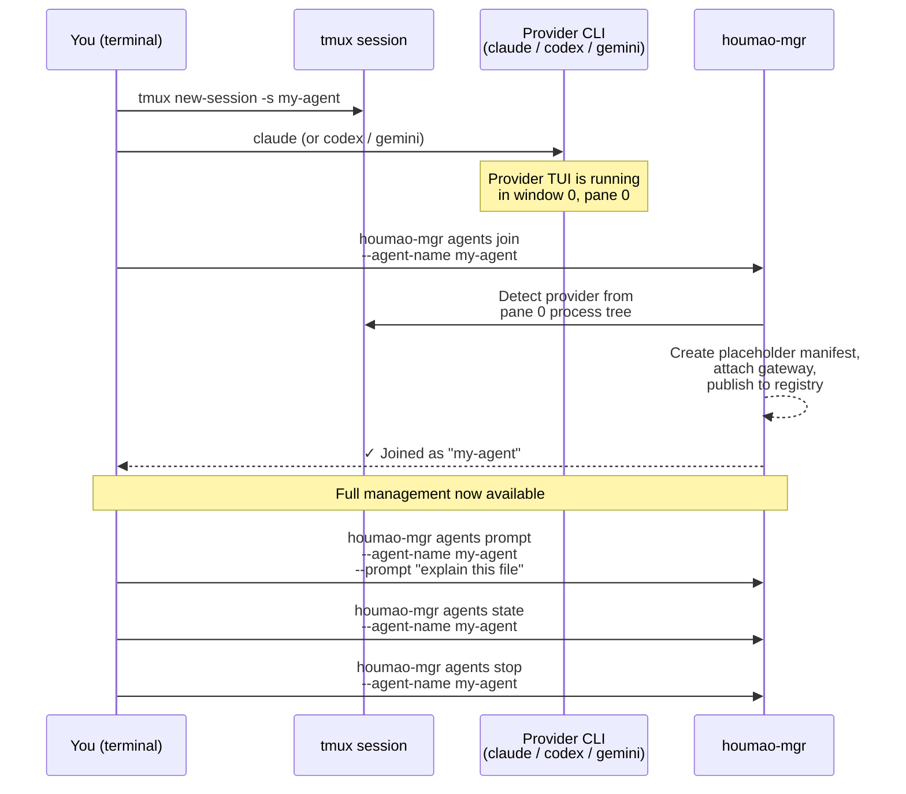
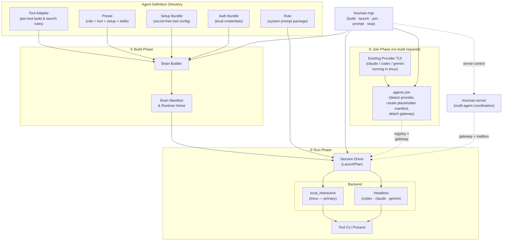
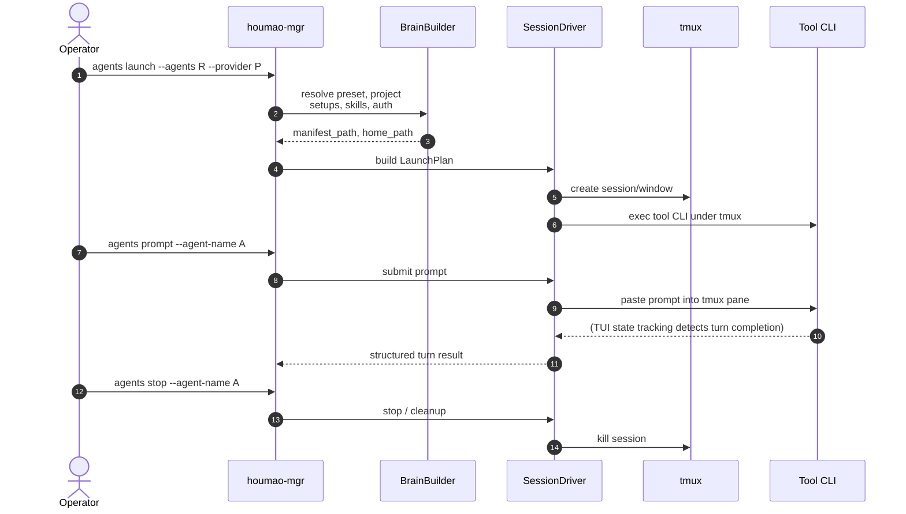

# Houmao
> A framework and CLI toolkit for orchestrating teams of loosely-coupled AI agents.

## Current Status

Houmao is under active development. The operator-facing workflow is stabilizing around the `houmao-mgr` + `houmao-server` pair, with `local_interactive` (tmux-backed) as the primary backend. Expect interface changes while the core runtime, gateway, and mailbox contracts continue to harden.

## Project Introduction

Project docs: [https://igamenovoer.github.io/houmao/](https://igamenovoer.github.io/houmao/)

### What It Is

`Houmao` is a framework and CLI toolkit designed to orchestrate **teams of loosely-coupled, CLI-based AI agents**.

> **Name Origin:** `Houmao` (猴毛, "monkey hair") is inspired by the classic tale *Journey to the West*. Just as Sun Wukong (The Monkey King) plucks strands of his magical hair to create independent, capable clones of himself, this framework allows you to multiply your capabilities by spinning up numerous autonomous helpers.

Unlike traditional orchestration models where an "agent" is merely an in-process object graph, `Houmao` treats each agent as a first-class citizen. Every agent is a dedicated, real CLI process (such as `codex`, `claude`, or `gemini`) operating with its own isolated disk state, memory, and native user experience.

### The Core Idea (What We Avoid)

The core idea is to **avoid a hard-coded orchestration model**.

Instead of shipping a fixed “agent graph” runtime (LangGraph / AutoGen-style orchestration), `Houmao` treats a team as a set of **independently runnable CLI agents** and provides lightweight primitives to construct, start, and manage them, while keeping “how the team coordinates” **flexible and context-driven**.

> Note
> Today, the primary construction paradigm is an **agent definition directory** (tools + roles + skills + presets).
> The details of “tool setups vs skills vs roles” are implementation choices that may evolve; the stable goal is **maximum flexibility with real, inspectable CLI agent processes**.

### What The Framework Provides

- **Zero-setup adoption**: wrap any running `claude`, `codex`, or `gemini` session with `houmao-mgr agents join` — no configuration, no restart. You keep your familiar coding-agent workflow and gain management, coordination, and team features on top.
- **Construction** (when you need it): build agent runtimes from tool setups + skills + roles (and optional presets) for reproducible, declarative agent setups.
- **Management**: start/resume/prompt/stop agents with `houmao-mgr` (typically tmux-backed so you can attach and interact).
- **Team communication**: a shared gateway and mailbox plane for groups of agents (built on Houmao's own gateway service).

### Why This Is Useful (Benefits)

- **Near-zero learning curve**: `agents join` lets you start with what you already know — your familiar coding agent in a terminal — and add Houmao's management layer only when you need it.
- **Low barrier to composition**: assemble new agent teams from human-like instruction packages (skills + roles) and tool profiles, without designing rigid contracts up front.
- **Flexible team contracts**: coordination choices can change with context because the framework does not impose a fixed graph or flow.
- **Transparent per-agent UX**: each agent is a real CLI process; you can attach to its tmux window/session to see what it’s doing and interact with its native TUI when needed.
- **Full tool surface area**: the system operates the same terminal/TUI interface you do, so every native capability remains usable (and you can always take over manually if automation hits an unexpected prompt).

### Typical Use Cases

- **Parallel specialist agents**: run a "coder" agent and a "reviewer" agent side by side on the same repo — each with a different role and tool — so one writes while the other critiques.
- **Optimization loops**: set up a coder agent that implements changes and a profiler agent that benchmarks them, iterating back and forth without manual handoff.
- **Team agent presets**: give every team member the same pre-configured agent lineup (same models, skills, and roles) checked into the repo, without sharing anyone's API keys.
- **Swap the AI, keep the workflow**: change which model or CLI tool an agent uses without touching its role prompt or the task it is working on.

### How Agents Join Your Workflow

- **Adopt an existing session (recommended):** start your CLI tool (`claude`, `codex`, or `gemini`) in a tmux session the way you normally would, then run `houmao-mgr agents join --agent-name <name>` from inside that session. Houmao wraps the running process with its management envelope — registry, gateway, prompt/interrupt, mailbox — without restarting the tool. Zero agent-definition setup required. This is the recommended starting point because there is nothing new to learn: you keep your familiar coding-agent workflow and layer Houmao management on top.
- **Managed launch (full control):** for teams that need reproducible, declarative agent setups, construct from tool setups + skills + roles/presets, then start/resume/prompt/stop via `houmao-mgr agents launch`. This path builds an isolated runtime home with projected configs, skills, and credentials.
- **Bring-your-own process with launch options:** you can also start the underlying CLI tool manually (for example via the generated `launch_helper_path` from `build-brain`) and then use `agents join` with `--launch-args` and `--launch-env` to record enough state for later `agents relaunch`.

## Installation

Pixi (recommended):

```bash
pixi install
pixi shell
```

## Documentation

The repository docs under `docs/` are built with MkDocs and are intended for GitHub Pages publishing.

Build the site locally:

```bash
pixi run docs-build
```

Serve the site locally with live reload:

```bash
pixi run docs-serve
```

Optional Postgres + pgvector environment (for future context hosting):

- Intended future use: manage persistent agent context such as RAG knowledge bases, dialog history, and work artifacts.
- Not required for current core runtime flows.

```bash
pixi install -e pg-hosting --manifest-path pyproject.toml
pixi run -e pg-hosting pg-init
```

Or editable install:

```bash
pip install -e .
```

### tmux (required)

The primary backend (`local_interactive`) runs each agent CLI inside a tmux session. Ensure tmux is installed:

```bash
command -v tmux
```

## Usage Guide

> **Recommended starting point:** if you already use a coding agent (`claude`, `codex`, or `gemini`) in a terminal, jump to [Section 1 — Quick Start: `agents join`](#1-quick-start-adopt-an-existing-session-agents-join). It takes about 30 seconds and requires no agent-definition setup.

### CLI Entry Points

| Entrypoint | Purpose | Status |
|---|---|---|
| `houmao-mgr` | Primary operator CLI — build, launch, prompt, stop, server control | **Active** |
| `houmao-server` | Houmao-owned REST server for multi-agent coordination | **Active** |
| `houmao-passive-server` | Lightweight passive validation server (no CAO dependency) | **Active** |
| `houmao-cli` | Legacy build/start/prompt/stop entrypoint | Deprecated — use `houmao-mgr` |
| `houmao-cao-server` | Legacy CAO server launcher | Deprecated — exits with migration guidance |

```bash
houmao-mgr --help
houmao-server --help
```

### 1. Quick Start: Adopt an Existing Session (`agents join`)

The fastest way to bring an agent under Houmao management. No agent-definition directory, no brain build, no config projection — just wrap a running CLI tool with the full management envelope.



**Step-by-step:**

```bash
# 1. Create a tmux session and start your CLI tool normally
tmux new-session -s my-agent
claude                          # or: codex, gemini

# 2. From a second terminal pane (inside the SAME tmux session), join
houmao-mgr agents join --agent-name my-agent

# 3. Now you can use the full management surface:
houmao-mgr agents state   --agent-name my-agent   # transport-neutral summary state
houmao-mgr agents prompt  --agent-name my-agent --prompt "explain this repo"
houmao-mgr agents stop    --agent-name my-agent   # graceful shutdown
```

> **Tip:** `agents join` auto-detects the provider (`claude_code`, `codex`, or `gemini_cli`) from the process tree in window 0 / pane 0. If detection fails, pass `--provider <name>` explicitly.

#### What You Get After Joining

Once `agents join` completes, the adopted session has the same management capabilities as a fully managed `agents launch` session:

| Capability | Command |
|---|---|
| Query transport-neutral summary state | `houmao-mgr agents state --agent-name <name>` |
| Inspect raw gateway-owned TUI tracking (when attached) | `houmao-mgr agents gateway tui state --agent-name <name>` |
| Send a semantic prompt | `houmao-mgr agents prompt --agent-name <name> --prompt "…"` |
| Interrupt a running turn | `houmao-mgr agents interrupt --agent-name <name>` |
| Attach to a gateway | `houmao-mgr agents gateway attach --agent-name <name>` |
| Send / receive mailbox messages | `houmao-mgr agents mail send --agent-name <name>` |
| Stop the agent | `houmao-mgr agents stop --agent-name <name>` |

The only difference: a joined agent has a *placeholder* brain manifest (no skills/configs were projected), and relaunch support depends on whether you provided `--launch-args` at join time.

### 2. Initialize A Local Houmao Project Overlay

The supported local workflow is `houmao-mgr project init`. It creates one repo-local `.houmao/` overlay, writes `.houmao/houmao-config.toml`, writes `.houmao/.gitignore` with `*`, and seeds `.houmao/agents/tools/` with the packaged adapter and setup bundles for supported tools.

Commands that need agent definitions now resolve the directory with this precedence:

1. CLI `--agent-def-dir`
2. env `AGENTSYS_AGENT_DEF_DIR`
3. nearest ancestor `.houmao/houmao-config.toml`
4. default `<pwd>/.agentsys/agents`

The project-local workflow looks like this:

```bash
pixi run houmao-mgr project init
pixi run houmao-mgr project agent-tools claude auth add --name default --api-key your-api-key-here
```

`project init` does not touch the repository root `.gitignore`. The whole `.houmao/` overlay stays local-only by default because `.houmao/.gitignore` ignores the subtree.

### 3. Prepare The Agent Definition Directory Contents

Top-level purpose summary:

- `tools/`: per-tool build/launch contracts, secret-free setup bundles, and local-only auth bundles.
- `roles/`: role prompt packages that define agent behavior/policy for a session, plus optional presets.
- `skills/`: reusable capability modules; each agent selects a subset.

`houmao-mgr project init` populates `tools/` for you. You author `roles/` and `skills/` locally inside `.houmao/agents/`.

Within `tools/<tool>/`:

- `adapter.yaml`: per-tool build/launch contract (executable, env injection, projection rules).
- `setups/<setup>/`: secret-free config files projected into the runtime home.
- `auth/<auth>/`: local-only auth bundles (gitignored).

Within `roles/<role>/`:

- `system-prompt.md`: the role prompt package.
- `presets/<tool>/<setup>.yaml`: path-derived presets that bind a role to a tool + setup + skills.

```text
<repo>/
  .houmao/
    houmao-config.toml                  # project-local source of truth
    .gitignore                          # contains `*`
    agents/
      tools/
        <tool>/
          adapter.yaml                  # REQUIRED: per-tool build & launch contract
          setups/<setup>/...            # REQUIRED (per preset): secret-free tool config
          auth/<auth>/                  # REQUIRED (per preset): local-only auth bundle
            env/vars.env
            files/...
      roles/
        <role>/
          system-prompt.md              # REQUIRED: role prompt package
          presets/<tool>/<setup>.yaml   # OPTIONAL: path-derived presets (recommended)
      skills/
        <skill>/SKILL.md                # REQUIRED (per preset): reusable skill packages
```

#### `tools/<tool>/adapter.yaml` (required)

Tool adapters are the per-tool contract between your source tree and the generated runtime home.

- Purpose: define how `build-brain` materializes a runnable home for each tool (`codex`, `claude`, `gemini`).
- Launch definition: executable, default args, and home selector env var (for example `CLAUDE_CONFIG_DIR`).
- Projection rules: where selected `setups/`, `skills/`, and auth files land inside the runtime home.
- Auth env policy: which keys from `env/vars.env` are allowlisted and how they are injected at launch.

For the full agent definition model, see [Agent Definitions](docs/getting-started/agent-definitions.md).

#### `skills/` (required by presets)

Skills are reusable capability modules (each with a `SKILL.md` entrypoint) that presets select from.

- Purpose: define composable behaviors and workflows that can be mixed per agent.
- Agent shaping: each agent selects a subset of available skills, and that selected subset is what makes the resulting agent role-specific in practice.

Skill example (`tests/fixtures/agents/skills/openspec-apply-change/SKILL.md`):

```markdown
---
name: openspec-apply-change
description: Implement tasks from an OpenSpec change.
---

Implement tasks from an OpenSpec change.
```

#### `tools/<tool>/setups/<setup>/` (required by presets, secret-free)

Tool-specific setup bundles that the builder projects into the constructed runtime home.

Codex default setup example (`tests/fixtures/agents/tools/codex/setups/default/config.toml`):

```toml
model = "gpt-5.4"
model_reasoning_effort = "medium"
personality = "friendly"
```

Claude default setup example (`tests/fixtures/agents/tools/claude/setups/default/settings.json`):

```json
{
  "skipDangerousModePermissionPrompt": true
}
```

#### `tools/<tool>/auth/<auth>/` (required by presets, local-only)

Auth bundles must stay uncommitted. Use a `files/` directory plus an `env/vars.env` file.

Template layout example:

```text
tools/codex/auth/personal-a-default/
  files/auth.json
  env/vars.env
```

`vars.env` example (`tests/fixtures/agents/tools/codex/auth/personal-a-default/env/vars.env`):

```bash
# OPENAI_API_KEY=<unset>
# OPENAI_BASE_URL=<unset>
# OPENAI_ORG_ID=<unset>
```

Keep real auth files (like `files/auth.json`) local-only and gitignored.

#### `roles/<role>/presets/<tool>/<setup>.yaml` (recommended, secret-free)

Presets are path-derived: role, tool, and setup identity come from the file path. The preset file only contains data that cannot be derived from its location: skills, optional default auth, optional launch settings, and optional extra metadata.

Example preset (`tests/fixtures/agents/roles/gpu-kernel-coder/presets/claude/default.yaml`):

```yaml
skills:
- openspec-apply-change
- openspec-verify-change
auth: personal-a-default
launch:
  prompt_mode: unattended
```

#### `roles/` (required)

Each role is a package directory with a required `system-prompt.md` (and optional `files/`).

Role prompt excerpt (`tests/fixtures/agents/roles/gpu-kernel-coder/system-prompt.md`):

```markdown
# SYSTEM PROMPT: GPU KERNEL CODER

You are the coding worker in a GPU kernel optimization loop.
You implement bounded CUDA/C++ changes, run validation, and report reproducible results.
```

### 4. Basic Workflow (Local tmux)

Build a brain and launch a managed agent:

```bash
# Launch a managed agent from a preset (build + start in one command)
houmao-mgr agents launch --agents gpu-kernel-coder --provider claude_code

# Send a prompt
houmao-mgr agents prompt --agent-name gpu-kernel-coder \
  --prompt "Review the latest commit for security issues"

# Stop and clean up
houmao-mgr agents stop --agent-name gpu-kernel-coder
```

Or build separately and launch:

```bash
# Build a runtime home from a preset
houmao-mgr brains build \
  --agent-def-dir tests/fixtures/agents \
  --preset roles/gpu-kernel-coder/presets/claude/default.yaml

# The build outputs JSON with home_path, manifest_path, and launch_helper_path.
# You can run the tool manually via launch_helper_path inside your own tmux window;
# managed lifecycle commands require a session started through houmao-mgr.
```

### 5. Server-Backed Multi-Agent Coordination

For multi-agent workflows that need a shared gateway and mailbox, use the `houmao-server` + `houmao-mgr` pair:

```bash
# Start the Houmao server
pixi run houmao-mgr server start --api-base-url http://127.0.0.1:9889

# Launch a managed agent through the server
pixi run houmao-mgr agents launch --agents gpu-kernel-coder --provider codex
```

See [docs/reference/houmao_server_pair.md](docs/reference/houmao_server_pair.md) for the full server-pair workflow.

## Developer Guide

### Architecture



### Sequence (UML)



### Development Checks

```bash
pixi run format
pixi run lint
pixi run typecheck
pixi run test-runtime
```

## Appendix

### Legacy: CAO Integration

Houmao was originally inspired by and built on [CAO (CLI Agent Orchestrator)](https://github.com/awslabs/cli-agent-orchestrator). Part of CAO's functionality has been integrated into Houmao's own runtime (the `cao_rest` and `houmao_server_rest` backends), but this integration is planned for removal in favor of Houmao's native `local_interactive` backend and the `houmao-server` + `houmao-mgr` pair.

If you encounter legacy paths that reference CAO, prefer the native Houmao equivalents:

| Legacy | Replacement |
|---|---|
| `houmao-cao-server` | `houmao-server` (managed via `houmao-mgr server start`) |
| `houmao-cli` | `houmao-mgr` |
| `cao_rest` backend | `local_interactive` backend (default) |
