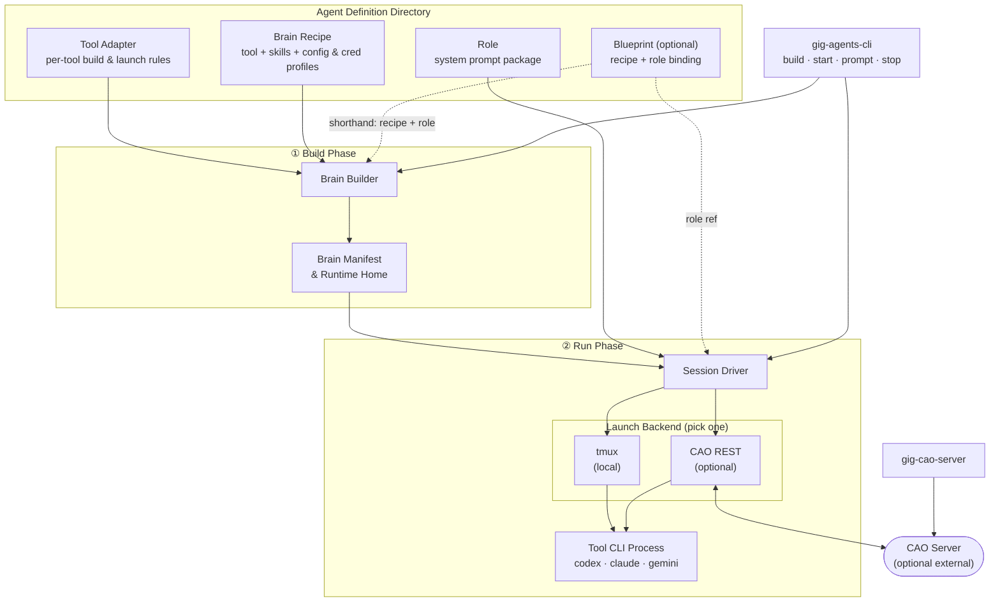
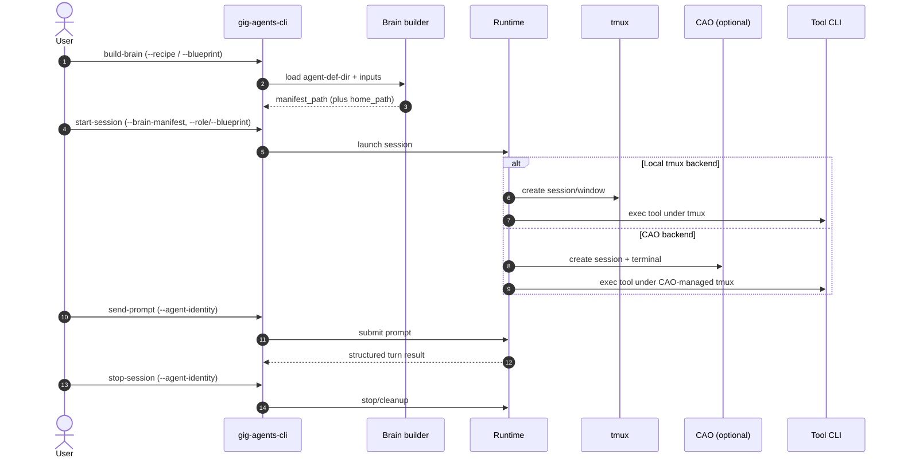

# gig-agents

## Project Introduction

### What It Is

`gig-agents` is a framework + CLI toolkit for building and running **teams of loosely-coupled, CLI-based agents**.

In this model, an **agent** is not an in-process object graph. It is a real CLI tool instance (for example `codex`, `claude`, `gemini`) running as a process, with its own state on disk and its own UX.

### The Core Idea (What We Avoid)

The core idea is to **avoid a hard-coded orchestration model**.

Instead of shipping a fixed “agent graph” runtime (LangGraph / AutoGen-style orchestration), `gig-agents` treats a team as a set of **independently runnable CLI agents** and provides lightweight primitives to construct, start, and manage them, while keeping “how the team coordinates” **flexible and context-driven**.

> Note
> Today, the primary construction paradigm is an **agent definition directory** (brains + roles + optional blueprints).
> The details of “tool specs vs skills vs roles” are implementation choices that may evolve; the stable goal is **maximum flexibility with real, inspectable CLI agent processes**.

### What The Framework Provides

- **Construction**: build agent runtimes from tool specs + skills + roles (and optional blueprints).
- **Management**: start/resume/prompt/stop agents with `gig-agents-cli` (typically tmux-backed so you can inspect and interact).
- **Team communication**: a shared control/communication plane for groups of terminals (currently via CAO, optional).

### Why This Is Useful (Benefits)

- **Low barrier to composition**: assemble new agent teams from human-like instruction packages (skills + roles) and tool profiles, without designing rigid contracts up front.
- **Flexible team contracts**: coordination choices can change with context because the framework does not impose a fixed graph or flow.
- **Transparent per-agent UX**: each agent is a real CLI process; you can attach to its tmux window/session to see what it’s doing and interact with its native TUI when needed.
- **Full tool surface area**: the system operates the same terminal/TUI interface you do, so every native capability remains usable (and you can always take over manually if automation hits an unexpected prompt).

### Typical Use Cases

- **Parallel specialist agents**: run a "coder" agent and a "reviewer" agent side by side on the same repo — each with a different role and tool — so one writes while the other critiques.
- **Optimization loops**: set up a coder agent that implements changes and a profiler agent that benchmarks them, iterating back and forth without manual handoff.
- **Team agent presets**: give every team member the same pre-configured agent lineup (same models, skills, and roles) checked into the repo, without sharing anyone's API keys.
- **Swap the AI, keep the workflow**: change which model or CLI tool an agent uses without touching its role prompt or the task it is working on.

### How Agents Join Your Workflow

- **Managed launch (recommended):** construct from tool specs + skills + roles/blueprints, then start/resume/prompt/stop via `gig-agents-cli`.
- **Bring-your-own process:** you can also start the underlying CLI tool manually (for example via the generated `launch_helper_path` from `build-brain`) and still participate in the same “agent team” workflow. First-class adoption/attach of an already-running tmux session is a design goal; today, the management commands assume the session was launched by `gig-agents-cli`.

## Installation

Pixi (recommended):

```bash
pixi install
pixi shell
```

Optional Postgres + pgvector environment (for future context hosting):

- Intended future use: manage persistent agent context such as RAG knowledge bases, dialog history, and work artifacts.
- Not required for current core runtime flows.

```bash
pixi install -e pg-hosting --manifest-path pyproject.toml
pixi run -e pg-hosting pg-init
```

Or editable install:

```bash
pip install -e .
```

### CAO (optional)

CAO is only needed if you want to use the `cao_rest` backend or the `gig-cao-server` commands. Install it from our forked `hz-release` branch, which is the supported source for `gig-agents` and may include features beyond upstream `main`:

```bash
uv tool install --upgrade git+https://github.com/imsight-forks/cli-agent-orchestrator.git@hz-release
```

Verify the required executables are available:

```bash
command -v cao-server
command -v tmux
```

## Usage Guide

### CLI Entry Points

- `gig-agents-cli`: build/start/prompt/stop lifecycle
- `gig-cao-server`: local `cao-server` start/status/stop (optional)

```bash
gig-agents-cli --help
gig-cao-server --help
```

### 1. Create / Choose An Agent Definition Directory

An **agent definition directory** is any folder (name is not hard-coded) that contains `brains/`, `roles/`, and optionally `blueprints/`.

Commands that need agent definitions resolve the directory with this precedence:

1. CLI `--agent-def-dir`
2. env `AGENTSYS_AGENT_DEF_DIR`
3. default `<pwd>/.agentsys/agents`

This repo includes a complete template you can copy and customize:

```bash
mkdir -p .agentsys
cp -a tests/fixtures/agents .agentsys/agents
export AGENTSYS_AGENT_DEF_DIR="$PWD/.agentsys/agents"
```

Then replace the credential profiles under `brains/api-creds/` with your own (keep them uncommitted).

### 2. Prepare The Agent Definition Directory Contents

Top-level purpose summary:

- `brains/`: reusable building blocks for constructing runtime homes.
- `roles/`: role prompt packages that define agent behavior/policy for a session.
- `blueprints/`: optional presets that bind a recipe to a role.

Within `brains/`:

- `tool-adapters/`: per-tool build/launch contract.
- `skills/`: reusable capabilities; each agent selects a subset.
- `cli-configs/`: secret-free tool config profiles.
- `api-creds/`: local-only credential profiles (gitignored).
- `brain-recipes/`: secret-free presets for tool + skill subset + profiles.

```text
<agent-def-dir>/
  brains/
    tool-adapters/                     # REQUIRED: one `<tool>.yaml` per supported tool
    skills/<skill-name>/SKILL.md       # REQUIRED (per recipe): reusable skill packages
    cli-configs/<tool>/<profile>/...   # REQUIRED (per recipe): secret-free tool config profiles
    api-creds/<tool>/<profile>/...     # REQUIRED (per recipe): local-only credential profiles (gitignored)
    brain-recipes/<tool>/*.yaml        # OPTIONAL: secret-free presets (recommended)
  roles/<role>/system-prompt.md        # REQUIRED: role prompt packages
  blueprints/*.yaml                    # OPTIONAL: recipe+role bindings (recommended)
```

#### `brains/tool-adapters/` (required)

Tool adapters are the per-tool contract between your source tree and the generated runtime home.

- Purpose: define how `build-brain` materializes a runnable home for each tool (`codex`, `claude`, `gemini`).
- Launch definition: executable, default args, and home selector env var (for example `CODEX_HOME`).
- Projection rules: where selected `cli-configs/`, `skills/`, and credential files land inside the runtime home.
- Credential env policy: which keys from `env/vars.env` are allowlisted and how they are injected at launch.

For the full adapter model and end-to-end behavior, see [Agents & Brains](docs/reference/agents_brains.md).

#### `brains/skills/` (required by recipes)

Skills are reusable capability modules (each with a `SKILL.md` entrypoint) that recipes select from.

- Purpose: define composable behaviors and workflows that can be mixed per agent.
- Agent shaping: each agent selects a subset of available skills, and that selected subset is what makes the resulting agent role-specific in practice.

Skill example (`tests/fixtures/agents/brains/skills/openspec-apply-change/SKILL.md`):

```markdown
---
name: openspec-apply-change
description: Implement tasks from an OpenSpec change.
---

Implement tasks from an OpenSpec change.
```

#### `brains/cli-configs/` (required by recipes, secret-free)

Tool-specific config profiles that the builder projects into the constructed runtime home.

Codex default profile example (`tests/fixtures/agents/brains/cli-configs/codex/default/config.toml`):

```toml
model = "gpt-5.3-codex"
model_reasoning_effort = "high"
personality = "friendly"
```

Claude default profile example (`tests/fixtures/agents/brains/cli-configs/claude/default/settings.json`):

```json
{
  "skipDangerousModePermissionPrompt": true
}
```

#### `brains/api-creds/` (required by recipes, local-only)

Credential profiles must stay uncommitted. Use a `files/` directory plus an `env/vars.env` file.

Template layout example:

```text
brains/api-creds/codex/personal-a-default/
  files/auth.json
  env/vars.env
```

`vars.env` example (`tests/fixtures/agents/brains/api-creds/codex/personal-a-default/env/vars.env`):

```bash
# OPENAI_API_KEY=<unset>
# OPENAI_BASE_URL=<unset>
# OPENAI_ORG_ID=<unset>
```

Keep real credential files (like `files/auth.json`) local-only and gitignored.

#### `brains/brain-recipes/` (recommended, secret-free)

Recipes are declarative presets selecting tool + skill subset + config profile + credential profile.

Example recipe (`tests/fixtures/agents/brains/brain-recipes/codex/gpu-kernel-coder-default.yaml`):

```yaml
schema_version: 1
name: gpu-kernel-coder-default
tool: codex
skills:
  - openspec-apply-change
  - openspec-verify-change
config_profile: default
credential_profile: personal-a-default
```

#### `roles/` (required)

Each role is a package directory with a required `system-prompt.md` (and optional `files/`).

Role prompt excerpt (`tests/fixtures/agents/roles/gpu-kernel-coder/system-prompt.md`):

```markdown
# SYSTEM PROMPT: GPU KERNEL CODER

You are the coding worker in a GPU kernel optimization loop.
You implement bounded CUDA/C++ changes, run validation, and report reproducible results.
```

#### `blueprints/` (recommended, secret-free)

Blueprints bind a brain recipe to a role without embedding credentials.

Example blueprint (`tests/fixtures/agents/blueprints/gpu-kernel-coder.yaml`):

```yaml
schema_version: 1
name: gpu-kernel-coder
brain_recipe: ../brains/brain-recipes/codex/gpu-kernel-coder-default.yaml
role: gpu-kernel-coder
```

### 3. Basic Workflow (Local tmux)

Build a brain home:

```bash
gig-agents-cli build-brain \
  --recipe brains/brain-recipes/codex/gpu-kernel-coder-default.yaml \
  --runtime-root tmp/agents-runtime
```

Output is JSON including `home_path`, `manifest_path`, and `launch_helper_path`.

Manual start option: if you want to run the tool yourself (outside `start-session`), execute the returned `launch_helper_path` inside your own tmux/window. Managed lifecycle commands (`send-prompt`, `stop-session`) require a session started by `gig-agents-cli`.

Start a session and send a prompt:

```bash
gig-agents-cli start-session \
  --brain-manifest <manifest-path-from-build-output> \
  --role gpu-kernel-coder \
  --agent-identity my-agent

gig-agents-cli send-prompt \
  --agent-identity my-agent \
  --prompt "Review the latest commit for security issues"

gig-agents-cli stop-session --agent-identity my-agent
```

### 4. Blueprint-Driven Preset (Recipe + Role)

```bash
gig-agents-cli build-brain --blueprint blueprints/gpu-kernel-coder.yaml

gig-agents-cli start-session \
  --brain-manifest <manifest-path-from-build-output> \
  --blueprint blueprints/gpu-kernel-coder.yaml
```

### 5. CAO-Backed Sessions (Optional)

Start a local CAO server:

```bash
gig-cao-server start  --config config/cao-server-launcher/local.toml
gig-cao-server status --config config/cao-server-launcher/local.toml
gig-cao-server stop   --config config/cao-server-launcher/local.toml
```

For a one-off local port override, add `--base-url http://127.0.0.1:9991`.

Start a session through CAO:

```bash
gig-agents-cli start-session \
  --brain-manifest <manifest-path-from-build-output> \
  --role gpu-kernel-coder \
  --backend cao_rest \
  --cao-base-url http://localhost:9889
```

Supported local CAO URLs use `http://localhost:<port>` or
`http://127.0.0.1:<port>`.

## Developer Guide

### Architecture



### Sequence (UML)



### Development Checks

```bash
pixi run format
pixi run lint
pixi run typecheck
pixi run test-runtime
```

## Appendix

### CAO

CAO (CLI Agent Orchestrator) provides the REST session/terminal control plane used by the `cao_rest` backend and the local `gig-cao-server` launcher flow.
It also exposes an inbox messaging API that can be used as a communication channel between agents/terminals.

Install CAO from our forked `hz-release` branch and verify required executables are on `PATH`. We recommend the fork because `gig-agents` may depend on CAO features that are not yet present on upstream `main`:

```bash
uv tool install --upgrade git+https://github.com/imsight-forks/cli-agent-orchestrator.git@hz-release
command -v cao-server
command -v tmux
```

Primary CAO links:

- Supported fork: <https://github.com/imsight-forks/cli-agent-orchestrator/tree/hz-release>
- Fork README (install + usage): <https://github.com/imsight-forks/cli-agent-orchestrator/tree/hz-release#readme>
- Original upstream project: <https://github.com/awslabs/cli-agent-orchestrator>
