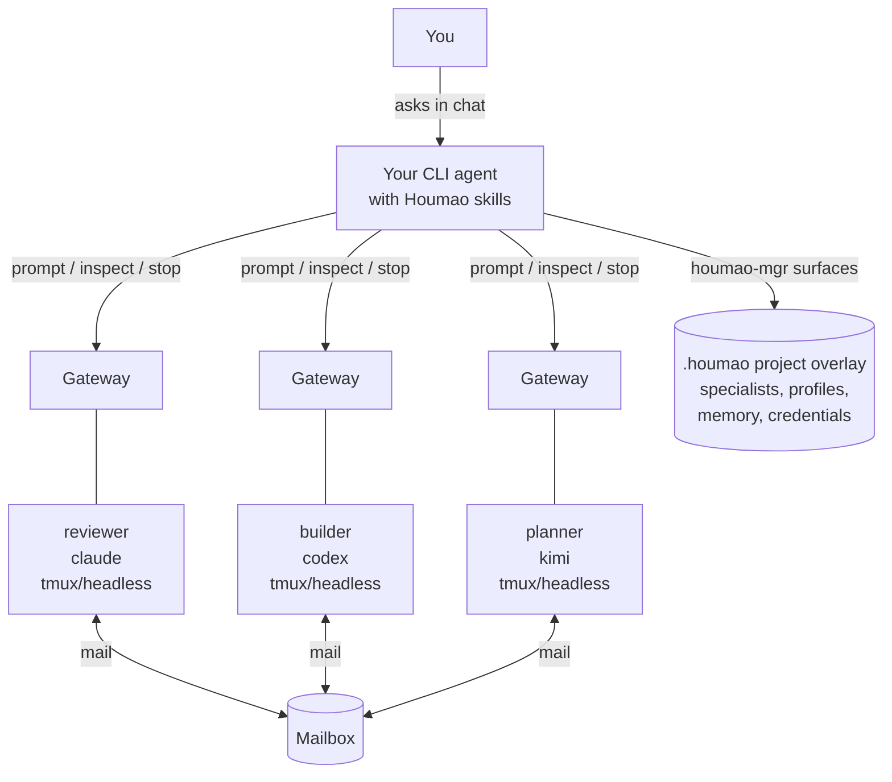
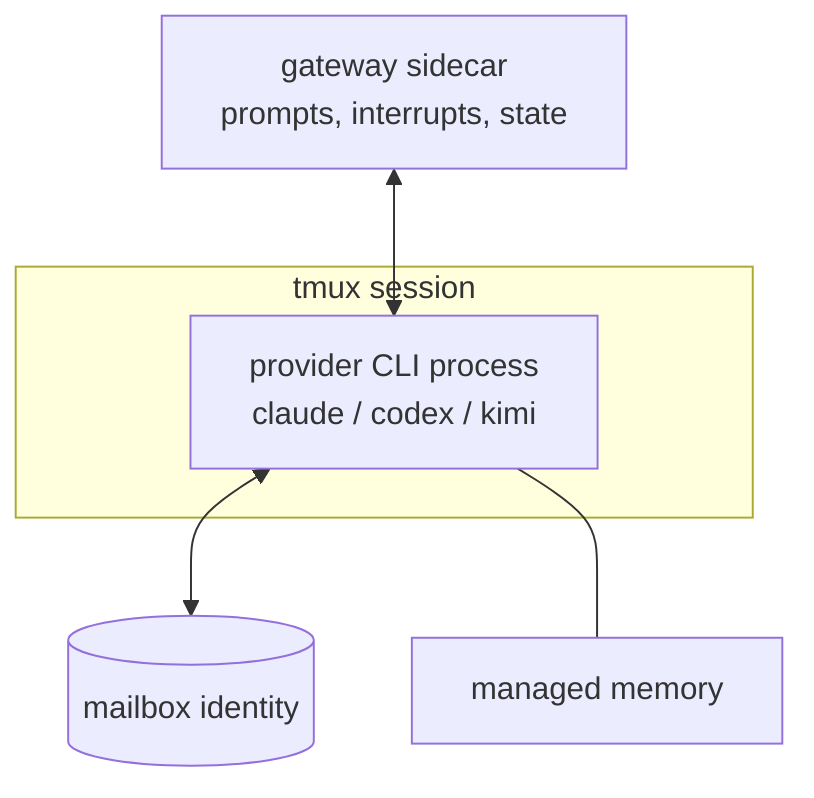

# Houmao
> A framework and CLI toolkit for orchestrating teams of loosely-coupled AI agents.

Project docs: [https://igamenovoer.github.io/houmao/](https://igamenovoer.github.io/houmao/)

## Motivation

If you build multi-agent systems, you know the hard part is the single agent: instruction following, tool use, real file access, communication, and memory take serious work to get right. CLI coding agents already do all of this, and they can be instructed like people, so Houmao lets them cooperate like people, without a hardcoded orchestration layer.

**Who this is for:**

- **Multi-agent system developers** prototyping a team: start with [Agent Loops](#agent-loops) and the [`examples/writer-team/`](examples/writer-team/) template; everything is also drivable through the `houmao-mgr` CLI and the `houmao-passive-server` HTTP API.
- **Agent system end users** with one-off tasks: Houmao spawns fully independent, persisting agents you instruct and hand work between. Expect Codex-style agent threads you orchestrate by talking to them, not a single prompt that launches an autonomous team and exits.
- **Houmao extenders** modifying the system itself: jump to [Development](#development) and the [developer docs](docs/developer/).

## What It Is

> **Name Origin:** `Houmao` (猴毛, "monkey hair") is inspired by the classic tale *Journey to the West*. Just as Sun Wukong (The Monkey King) plucks strands of his magical hair to create independent, capable clones of himself, this framework lets you multiply your capabilities by spinning up autonomous helpers.

Houmao builds and runs teams of CLI-based AI agents. You keep talking to your own CLI agent (`claude`, `codex`, or `kimi`), and Houmao lets it spawn and supervise more agents like itself. (`copilot` is also supported, but only as a target for installing Houmao's skills, not as an agent Houmao launches.)

The model has five load-bearing pieces:

- **Managed agent**: a real provider CLI process Houmao runs in its own tmux session, with its own disk state and memory.
- **Specialist**: a named role you define once, bundling a provider tool, credentials, skills, and a system prompt. Houmao launches it as many managed agents as you need.
- **Project profile**: reusable launch defaults over one specialist, such as the agent name and working directory, so the same setup relaunches cleanly.
- **Gateway**: a per-agent sidecar that delivers prompts and reports session state.
- **Mailbox**: a shared layer that lets agents exchange messages without calling each other directly.

## Why This Design

**Manage agents like humans.** Houmao's working model is the way you already manage people. A specialist is the job description, written once: role, tools, credentials, and expectations. A project profile is the standing assignment: where the agent works and how it launches. A managed agent is the person on the job, with its own desk (a tmux session), its own notes (managed memory), and its own inbox (a mailbox identity).

You then work with managed agents the way you work with contractors. You delegate in plain language, check their state, read what they produce, and decide when the engagement ends. The same specialist can staff a one-off helper or an entire team.

**Let your CLI agent operate the system.** You do not learn a new console. Install Houmao's skills into Claude, Codex, Kimi, or Copilot, then ask that agent in plain language to create specialists, launch agents, inspect state, send prompts, and run loops.

**Avoid central fragile orchestration.** Agents coordinate through per-agent gateways and shared mailboxes instead of one in-process object graph. No single broker stands between the team and its work.

**Keep full provider capability.** Houmao does not replace the underlying CLI. It adds lifecycle, memory, gateway, mailbox, and team-control structure around the provider tools you already use.

**Scale from one helper to generated teams.** Start with one reviewer. Add a second specialist when you need one. When a plan outgrows ad-hoc prompting, ask for a **loop**: a generated multi-agent operating plan your agent authors, launches, and supervises. Then let a prepared team run it.

## Architecture at a Glance

Your CLI agent drives Houmao through the `houmao-mgr` CLI and the installed system skills. Each managed agent runs as a real provider process inside its own tmux session. A gateway sidecar per agent accepts prompts, queues requests, and reports TUI or headless state. Agents hand work to each other through the shared mailbox. Project definitions live in a `.houmao/` overlay inside your repo: specialists, launch profiles, credentials, memory, and mailbox roots.



One managed agent, from the inside:



The normal experience is conversational: your CLI agent reads the Houmao skills and drives `houmao-mgr` for you. Direct CLI use remains supported and documented, but this README assumes you usually drive Houmao through an agent.

## Quick Start

**Prerequisites:** Python 3.11+ with [`uv`](https://docs.astral.sh/uv/), `tmux`, and Linux or macOS. The preferred skill installer also needs `npx`. Managed agents run in tmux-backed sessions, which is why `tmux` is required.

```bash
# 1. Install the CLI: `houmao-mgr --version` should print a version after this
uv tool install houmao

# 2. Verify tmux: prints a path such as /usr/bin/tmux
command -v tmux

# 3. Install Houmao skills into your CLI agent: select your agent and the complete
#    admin surface (welcome, admin entrypoint, shared routines, and both loop skills)
npx skills add https://github.com/igamenovoer/houmao-skills
```

The unqualified skills URL tracks the latest stable Houmao release. Pin the tag matching your installed `houmao-mgr` when you need a reproducible version:

```bash
npx skills add https://github.com/igamenovoer/houmao-skills#v1.2.1
```

Without `npx` or internet access, or when you need an explicit agent home, use `houmao-mgr system-skills install --tool <tool> --pack admin`; flag details live in the [System Skills CLI reference](docs/reference/cli/system-skills.md).

Now start your CLI agent from the project directory and ask:

```text
$houmao-admin-welcome start-guided-tour
```

A `$name` line invokes an installed skill in your CLI agent's chat. If you learn only one Houmao invocation, learn this one. The welcome tour is read-only: it checks your setup and walks beginner, intermediate, and advanced paths. When you are ready to act, it hands execution to `$houmao-admin-entrypoint`. The welcome and both entrypoints also answer `help` (for example, `$houmao-admin-welcome help`).

Your first real task looks like this:

```text
You: $houmao-admin-entrypoint create a houmao Codex backend-reviewer specialist
     for this repo, make a reusable launch profile, launch it, and ask it to
     review the current working tree.

AI:  Done. I initialized the Houmao project overlay, created specialist
     `backend-reviewer` (tool: codex), prepared profile
     `backend-reviewer-default`, launched managed agent `reviewer-1` with its
     gateway attached, and sent the review prompt. The agent is running; I will
     report when the turn completes.
```

Naming the entrypoint skill explicitly works best for the first request of a session. Later requests can drop the handle; keep the keyword `houmao` in the prompt so your agent routes them to Houmao skills. The underlying commands (`houmao-mgr project init`, `project specialist`, `project profile`, `agents prompt`) are documented in the [Easy Specialists guide](docs/getting-started/easy-specialists.md), the [Launch Profiles guide](docs/getting-started/launch-profiles.md), and the [`houmao-mgr` CLI reference](docs/reference/cli/houmao-mgr.md).

> **Kimi Code role-prompt note:** Maintained Kimi Code 0.23.x launches deliver Houmao role context through managed bootstrap or auto-skill workflows. Houmao projects `houmao-auto-system-prompt` into managed Kimi homes; invoke it before substantive chat if the role prompt is not confirmed loaded.

## Agent-Driven Examples

Once an agent is running, later requests read naturally. The keyword `houmao` keeps routing reliable:

```text
You: Use houmao to ask reviewer-1 whether the migration is safe, then show me
     its current state.

AI:  Sent the prompt through reviewer-1's gateway and inspected the
     managed-agent state. It is running, the last turn is complete, and the
     response is ready.
```

Gateway-backed interaction gives your agent a stable way to prompt, interrupt, inspect, queue work, watch TUI state, and use mailbox facades. You never take over the provider CLI by hand. See the [Gateway CLI reference](docs/reference/cli/agents-gateway.md) and the [managed memory guide](docs/getting-started/managed-memory-dirs.md) for the direct surfaces.

## Core Concepts

| Concept | Mental model |
|---|---|
| User CLI agent | The agent you are talking to now. It has Houmao skills installed and can operate Houmao for you. |
| Specialist | A reusable role/tool/credential definition: "backend reviewer", "story writer", "researcher", "release engineer". |
| Project profile | Reusable launch defaults over one specialist: managed-agent name, working directory, credential lane, mailbox posture, prompt mode, and optional skill policy. |
| Managed agent | A live agent launched or adopted by Houmao, backed by tmux/headless runtime state and visible through `agents list`, gateway, mail, memory, and inspection surfaces. |
| Gateway | A per-agent sidecar for prompt delivery, interrupts, request queues, TUI/headless state, reminders, and mailbox facades. |
| Mailbox | A shared async communication layer so agents can send structured work, replies, and wakeup messages without a central orchestrator. |
| Loop | A generated multi-agent operating plan. The user agent stays outside the execution loop and uses loop skills to author, validate, launch, observe, pause, resume, recover, or stop it. |

Project state lives under a `.houmao/` overlay with specialists, profiles, credentials, projected content, mailbox roots, memory, and catalog metadata. Concrete work routes through `$houmao-admin-entrypoint project-mgr ...`; layout details live in the [getting-started docs](docs/getting-started/quickstart.md).

## Agent Loops

This is where Houmao starts to feel different from a wrapper around one CLI. Invoke `$houmao-agent-loop-pro` with a complex multi-agent plan, and your CLI agent turns it into a runnable team workflow:

```text
You: $houmao-agent-loop-pro create a loop for this plan:
     three agents should design, implement, and review a migration.
     The planner decomposes the work, the builder edits code, the reviewer
     checks behavior, and the team should stop only after tests and review
     notes are complete.

AI:  I created the loop intention, clarified the topology, generated the
     execplan, prepared specialists and launch profiles, checked workspace
     and mailbox/gateway posture, launched the participants, started the run,
     and I will report status from outside the execution loop.
```

The pro loop owns the schema-rich path: intention clarification, `tree-loop` versus `generic-loop` topology choice, generated contracts, harnesses, skills, validation, launch, run control, and recovery. The `houmao-agent-loop-lite` sibling is the lighter Markdown/direct-SQL path for smaller loops, without JSON schemas, Jinja2, or generated harnesses. Both loops require explicit invocation and an explicit `<loop-dir>` before any filesystem work.

The reusable [`examples/writer-team/`](examples/writer-team/) template shows a three-agent story-writing team with prompt files, a tree loop plan, a start charter, and local setup commands. A **story-writer** drafts and finalizes chapters, a **character-designer** builds profiles, and a **story-reviewer** checks logic and pacing while the operator watches from outside the loop.

The video below shows this writer team running: three managed agents drafting, refining, and reviewing chapters while the operator observes.

https://github.com/user-attachments/assets/6cff608a-8b5b-4dcd-96fb-f2f0208a18b6

For the full loop-authoring workflow, see the [Loop Authoring Guide](docs/getting-started/loop-authoring.md) and the [System Skills Overview](docs/getting-started/system-skills-overview.md).

## System Skills

Houmao ships six system skills. Each directory works at rest and installs with a standard Agent Skills tool; Houmao does not assemble skill Markdown at runtime.

| Standalone skill | Pack | Role |
|---|---|---|
| `houmao-admin-welcome` | `admin` | **Start here.** Read-only first-use orientation with five guided paths; `$houmao-admin-welcome start-guided-tour` is the one invocation to learn first. |
| `houmao-admin-entrypoint` | `admin` | Router for any Houmao-related request from a human operator. Informational requests stay local; operational work keeps the admin frame and requires explicit targets. |
| `houmao-agent-entrypoint` | `agent` | Router for any Houmao-related request from a genuine managed-agent session. Operational work requires fresh identity verification first. |
| `houmao-shared-routines` | `admin`, `agent` | Advanced router owning sixteen parent-scoped routines (project, credentials, definitions, messaging, gateway, mailbox, memory, inspection, workspace, and more). |
| `houmao-agent-loop-pro` | `admin`, `agent` | Explicit entrypoint for schema-rich loop authoring and run control. |
| `houmao-agent-loop-lite` | `admin`, `agent` | Explicit entrypoint for Markdown/direct-SQL loop authoring and run control. |

Routing follows the actor: in a human-operator session your agent selects the admin entrypoint, and in a genuine managed session it selects the agent entrypoint. Welcome and both loop skills run only when invoked explicitly, and advanced users may call `$houmao-shared-routines` directly. The complete admin pack installs five roots (welcome, admin entrypoint, shared routines, both loops); the agent pack installs four. Pack membership, install lifecycle, route selection, and the full route map live in the [System Skills Overview](docs/getting-started/system-skills-overview.md) and the [System Skills CLI reference](docs/reference/cli/system-skills.md).

## Subsystems at a Glance

| Subsystem | Description | Docs |
|---|---|---|
| Gateway | Per-agent sidecar for session control, request queue, TUI/headless state, reminders, and mail facade | [Gateway Reference](docs/reference/gateway/index.md) |
| Mailbox | Unified async message transport through filesystem and Stalwart JMAP backends | [Mailbox Reference](docs/reference/mailbox/index.md) |
| TUI Tracking | State machine, detectors, and replay engine for tracking provider TUI state | [TUI Tracking Reference](docs/reference/tui-tracking/state-model.md) |
| Passive Server | Registry-driven stateless server for distributed agent discovery, observation, and management | [Passive Server Reference](docs/reference/cli/houmao-passive-server.md) |

## Demos and Examples

- [`examples/writer-team/`](examples/writer-team/) - Complete tree-loop template for the three-agent story-writing team shown above.
- [`scripts/demo/minimal-agent-launch/`](scripts/demo/minimal-agent-launch/) - Recipe-backed headless launch with Claude or Codex.
- [`scripts/demo/single-agent-mail-wakeup/`](scripts/demo/single-agent-mail-wakeup/) - Specialist plus gateway and mailbox-notifier wakeup.
- [`scripts/demo/single-agent-gateway-wakeup-headless/`](scripts/demo/single-agent-gateway-wakeup-headless/) - Headless specialist with gateway wakeup and turn evidence.
- [`scripts/demo/shared-tui-tracking-demo-pack/`](scripts/demo/shared-tui-tracking-demo-pack/) - Standalone tracked-TUI capture, watch, and replay validation.

## CLI Entry Points

| Entrypoint | Purpose | Status |
|---|---|---|
| `houmao-mgr` | Primary operator CLI for project setup, specialists/profiles, launch, prompt, gateway, mailbox, memory, credentials, and local workflow control | **Active** |
| `houmao-passive-server` | Maintained registry-driven API server for discovering, observing, and managing running agents | **Active** |

Detailed command syntax lives in the [`houmao-mgr` CLI reference](docs/reference/cli/houmao-mgr.md), [System Skills CLI reference](docs/reference/cli/system-skills.md), [agents mail reference](docs/reference/cli/agents-mail.md), [agents gateway reference](docs/reference/cli/agents-gateway.md), and [internals graph reference](docs/reference/cli/internals.md). If you already have a provider TUI running and want Houmao management on top, use the documented `agents join` adoption path rather than treating it as the default first-run flow.

```bash
houmao-mgr --help
houmao-mgr --version
houmao-passive-server --help
```

## Full Documentation

Complete reference, guides, and developer docs are published at **[igamenovoer.github.io/houmao](https://igamenovoer.github.io/houmao/)**.

## Development

```bash
pixi run format
pixi run lint
pixi run typecheck
pixi run test-runtime
pixi run docs-serve
```

## License

Houmao is licensed under the [Apache License, Version 2.0](LICENSE).

---

> **Legacy note:** Houmao was originally inspired by [CAO (CLI Agent Orchestrator)](https://github.com/awslabs/cli-agent-orchestrator). Legacy `houmao-cli`, standalone `houmao-server`, and `cao_rest` backend paths are retired. Use `houmao-mgr`, `houmao-passive-server`, and local/headless managed-agent workflows instead.
