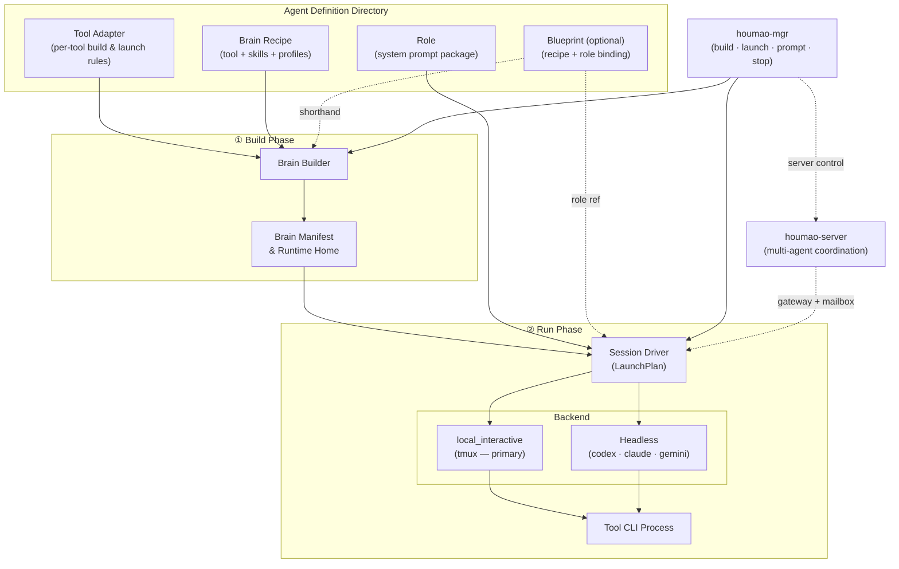
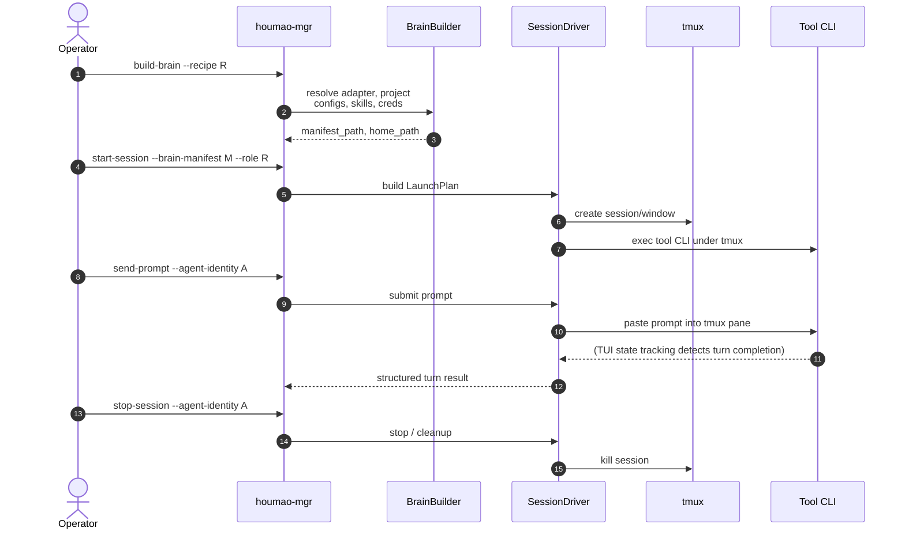

# Houmao
> A framework and CLI toolkit for orchestrating teams of loosely-coupled AI agents.

## Current Status

Houmao is under active development. The operator-facing workflow is stabilizing around the `houmao-mgr` + `houmao-server` pair, with `local_interactive` (tmux-backed) as the primary backend. Expect interface changes while the core runtime, gateway, and mailbox contracts continue to harden.

## Project Introduction

### What It Is

`Houmao` is a framework and CLI toolkit designed to orchestrate **teams of loosely-coupled, CLI-based AI agents**.

> **Name Origin:** `Houmao` (猴毛, "monkey hair") is inspired by the classic tale *Journey to the West*. Just as Sun Wukong (The Monkey King) plucks strands of his magical hair to create independent, capable clones of himself, this framework allows you to multiply your capabilities by spinning up numerous autonomous helpers.

Unlike traditional orchestration models where an "agent" is merely an in-process object graph, `Houmao` treats each agent as a first-class citizen. Every agent is a dedicated, real CLI process (such as `codex`, `claude`, or `gemini`) operating with its own isolated disk state, memory, and native user experience.

### The Core Idea (What We Avoid)

The core idea is to **avoid a hard-coded orchestration model**.

Instead of shipping a fixed “agent graph” runtime (LangGraph / AutoGen-style orchestration), `Houmao` treats a team as a set of **independently runnable CLI agents** and provides lightweight primitives to construct, start, and manage them, while keeping “how the team coordinates” **flexible and context-driven**.

> Note
> Today, the primary construction paradigm is an **agent definition directory** (brains + roles + optional blueprints).
> The details of “tool specs vs skills vs roles” are implementation choices that may evolve; the stable goal is **maximum flexibility with real, inspectable CLI agent processes**.

### What The Framework Provides

- **Construction**: build agent runtimes from tool specs + skills + roles (and optional blueprints).
- **Management**: start/resume/prompt/stop agents with `houmao-mgr` (typically tmux-backed so you can attach and interact).
- **Team communication**: a shared gateway and mailbox plane for groups of agents (built on Houmao's own gateway service).

### Why This Is Useful (Benefits)

- **Low barrier to composition**: assemble new agent teams from human-like instruction packages (skills + roles) and tool profiles, without designing rigid contracts up front.
- **Flexible team contracts**: coordination choices can change with context because the framework does not impose a fixed graph or flow.
- **Transparent per-agent UX**: each agent is a real CLI process; you can attach to its tmux window/session to see what it’s doing and interact with its native TUI when needed.
- **Full tool surface area**: the system operates the same terminal/TUI interface you do, so every native capability remains usable (and you can always take over manually if automation hits an unexpected prompt).

### Typical Use Cases

- **Parallel specialist agents**: run a "coder" agent and a "reviewer" agent side by side on the same repo — each with a different role and tool — so one writes while the other critiques.
- **Optimization loops**: set up a coder agent that implements changes and a profiler agent that benchmarks them, iterating back and forth without manual handoff.
- **Team agent presets**: give every team member the same pre-configured agent lineup (same models, skills, and roles) checked into the repo, without sharing anyone's API keys.
- **Swap the AI, keep the workflow**: change which model or CLI tool an agent uses without touching its role prompt or the task it is working on.

### How Agents Join Your Workflow

- **Managed launch (recommended):** construct from tool specs + skills + roles/blueprints, then start/resume/prompt/stop via `houmao-mgr`.
- **Bring-your-own process:** you can also start the underlying CLI tool manually (for example via the generated `launch_helper_path` from `build-brain`) and still participate in the same “agent team” workflow. First-class adoption/attach of an already-running tmux session is a design goal; today, the management commands assume the session was launched by `houmao-mgr`.

## Installation

Pixi (recommended):

```bash
pixi install
pixi shell
```

Optional Postgres + pgvector environment (for future context hosting):

- Intended future use: manage persistent agent context such as RAG knowledge bases, dialog history, and work artifacts.
- Not required for current core runtime flows.

```bash
pixi install -e pg-hosting --manifest-path pyproject.toml
pixi run -e pg-hosting pg-init
```

Or editable install:

```bash
pip install -e .
```

### tmux (required)

The primary backend (`local_interactive`) runs each agent CLI inside a tmux session. Ensure tmux is installed:

```bash
command -v tmux
```

## Usage Guide

### CLI Entry Points

| Entrypoint | Purpose | Status |
|---|---|---|
| `houmao-mgr` | Primary operator CLI — build, launch, prompt, stop, server control | **Active** |
| `houmao-server` | Houmao-owned REST server for multi-agent coordination | **Active** |
| `houmao-passive-server` | Lightweight passive validation server (no CAO dependency) | **Active** |
| `houmao-cli` | Legacy build/start/prompt/stop entrypoint | Deprecated — use `houmao-mgr` |
| `houmao-cao-server` | Legacy CAO server launcher | Deprecated — exits with migration guidance |

```bash
houmao-mgr --help
houmao-server --help
```

### 1. Create / Choose An Agent Definition Directory

An **agent definition directory** is any folder (name is not hard-coded) that contains `brains/`, `roles/`, and optionally `blueprints/`.

Commands that need agent definitions resolve the directory with this precedence:

1. CLI `--agent-def-dir`
2. env `AGENTSYS_AGENT_DEF_DIR`
3. default `<pwd>/.agentsys/agents`

This repo includes a complete template you can copy and customize:

```bash
mkdir -p .agentsys
cp -a tests/fixtures/agents .agentsys/agents
export AGENTSYS_AGENT_DEF_DIR="$PWD/.agentsys/agents"
```

Then replace the credential profiles under `brains/api-creds/` with your own (keep them uncommitted).

### 2. Prepare The Agent Definition Directory Contents

Top-level purpose summary:

- `brains/`: reusable building blocks for constructing runtime homes.
- `roles/`: role prompt packages that define agent behavior/policy for a session.
- `blueprints/`: optional presets that bind a recipe to a role.

Within `brains/`:

- `tool-adapters/`: per-tool build/launch contract.
- `skills/`: reusable capabilities; each agent selects a subset.
- `cli-configs/`: secret-free tool config profiles.
- `api-creds/`: local-only credential profiles (gitignored).
- `brain-recipes/`: secret-free presets for tool + skill subset + profiles.

```text
<agent-def-dir>/
  brains/
    tool-adapters/                     # REQUIRED: one `<tool>.yaml` per supported tool
    skills/<skill-name>/SKILL.md       # REQUIRED (per recipe): reusable skill packages
    cli-configs/<tool>/<profile>/...   # REQUIRED (per recipe): secret-free tool config profiles
    api-creds/<tool>/<profile>/...     # REQUIRED (per recipe): local-only credential profiles (gitignored)
    brain-recipes/<tool>/*.yaml        # OPTIONAL: secret-free presets (recommended)
  roles/<role>/system-prompt.md        # REQUIRED: role prompt packages
  blueprints/*.yaml                    # OPTIONAL: recipe+role bindings (recommended)
```

#### `brains/tool-adapters/` (required)

Tool adapters are the per-tool contract between your source tree and the generated runtime home.

- Purpose: define how `build-brain` materializes a runnable home for each tool (`codex`, `claude`, `gemini`).
- Launch definition: executable, default args, and home selector env var (for example `CODEX_HOME`).
- Projection rules: where selected `cli-configs/`, `skills/`, and credential files land inside the runtime home.
- Credential env policy: which keys from `env/vars.env` are allowlisted and how they are injected at launch.

For the full adapter model and end-to-end behavior, see [Agents & Brains](docs/reference/agents_brains.md).

#### `brains/skills/` (required by recipes)

Skills are reusable capability modules (each with a `SKILL.md` entrypoint) that recipes select from.

- Purpose: define composable behaviors and workflows that can be mixed per agent.
- Agent shaping: each agent selects a subset of available skills, and that selected subset is what makes the resulting agent role-specific in practice.

Skill example (`tests/fixtures/agents/brains/skills/openspec-apply-change/SKILL.md`):

```markdown
---
name: openspec-apply-change
description: Implement tasks from an OpenSpec change.
---

Implement tasks from an OpenSpec change.
```

#### `brains/cli-configs/` (required by recipes, secret-free)

Tool-specific config profiles that the builder projects into the constructed runtime home.

Codex default profile example (`tests/fixtures/agents/brains/cli-configs/codex/default/config.toml`):

```toml
model = "gpt-5.3-codex"
model_reasoning_effort = "high"
personality = "friendly"
```

Claude default profile example (`tests/fixtures/agents/brains/cli-configs/claude/default/settings.json`):

```json
{
  "skipDangerousModePermissionPrompt": true
}
```

#### `brains/api-creds/` (required by recipes, local-only)

Credential profiles must stay uncommitted. Use a `files/` directory plus an `env/vars.env` file.

Template layout example:

```text
brains/api-creds/codex/personal-a-default/
  files/auth.json
  env/vars.env
```

`vars.env` example (`tests/fixtures/agents/brains/api-creds/codex/personal-a-default/env/vars.env`):

```bash
# OPENAI_API_KEY=<unset>
# OPENAI_BASE_URL=<unset>
# OPENAI_ORG_ID=<unset>
```

Keep real credential files (like `files/auth.json`) local-only and gitignored.

#### `brains/brain-recipes/` (recommended, secret-free)

Recipes are declarative presets selecting tool + skill subset + config profile + credential profile.

Example recipe (`tests/fixtures/agents/brains/brain-recipes/codex/gpu-kernel-coder-default.yaml`):

```yaml
schema_version: 1
name: gpu-kernel-coder-default
tool: codex
skills:
  - openspec-apply-change
  - openspec-verify-change
config_profile: default
credential_profile: personal-a-default
```

#### `roles/` (required)

Each role is a package directory with a required `system-prompt.md` (and optional `files/`).

Role prompt excerpt (`tests/fixtures/agents/roles/gpu-kernel-coder/system-prompt.md`):

```markdown
# SYSTEM PROMPT: GPU KERNEL CODER

You are the coding worker in a GPU kernel optimization loop.
You implement bounded CUDA/C++ changes, run validation, and report reproducible results.
```

#### `blueprints/` (recommended, secret-free)

Blueprints bind a brain recipe to a role without embedding credentials.

Example blueprint (`tests/fixtures/agents/blueprints/gpu-kernel-coder.yaml`):

```yaml
schema_version: 1
name: gpu-kernel-coder
brain_recipe: ../brains/brain-recipes/codex/gpu-kernel-coder-default.yaml
role: gpu-kernel-coder
```

### 3. Basic Workflow (Local tmux)

Build a brain, start a session, interact, and stop:

```bash
# Build a runtime home from a recipe
houmao-mgr build-brain \
  --recipe brains/brain-recipes/codex/gpu-kernel-coder-default.yaml \
  --runtime-root tmp/agents-runtime

# Start a managed session (output includes agent-identity)
houmao-mgr start-session \
  --brain-manifest <manifest-path-from-build-output> \
  --role gpu-kernel-coder \
  --agent-identity my-agent

# Send a prompt and wait for the structured turn result
houmao-mgr send-prompt \
  --agent-identity my-agent \
  --prompt "Review the latest commit for security issues"

# Stop and clean up
houmao-mgr stop-session --agent-identity my-agent
```

The build step outputs JSON with `home_path`, `manifest_path`, and `launch_helper_path`. You can also run the tool manually via `launch_helper_path` inside your own tmux window; managed lifecycle commands require a session started through `houmao-mgr`.

### 4. Blueprint-Driven Preset (Recipe + Role)

```bash
houmao-mgr build-brain --blueprint blueprints/gpu-kernel-coder.yaml

houmao-mgr start-session \
  --brain-manifest <manifest-path-from-build-output> \
  --blueprint blueprints/gpu-kernel-coder.yaml
```

### 5. Server-Backed Multi-Agent Coordination

For multi-agent workflows that need a shared gateway and mailbox, use the `houmao-server` + `houmao-mgr` pair:

```bash
# Start the Houmao server
pixi run houmao-mgr server start --api-base-url http://127.0.0.1:9889

# Launch a managed agent through the server
pixi run houmao-mgr agents launch --agents gpu-kernel-coder --provider codex
```

See [docs/reference/houmao_server_pair.md](docs/reference/houmao_server_pair.md) for the full server-pair workflow.

## Developer Guide

### Architecture



### Sequence (UML)



### Development Checks

```bash
pixi run format
pixi run lint
pixi run typecheck
pixi run test-runtime
```

## Appendix

### Legacy: CAO Integration

Houmao was originally inspired by and built on [CAO (CLI Agent Orchestrator)](https://github.com/awslabs/cli-agent-orchestrator). Part of CAO's functionality has been integrated into Houmao's own runtime (the `cao_rest` and `houmao_server_rest` backends), but this integration is planned for removal in favor of Houmao's native `local_interactive` backend and the `houmao-server` + `houmao-mgr` pair.

If you encounter legacy paths that reference CAO, prefer the native Houmao equivalents:

| Legacy | Replacement |
|---|---|
| `houmao-cao-server` | `houmao-server` (managed via `houmao-mgr server start`) |
| `houmao-cli` | `houmao-mgr` |
| `cao_rest` backend | `local_interactive` backend (default) |
