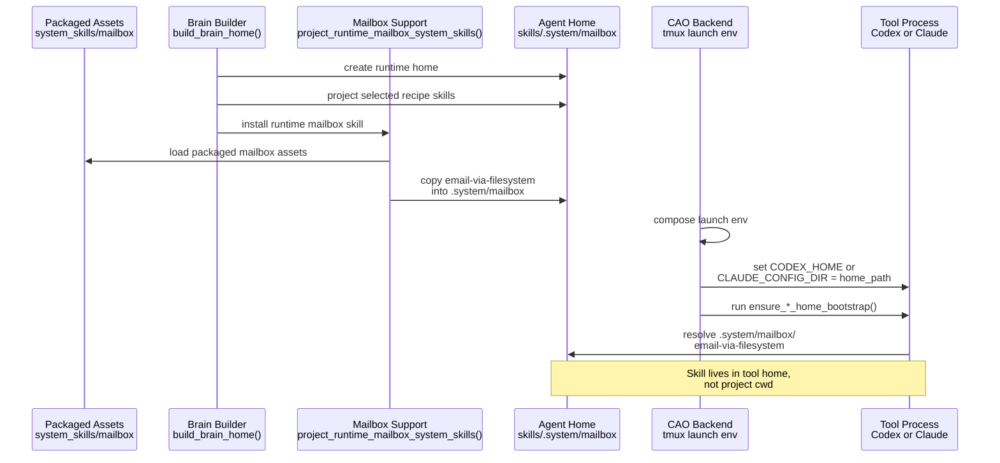

# How Bundled Skills Are Installed Into Agents

## Scope
This note explains how repository-bundled skills, especially the filesystem mailbox skill, move from source code assets into a live agent runtime home.

## Where bundled skills live in the repository
Bundled runtime-owned skills are stored as packaged assets under `src/houmao/agents/realm_controller/assets/system_skills/`.

The mailbox send/check/reply flow currently depends on the filesystem mailbox skill at `src/houmao/agents/realm_controller/assets/system_skills/mailbox/email-via-filesystem/`. That directory contains the skill entrypoint `SKILL.md` plus reference documents such as `references/filesystem-layout.md` and `references/env-vars.md`.

These files are not treated as user-authored project skills. They are shipped as code-adjacent package resources and loaded through `importlib.resources`.

## Runtime reference name
Houmao gives the filesystem mailbox skill a stable runtime reference in `src/houmao/agents/mailbox_runtime_support.py`:

- namespace directory: `.system/mailbox`
- skill name: `email-via-filesystem`
- full runtime reference: `.system/mailbox/email-via-filesystem`

Mailbox prompts use that runtime reference directly. For example, `src/houmao/agents/realm_controller/mail_commands.py` tells the agent to use the runtime-owned filesystem mailbox skill `.system/mailbox/email-via-filesystem` for the mailbox operation.

## How the skill is projected into a brain home
When Houmao builds a brain home, it creates a per-agent runtime home under the runtime root and projects selected config, credentials, and skills into it.

For skills, the flow is:

1. `src/houmao/agents/brain_builder.py` resolves `skill_destination_dir = home_path / adapter.skills_destination`.
2. User-selected skills from the recipe are projected into that directory according to the adapter mode, typically by symlink.
3. Houmao then unconditionally calls `project_runtime_mailbox_system_skills(skill_destination_dir)`.
4. `src/houmao/agents/mailbox_runtime_support.py` loads packaged assets from `houmao.agents.realm_controller.assets/system_skills/mailbox` and copies them into `destination_root / ".system/mailbox"`.

With the current Codex and Claude adapter fixtures, `skills_projection.destination` is `skills`, so the mailbox skill ends up at:

`<agent-home>/skills/.system/mailbox/email-via-filesystem/SKILL.md`

This is covered by `tests/unit/agents/test_brain_builder.py`, which asserts that `skills/.system/mailbox/email-via-filesystem/SKILL.md` exists in the built home.

## How the launched agent sees the projected skill
Projection into the home is only part of the story. The launcher must also make the tool use that home.

The launch path does that by carrying the runtime home through the tool-specific home selector environment variable:

- Codex uses `CODEX_HOME`
- Claude uses `CLAUDE_CONFIG_DIR`

`src/houmao/agents/realm_controller/backends/cao_rest.py` builds the tmux launch environment and sets `launch_env[plan.home_env_var] = str(plan.home_path)`. Before launch, the backend also runs the tool bootstrap helper, such as `ensure_codex_home_bootstrap(...)`, against that same home.

As a result, the live agent process starts with its tool home pointing at the runtime-built home that already contains the projected bundled skills.

## Sequence diagram

## Important behavioral implication
The bundled mailbox skill is installed into the agent home, not into the copied project working directory.

That distinction matters when debugging real-agent runs:

- a prompt reference like `.system/mailbox/email-via-filesystem` is intended to resolve inside the tool home skill namespace
- it is not a promise that the current repository checkout contains a `.system/` directory at its cwd
- if the agent starts searching the project worktree for `.system/mailbox/...`, it can fail to find the skill even though Houmao installed it correctly into the runtime home

## Summary
Bundled mailbox skills live in `src/houmao/agents/realm_controller/assets/system_skills/` as packaged resources. During `build_brain_home`, Houmao copies those packaged assets into the runtime home under the `.system/mailbox` namespace inside the configured skills destination. The launch backend then points the agent tool at that runtime home via `CODEX_HOME` or `CLAUDE_CONFIG_DIR`, so the running agent can access the bundled skill by the stable reference `.system/mailbox/email-via-filesystem`.
