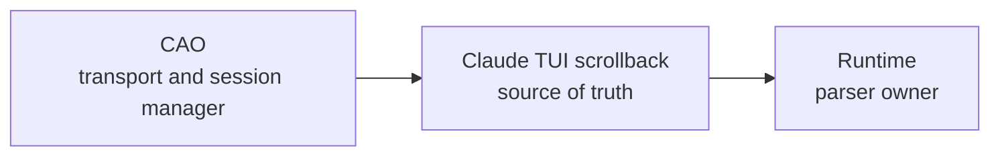
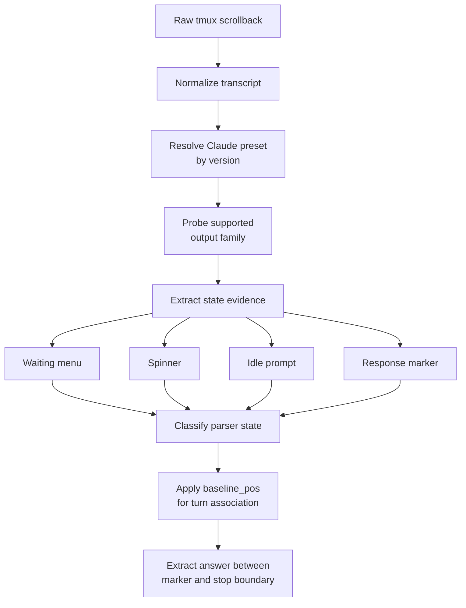
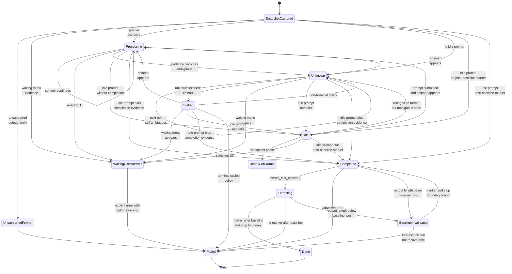
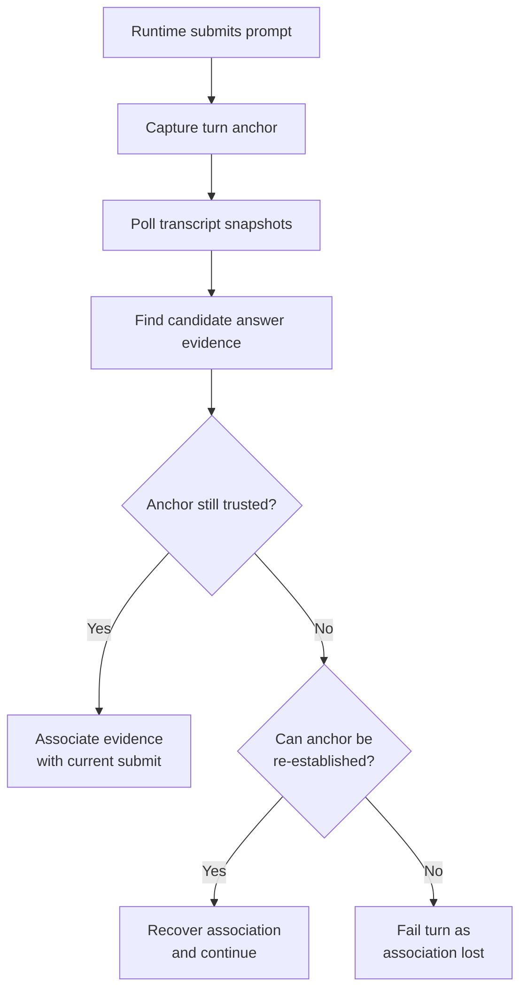

# Claude Code TUI State Definitions And Transitions

## Current Maintained References

This note predates the standalone shared tracked-TUI implementation and the newer maintained parsing docs. For current signal cues and maintained runtime semantics, start with:

- [README.md](README.md)
- [signals/README.md](signals/README.md)
- [docs/developer/tui-parsing/shared-contracts.md](../../../../../docs/developer/tui-parsing/shared-contracts.md)
- [docs/developer/tui-parsing/claude.md](../../../../../docs/developer/tui-parsing/claude.md)
- [docs/developer/tui-parsing/claude-signals.md](../../../../../docs/developer/tui-parsing/claude-signals.md)
- [docs/developer/tui-parsing/codex-signals.md](../../../../../docs/developer/tui-parsing/codex-signals.md)
- [docs/developer/tui-parsing/runtime-lifecycle.md](../../../../../docs/developer/tui-parsing/runtime-lifecycle.md)
- [scripts/demo/shared-tui-tracking-demo-pack/README.md](../../../../../scripts/demo/shared-tui-tracking-demo-pack/README.md)

## Purpose
This note captures the current contract we implicitly and explicitly rely on when parsing Claude Code's TUI scrollback through CAO/tmux. The goal is to make the present contract legible before proposing a stronger one.

This is an audit of the current handling, not an implementation plan.

## Sources Reviewed
- `openspec/specs/cao-claude-code-output-extraction/spec.md`
- `docs/reference/cao_claude_shadow_parsing.md`
- `src/houmao/agents/realm_controller/backends/claude_code_shadow.py`
- `src/houmao/agents/realm_controller/backends/shadow_parser_core.py`
- `tests/unit/agents/realm_controller/test_claude_code_shadow_parser.py`
- `tests/fixtures/shadow_parser/claude/*`
- `docs/developer/tui-parsing/shared-contracts.md`
- `docs/developer/tui-parsing/claude.md`
- `docs/developer/tui-parsing/claude-signals.md`
- `docs/developer/tui-parsing/codex-signals.md`
- `docs/developer/tui-parsing/runtime-lifecycle.md`
- `scripts/demo/shared-tui-tracking-demo-pack/README.md`

## The Current Contract, As It Exists Today

### 1. Ownership boundary
The strongest part of the contract is the ownership split:

- In `parsing_mode=shadow_only`, Claude Code status and answer extraction are runtime-owned and derived from `GET /terminals/{id}/output?mode=full`.
- In `parsing_mode=cao_only`, the runtime does not invoke the Claude shadow parser and uses CAO-native status plus `mode=last`.
- Within one `shadow_only` turn, the runtime does not mix in CAO-native fallback.

This part is explicit in both spec and docs. Conceptually:



### 2. Normalized transcript surface
The parser contract assumes a normalized text transcript derived from raw tmux scrollback:

- ANSI is stripped before parsing.
- Newlines are normalized.
- Parsing operates on plain text lines, not on terminal cell state.

That means the contract is not over "what Claude rendered on screen" in a rich terminal sense. It is over a lossy normalized transcript produced from tmux capture output.

### 3. Versioned preset contract
The Claude parser is version-aware. A preset currently defines:

- response markers
- idle prompt tokens
- supported output variants
- spinner characters
- whether spinners require a parenthesized suffix
- separator token

Preset resolution order is explicit:

```text
env override -> banner version detection -> latest known preset
```

Unknown versions do not silently become a new format. They map to a floor preset and emit an anomaly.

### 4. Supported output-family contract
The current parser only claims support for a small set of Claude output variants:

- idle prompt
- response marker output
- waiting menu
- spinner/progress output

If the snapshot does not match one of those supported variants for the chosen preset, parsing fails explicitly with `unsupported_output_format`.

This is important: the parser already has an output-family contract, not just regexes.

### 5. State classification contract
The parser exposes a five-state model:

```text
processing
waiting_user_answer
completed
idle
unknown
```

The runtime adds one more lifecycle state on top:

```text
stalled
```

Current classification logic is effectively:

```text
normalized transcript
  -> supported variant?
  -> waiting-user-answer evidence?
  -> spinner evidence?
  -> idle prompt visible?
  -> response marker after baseline?
  -> status
```

The priority order is explicit and matters:

```text
waiting_user_answer > processing > completed > idle > unknown
```

### 6. Extraction contract
Answer extraction currently means:

1. resolve preset
2. normalize transcript
3. locate the last response marker after `baseline_pos`
4. collect text until a stop boundary
5. return ANSI-stripped plain text

Current stop boundaries are:

- idle prompt line
- separator line containing `────────`

Response marker matching is line-anchored and requires whitespace after the marker token.

### 7. Turn isolation contract
The current turn-association mechanism is `baseline_pos`.

Before prompt submission, the runtime captures the end offset of the last known response marker in the current transcript. After prompt submission:

- status classification only treats markers at or after `baseline_pos` as candidates for completion
- extraction only treats markers at or after `baseline_pos` as candidates for the answer

If the transcript becomes shorter than `baseline_pos`, the contract says the baseline is invalidated and parsing falls back to a safer path.

### 8. Baseline invalidation contract
When `baseline_invalidated = True`, the parser does not say "turn identity is lost." It says:

- reset effective baseline to zero
- continue parsing
- require stronger evidence for extraction safety

Today that stronger evidence is basically:

- a response marker must still exist
- a stop boundary must exist after the marker

The anomaly is surfaced as `baseline_invalidated`.

### 9. Waiting-user-answer contract
`waiting_user_answer` is a first-class terminal outcome, not a parser footnote. The contract is:

- if selection UI is detected, the turn fails explicitly
- the error includes an ANSI-stripped options excerpt

This is one of the cleaner parts of the current design because it is modeled as a distinct state rather than a failed completion parse.

## Visual Model Of The Current Contract



## State Transition Graph

The current Claude shadow parser plus runtime lifecycle can be described as this state machine:



In plain terms:

- parser states are `waiting_user_answer`, `processing`, `unknown`, `idle`, and `completed`
- runtime adds `stalled` on top of continuous `unknown`
- extraction is a separate phase after `completed`
- `baseline_invalidated` is not really a normal state; it is a loss-of-anchor condition that weakens turn association

This is one reason the current contract feels underspecified: the visible parser states are explicit, but anchor loss is still modeled more as an anomaly than as a proper transition in the turn-association contract.

## Contract-Level State Definitions

The contract should define states against a small set of normalized inputs:

- `T`: the normalized ANSI-stripped transcript snapshot from CAO `mode=full`
- `V`: the resolved Claude parser preset version
- `W(T)`: the bounded tail window used for state classification
- `B`: the current-turn baseline anchor captured before prompt submission
- `B*`: the effective baseline anchor used for a specific snapshot, where the current contract uses `B* = B` normally and `B* = 0` after baseline invalidation

The important contract move is that state definitions should depend on named predicates, not directly on hard-coded regexes. Each preset version `V` binds those predicates to concrete detectors.

### Version-Bound Detection Placeholders

The parser contract can stay stable if it names placeholder detectors like these and lets each preset supply the concrete regex or structural matcher:

| Placeholder | Contract meaning | Current binding examples |
|-------------|------------------|--------------------------|
| `SUPPORTED_OUTPUT_FAMILY(V)` | Snapshot shape recognized as Claude TUI output that this parser version claims to support | Current families include idle prompt, response marker output, waiting menu, and spinner output |
| `WAITING_MENU_BLOCK(V)` | Structural waiting-menu detector built from option-line, selected-option, and hint predicates | Current implementation requires at least two numbered options plus either a selected option or hint text |
| `RESPONSE_MARKER_LINE(V)` | Assistant-response marker at line start, with message text following it | `2.1.62`: `^[ \t]*●[ \t]+(.*)$`; older presets use `⏺` |
| `IDLE_PROMPT_LINE(V)` | Idle prompt line that proves Claude is awaiting input | `2.1.62`: `^\s*❯(?:\s|$)`; older presets may allow `>` |
| `PROCESSING_SPINNER_LINE(V)` | Spinner/progress line that proves Claude is still working | Current presets use spinner chars such as `✶✢✽✻·✳` plus trailing `…`; older presets also require a parenthesized suffix |
| `WAITING_OPTION_LINE(V)` | One option line inside a selection menu | Current shape: `^\s*(?:❯\s*)?\d+\.\s+\S+` |
| `WAITING_SELECTED_OPTION_LINE(V)` | Selected option line inside a selection menu | Current shape: `^\s*❯\s*\d+\.\s+\S+` |
| `WAITING_HINT_LINE(V)` | Supplemental menu hint text that confirms the numbered list is interactive UI, not normal answer text | Current shape includes phrases like `choose an option`, `arrow keys`, or `press enter` |
| `STOP_BOUNDARY_LINE(V)` | Boundary line that terminates answer extraction | Current shape is `IDLE_PROMPT_LINE(V)` or a separator line containing `────────` |

Even when two versions share the same detector, the contract should still name it as version-bound. That keeps the surface explicit when Claude changes later.

### Parser States

#### `waiting_user_answer`
Definition:

- `waiting_user_answer` holds when `SUPPORTED_OUTPUT_FAMILY(V)` is true for `T`
- and `WAITING_MENU_BLOCK(V)` is present in `W(T)`
- and no higher-priority contract failure such as `unsupported_output_format` applies

Where `WAITING_MENU_BLOCK(V)` is a structural predicate:

- at least two `WAITING_OPTION_LINE(V)` matches exist in `W(T)`, and
- at least one `WAITING_SELECTED_OPTION_LINE(V)` or `WAITING_HINT_LINE(V)` match exists in `W(T)`

Contract meaning:

- Claude is blocked on interactive selection
- the turn must fail explicitly rather than continue polling for completion

#### `processing`
Definition:

- `processing` holds when `SUPPORTED_OUTPUT_FAMILY(V)` is true for `T`
- and `waiting_user_answer` is false
- and at least one `PROCESSING_SPINNER_LINE(V)` match exists in `W(T)`

Contract meaning:

- Claude is still generating or thinking
- runtime should keep polling

#### `completed`
Definition:

- `completed` holds when `SUPPORTED_OUTPUT_FAMILY(V)` is true for `T`
- and `waiting_user_answer` is false
- and `processing` is false
- and at least one `IDLE_PROMPT_LINE(V)` match exists in `W(T)`
- and turn-associated response evidence is present

The current contract's turn-associated response evidence is:

- normal path: at least one `RESPONSE_MARKER_LINE(V)` match begins at or after `B*`
- degraded path after baseline invalidation: at least one `RESPONSE_MARKER_LINE(V)` match exists and at least one `STOP_BOUNDARY_LINE(V)` occurs after that marker

Contract meaning:

- Claude appears idle
- and the snapshot contains enough answer evidence for the runtime to attempt extraction

This is the weak spot in the present contract, because the degraded path defines "safe enough" too loosely.

#### `idle`
Definition:

- `idle` holds when `SUPPORTED_OUTPUT_FAMILY(V)` is true for `T`
- and `waiting_user_answer` is false
- and `processing` is false
- and at least one `IDLE_PROMPT_LINE(V)` match exists in `W(T)`
- and `completed` is false

Contract meaning:

- Claude is ready for prompt submission
- no current-turn completion evidence has been established

#### `unknown`
Definition:

- `unknown` holds when `SUPPORTED_OUTPUT_FAMILY(V)` is true for `T`
- and none of `waiting_user_answer`, `processing`, `completed`, or `idle` hold

Contract meaning:

- the snapshot is recognized as Claude output
- but it does not yet contain safe evidence for a stronger state

#### `stalled`
Definition:

- `stalled` is runtime-owned rather than parser-owned
- it holds when parser state remains `unknown` continuously for at least `unknown_to_stalled_timeout_seconds`

Contract meaning:

- the system has not lost output-family recognition
- but it has lost timely progress toward a stronger parser state

#### `unsupported_output_format`
Definition:

- `unsupported_output_format` holds when `SUPPORTED_OUTPUT_FAMILY(V)` is false for `T`

Contract meaning:

- parser/version contract does not recognize this Claude TUI snapshot
- the runtime must fail explicitly rather than silently reclassify as `processing` or `unknown`

#### `baseline_invalidated`
Definition:

- `baseline_invalidated` holds when the normalized transcript length for `T` falls below the captured baseline anchor `B`

Contract meaning:

- the original turn anchor can no longer be trusted as an absolute position
- the system has entered a degraded turn-association mode

This is not a stable parser state like `processing` or `idle`. It is a turn-association condition that changes how `completed` and extraction must be interpreted.

## Contract-Level Transition Event Definitions

The contract should also name transition events explicitly. A transition should not be described as "some regex matched." It should be described as "this version-bound event occurred."

### Event Vocabulary

| Event | Detection contract | Typical transitions |
|-------|--------------------|---------------------|
| `evt_supported_output_family` | `SUPPORTED_OUTPUT_FAMILY(V)` matches `T` | snapshot evaluation begins |
| `evt_unsupported_output_family` | `SUPPORTED_OUTPUT_FAMILY(V)` does not match `T` | `SnapshotCaptured -> UnsupportedFormat` |
| `evt_waiting_menu_detected` | `WAITING_MENU_BLOCK(V)` is true in `W(T)` | `SnapshotCaptured -> WaitingUserAnswer`, `Unknown -> WaitingUserAnswer`, `Processing -> WaitingUserAnswer` |
| `evt_processing_detected` | `PROCESSING_SPINNER_LINE(V)` matches any line in `W(T)` and waiting-menu event is absent | `SnapshotCaptured -> Processing`, `Unknown -> Processing` |
| `evt_idle_prompt_visible` | `IDLE_PROMPT_LINE(V)` matches any line in `W(T)` | candidate transition to `Idle` or `Completed` |
| `evt_post_baseline_response_detected` | a `RESPONSE_MARKER_LINE(V)` match begins at or after `B*` | `Idle -> Completed`, `SnapshotCaptured -> Completed` |
| `evt_no_post_baseline_response` | `IDLE_PROMPT_LINE(V)` is true but `evt_post_baseline_response_detected` is false | transition to or remain in `Idle` |
| `evt_baseline_invalidated` | transcript length of `T` is less than captured anchor `B` | `Completed -> BaselineInvalidated`, `Extracting -> BaselineInvalidated` |
| `evt_stop_boundary_detected` | a `STOP_BOUNDARY_LINE(V)` occurs after the selected response marker | extraction may terminate successfully |
| `evt_unknown_timeout_elapsed` | parser state stays `unknown` continuously through the configured timeout window | `Unknown -> Stalled` |
| `evt_terminal_stalled_policy` | runtime is in `stalled` and policy says stalled is terminal | `Stalled -> Failed` |
| `evt_extraction_success` | a turn-associated marker is selected and answer extraction terminates at a valid stop boundary or allowed end condition | `Extracting -> Done` |
| `evt_extraction_failure` | extraction cannot find a valid turn-associated marker or a required boundary | `Completed -> Failed`, `Extracting -> Failed` |

### Detailed Event Detection Rules

#### `evt_waiting_menu_detected`
The contract should define this event structurally rather than by one regex:

- scan `W(T)` for `WAITING_OPTION_LINE(V)`
- require at least two option matches
- require either one `WAITING_SELECTED_OPTION_LINE(V)` match or one `WAITING_HINT_LINE(V)` match

This prevents a numbered list inside normal Claude output from being mistaken for interactive menu UI.

#### `evt_processing_detected`
The contract should define this as:

- at least one line in `W(T)` matches `PROCESSING_SPINNER_LINE(V)`
- and `evt_waiting_menu_detected` is false

The version-bound placeholder matters here because spinner syntax has already changed across Claude versions.

#### `evt_idle_prompt_visible`
The contract should define this as:

- at least one line in `W(T)` matches `IDLE_PROMPT_LINE(V)`

The placeholder must tolerate version-specific prompt glyphs and prompt-line suffix behavior such as ghost text or typed input.

#### `evt_post_baseline_response_detected`
The contract should define this as:

- find all `RESPONSE_MARKER_LINE(V)` matches in `T`
- discard any match that begins before `B*`
- if any remaining match exists, the event is true

This is the core "current turn has answer evidence" event in the non-degraded path.

#### `evt_baseline_invalidated`
The contract should define this as:

- if `len(T) < B`, then `evt_baseline_invalidated` occurs

The important contract consequence is not just anomaly logging. The event changes the semantics of turn association.

#### `evt_stop_boundary_detected`
The contract should define this as:

- after the selected response marker, scan forward line by line
- if any later line matches `STOP_BOUNDARY_LINE(V)`, the event is true

This event exists to terminate answer extraction and, in degraded cases, to strengthen recovery confidence.

#### `evt_unknown_timeout_elapsed`
The contract should define this as:

- maintain a continuous duration counter for parser state `unknown`
- if no stronger parser state interrupts that run and elapsed time reaches `unknown_to_stalled_timeout_seconds`, the event occurs

This is a runtime-lifecycle event, not a transcript-syntax event.

### Why Version-Bound Placeholders Matter

The contract should remain stable if future Claude versions change:

- prompt glyphs
- response marker glyphs
- spinner line shape
- waiting-menu decoration
- separator tokens

So the contract should say things like:

- "`completed` requires `IDLE_PROMPT_LINE(V)` plus `RESPONSE_MARKER_LINE(V)` after the current turn anchor"
- not "`completed` requires a literal `❯` line and a literal `●` line"

That keeps the contract readable while still allowing each preset version to bind those placeholders to concrete regexes or structural detectors.

## Where The Contract Is Strong

### Explicit ownership
The runtime-vs-CAO boundary is explicit and healthy.

### Explicit drift handling
Unsupported formats fail explicitly instead of being treated as indefinite processing.

### Explicit versioning
Preset resolution and floor-lookup anomalies are part of the contract, not hidden behavior.

### Explicit parser state model
The parser has named statuses and a documented priority order.

## Where The Contract Is Still Implicit

### 1. Turn identity is not a first-class contract
This is the main weakness.

Today, "this answer belongs to the prompt we just submitted" is not modeled as an explicit contract dimension. It is inferred indirectly from `baseline_pos`, and after baseline reset the contract becomes much softer.

> Key point: this is not mainly a concurrency problem. It is a transcript-causality problem.

Claude Code is operationally single-threaded in the common case: it works one prompt at a time, and normally anything it emits before returning to idle belongs to the last prompt it accepted.

The hard part is that our runtime is not observing a structured turn stream. It is observing periodic snapshots of shared tmux scrollback. So the contract problem is not "can Claude answer two prompts at once?" It is "can the runtime prove that the visible answer text in this snapshot is causally attributable to the submit event it just issued?"

#### Execution model vs observation model

| Dimension | Practical reality |
|-----------|-------------------|
| Claude execution model | Usually single-threaded, one accepted prompt at a time |
| Runtime observation model | Snapshot-based polling over cumulative tmux scrollback |
| Missing guarantee | A structured, authoritative turn boundary tying answer text to a specific submit event |

What is missing is a first-class answer to this question:

> What evidence proves that a visible response belongs to the prompt submission event we own, not just to some earlier surviving, truncated, or externally modified transcript fragment?

Right now the parser contract answers that only partially:

- before baseline reset: marker occurs after baseline
- after baseline reset: marker exists and a boundary exists

That is not the same as proving current-turn association.

#### Why turn association is still needed

- The transcript already contains prior turns, so "visible answer text exists" does not imply "new answer text for this submit exists".
- tmux scrollback is not a turn log; it is a mutable observation surface that can be truncated, redrawn, resumed, or externally interacted with.
- The runtime can lose the original anchor that separated "old answer already on screen" from "answer produced after this submit".

#### Why this is hard to handle

- The transcript is cumulative, so old answers remain visible after new submits.
- Absolute positions can stop being valid when scrollback is truncated or the screen is redrawn.
- Status is inferred from snapshots rather than emitted as authoritative turn events.
- The tmux session can be resumed with existing history already present.
- A human operator can attach and interact with the same terminal outside the runtime's control.
- Non-answer UI such as waiting menus, trust prompts, or update flows can appear between submit and completion.

### 2. Baseline invalidation is treated as recoverable extraction drift, not as turn-association loss
This is exactly where case-by-case fixes start creeping in.

The current contract assumes that once baseline reset happens, marker-plus-boundary is a sufficient safety condition. The recent stale-answer bug shows that this is not always true. A truncated old transcript can still satisfy those conditions.

So the real underspecification is:

> `baseline_invalidated` currently weakens the turn contract, but the contract never states how turn identity is re-established.

### 3. Output-family recognition and turn-association are mixed together
The parser already has a decent output-family contract, but it does not cleanly separate three different questions:

1. Is this Claude output in a supported family?
2. What state does this snapshot represent?
3. Is the completion evidence associated with the current turn?

Those are different contracts. Today they are partially entangled.

### 4. The contract is line-pattern based, not transcript-grammar based
Current parsing is built from line-level cues:

- prompt prefix
- response marker prefix
- spinner line
- numbered options
- separator line

That works, but it means the contract is closer to "recognized symptoms" than to a real transcript grammar. This makes it easy to keep adding special cases whenever Claude redraws or truncates differently.

### 5. Bounded-tail status logic is explicit, but its safety assumptions are not
The contract says status classification uses a bounded tail window, but it does not fully spell out the safety assumption behind that choice:

- old evidence outside the window is intentionally ignored
- therefore the contract assumes recent tail lines are sufficient to determine live state

That is a reasonable operational choice, but it is still a heuristic unless we state it as a deliberate contract boundary.

### 6. Idle-prompt recognition is deliberately permissive, but not framed as a formal rule
The docs explain that prompt ghost text is allowed on the prompt line, but this is currently documented as rationale, not as a compact formal rule such as:

```text
idle_prompt_line := optional leading whitespace + prompt_token + (end_of_line | whitespace + arbitrary suffix)
```

That kind of rule would make future changes easier to reason about.

## The Most Important Gap

The biggest contract hole is not "we need more regexes." It is this:

> We have a syntax contract and a state contract, but only a weak turn-association contract.

Another way to say it:

| Today | Missing |
|-------|---------|
| "I can tell what kind of Claude snapshot this looks like." | "I can prove this completed answer belongs to the submit event I just issued." |

That gap is what invites runtime-side if-else recovery logic.

## A Better Contract Shape To Move Toward

If this becomes a future design/spec change, the cleanest direction is to split the Claude TUI contract into separate layers.

| Layer | Focus question | Contract surface |
|-------|----------------|------------------|
| Layer A: Transcript syntax contract | What kind of snapshot is this? | banner, prompt line, response marker line, spinner line, waiting menu block, separator |
| Layer B: Snapshot state contract | What is Claude doing in this snapshot? | waiting, processing, idle, completed, unknown |
| Layer C: Turn-association contract | Does this answer belong to this turn? | baseline-region evidence, append-region evidence, prompt-echo evidence, other explicit turn anchor |
| Layer D: Drift/loss contract | What happens when association evidence is lost? | unsupported format, association lost, baseline invalidated but re-anchored, baseline invalidated and not safely re-anchored |

### Layer C: Turn-association contract

> Layer C is a transcript-causality contract: it defines how the runtime proves that visible answer evidence belongs to the submit event it owns.

#### At a glance

| Item | Meaning |
|------|---------|
| Core question | Which prompt submission is this visible answer evidence attributable to? |
| Why it exists | Claude may be single-threaded, but CAO/tmux gives us snapshots of shared scrollback rather than structured turn events |
| What it must define | turn anchors, anchor preservation, anchor recovery, and failure when association becomes untrustworthy |
| What goes wrong without it | old visible answers, redraws, truncation, or external interaction can be misread as fresh completion evidence |

#### Causal flow



#### Why Layer C exists even though Claude is normally single-threaded

Claude's execution model is usually single-threaded, but our observation model is not turn-native:

- we do not receive a structured event like `turn_id=123 completed with answer=X`
- we receive periodic snapshots of a terminal transcript that already includes historical output
- the transcript may have changed shape between polls due to redraw, truncation, resume, or external interaction

If the transport had stronger guarantees, Layer C would be almost trivial. It would nearly collapse into "everything after submit belongs to the answer" if all of the following were true:

- the runtime had exclusive control of the terminal
- the transcript were append-only and never redrawn or truncated
- prompt submission and answer completion were exposed as structured events
- old history could not be mistaken for fresh output

CAO plus tmux does not give us those guarantees today, so the contract has to recover them explicitly.

#### Why turn association is hard on CAO/tmux

| Surface property | Why it makes association hard |
|------------------|-------------------------------|
| Cumulative transcript | Old answers remain visible after new submits |
| Non-stable positions | Absolute offsets can stop being valid after redraw or truncation |
| Snapshot polling | Status and causality are inferred rather than emitted as authoritative events |
| Resumable sessions | Old completed turns may already be present before the current submit |
| Shared terminal | A human operator may change the transcript outside the runtime's control |
| Turn-local UI | Menus, trust prompts, or update flows may appear after submit but are not the answer |

#### Examples

1. **Baseline reset after long prior history.** The runtime submits a new prompt after a long first turn. Later, the captured transcript becomes shorter than the saved baseline offset. An older answer marker and stop boundary are still visible in the shortened transcript. Claude is still single-threaded, but the parser can no longer prove whether that visible answer was produced before or after the new submit.

2. **Resumed session with existing completed turns.** The runtime attaches to an already-running tmux session that contains several old Claude turns and an idle prompt. When it submits a new prompt, the parser must distinguish "the last answer currently visible on screen" from "the answer generated after this new submit." Without an explicit association rule, "last visible answer" is ambiguous.

3. **External terminal interaction.** A human attaches to the tmux session, scrolls, selects an option, or types into the prompt between runtime polls. Claude may still be single-threaded, but now some transcript changes are caused by the operator rather than by the runtime-owned submit. The contract needs to say whether such changes preserve, weaken, or destroy the current turn anchor.

4. **Transcript redraw without semantic turn boundaries.** Claude or the terminal redraws the visible screen, or an update/banner changes the captured scrollback layout. The answer text may still be present, but positional association to the runtime's last submit is weakened because the surface is not an append-only turn log.

5. **Waiting-user-answer interposition.** The runtime submits a prompt, but Claude surfaces a menu or trust prompt before an answer is complete. That UI belongs to the current submit path, but it is not answer text. Turn association therefore cannot just mean "everything after submit belongs to the answer." It has to distinguish answer-producing output from other turn-local UI.

#### What Layer C should eventually define

- what counts as a valid turn anchor before submission
- what evidence preserves that anchor after polling and redraws
- what evidence re-establishes an anchor after baseline invalidation
- what conditions mean the anchor is irrecoverably lost and the turn must fail
- whether prompt echo is required, optional, or forbidden as an association cue
- how external interaction changes trust in the current anchor

Without that layer, parser robustness tends to accumulate as recovery heuristics in runtime code instead of as contract rules.

### Layer D: Drift/loss contract

This matters because `baseline_invalidated` should probably not be only an anomaly. In contract terms it is closer to "turn anchor was lost; safe recovery requires a new anchor."

## Practical Reading Of The Current Claude Contract

If we describe the current system in one sentence:

> We parse Claude Code scrollback as a versioned, normalized line transcript with explicit supported variants and parser states, but we still under-specify how a completed answer is re-bound to the current turn once the baseline anchor is lost.

That is the key thing to carry forward into any future spec/design work.

## Suggested Next Spec Direction

When we formalize this, the change should probably not be "fix stale baseline bug." It should be closer to:

```text
Make Claude shadow parsing a three-part contract:
1. transcript syntax
2. snapshot state
3. turn association
```

That would let robustness come from contract structure instead of incremental recovery branches in runtime code.
