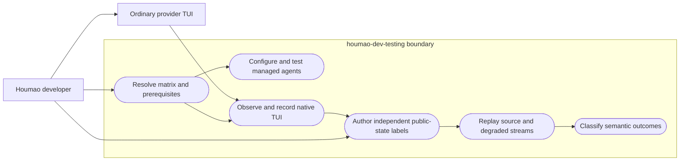
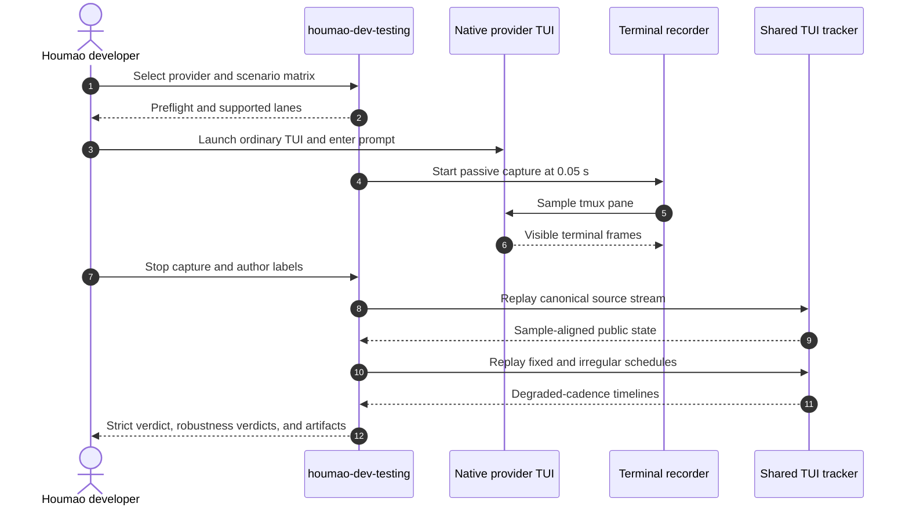

# Use Case 01: Validate Agent Launches and Runtime Behavior

## Actor Goal

As a Houmao developer, I want to test managed agents across supported provider CLIs and runtime postures, so that I can distinguish launch defects, headless defects, TUI parser defects, and observation-cadence limitations.

## Use Case

The developer invokes `houmao-dev-testing` with one or more providers, scenarios, and runtime postures. The skill prepares a test matrix from current repository capabilities and verifies its prerequisites. It guides managed configuration and launch checks for TUI and headless agents. For TUI state tracking, it first establishes independent evidence from an ordinary provider TUI that has no Houmao prompt, home construction, gateway, or lifecycle integration. The operator records that TUI at high frequency, reviews the session, and labels the expected public tracked state without consulting tracker output. The skill then replays the machine-readable recording through Houmao at the source cadence and at slower or irregular cadences. It separates exact canonical comparison from semantic robustness evaluation.

## Supported Actions

### Prepare a Provider Test Matrix

The skill resolves which providers, auth bundles, runtime postures, and tracker workflows are valid in the current checkout.

- context
  - Actor **has** a Houmao source checkout and a testing goal involving one or more provider CLIs.
  - System **has** current project docs, launch-policy registries, fixture conventions, and local upstream source references.
- intent
  - Actor **wants** a valid test plan before creating runtime state or starting provider processes.
  - Actor **wonders** "Can I test Codex and Kimi in both TUI and headless modes, and what evidence does each path require?"
- action
  - Actor then **asks** the system to prepare or run the applicable provider and posture matrix.
- result
  - Actor **gets** a preflight report with supported lanes, selected credentials, commands, artifact roots, skipped combinations, and concrete blockers.

### Configure and Launch a Managed Houmao Agent

The skill uses the maintained project overlay, specialist, profile, and managed-agent commands to exercise Houmao-owned configuration and launch behavior.

- context
  - Actor **has** a provider CLI, a usable local auth bundle, and an isolated work directory.
  - System **has** the supported `houmao-mgr project` and scoped `houmao-mgr agents` command surfaces.
- intent
  - Actor **wants** to verify that Houmao builds and launches an agent with the intended tool, auth, prompt posture, and runtime mode.
  - Actor **wonders** "Does this profile launch a usable unattended headless agent without breaking the equivalent local TUI path?"
- action
  - Actor then **asks** the system to configure, launch, prompt, inspect, and clean up the selected managed-agent lane.
- result
  - Actor **gets** command results, the resolved runtime identity, headless turn evidence or TUI session evidence, state output, logs, and a cleanup result.

### Establish Independent Native TUI Ground Truth

The skill guides a human-observed provider session that Houmao does not launch or prime.

- context
  - Actor **has** an ordinary native Claude, Codex, or Kimi TUI running in a dedicated tmux pane.
  - System **has** the passive terminal recorder and a machine replay surface based on pane snapshots.
- intent
  - Actor **wants** independent evidence of what the provider TUI displays during a representative interaction.
  - Actor **wonders** "Which visible states occur when the native TUI becomes ready, works on my prompt, completes, blocks, or exits?"
- action
  - Actor then **asks** the system to record the pane at approximately 20 frames per second while the operator prompts and watches it.
- result
  - Actor **gets** a high-frequency visual record, authoritative pane snapshots, timing metadata, and a label set authored from human review rather than tracker predictions.

### Replay and Judge TUI Tracking Robustness

The skill replays one labeled source recording through Houmao under canonical and degraded observation schedules.

- context
  - Actor **has** a completed recording, public-state labels, a provider identity, and a scenario contract.
  - System **has** the shared TUI tracker, fixed-cadence derivation, strict validation, and a planned schedule-driven derivation interface for irregular delay simulation.
- intent
  - Actor **wants** to know whether tracker behavior remains useful when real capture timing is slower or uneven.
  - Actor **wonders** "If a short-lived state disappears at 2 Hz or after a capture gap, does the tracker remain coherent instead of reporting a contradictory result?"
- action
  - Actor then **asks** the system to replay the source stream, fixed-rate variants, and deterministic irregular-cadence variants.
- result
  - Actor **gets** separate canonical and robustness verdicts, transition timelines, drift measurements, observation-loss notes, and issue reports for genuine contradictions.

## Main Flow

1. The developer selects providers, scenarios, and requested TUI or headless postures.
2. The skill reads current repository commands and provider support before suggesting a test matrix.
3. The skill limits the provider matrix to Claude, Codex, and Kimi.
4. The skill verifies Pixi, tmux, provider binaries, auth bundles, work directories, and output-root safety.
5. For each managed test lane, the skill initializes an isolated project overlay and creates or selects a specialist and launch profile.
6. The skill launches through `pixi run houmao-mgr project agents launch`. It never uses removed standalone launcher surfaces.
7. For a headless lane, the skill submits a bounded prompt and records turn status, stdout, stderr, exit behavior, runtime state, and cleanup evidence.
8. For a managed TUI lane, the skill records the tmux identity, current tracked state, prompt path, visible response, and final tracked state.
9. For tracker qualification, the operator starts the provider's ordinary TUI in a fresh tmux session without Houmao-managed instructions or lifecycle state.
10. The skill starts the terminal recorder in passive mode with `sample_interval_seconds = 0.05`, which targets 20 samples per second.
11. The operator performs a scripted scenario and watches the TUI. Representative scenarios include idle readiness, successful completion, interruption, blocking approval, known failure, transient overlays, and process exit.
12. The operator stops the recorder and reviews `session.cast` for human context and `pane_snapshots.ndjson` for sample-level evidence.
13. The operator labels public tracked-state expectations from visible evidence and documented settle semantics. Tracker-generated observations remain hidden during label authoring.
14. The skill validates label coverage, non-overlap, scenario identity, provider version, and sensitive-content handling.
15. The skill replays the unmodified 20 fps source stream and performs strict sample-aligned comparison against the labels.
16. The skill derives slower fixed streams, including 10 Hz, 5 Hz, and the documented 2 Hz robustness floor.
17. When schedule-driven derivation is available, the skill also derives seeded jitter, isolated gaps, and short burst-delay streams from the same source.
18. The skill evaluates degraded streams with a transition contract rather than strict per-sample equality.
19. The skill classifies every variant as `pass`, `degraded_but_coherent`, `fail`, or `inconclusive` and explains the evidence.
20. The skill writes a summary, retains replay artifacts, cleans up owned runtime resources, and leaves independent native provider state untouched unless the operator requested removal.

## Alternative And Exception Flows

- If a requested provider or posture is unsupported, the skill marks that matrix cell `skipped_unsupported` and names the current boundary. It does not improvise a legacy launch path.
- If auth material is missing, the skill stops before launch and reports the expected local bundle. It never prints secret contents or commits plaintext credentials.
- If a native TUI already contains Houmao-managed prompt text or home state, the skill rejects it as independent ground truth and asks for a clean native session.
- If a tmux session has multiple panes, the skill requires an explicit target pane before recording.
- If capture cannot sustain the requested 0.05 second interval, the manifest records observed timing. The result becomes `inconclusive` when the source evidence is too sparse for the scenario.
- If labels are incomplete, overlapping, derived from tracker output, or inconsistent with public settle semantics, strict validation stops before replay comparison.
- If a fixed-cadence variant omits a short-lived state but preserves the required state family, order, terminal result, and invariants, the skill reports `degraded_but_coherent` rather than a false exact-match failure.
- If a sparse stream causes a fabricated success, fabricated known failure, impossible transition order, unstable oscillation, or confidence beyond available diagnostics, the skill reports `fail` and creates an issue artifact.
- If irregular cadence support is absent, the skill runs supported fixed sweeps and reports the irregular-delay portion as `not_run_capability_missing`. It does not claim full cadence robustness.
- If the provider version falls outside the maintained tracker profile, the skill preserves the evidence and reports `inconclusive_version` unless the behavior clearly violates a version-independent invariant.

## Mermaid Flow Diagram

## Mermaid Sequence Diagram

## Durable Outputs

- A resolved provider and posture matrix with explicit supported, skipped, and blocked cells.
- Managed launch manifests, scoped command output, headless turn artifacts, TUI state observations, and cleanup evidence.
- A native TUI recorder root containing `manifest.json`, `session.cast`, and `pane_snapshots.ndjson`.
- Independent `labels.json` ground truth tied to source sample identifiers and scenario semantics.
- Canonical `parser_observed.ndjson` and `state_observed.ndjson` outputs.
- Derived snapshot streams and replay timelines for every cadence variant.
- A machine-readable comparison result and a human-readable summary with per-variant classifications.
- Issue records for contradictions, unsupported capabilities, and inconclusive evidence.

## Example Prompt And Expected AI Response

### Event 001 - Test Codex TUI Tracking Across Capture Delays

> Time: `2026-07-11T12:00:00Z` · Session: `houmao-dev-testing-design-example`

User Prompt:

> Use `$houmao-dev-testing` to qualify the current Codex TUI tracker. Record a clean native session at 20 fps, help me label success and interruption, then replay it at 10, 5, and 2 Hz plus a deterministic jittered schedule.

AI:

> The agent should first report prerequisites, the exact native-versus-managed boundary, the selected auth source, the tmux target, and the output root. It should start passive capture only after target confirmation. After capture, it should pause for human label authoring and must not expose tracker predictions as ground truth. It should run strict comparison on the source stream, semantic contracts on degraded streams, and finish with per-variant `pass`, `degraded_but_coherent`, `fail`, or `inconclusive` results. If the checkout lacks irregular schedule derivation, it should run fixed sweeps and report the jittered case as a capability gap.

Notes:

- The agent may create isolated project and recorder artifacts, but it must not mutate host credentials.
- A clean source session means the provider TUI has no Houmao-managed prompt, gateway, generated home, or launch lifecycle.
- The response must distinguish missing observations from incorrect tracker claims.

## Assumptions And Open Questions

- The first implementation targets Claude, Codex, and Kimi.
- A 0.05 second requested interval is the initial high-frequency capture target. Actual sample timestamps remain authoritative.
- The current fixed-cadence sweep is reusable. Irregular within-run cadence requires a schedule-driven stream derivation extension.
- Labels describe public tracked state, not detector internals and not raw visual impressions alone.
- The design assumes an operator participates in native prompting and ground-truth review. Fully automatic label generation is out of scope.
- The retention and redaction policy for recordings that contain repository or model output remains open.
