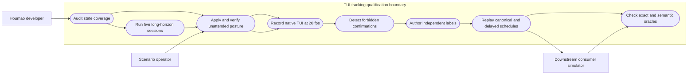
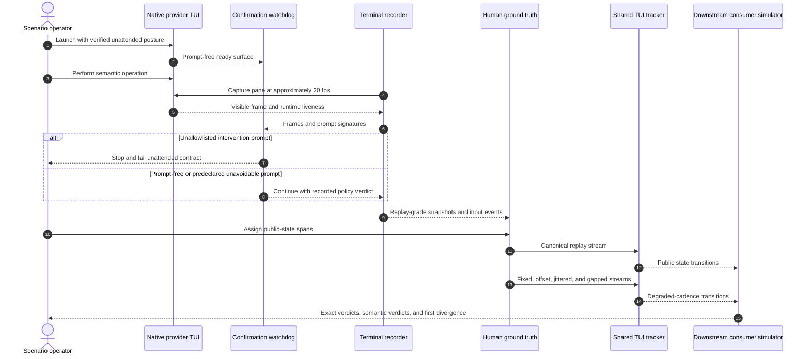

# Use Case 01: Qualify TUI State Tracking Robustness

## Actor Goal

As a Houmao developer, I want complete state, transition, and long-horizon tests for maintained TUI trackers, so that gateways, schedulers, dashboards, and other downstream consumers can rely on coherent state even when captures are delayed or sparse.

## Use Case

The developer qualifies the current Claude Code, Codex, and Kimi Code TUI trackers against independent terminal evidence. Every native provider session uses the maintained `unattended` launch posture and is recorded at approximately 20 fps, labeled from the visible TUI without consulting tracker output, and replayed through the shared tracker. The suite covers every public state reachable during unattended operation, treats avoidable confirmation surfaces as failures, exercises multi-step transitions that invalidate stale outcomes, and runs five long-horizon sessions with at least 20 scripted operator actions apiece. Canonical replay uses strict sample-aligned comparison. Slower, offset, jittered, and gapped replay uses semantic invariants because capture delay may legitimately omit short-lived states.

`Unattended` is a test contract, not merely a launch label. The CLI must not request confirmation, approval, permission, trust, login, update, session selection, browser interaction, or an answer to a model-generated user question during any normal test step. The only permitted intervention is a provider prompt that source, help, configuration, and live-probe evidence show is hard-coded with no supported bypass. The coordinator must declare that exception before execution and record a scripted response; it must never accept an unexpected prompt ad hoc.

The plan distinguishes three public layers:

1. diagnostics and liveness: transport, process, parse status, and diagnostic availability;
2. normalized tracker state: surface acceptance/editing/readiness, turn phase, last-turn result/source, chat context, stability, and active reasons;
3. server lifecycle state: parsed business state, operator status, readiness, completion, projection change, and turn-anchor authority.

## Scope And Exclusions

## Execution Status on 2026-07-11

| Provider | Installed version | Unattended strategy and effective posture | Detector qualification |
| --- | --- | --- | --- |
| Codex | 0.144.1 | `codex-unattended-0.116.x` remains the compatible launch strategy; effective startup forces `approval_policy=never`, `sandbox_mode=danger-full-access`, trusted project state, and no full-access warning or tooltips | 0.144.x detector remains experimental and unregistered. Two controlled turns exhausted retries with an external `Request timed out`, so completion, interruption, delegation, sparse replay, and stress gates remain blocked; registry selection stays `fallback`. |
| Kimi Code | 0.23.5, with the first canonical capture on 0.23.4 | `kimi-tui-unattended-0.23.x`; fresh/latest/exact TUI commands receive one strategy-owned `--auto`, `.skip-migration-from-kimi-cli`, `KIMI_CODE_NO_AUTO_UPDATE=1`, and the managed config fallback | `KimiCodeSignalDetectorV0_23_X` is maintained for `>=0.23.0,<0.24.0` after five development, three held-out, tool, interruption, and sparse-cadence validation runs. |

The intervention allowlist remained empty. No Kimi capture showed an approval, permission, trust, login, update, migration, session-picker, browser, or user-question prompt. The five long-horizon procedures remain pending because this plan requires refreshed current profiles and Codex 0.144.x has not passed its registration gate.

In scope:

- Claude Code, Codex, and Kimi Code maintained detector profiles and fallback-version selection;
- native TUI capture, replay, server-owned tracking, and gateway-owned tracking;
- provider-specific unattended launch preparation and verification, including effective arguments, runtime-home state, environment, and post-launch permission mode;
- locally controllable tmux loss, TUI process exit, unsupported process, probe failure, parse failure, intentionally opened non-confirmation UI overlays, user interruption, stale scrollback, local terminal failure, and unknown-to-stalled timing;
- explicit-input and surface-inference authority;
- canonical, downsampled, phase-offset, jittered, and isolated-gap observation schedules;
- downstream safety invariants and bounded transition history.

Excluded from live/manual scenario requirements:

- provider network outages, rate limits, authentication-service failures, remote compaction failures, and other LLM API errors that cannot be induced repeatably;
- exact response wording or model reasoning quality;
- headless provider state, except where it supplies a comparison boundary proving that no TUI coverage was claimed;
- destructive mutation of host credentials or pre-existing provider homes;
- live induction of approval, permission, trust, login, update, session-picker, browser, or user-question prompts merely to cover their tracker labels.

The `chat_context=degraded` branch is therefore not a required live scenario when it depends on a remote compact-stream or server error. Existing synthetic unit fixtures may continue to cover its mapping. The ordinary `chat_context=current` and conservative `chat_context=unknown` paths remain required. Likewise, `awaiting_operator`, `modal`, `waiting_user_answer`, and `blocked` remain valid public states, but the live unattended suite monitors them as forbidden states. Existing synthetic or recorded replay fixtures cover their positive mapping unless an allowlisted unavoidable prompt makes one reachable under unattended operation.

## Unattended Launch Contract

The coordinator derives the exact posture from the checked-out launch-policy registry and rejects `as_is`, missing policy provenance, an unsupported provider version, or conflicting caller overrides before recording. The current maintained posture is:

| Provider | Required unattended preparation | Post-launch check |
| --- | --- | --- |
| Claude Code | Add `--dangerously-skip-permissions`; set `skipDangerousModePermissionPrompt=true`; seed completed onboarding, API-key approval when applicable, and workspace trust in the isolated provider home | Ready editor appears without onboarding, API-key, dangerous-mode, or workspace-trust prompt |
| Codex | Force `approval_policy=never`, `sandbox_mode=danger-full-access`, `notice.hide_full_access_warning=true`, `tui.show_tooltips=false`, and trusted project state through both runtime config and final CLI overrides | Ready editor appears without trust, migration, full-access warning, tooltip, approval, or sandbox prompt |
| Kimi Code | For maintained Kimi Code 0.23.x, suppress the legacy migration picker with `.skip-migration-from-kimi-cli`, set `default_permission_mode=auto` as the managed-home fallback, disable auto-update with `KIMI_CODE_NO_AUTO_UPDATE=1`, and launch fresh or resumed TUI sessions with one strategy-owned native `--auto` argument | Visible mode is auto from initial readiness; fresh, latest-resume, and exact-resume sessions execute command, write, edit, plan, and read requests without approval or `AskUserQuestion` |

The native TUI remains independent of Houmao prompts and skills: the test may reproduce Houmao's provider-home settings and launch arguments, but it must omit Houmao role injection, bootstrap messages, and tracker feedback. `unattended-posture.json` records the selected strategy id, detected version, executable, effective arguments, redacted environment names, owned settings, session-selection inputs, post-launch checks, and source evidence.

The coordinator also loads `intervention-allowlist.yaml`, which is empty by default. Each exception entry must name the provider and version range, match a stable prompt signature, cite source/help/config/live-probe evidence that no supported bypass exists, specify one deterministic response, and define cleanup. A newly observed prompt cannot add itself to the allowlist during a run.

## Supported Actions

### Verify Unattended Operation

Resolve, apply, and prove the provider-specific no-confirmation posture before collecting tracker evidence.

- context
  - Actor **has** a maintained provider version, isolated provider home, prepared credentials, working directory, and an empty-or-reviewed intervention allowlist.
  - System **has** the checked-out launch-policy registry, provider hooks, startup checks, and prompt-signature watchdog.
- intent
  - Actor **wants** every scenario to run without avoidable operator intervention.
  - Actor **wonders** "Did the effective launch suppress every provider confirmation surface, or did one setting fail to take effect?"
- action
  - Actor then **asks** the system to resolve `unattended`, record the effective posture, launch the native TUI, and reject any unexpected intervention request.
- result
  - Actor **gets** prompt-free readiness evidence, an auditable posture manifest, and either a normal unattended verdict, an evidence-backed unavoidable-intervention verdict, or a bounded failure.

### Build And Audit The State-Coverage Ledger

Map every public state value to at least one reproducible scenario, an existing fixture, or an explicit exclusion.

- context
  - Actor **has** the current shared-tracker models, provider detectors, server lifecycle reducer, and existing recorded-case catalog.
  - System **has** public state vocabularies and provider-specific visible-signal rules.
- intent
  - Actor **wants** proof that every practical state has a test owner.
  - Actor **wonders** "Which case covers `candidate_complete`, stale-result invalidation, confirmation-free tool use, and process loss without relying on an API outage?"
- action
  - Actor then **asks** the system to generate and validate a state-to-scenario coverage ledger.
- result
  - Actor **gets** a machine-readable coverage matrix with `covered_live_unattended`, `covered_replay`, `covered_synthetic`, `forbidden_live_unattended`, `excluded_unreachable_unattended`, or `excluded_unreliable_external` for every value.

### Record And Label Independent Native TUI Scenarios

Capture provider behavior without Houmao-managed prompts or tracker predictions influencing the ground truth, while reproducing the maintained unattended launch posture in an isolated provider home.

- context
  - Actor **has** a dedicated native provider TUI, an exact tmux pane, a scripted scenario, a safe output root, and an isolated provider home prepared for unattended operation.
  - System **has** terminal recording with pane snapshots, input events, timing metadata, review video, and a preflight that records the effective unattended arguments and settings.
- intent
  - Actor **wants** high-frequency evidence and independent labels for all visible state spans.
  - Actor **wonders** "Did the provider complete the tool step without asking, and would the harness catch even a brief confirmation panel?"
- action
  - Actor then **asks** the system to record at a requested `0.05` second interval and pause for human label review.
- result
  - Actor **gets** replay-grade snapshots, an input-event ledger, visual evidence, full-coverage labels, unattended-posture evidence, confirmation-violation detection, and provenance tying every label to source sample identifiers.

### Exercise Complex Multi-Step Transitions

Run scenarios in which prior terminal outcomes, drafts, uninterrupted tool execution, active evidence, and completion timers interact across multiple turns.

- context
  - Actor **has** canonical single-state fixtures and semantic operation intents such as submit, interrupt, execute a tool, write, edit, read, dismiss a non-confirmation overlay, and close.
  - System **has** explicit-input authority, visible-draft authority, success settlement, temporal growth inference, and stale-scrollback suppression.
- intent
  - Actor **wants** to verify transition logic rather than isolated screenshots.
  - Actor **wonders** "After a success, interruption, edited draft, and second success, does the tracker clear each stale result at the right time?"
- action
  - Actor then **asks** the system to run the multi-step case catalog and compare ordered transition contracts.
- result
  - Actor **gets** per-step state expectations, actual transition timelines, timer events, authority changes, and the first divergent operation when a contract fails.

### Run Five Long-Horizon Stress Sessions

Execute five different interaction procedures, each with at least 20 operator actions in one uninterrupted provider session.

- context
  - Actor **has** stable provider credentials, a run-scoped native TUI, and stress scripts whose user operations are individually recorded.
  - System **has** bounded capture storage, transition history, replay sweeps, and cleanup controls.
- intent
  - Actor **wants** confidence that state tracking does not accumulate stale outcomes, oscillate, or lose authority over many turns.
  - Actor **wonders** "Will the twentieth action still produce the same coherent transition semantics as the first action?"
- action
  - Actor then **asks** the system to execute all five stress procedures and evaluate canonical and degraded-cadence replay.
- result
  - Actor **gets** five session reports, at least 100 correlated input operations, invariant results, cadence verdicts, transition-count diagnostics, and retained failure slices.

## Public State-Coverage Ledger

Every row is mandatory unless marked excluded. A case may cover several rows, but every provider-specific signal must also appear in the provider matrix below. Positive live coverage applies only to states reachable under `unattended` mode. A valid but unreachable confirmation state receives `excluded_unreachable_unattended` plus synthetic or recorded replay coverage; its appearance in a normal live run is a failure.

### Diagnostics And Liveness

| Public field | Values to cover | Reproducible trigger | Required mode |
| --- | --- | --- | --- |
| `transport_state` | `tmux_up` | Normal live pane | Live and replay |
| `transport_state` | `tmux_missing` | Kill the owned tmux session after active evidence | Live |
| `transport_state` | `probe_error` | Inject a deterministic local tmux probe exception | Synthetic integration |
| `process_state` | `tui_up` | Supported provider process is alive | Live and replay |
| `process_state` | `tui_down` | Exit or kill only the provider TUI while tmux survives | Live |
| `process_state` | `unsupported_tool` | Replace the pane command with a harmless unsupported process | Synthetic integration |
| `process_state` | `probe_error` | Inject local process-tree inspection failure | Synthetic integration |
| `process_state` | `unknown` | No authoritative process observation | Synthetic replay |
| `parse_status` | `parsed` | Normal supported surface | Live and replay |
| `parse_status` | `skipped_tui_down` | TUI process is down | Live or integration |
| `parse_status` | `unsupported_tool` | Unsupported harmless pane process | Synthetic integration |
| `parse_status` | `transport_unavailable` | Tmux session missing | Live or integration |
| `parse_status` | `probe_error` | Deterministic local probe fault | Synthetic integration |
| `parse_status` | `parse_error` | Feed malformed or fault-injected parser input | Synthetic integration |
| `diagnostics.availability` | `available`, `unavailable`, `tui_down`, `error`, `unknown` | Derived from the rows above | Mixed live and synthetic |

### Normalized Tracker State

| Public field | Values to cover | Representative evidence |
| --- | --- | --- |
| `surface.accepting_input` | `yes`, `no`, `unknown` | Ready prompt; active work; missing, ambiguous, or intentionally opened non-confirmation overlay |
| `surface.editing_input` | `yes`, `no`, `unknown` | Typed draft; empty/placeholder or active; unmatched styling/fallback profile |
| `surface.ready_posture` | `yes`, `no`, `unknown` | Idle prompt; active work; overlay or missing prompt |
| `turn.phase` | `ready`, `active`, `unknown` | Idle/settled; explicit input or activity; ambiguous overlay or diagnostics loss |
| `last_turn.result` | `none`, `success`, `interrupted`, `known_failure` | No terminal turn/new input; settled success; user interrupt; local recognized terminal failure |
| `last_turn.source` | `none`, `explicit_input`, `surface_inference` | No result; recorded submit event; visible draft/activity without an input event |
| `chat_context` | `current`, `unknown` | Normal provider session; absent or unsupported diagnostic context |
| `chat_context` | `degraded` | Existing synthetic fixture only when the trigger is an unreliable remote/API failure |
| `stability.stable` | `false`, `true` | Immediately after a signature change; after the configured stability threshold |
| `active_reasons` | Provider-supported unattended reason families | Spinner/status row, active block, steer handoff, or temporal transcript growth; approval reasons are synthetic/replay-only unless allowlisted unavoidable |

### Parsed And Server Lifecycle State

| Public field | Values to cover | Representative evidence |
| --- | --- | --- |
| `parsed_surface.business_state` | `idle`, `working`, `unknown`; `awaiting_operator` is forbidden live | Ready prompt; active response; ambiguous surface; synthetic/replay confirmation fixture |
| `parsed_surface.input_mode` | `freeform`, `closed`, `unknown`; `modal` is forbidden live when it requests intervention | Ready editor; active work; unclassified surface; synthetic/replay confirmation fixture |
| `operator.status` | `ready`, `processing`, `completed`, `tui_down`, `unavailable`, `error`, `unknown`; `waiting_user_answer` is forbidden live | Unattended lifecycle reductions and local diagnostic faults; synthetic/replay confirmation fixture |
| `readiness_state` | `ready`, `waiting`, `failed`, `unknown`, `stalled`; `blocked` is forbidden live when caused by confirmation | Submit ready; active; known local failure; ambiguity; shortened stall timer; synthetic/replay confirmation fixture |
| `completion_state` | `inactive`, `in_progress`, `candidate_complete`, `completed`, `waiting`, `failed`, `unknown`, `stalled`; `blocked` is forbidden live when caused by confirmation | Background idle; anchored active; ready return before/after stability; failure; ambiguity timeout; synthetic/replay confirmation fixture |
| `projection_changed` | `false`, `true` | Stable surface; response projection growth during an anchored turn |
| `completion_authority` | `turn_anchored`, `unanchored_background` | Prompt-note/submit authority; passive observation without input authority |
| `turn_anchor_state` | `active`, `absent`, `lost` | Anchored turn; background watch; process/transport loss before terminal outcome |

`operator.status=error`, `readiness_state=failed`, and `completion_state=failed` must use local probe/parser faults or recognized non-network terminal failures. The suite must not depend on rate limiting, remote authentication, or LLM service outages.

The coverage ledger must distinguish an intentionally opened navigation overlay from a provider request for intervention. Slash menus and selectors may be exercised as explicit operator UI actions. They do not relax the unattended guarantee and must not trigger a confirmation, permission decision, or required answer.

## Provider-Specific Scenario Matrix

| ID | Provider | Scenario | Required visible/state evidence |
| --- | --- | --- | --- |
| PS-01 | Claude | Startup placeholder and ghost suggestion | Ready, accepting, non-editing; placeholder text is not user authority |
| PS-02 | Claude | Typed and color-styled draft | Editing `yes`, surface-inferred turn authority, stale terminal result cleared |
| PS-03 | Claude | Unrecognized non-color prompt styling | Editing `unknown`, no fabricated success |
| PS-04 | Claude | Spinner and active response block | Active with current-turn activity reason; stale scrollback spinner ignored |
| PS-05 | Claude | Slash menu open and dismiss | Ready → unknown overlay → ready; no terminal result |
| PS-06 | Claude | Interrupt after active | Active → interrupted/ready; exact current-turn interruption wins over ready redraw |
| PS-07 | Claude | Recognized local terminal failure | `known_failure` without using a network/API error; ready posture may remain usable |
| PS-08 | Claude | Success with footer advisory | Candidate → settled success despite harmless installer/advisory footer |
| PS-09 | Codex | Empty, dim, dynamic, and disabled placeholders | Ready and non-editing for provider placeholders |
| PS-10 | Codex | Literal placeholder phrase typed by user | Editing `yes`; literal text is not mistaken for dynamic placeholder styling |
| PS-11 | Codex | Explicitly opened non-confirmation overlay | Accepting/ready unknown, no success settlement, and no requested intervention |
| PS-12 | Codex | Active status, steer handoff, and transcript growth | Active from direct status and temporal inference when a frame misses the status row |
| PS-13 | Codex | Interrupt and stale interrupted scrollback | Current interruption recorded; prior interruption ignored after a newer draft/turn |
| PS-14 | Codex | Local generic/warning/context-window terminal failure | Success blocked; exact recognized local failure becomes `known_failure`; ambient warnings do not |
| PS-15 | Codex | Response completion | Ready candidate → success after settle; input or draft invalidates stale success |
| PS-16 | Kimi | Welcome editor, empty prompt, typed draft, and slash draft | Ready/non-editing then editing `yes`; no active turn from footer metadata alone |
| PS-17 | Kimi | Braille and moon spinner activity | Active with provider-specific spinner reason |
| PS-18 | Kimi | Command/write/edit/plan execution in auto permission mode | Tool actions proceed without an approval panel; any unallowlisted intervention request fails the case |
| PS-19 | Kimi | Repeated tool actions across turns | Each tool action remains active then settles without confirmation; no stale blocked or waiting state leaks between turns |
| PS-20 | Kimi | Interrupted turn | Active → interrupted/ready, then stale result cleared by next input |
| PS-21 | Kimi | Completed response and footer “thinking” metadata | Candidate → success; capability metadata is ignored as activity |
| PS-22 | Kimi | Prompt-free unattended startup | Prepared auth, disabled auto-update, and session selection avoid startup/login/update/session-picker prompts; an unallowlisted prompt fails preflight |
| PS-23 | All | Fallback detector profile through recorded or synthetic replay | Conservative unknown editing for unmatched nonempty prompt; no overconfident result and no unsupported live launch |
| PS-24 | All | TUI process exit and tmux loss | Active → TUI down or unavailable; active turn anchor becomes lost |

## Multi-Step Transition Cases

These cases test ordered state evolution rather than individual screenshots. Each arrow is a required semantic transition; canonical labels may include additional intermediate samples.

| ID | Procedure | Required transition contract |
| --- | --- | --- |
| MS-01 | Submit short prompt, observe active, return ready, hold stable | `ready/none → active/none → ready/none → ready/success` |
| MS-02 | Complete once, type a new draft, edit it, submit, complete again | `success → draft/none → active/none → success`; prior success clears before second terminal result |
| MS-03 | Start long turn, interrupt, type recovery draft, submit, succeed | `active → interrupted → draft/none → active/none → success` |
| MS-04 | Start, interrupt, start again, interrupt again, close the TUI | Two distinct interrupted outcomes, each cleared by newer authority, followed by `tui_down` or `unavailable` |
| MS-05 | Explicitly open a slash menu or navigation overlay, dismiss, type prompt, submit | `ready → unknown → ready → draft → active`; overlay never settles success or requests intervention |
| MS-06 | Request command, write, edit, and read operations in a run-owned directory | Every tool action follows `ready → active → success` without `awaiting_operator`, `modal`, `waiting_user_answer`, or confirmation-driven `blocked` |
| MS-07 | Run tool actions in consecutive turns, then submit a no-tool prompt | Each new input clears the prior result, no confirmation appears, and each turn receives fresh authority and one terminal outcome |
| MS-08 | Let response projection grow after an early ready redraw | Early candidate is invalidated or delayed; success occurs only after final stable suffix |
| MS-09 | Preserve stale spinner/interruption/error rows in scrollback while completing a new turn | Current visible region wins; no stale active, interruption, or failure result leaks into the new turn |
| MS-10 | Remove active status frames from a replay while transcript continues growing | Codex/Kimi temporal growth may preserve active semantics; otherwise result is unknown, never false ready-success |
| MS-11 | Kill provider process during active turn, restart in same pane, return ready | Anchor becomes lost on process exit; restart begins conservatively and does not resurrect the old terminal result |
| MS-12 | Hold an unclassified surface beyond a shortened unknown timeout, then recover | `unknown → stalled → ready`; recovery clears stalled posture without manufacturing completion |

## Five Long-Horizon Stress Sessions

Each numbered row is one simulated operator action and must produce one authoritative `managed_send_keys` or equivalent semantic input event. Every provider is launched in the maintained unattended posture. Waits for visible checkpoints and allowlisted scripted interventions are harness actions and do not count toward the minimum. The provider session, tmux pane, recorder, and tracker remain the same for all actions within a stress case.

### ST-01: Repeated Draft Editing And Successful Turns

Primary providers: Claude and Codex. Purpose: detect stale-success leakage and editor-classification drift across repeated ordinary turns.

| Op | Operator action | Required checkpoint or invariant |
| --- | --- | --- |
| 1 | Type draft `Reply exactly S1-A` without submitting | Editing `yes`; last turn `none` |
| 2 | Append ` and stop` | Editing remains `yes`; no success candidate |
| 3 | Backspace the appended words | Draft remains authoritative |
| 4 | Submit the draft | Turn becomes active from explicit input |
| 5 | Type draft `Reply exactly S1-B` after success settles | Prior success clears to `none` |
| 6 | Move cursor left within the draft | Editing remains `yes` |
| 7 | Insert `-EDITED` | No terminal result is inferred |
| 8 | Submit | Fresh active turn |
| 9 | Type `/` to open the slash menu after success | Ambiguous overlay; no success |
| 10 | Press `Escape` | Ready returns |
| 11 | Type draft `Reply exactly S1-C` | Editing `yes` |
| 12 | Clear the draft with the provider-supported line-clear key | Non-editing ready prompt |
| 13 | Retype `Reply exactly S1-C` | Surface-inferred authority is fresh |
| 14 | Submit | Active then success |
| 15 | Type draft `Reply exactly S1-D` | Prior success clears |
| 16 | Append two spaces and remove them | Stability signature may change; state family must not oscillate |
| 17 | Submit | Active from explicit input |
| 18 | Type draft `Reply exactly S1-E` after completion | Last turn clears |
| 19 | Submit | Fifth active turn |
| 20 | Press the provider's ordinary new-empty-prompt key after final success | Final posture is ready/non-editing; final success remains until newer authority is actually armed |

### ST-02: Interrupt, Steer, Recover, And Re-Interrupt

Primary provider: Codex, mirrored on Claude where steering is supported. Purpose: exercise repeated interruption identity and active-draft overlap.

| Op | Operator action | Required checkpoint or invariant |
| --- | --- | --- |
| 1 | Submit long repository-summary prompt A | Active turn 1 |
| 2 | Type a steer draft while turn 1 is active | Active plus editing when provider supports overlapping draft |
| 3 | Submit steer draft | Steer handoff remains active, not completed |
| 4 | Interrupt turn 1 | Interrupted result 1 |
| 5 | Type recovery draft A | Interrupted result clears |
| 6 | Submit recovery draft A | Active turn 2 |
| 7 | Interrupt turn 2 | Interrupted result 2 |
| 8 | Type short success prompt B | Fresh draft authority |
| 9 | Submit B | Active then success 1 |
| 10 | Submit long prompt C | Success clears; active turn 4 |
| 11 | Type steer draft C1 | Active/editing overlap |
| 12 | Clear steer draft C1 | Active remains; editing changes without completion |
| 13 | Type steer draft C2 | Editing returns |
| 14 | Submit steer draft C2 | Active handoff |
| 15 | Interrupt turn C | Interrupted result 3 |
| 16 | Open slash menu | Overlay does not revive interruption as current-turn activity |
| 17 | Dismiss slash menu | Ready/interrupted remains coherent |
| 18 | Type final recovery prompt D | Interrupted result clears |
| 19 | Submit D | Active then success 2 |
| 20 | Start an empty new draft and leave it unsubmitted | Final state ready/non-editing or editing according to visible payload; no extra terminal outcome |

### ST-03: Unattended Tool Execution Without Confirmation

Primary provider: Kimi, with Claude and Codex variants. Each provider uses its maintained unattended posture. Purpose: exercise command, write, edit, read, plan, and cleanup operations across many turns while proving that provider-side confirmation never interrupts the session. Every path is inside a run-owned temporary directory.

| Op | Operator action | Required checkpoint or invariant |
| --- | --- | --- |
| 1 | Submit a prompt requesting `pwd` | Active then success without confirmation |
| 2 | Submit a prompt to create the run-owned directory | Fresh active turn; no permission panel |
| 3 | Submit a prompt to write `alpha` to `first.txt` | Write completes without confirmation |
| 4 | Submit a prompt to read `first.txt` | Read completes and reports `alpha` |
| 5 | Submit a prompt to append `beta` to `first.txt` | Edit completes without confirmation |
| 6 | Submit a prompt to read the changed file | Current content is returned; no stale blocked state |
| 7 | Submit a prompt to replace `alpha` with `gamma` | Edit completes without confirmation |
| 8 | Submit a prompt to run a line-count command on `first.txt` | Command completes without confirmation |
| 9 | Submit a prompt to list the run-owned directory | Listing completes; each turn has one terminal outcome |
| 10 | Submit a prompt to create `second.txt` | Second write completes without confirmation |
| 11 | Submit a prompt to compare the two files | Tool chain remains active until one settled result |
| 12 | Submit a prompt to rename `second.txt` to `renamed.txt` | Rename completes without confirmation |
| 13 | Submit a prompt to create a small JSON file | Structured write completes without confirmation |
| 14 | Submit a prompt to parse and report one JSON field | Read/command path completes without intervention |
| 15 | Submit a prompt to remove `renamed.txt` | Run-owned cleanup completes without confirmation |
| 16 | Submit a prompt to verify that `first.txt` still exists | Read-only check completes and does not inherit prior state |
| 17 | Submit a prompt to plan a harmless directory inspection | Plan returns without requesting approval or a user answer |
| 18 | Submit a prompt to perform that inspection | Planned tool execution completes unattended |
| 19 | Submit a no-tool prompt summarizing the observed filenames | Prior tool result clears; ordinary response succeeds |
| 20 | Submit a final prompt to read `first.txt` | Final state settles ready and successful with zero unallowlisted interventions |

### ST-04: Menus, Prompt Ambiguity, Resize, And Stale Scrollback

Providers: run once for each of Claude, Codex, and Kimi. Purpose: stress prompt classification and current-visible-region precedence without relying on model failures.

| Op | Operator action | Required checkpoint or invariant |
| --- | --- | --- |
| 1 | Open slash menu | Unknown overlay, never success or requested intervention |
| 2 | Move selection down | Overlay remains bounded |
| 3 | Move selection up | No turn result change |
| 4 | Dismiss menu | Ready returns |
| 5 | Type a string equal to a common placeholder phrase | Styled user draft must remain distinguishable from provider placeholder where supported |
| 6 | Clear the line | Non-editing ready |
| 7 | Resize pane narrower | Wrapped prompt/status must not fabricate active or interrupted state |
| 8 | Type short prompt A | Editing authority |
| 9 | Submit A | Active then success |
| 10 | Enter tmux copy/scroll mode and move upward | Recorder may show scrollback; tracker must use the captured visible surface conservatively |
| 11 | Exit copy/scroll mode | Current provider surface returns |
| 12 | Resize pane wider | State remains semantically coherent |
| 13 | Open provider model/session selector as an explicit navigation action | Modal or unknown posture, but no confirmation request |
| 14 | Move selector choice without confirming | No terminal result |
| 15 | Cancel selector | Ready returns |
| 16 | Submit long prompt B | Active turn |
| 17 | Interrupt B | Interrupted result |
| 18 | Resize while interrupted banner remains visible | Interruption survives wrapping but is not duplicated |
| 19 | Type short recovery prompt C | Stale interruption clears |
| 20 | Submit C | Active then success; stale scrollback does not contaminate final result |

### ST-05: Mixed Long-Horizon Downstream-Consumer Session

Providers: Codex and Kimi variants in maintained unattended posture. Purpose: combine ordinary turns, explicitly opened navigation overlays, confirmation-free tool execution, interruptions, liveness changes, and capture-delay replay while a simulated downstream consumer reads every published state.

| Op | Operator action | Required checkpoint or invariant |
| --- | --- | --- |
| 1 | Submit short prompt A | Active then success |
| 2 | Type draft B | Success clears before another terminal result |
| 3 | Submit B | Active then success |
| 4 | Submit long prompt C | Active |
| 5 | Interrupt C | Interrupted |
| 6 | Type recovery draft D | Interruption clears |
| 7 | Submit D | Active then success |
| 8 | Open slash menu | Unknown/modal without success or intervention request |
| 9 | Dismiss menu | Ready |
| 10 | Submit a harmless tool-use prompt E in the run-owned directory | Active then success without confirmation |
| 11 | Submit a second tool-use prompt that reads back E's output | Fresh active turn, one success, and no modal or waiting state |
| 12 | Submit safe no-tool prompt F | Fresh active turn |
| 13 | Type steer draft F1 while active | Active/editing overlap where supported |
| 14 | Submit steer draft F1 | Still active |
| 15 | Wait for completion, then type draft G | Completion settles once; new draft clears it |
| 16 | Clear draft G | Ready/non-editing |
| 17 | Retype draft G | Editing authority reacquired |
| 18 | Submit G | Active then success |
| 19 | Exit the provider TUI normally | `tui_down`, anchor absent or lost, no stale ready admission |
| 20 | Restart the same provider in the owned tmux pane | Conservative unknown/startup then ready; old last-turn result is not resurrected |
| 21 | Submit final prompt H after restart | Fresh explicit-input authority |
| 22 | Leave the final ready surface visible through the stability window | One settled success and a stable final signature |

## Capture And Replay Schedule

Every canonical case and stress session uses actual timestamps as authority.

1. Verify the unattended posture and start a confirmation watchdog before the first provider operation.
2. Request source capture at `0.05` seconds per sample, approximately 20 fps.
3. Require observed source cadence statistics in the manifest. Mark the case inconclusive if sustained capture gaps make the intended state unlabelable.
4. Fail the live case immediately when a frame or checkpoint contains an unallowlisted intervention prompt. Preserve the preceding operation, prompt signature, effective posture, and following timeout or cleanup frames.
5. Run strict sample-aligned comparison on the original source stream.
6. Derive fixed streams at 10 Hz (`0.1s`), 5 Hz (`0.2s`), and 2 Hz (`0.5s`). Two hertz is the maintained robustness floor.
7. For each fixed rate, derive at least two phase offsets: zero and half one target interval. This prevents a favorable sampling phase from hiding short-lived-state weakness.
8. When schedule-driven derivation is available, run seeded jitter variants with target intervals multiplied by values in `[0.5, 1.5]`, while retaining monotonic timestamps.
9. Inject isolated gaps of `0.75s`, `1.5s`, and `3.0s` at predeclared transition boundaries. A gap may hide a transient state but must not manufacture a contradictory one.
10. Run one bursty schedule per stress session: five fast samples near an operation, then one slow sample after `0.5s`, repeated with a fixed seed.
11. Persist the exact source-sample mapping for every derived sample.

If irregular schedule derivation is not yet implemented, fixed cadence and phase-offset variants remain mandatory. Jitter, isolated-gap, and bursty variants are recorded as `not_run_capability_missing`; the suite must not claim irregular-delay robustness.

## Canonical And Degraded-Cadence Oracles

Canonical 20 fps replay requires:

- complete, non-overlapping ground-truth coverage;
- exact equality for public tracked fields at every source sample after documented timer semantics are applied;
- exact ordered input authority and terminal-outcome identity;
- zero unexplained transition divergence.

Degraded cadence does not require the same label on the same wall-clock instant. It requires these invariants:

1. No fabricated `success`, `known_failure`, or `interrupted` result.
2. No success without prior turn authority and the configured stable-candidate window.
3. New explicit input, visible draft, or active evidence clears a stale terminal result before a later terminal result settles.
4. No avoidable confirmation surface produces `awaiting_operator`, `modal`, `waiting_user_answer`, or confirmation-driven `blocked`; its presence is a live unattended-policy failure even if the tracker labels it correctly.
5. Diagnostics loss never leaves a stale ready/submit-safe claim.
6. Transition order remains a valid subsequence of the canonical semantic sequence. Missing a short-lived candidate or draft span is allowed; reversing active and terminal outcome is not.
7. Repeated identical samples do not cause oscillation or duplicate terminal outcomes.
8. At most one terminal outcome is attributed to each anchored turn.
9. Current visible evidence takes precedence over stale scrollback.
10. Unknown evidence yields `unknown` or a documented stalled state, never unjustified confidence.
11. Final state converges to the canonical terminal family within `settle_seconds + 2 × observed_sample_interval`, unless the final evidence itself was omitted.
12. A replay schedule must not skip across a source-proven confirmation interval and report continuous submit-safe readiness or success. Conservative unknown is required when the sampled evidence cannot justify continuity.
13. Every published state is schema-valid and consumable by the gateway/server state models.

Each case and replay variant receives one verdict:

- `pass`: required state families, order, terminal outcome, and invariants are preserved;
- `degraded_but_coherent`: one or more short-lived states are omitted, but the result remains safe and meaningful;
- `pass_with_unavoidable_intervention`: all state oracles pass and every intervention matches a predeclared, evidence-backed hard-coded exception; this verdict must remain distinct from an ordinary unattended pass;
- `fail`: an invariant is violated, the sequence is contradictory, or a false terminal/admission state is published;
- `inconclusive`: source evidence, provider version, or replay capability is insufficient.

## Stress Acceptance Criteria

The five stress procedures pass as a group only when:

- all five sessions execute at least 20 correlated operator actions, for at least 100 total operations;
- every operation has a unique event id, timestamp, semantic action, and expected checkpoint;
- canonical replay has zero unexplained public-state mismatches;
- every fixed-rate replay at 2 Hz or faster has zero safety-invariant violations;
- every provider launch resolves an unattended strategy and passes its prompt-free readiness check;
- no session shows an unallowlisted confirmation, approval, permission, trust, login, update, session-picker, browser, or user-question prompt;
- any allowlisted hard-coded intervention is scripted, recorded outside the user-operation count, and reported as `pass_with_unavoidable_intervention` rather than `pass`;
- all terminal outcomes are associated with the correct turn and are cleared by newer authority;
- no session leaks a stale blocked state, interruption, failure, success, or active reason into an unrelated later turn;
- the tracker and downstream consumer remain live for the entire session without unbounded transition growth, deadlock, or uncaught exception;
- the final state, cleanup state, and retained artifact inventory agree;
- failures retain a minimal slice spanning the preceding operation, first divergence, and following stabilization point.

## Main Flow

1. The developer resolves the maintained provider versions, tracker profiles, and `unattended` launch-policy strategies from the current checkout.
2. The test coordinator emits the state-coverage ledger and marks confirmation-driven states as forbidden live or unreachable under unattended operation.
3. The coordinator selects single-state, multi-step, and stress scenarios for each provider.
4. The coordinator prepares an isolated provider home, applies the provider-specific unattended arguments and settings, disables avoidable startup prompts, and writes `unattended-posture.json`.
5. The operator launches an ordinary provider TUI in a dedicated tmux pane without Houmao role prompts, skills, bootstrap messages, or tracker feedback.
6. The coordinator performs the provider-specific prompt-free readiness check, verifies Kimi's native `--auto` posture from initial readiness, and arms the confirmation watchdog.
7. The recorder starts at a requested `0.05` second interval and records pane snapshots plus semantic input events.
8. The coordinator executes the scenario operations, waiting for visible checkpoints without counting waits or allowlisted scripted interventions as user actions.
9. The operator reviews the cast and snapshots, labels public state, and signs off without seeing tracker output.
10. The harness validates label completeness and replays the canonical stream.
11. The harness runs fixed-rate, phase-offset, and available irregular schedules.
12. The comparator applies exact canonical, semantic degraded-cadence, and unattended no-confirmation oracles.
13. A simulated downstream consumer reads every published state and checks schema validity, monotonicity, admission safety, and terminal-result uniqueness.
14. The coordinator updates the coverage ledger, writes verdicts and confirmation violations, preserves failure slices, and cleans up owned processes.

## Alternative And Exception Flows

- If a recorded or synthetic surface selects a fallback detector profile, run PS-23 and classify provider-specific exactness as `inconclusive_version` unless version-independent invariants fail. Do not install or launch an unsupported provider version merely to reach the fallback.
- If the launch-policy registry has no compatible unattended TUI strategy, stop before capture with `unsupported_unattended_version`. Do not fall back to `as_is`.
- If startup or a test operation shows an unallowlisted intervention prompt, stop sending normal operations, retain the evidence slice, and fail `unattended_confirmation_violation`. Do not answer the prompt or infer that it is unavoidable.
- If a prompt matches a predeclared allowlist entry, record the match, send only the declared scripted response, continue capture, and use `pass_with_unavoidable_intervention` at best. The manual label must still describe the visible waiting state.
- If evidence does not establish whether a prompt has a supported bypass, stop with `unresolved_unattended_bypass`; inspect source, help, configuration, and provider behavior before changing the allowlist.
- If an LLM API or network error occurs accidentally, quarantine that span from required live coverage. The rest of the session may continue if state authority remains clear.
- If the source recorder misses the entire visible span for a required state, recapture the canonical case. Do not repair ground truth from tracker predictions.
- If low-frequency replay omits a transient interruption or allowlisted unavoidable prompt but later reports a conservative unknown state, judge the sequence against the safety invariants. Do not demand impossible sample equality.
- If low-frequency replay reports success or submit-safe readiness across a source-proven prompt or process-loss interval, fail the case.
- If a stress session crashes before its twentieth operation, the session is incomplete and must be rerun from a fresh provider process.
- If cleanup would affect a pre-existing tmux session, credential bundle, or provider home, stop and report `unsafe_mutation_scope`.

## Mermaid Flow Diagram

## Mermaid Sequence Diagram

## Durable Outputs

- `coverage/state-coverage.yaml`: every public enum value, provider signal, owner scenario, mode, and exclusion rationale.
- `unattended-posture.json`: selected strategy, provider version, effective command, redacted environment names, isolated-home settings, readiness checks, and launch-policy evidence.
- `intervention-allowlist.yaml`: provider/version prompt signatures with no-bypass evidence, deterministic scripted responses, and cleanup; empty by default.
- `sessions/<case-id>/scenario.json`: provider, version, operation script, checkpoints, capture plan, and mutation scope.
- `sessions/<case-id>/recording/manifest.json`, `session.cast`, `pane_snapshots.ndjson`, and `input_events.ndjson`.
- `sessions/<case-id>/recording/labels.json`: independent full-sample canonical ground truth.
- `sessions/<case-id>/analysis/groundtruth_timeline.ndjson` and `replay_timeline.ndjson`.
- `sessions/<case-id>/sweeps/<variant>/`: derived snapshots, source mapping, transition timeline, invariants, and verdict.
- `stress/stress-summary.json`: operation counts, provider versions, per-session terminal outcomes, cadence verdicts, and resource usage.
- `stress/downstream-consumer-trace.ndjson`: every state consumed, admission decision, schema result, and monotonic transition index.
- `confirmation-violations.ndjson`: every detected intervention surface, allowlist result, preceding operation, evidence frames, response if permitted, and case verdict.
- `issues/<case-id>-<first-divergence>.md`: minimal evidence slice and reproduction command for each genuine failure.
- `summary_report.md`: coverage gaps, exclusions, canonical results, cadence robustness, and release recommendation.

## Example Prompt And Expected AI Response

### Event 001: Design And Execute The Long-Horizon Tracker Suite

> Time: `2026-07-11T15:00:00Z` · Session: `tui-tracker-long-horizon-plan`

User Prompt:

> Use only unattended TUI mode to cover all states reachable without operator confirmation, run the complex transition catalog, and execute ST-01 through ST-05. Record at 20 fps and judge 10, 5, and 2 Hz replay. Fail any avoidable confirmation prompt; intervene only for a predeclared hard-coded CLI prompt with evidence that no bypass exists.

AI:

> The agent should first show the resolved state-coverage ledger, provider versions, unattended strategy ids, effective prompt-suppression posture, exact tmux targets, operation counts, empty-or-reviewed intervention allowlist, and excluded external-error states. It should refuse `as_is`, verify a prompt-free ready surface, and record and label canonical evidence before exposing tracker output. It should run five sessions with at least 20 input events each, report exact canonical comparison separately from degraded-cadence semantic verdicts, and stop on an unallowlisted confirmation, fabricated success, stale readiness after process loss, incorrect terminal-result carryover, or unsafe resource ownership. Its final response should link unattended-posture evidence, confirmation violations, session manifests, stress summary, failure slices, and cleanup evidence.

Notes:

- The agent must not generate labels from tracker predictions.
- The agent must use `unattended` for every provider and must not fall back to `as_is`.
- The agent must not answer an unexpected prompt. It may answer only a predeclared hard-coded prompt whose allowlist entry proves no supported bypass exists.
- Provider/API outages are incidental evidence, not required test stimuli.
- The response must distinguish `degraded_but_coherent` from a genuine invariant violation.

## Assumptions And Open Questions

- The maintained recorder can sustain a requested 20 fps capture on the test host; actual timestamps remain authoritative.
- Current fixed-cadence derivation supports 10, 5, and 2 Hz. Deterministic phase offsets can be produced by selecting a different first source sample. General jitter/gap schedules may require a future derivation interface.
- Semantic operation intents must translate to provider-specific key sequences, but the recorded operation id and intent remain provider-neutral.
- The checked-out launch-policy registry is the authority for unattended posture. The current contract uses Claude permission bypass plus seeded trust/onboarding state, Codex `approval_policy=never` with `danger-full-access`, and Kimi 0.23.x native `--auto` mode plus the managed-home permission fallback and migration marker.
- `intervention-allowlist.yaml` starts empty. Discovering a prompt during execution is evidence of a failed or unresolved unattended posture, not permission to add an exception during that run.
- A deterministic local recognized failure stimulus still needs provider-specific authoring. Context-window exhaustion may be too costly for routine runs and should not be the only `known_failure` case.
- The downstream consumer simulator should exercise the same admission assumptions used by gateway prompt dispatch: only available, ready, accepting, unblocked surfaces are submit-safe.
- Resource thresholds for replay duration, transition-history size, and memory growth should be fixed after one baseline run on the CI or qualification host.
