# Use Case 02: Pressure-Test Long-Horizon TUI State Tracking

## Actor Goal

As a Houmao developer, I want long-horizon TUI tracking tests with many operations in one session, so that I can detect state leakage, drift, oscillation, duplicated outcomes, lost authority, and downstream contradictions that focused cases cannot expose.

## Use Case

The developer runs five distinct long-horizon sessions, each with at least 20 recorded user operations. Every session combines several state-transition families while retaining the same provider session, tmux pane, recorder, and tracker, except where restart behavior is the explicit stimulus. Across the five sessions, the plan pressures every in-scope transition family defined by [UC-01](uc-01-qualify-focused-tui-state-transitions.md).

This use case reuses UC-01's unattended launch contract, state-coverage ledger, independent native-TUI labeling method, canonical capture rules, degraded-cadence oracles, and exclusions. It does not redefine detector correctness. A transition must first have a focused `PS-*` or `MS-*` owner in UC-01 before it can count toward long-horizon coverage here.

Every live provider session uses `unattended` mode. An approval, permission, trust, login, update, session-picker, browser, or model-generated user-question prompt is a failed test unless a predeclared intervention allowlist proves that the provider hard-codes the prompt and exposes no supported bypass.

## Relationship to UC-01

UC-01 asks whether one state or bounded transition is classified correctly and normally limits a session to one through four user interactions. UC-02 asks whether those correct transitions remain coherent after at least 20 user operations and accumulated terminal history.

A UC-02 failure must be reduced to the smallest UC-01-style reproduction before detector logic changes whenever accumulated history is not necessary to reproduce the defect. A passing UC-02 session cannot compensate for a missing or failing focused contract.

## Supported Action

### Run Long-Horizon Transition Pressure Sessions

Execute five interaction procedures, each with at least 20 user operations in one maintained provider session.

- context
  - Actor **has** qualified focused transition contracts, stable provider credentials, a run-scoped native TUI, and long-horizon scripts whose operations are individually recorded.
  - System **has** bounded capture storage, transition history, replay sweeps, a confirmation watchdog, downstream-consumer simulation, and cleanup controls.
- intent
  - Actor **wants** confidence that state tracking does not accumulate stale outcomes, oscillate, lose authority, or publish contradictory state over many turns.
  - Actor **wonders** "Will the twentieth operation preserve the same transition semantics and downstream safety as the first?"
- action
  - Actor then **asks** the system to execute ST-01 through ST-05 and evaluate canonical and degraded-cadence replay.
- result
  - Actor **gets** five session reports, at least 100 correlated input operations, transition-family coverage, cadence verdicts, transition-growth diagnostics, downstream-consumer traces, and retained failure slices.

## Transition-Family Coverage Obligation

The five sessions must collectively exercise every in-scope UC-01 transition family under accumulated-history pressure:

- startup and prompt-free readiness;
- draft acquisition, editing, clearing, and reacquisition;
- explicit-input and surface-inference authority;
- active turns, temporal-growth inference, steering, and stable completion;
- success invalidation by newer authority;
- interruption, repeated interruption identity, and recovery;
- explicitly opened non-confirmation overlays and conservative unknown state;
- unattended command, read, write, edit, and plan operations;
- stale spinner, interruption, failure, and success evidence in scrollback;
- process loss, turn-anchor loss, restart, and conservative recovery;
- delayed and irregular observation schedules;
- schema-valid downstream admission and terminal-outcome uniqueness.

Provider-visible network and LLM API errors remain excluded because the test cannot induce them reliably. Confirmation-driven states remain forbidden live outcomes under `unattended` mode and retain their synthetic or replay owners from UC-01.

## Five Long-Horizon Transition Pressure Sessions

Each numbered row is one simulated user operation and must produce one authoritative `managed_send_keys` or equivalent semantic input event. Every provider is launched in the maintained unattended posture. Waits for visible checkpoints and allowlisted scripted interventions are harness actions and do not count toward the minimum. The provider session, tmux pane, recorder, and tracker remain the same for all operations within a session, except that ST-05 deliberately restarts the provider while retaining the owned pane, recorder, and tracker.

### ST-01: Repeated Draft Editing and Successful Turns

Primary providers: Claude and Codex. Purpose: detect stale-success leakage and editor-classification drift across repeated ordinary turns.

| Op | User operation | Required checkpoint or invariant |
| --- | --- | --- |
| 1 | Type draft `Reply exactly S1-A` without submitting | Editing `yes`; last turn `none` |
| 2 | Append ` and stop` | Editing remains `yes`; no success candidate |
| 3 | Backspace the appended words | Draft remains authoritative |
| 4 | Submit the draft | Turn becomes active from explicit input |
| 5 | Type draft `Reply exactly S1-B` after success settles | Prior success clears to `none` |
| 6 | Move cursor left within the draft | Editing remains `yes` |
| 7 | Insert `-EDITED` | No terminal result is inferred |
| 8 | Submit | Fresh active turn |
| 9 | Type `/` to open the slash menu after success | Ambiguous overlay; no success |
| 10 | Press `Escape` | Ready returns |
| 11 | Type draft `Reply exactly S1-C` | Editing `yes` |
| 12 | Clear the draft with the provider-supported line-clear key | Non-editing ready prompt |
| 13 | Retype `Reply exactly S1-C` | Surface-inferred authority is fresh |
| 14 | Submit | Active then success |
| 15 | Type draft `Reply exactly S1-D` | Prior success clears |
| 16 | Append two spaces and remove them | Stability signature may change; state family must not oscillate |
| 17 | Submit | Active from explicit input |
| 18 | Type draft `Reply exactly S1-E` after completion | Last turn clears |
| 19 | Submit | Fifth active turn |
| 20 | Press the provider's ordinary new-empty-prompt key after final success | Final posture is ready/non-editing; final success remains until newer authority is actually armed |

### ST-02: Interrupt, Steer, Recover, and Re-Interrupt

Primary provider: Codex, mirrored on Claude where steering is supported. Purpose: exercise repeated interruption identity and active-draft overlap.

| Op | User operation | Required checkpoint or invariant |
| --- | --- | --- |
| 1 | Submit long repository-summary prompt A | Active turn 1 |
| 2 | Type a steer draft while turn 1 is active | Active plus editing when provider supports overlapping draft |
| 3 | Submit steer draft | Steer handoff remains active, not completed |
| 4 | Interrupt turn 1 | Interrupted result 1 |
| 5 | Type recovery draft A | Interrupted result clears |
| 6 | Submit recovery draft A | Active turn 2 |
| 7 | Interrupt turn 2 | Interrupted result 2 |
| 8 | Type short success prompt B | Fresh draft authority |
| 9 | Submit B | Active then success 1 |
| 10 | Submit long prompt C | Success clears; active turn 4 |
| 11 | Type steer draft C1 | Active/editing overlap |
| 12 | Clear steer draft C1 | Active remains; editing changes without completion |
| 13 | Type steer draft C2 | Editing returns |
| 14 | Submit steer draft C2 | Active handoff |
| 15 | Interrupt turn C | Interrupted result 3 |
| 16 | Open slash menu | Overlay does not revive interruption as current-turn activity |
| 17 | Dismiss slash menu | Ready/interrupted remains coherent |
| 18 | Type final recovery prompt D | Interrupted result clears |
| 19 | Submit D | Active then success 2 |
| 20 | Start an empty new draft and leave it unsubmitted | Final state ready/non-editing or editing according to visible payload; no extra terminal outcome |

### ST-03: Unattended Tool Execution Without Confirmation

Primary provider: Kimi, with Claude and Codex variants. Each provider uses its maintained unattended posture. Purpose: exercise command, write, edit, read, plan, and cleanup operations across many turns while proving that provider-side confirmation never interrupts the session. Every path is inside a run-owned temporary directory.

| Op | User operation | Required checkpoint or invariant |
| --- | --- | --- |
| 1 | Submit a prompt requesting `pwd` | Active then success without confirmation |
| 2 | Submit a prompt to create the run-owned directory | Fresh active turn; no permission panel |
| 3 | Submit a prompt to write `alpha` to `first.txt` | Write completes without confirmation |
| 4 | Submit a prompt to read `first.txt` | Read completes and reports `alpha` |
| 5 | Submit a prompt to append `beta` to `first.txt` | Edit completes without confirmation |
| 6 | Submit a prompt to read the changed file | Current content is returned; no stale blocked state |
| 7 | Submit a prompt to replace `alpha` with `gamma` | Edit completes without confirmation |
| 8 | Submit a prompt to run a line-count command on `first.txt` | Command completes without confirmation |
| 9 | Submit a prompt to list the run-owned directory | Listing completes; each turn has one terminal outcome |
| 10 | Submit a prompt to create `second.txt` | Second write completes without confirmation |
| 11 | Submit a prompt to compare the two files | Tool chain remains active until one settled result |
| 12 | Submit a prompt to rename `second.txt` to `renamed.txt` | Rename completes without confirmation |
| 13 | Submit a prompt to create a small JSON file | Structured write completes without confirmation |
| 14 | Submit a prompt to parse and report one JSON field | Read/command path completes without intervention |
| 15 | Submit a prompt to remove `renamed.txt` | Run-owned cleanup completes without confirmation |
| 16 | Submit a prompt to verify that `first.txt` still exists | Read-only check completes and does not inherit prior state |
| 17 | Submit a prompt to plan a harmless directory inspection | Plan returns without requesting approval or a user answer |
| 18 | Submit a prompt to perform that inspection | Planned tool execution completes unattended |
| 19 | Submit a no-tool prompt summarizing the observed filenames | Prior tool result clears; ordinary response succeeds |
| 20 | Submit a final prompt to read `first.txt` | Final state settles ready and successful with zero unallowlisted interventions |

### ST-04: Menus, Prompt Ambiguity, Resize, and Stale Scrollback

Providers: run once for each of Claude, Codex, and Kimi. Purpose: stress prompt classification and current-visible-region precedence without relying on model failures.

| Op | User operation | Required checkpoint or invariant |
| --- | --- | --- |
| 1 | Open slash menu | Unknown overlay, never success or requested intervention |
| 2 | Move selection down | Overlay remains bounded |
| 3 | Move selection up | No turn result change |
| 4 | Dismiss menu | Ready returns |
| 5 | Type a string equal to a common placeholder phrase | Styled user draft must remain distinguishable from provider placeholder where supported |
| 6 | Clear the line | Non-editing ready |
| 7 | Resize pane narrower | Wrapped prompt/status must not fabricate active or interrupted state |
| 8 | Type short prompt A | Editing authority |
| 9 | Submit A | Active then success |
| 10 | Enter tmux copy/scroll mode and move upward | Recorder may show scrollback; tracker must use the captured visible surface conservatively |
| 11 | Exit copy/scroll mode | Current provider surface returns |
| 12 | Resize pane wider | State remains semantically coherent |
| 13 | Open provider model/session selector as an explicit navigation action | Modal or unknown posture, but no confirmation request |
| 14 | Move selector choice without confirming | No terminal result |
| 15 | Cancel selector | Ready returns |
| 16 | Submit long prompt B | Active turn |
| 17 | Interrupt B | Interrupted result |
| 18 | Resize while interrupted banner remains visible | Interruption survives wrapping but is not duplicated |
| 19 | Type short recovery prompt C | Stale interruption clears |
| 20 | Submit C | Active then success; stale scrollback does not contaminate final result |

### ST-05: Mixed Long-Horizon Downstream-Consumer Session

Providers: Codex and Kimi variants in maintained unattended posture. Purpose: combine ordinary turns, explicitly opened navigation overlays, confirmation-free tool execution, interruptions, liveness changes, and capture-delay replay while a simulated downstream consumer reads every published state.

| Op | User operation | Required checkpoint or invariant |
| --- | --- | --- |
| 1 | Submit short prompt A | Active then success |
| 2 | Type draft B | Success clears before another terminal result |
| 3 | Submit B | Active then success |
| 4 | Submit long prompt C | Active |
| 5 | Interrupt C | Interrupted |
| 6 | Type recovery draft D | Interruption clears |
| 7 | Submit D | Active then success |
| 8 | Open slash menu | Unknown/modal without success or intervention request |
| 9 | Dismiss menu | Ready |
| 10 | Submit a harmless tool-use prompt E in the run-owned directory | Active then success without confirmation |
| 11 | Submit a second tool-use prompt that reads back E's output | Fresh active turn, one success, and no modal or waiting state |
| 12 | Submit safe no-tool prompt F | Fresh active turn |
| 13 | Type steer draft F1 while active | Active/editing overlap where supported |
| 14 | Submit steer draft F1 | Still active |
| 15 | Wait for completion, then type draft G | Completion settles once; new draft clears it |
| 16 | Clear draft G | Ready/non-editing |
| 17 | Retype draft G | Editing authority reacquired |
| 18 | Submit G | Active then success |
| 19 | Exit the provider TUI normally | `tui_down`, anchor absent or lost, no stale ready admission |
| 20 | Restart the same provider in the owned tmux pane | Conservative unknown/startup then ready; old last-turn result is not resurrected |
| 21 | Submit final prompt H after restart | Fresh explicit-input authority |
| 22 | Leave the final ready surface visible through the stability window | One settled success and a stable final signature |

## Capture and Replay Requirements

Use UC-01's canonical capture and replay schedule for every ST session:

1. Verify the maintained unattended posture and arm the confirmation watchdog.
2. Record the independent native TUI at a requested `0.05` second interval, approximately 20 fps, with actual timestamps as authority.
3. Label the visible recording without exposing tracker predictions.
4. Run strict sample-aligned replay on the canonical stream.
5. Run fixed 10 Hz, 5 Hz, and 2 Hz streams with zero and half-interval phase offsets.
6. Run seeded jitter and isolated-gap variants when the derivation interface supports them.
7. Run one bursty schedule per session: five fast samples near an operation, followed by one sample after `0.5s`, repeated with a fixed seed.
8. Persist the source-sample mapping for every derived sample.

A delayed replay may omit a short-lived state, but it must remain safe and semantically coherent under UC-01's degraded-cadence invariants. It must not fabricate a terminal result, reverse active and terminal order, retain stale submit-safe readiness across liveness loss, or associate one turn's outcome with another turn.

## Acceptance Criteria

This use case passes as a group only when:

- all five sessions execute at least 20 correlated user operations, for at least 100 operations total;
- every operation has a unique event id, timestamp, semantic action, and expected checkpoint;
- the five sessions collectively cover every in-scope transition family listed above;
- canonical replay has zero unexplained public-state mismatches;
- every fixed-rate replay at 2 Hz or faster has zero safety-invariant violations;
- every provider launch resolves an unattended strategy and passes its prompt-free readiness check;
- no session shows an unallowlisted confirmation, approval, permission, trust, login, update, session-picker, browser, or user-question prompt;
- any allowlisted hard-coded intervention is scripted, excluded from the user-operation count, and reported as `pass_with_unavoidable_intervention`;
- every terminal outcome belongs to the correct turn and newer authority clears stale outcomes;
- no session leaks a stale blocked state, interruption, failure, success, or active reason into an unrelated later turn;
- the tracker and downstream consumer remain live without unbounded transition growth, deadlock, or uncaught exception;
- final tracker state, cleanup state, and retained artifact inventory agree;
- failures retain a minimal slice spanning the preceding operation, first divergence, and following stabilization point.

## Main Flow

1. The developer confirms that UC-01 provides a focused owner for every transition family selected for pressure testing.
2. The coordinator resolves maintained provider versions and unattended launch strategies.
3. The coordinator prepares an isolated provider home and writes `unattended-posture.json`.
4. The operator launches the ordinary provider TUI without Houmao role prompts, skills, bootstrap messages, or tracker feedback.
5. The coordinator verifies prompt-free readiness and starts the confirmation watchdog.
6. The recorder starts at approximately 20 fps.
7. The coordinator executes one ST procedure and records each user operation as a semantic input event.
8. The operator labels the recording without seeing tracker output.
9. The harness replays canonical and degraded schedules through the shared tracker.
10. A simulated downstream consumer checks schema validity, admission safety, transition monotonicity, and terminal-outcome uniqueness.
11. The coordinator repeats the flow for all five procedures, checks aggregate transition-family coverage, preserves failure slices, and cleans up owned resources.

## Alternative and Exception Flows

- If a session crashes before its twentieth operation, mark it incomplete and rerun it from a fresh provider process.
- If the launch-policy registry has no compatible unattended strategy, stop with `unsupported_unattended_version`; do not fall back to `as_is`.
- If an unallowlisted intervention prompt appears, stop normal operations, retain the evidence slice, and fail `unattended_confirmation_violation`.
- If a prompt matches a predeclared allowlist entry, send only its declared scripted response and use `pass_with_unavoidable_intervention` at best.
- If a network or LLM API error occurs accidentally, quarantine that span from required coverage. Continue only if state authority remains clear.
- If the recorder misses the complete span for a required transition, rerun the session; do not reconstruct ground truth from tracker output.
- If a failure reproduces in fewer than five user interactions, add or update its focused UC-01 case and link the long-horizon failure slice to it.
- If cleanup could mutate a pre-existing tmux session, credential bundle, provider home, or working tree, stop with `unsafe_mutation_scope`.

## Mermaid Flow Diagram

```mermaid
flowchart LR
  Focused[UC-01 focused contracts]
  Preflight([Verify unattended posture])
  Capture([Record at 20 fps])
  Operations([Run 20 or more operations])
  Labels([Author independent labels])
  Replay([Replay canonical and delayed schedules])
  Consumer([Check downstream state])
  Aggregate([Check five-session coverage])

  Focused --> Preflight --> Capture --> Operations --> Labels --> Replay --> Consumer --> Aggregate
```

## Durable Outputs

- `sessions/<st-id>/scenario.json`: provider, version, operation script, checkpoints, transition-family map, capture plan, and mutation scope.
- `sessions/<st-id>/recording/`: manifest, cast, pane snapshots, input events, and independent labels.
- `sessions/<st-id>/sweeps/<variant>/`: derived snapshots, source mapping, transition timeline, invariants, and verdict.
- `stress/stress-summary.json`: operation counts, transition-family coverage, provider versions, terminal outcomes, cadence verdicts, and resource usage.
- `stress/downstream-consumer-trace.ndjson`: consumed states, admission decisions, schema results, and monotonic transition indices.
- `confirmation-violations.ndjson`: detected intervention surfaces, allowlist results, evidence frames, and verdicts.
- `issues/<st-id>-<first-divergence>.md`: minimal evidence slice plus the linked or proposed UC-01 focused reproduction.
- `summary_report.md`: aggregate pressure results, coverage gaps, exclusions, and release recommendation.

## Example Prompt and Expected AI Response

### Event 001: Execute the Long-Horizon Suite

> Time: `2026-07-11T15:00:00Z` · Session: `tui-tracker-long-horizon-plan`

User Prompt:

> Use only unattended TUI mode. Execute ST-01 through ST-05 with at least 20 recorded user operations each. Collectively cover every focused transition family from UC-01, record at 20 fps, and judge canonical, 10 Hz, 5 Hz, and 2 Hz replay. Fail any avoidable confirmation prompt.

AI:

> The agent should show the focused-contract mapping, provider versions, unattended strategy ids, exact tmux targets, operation counts, and intervention allowlist before execution. It should preserve one provider session, pane, recorder, and tracker through each procedure unless restart is the stated stimulus. It should report each session separately and enforce the aggregate transition-family gate across all five sessions.

## Assumptions and Open Questions

- The recorder can sustain a requested 20 fps on the qualification host; actual timestamps remain authoritative.
- The replay interface supports fixed cadence and phase offsets. Jitter, gap, and bursty schedules may remain `not_run_capability_missing` until schedule-driven derivation exists.
- Provider-neutral semantic operations require provider-specific key sequences.
- Resource thresholds for replay duration, transition-history size, and memory growth should be fixed after one baseline run on the qualification host.
