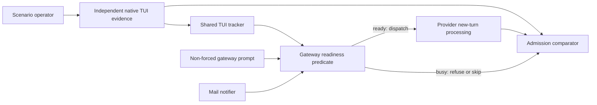
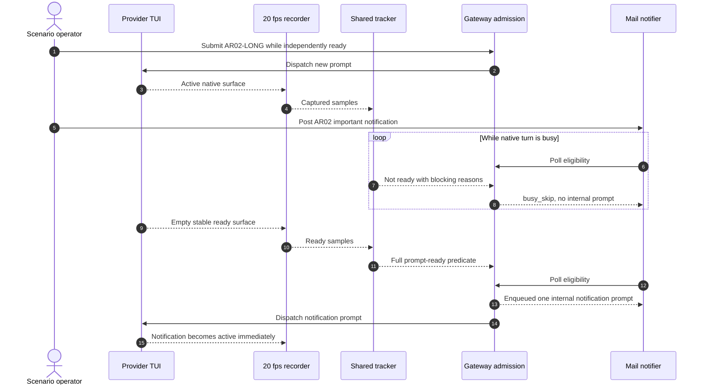

# Use Case 03: Qualify Prompt Admission Readiness

## Actor Goal

As a Houmao developer, I want behavioral prompt-admission tests for every maintained TUI tracker, so that gateway prompts, `houmao-mgr` prompts, and mail-notifier wakeups are admitted exactly when the provider will process them as a new turn instead of retaining them in the provider CLI for later.

## Use Case

The developer qualifies the boundary between `busy` and `ready` for Claude Code, Codex, and Kimi Code in unattended TUI sessions. This use case treats readiness as a behavioral promise, not a visual synonym for an empty editor:

- `ready` means that a new independent prompt submitted now starts processing immediately and does not enter a provider-native queue, pending-follow-up buffer, or steering path for the current turn;
- `busy` means that a new independent prompt cannot start immediately. A provider may retain it for later, reinterpret it as steering, or refuse it, but Houmao must not claim that the surface is ready for a new turn.

The test first calibrates each provider's native busy-input behavior in a disposable session. It then records independent 20 fps evidence while exercising the non-forced gateway direct-control path, which must send immediately or return `error_code=not_ready` without injecting text. Finally, it places an important operator-origin mail notification into the agent mailbox while the TUI is busy and proves that the notifier records `busy_skip`, preserves the mail outside the provider CLI, and releases one wake-up prompt promptly after the native surface becomes ready.

This is an end-to-end admission qualification layered over the detector suites. [UC-01](uc-01-qualify-focused-tui-state-transitions.md) owns focused field and transition correctness. [UC-02](uc-02-pressure-test-long-horizon-tui-state-tracking.md) owns accumulated-history pressure. UC-03 proves that the tracked fields produce the right operational decision at the prompt boundary and that a false-busy result cannot indefinitely block outside work such as an email notification.

Every live provider session uses the maintained `unattended` posture. The CLI must not request confirmation, approval, permission, trust, login, update, session selection, browser interaction, or an answer to a model-generated question during a normal step. Only a predeclared, evidence-backed hard-coded provider prompt with no supported bypass may receive a scripted response.

## Admission Contract Under Test

For a TUI target, the current non-forced gateway direct-control path admits a prompt only when all of these conditions hold:

- gateway request admission is open;
- gateway-managed execution is idle and durable queue depth is zero;
- `turn.phase=ready`;
- `surface.accepting_input=yes`;
- `surface.editing_input=no`;
- `surface.ready_posture=yes`;
- `stability.stable=true`;
- when parsed surface evidence is available, `parsed_surface.business_state=idle` and `parsed_surface.input_mode=freeform`.

The maintained operator command is:

```text
houmao-mgr agents single --agent-id {{AGENT_ID}} gateway prompt --prompt "{{PROMPT}}"
```

It targets `POST /v1/control/prompt`, not the durable queued request surface. A successful call returns `status=ok`, `action=submit_prompt`, `sent=true`, and `forced=false`. A readiness refusal exits non-zero with structured `error_code=not_ready`; it must not create a durable queued request or mutate the provider TUI. The test must not use `POST /v1/requests` as the direct-readiness oracle because that surface intentionally accepts durable queued work.

The mail notifier uses the same TUI readiness predicate before it creates an internal `mail_notifier_prompt`. While the target is busy, each applicable poll must record `outcome=busy_skip` in `gateway_notifier_audit` and must not create an internal prompt. Once the target becomes ready, a later poll may record `outcome=enqueued`; the worker must then begin that prompt without a provider-native queue delay.

`--force` bypasses the readiness gate and is prohibited in qualification runs. It is allowed only in the disposable native-behavior calibration described below.

## Supported Actions

### Calibrate Provider-Native Busy Input

Determine what each maintained provider does when prompt text is forcibly submitted during an active turn.

- context
  - Actor **has** a disposable unattended provider session, an empty run-local Boltons copy, a long read-only prompt, and a unique forced canary.
  - System **has** 20 fps recording, exact input-event capture, and provider-native queue, pending-follow-up, steering, or refusal signatures.
- intent
  - Actor **wants** an independent behavioral basis for labeling the same visible surface `busy` rather than trusting tracker output.
  - Actor **wonders** "If Houmao bypassed its guard here, would this provider start a new turn now or retain or reinterpret the prompt?"
- action
  - Actor then **asks** the system to submit the long prompt, wait for independently visible active evidence, send the canary once through gateway prompt control with `--force`, and observe the provider until both the original work and canary disposition are unambiguous.
- result
  - Actor **gets** a provider/version calibration record classified as `queued_for_later`, `steered_into_current_turn`, `provider_rejected`, or `immediate_independent_turn`, together with the exact visible signatures needed to detect provider-native retention in qualification sessions.

### Qualify Direct Ready-or-Refuse Prompt Control

Alternate known-busy and known-ready native surfaces while sending unique prompts through non-forced gateway direct control.

- context
  - Actor **has** an attached gateway, an independently labeled native TUI, a recorded Boltons copy, and unique prompt canaries.
  - System **has** current TUI tracking, the direct prompt-control route, structured refusal output, gateway events, and queue inspection.
- intent
  - Actor **wants** zero false-ready admissions and bounded recovery from false-busy tracking.
  - Actor **wonders** "Will Houmao reject work while the CLI would retain it, then open quickly enough when a new prompt would run immediately?"
- action
  - Actor then **asks** the system to execute AR-01 exactly, compare every live admission decision with independent behavioral ground truth, and replay the recording at canonical and degraded cadences.
- result
  - Actor **gets** correlated native labels, tracked state, prompt-control responses, provider input evidence, queue evidence, dispatch latency, and the first false-ready or false-busy interval.

### Qualify Mail-Notification Release

Place an important notification in the managed mailbox during active work and observe its complete readiness-gated lifecycle.

- context
  - Actor **has** a mailbox-enabled managed TUI, an attached gateway, a one-second unread-only notifier, and one unique operator-origin message.
  - System **has** durable mailbox truth, per-poll notifier audit records, internal gateway request records, and TUI recording.
- intent
  - Actor **wants** important outside notifications to stay out of the provider's own queue while busy and to start promptly once ready.
  - Actor **wonders** "Will a false-busy `ready_posture` leave this notification blocked even after the CLI can process it immediately?"
- action
  - Actor then **asks** the system to execute AR-02 exactly, requiring busy skips during the active turn and one prompt release after independent ready ground truth.
- result
  - Actor **gets** a correlated mail message, notifier poll history, enqueue record, provider dispatch evidence, ready-to-release latency, and proof that the notification was neither lost nor injected early.

## Independent Behavioral Ground Truth

The operator labels the native recording without seeing tracker output, gateway decisions, or notifier audit results. Labels use these values:

| Label | Native evidence | Required `surface.ready_posture` | Behavioral validation |
| --- | --- | --- | --- |
| `ready_immediate` | Supported empty prompt surface, no draft, overlay, current active evidence, retained follow-up, or unresolved provider work | `yes` | A unique non-forced canary becomes the next independent active turn immediately, with no calibrated provider-native retention signature |
| `busy_active` | Current response, tool action, spinner, transcript growth, or other active-turn evidence | `no` | Disposable forced calibration shows that a new prompt is retained, steered, or refused rather than started as an independent turn |
| `busy_draft` | User-authored draft is present in the prompt editor | Any value except `yes`; the exact provider expectation comes from UC-01 | Non-forced control must preserve the draft and refuse the outside prompt |
| `busy_overlay` | Slash menu, selector, copy-mode surface, or another non-submit-ready overlay is visible | Any value except `yes`; canonical overlays normally use `unknown` | Non-forced control must preserve the surface and refuse the outside prompt |
| `indeterminate` | Capture gap, unsupported surface, ambiguous transition, or missing process evidence prevents a behavioral conclusion | `unknown` | No exact readiness claim; live attempt is excluded or expected to refuse conservatively |

An unequivocal active span that remains `surface.ready_posture=unknown` is a classification failure even when the conservative gateway refusal is operationally safe. An unequivocal ready span reported as `no` or `unknown` is both a classification failure and, after the readiness deadline, an availability failure. This distinction ensures that the test exposes the current class of detector defect instead of hiding it behind the full admission predicate.

An accepted prompt counts as immediate only when all of the following are visible or durable:

1. the direct-control call reports `sent=true`;
2. the unique prompt becomes the next provider input event, not a durable gateway queue item waiting behind other work;
3. the provider enters active processing within `max(1.0 second, 2 × observed_watch_interval)` after dispatch returns;
4. no calibrated provider-native queue, pending-follow-up, or steering signature appears;
5. no older turn completes between prompt delivery and the canary becoming active.

The independent label is authoritative for classification. The accepted/refused result and provider behavior validate that label; tracker output must never be used to author or repair it.

## Boltons Test-Project Contract

Every live session uses a fresh copy of `tests/fixtures/test-projects/boltons` under the run root. The coordinator applies UC-02's copy, cache cleanup, fresh Git baseline, fixture hash, offline collection, isolated provider home, and cleanup rules. The vendored fixture is immutable input.

Every agent prompt begins with this exact prefix:

`Work only in this Boltons checkout. Do not use the network, install packages, modify dependency files, or ask questions.`

The procedure tables abbreviate it as `{{SAFE}}`. The manifest expands `{{SAFE}}`, `{{AGENT_ID}}`, `{{MESSAGE_REF}}`, `{{GATEWAY_BASE_URL}}`, and the operation-owned `{{PROMPT}}` before execution and stores every literal command, HTTP body, and prompt. No prompt may be improvised during a run.

## Provider Matrix

Run CAL-01, AR-01, and AR-02 once for each maintained Claude Code, Codex, and Kimi Code tracker profile. Each attempt uses a fresh provider process and Boltons copy. A provider/version whose forced calibration produces `immediate_independent_turn` during the existing active turn requires design review before qualification because the shared new-turn readiness definition may not fit that provider; the coordinator must not silently relabel the state.

| Procedure | Claude Code | Codex | Kimi Code | Purpose |
| --- | --- | --- | --- | --- |
| CAL-01 | Required | Required | Required | Establish native busy-input retention, steering, or refusal signatures |
| AR-01 | Required | Required | Required | Prove direct false-ready safety and false-busy recovery across active, draft, overlay, and ready surfaces |
| AR-02 | Required | Required | Required | Prove important mail stays outside the CLI while busy and releases promptly when ready |

## CAL-01: Disposable Native Busy-Input Calibration

This procedure is evidence calibration, not a passing gateway-safety run. `--force` is expected to bypass Houmao readiness and may contaminate the provider session, so the coordinator destroys the session afterward and never reuses its labels as qualification output without human review.

| Op | Exact prompt or action | Independent checkpoint | Required artifact |
| --- | --- | --- | --- |
| 1 | Submit non-forced through gateway control: `{{SAFE}} Read boltons/iterutils.py, boltons/dictutils.py, boltons/strutils.py, boltons/urlutils.py, and their matching tests. Do not edit files. Produce at least 60 numbered API-and-test observations and end with CAL01-LONG.` | The prompt starts as an independent turn | Direct-control success and provider input event |
| 2 | Wait for two consecutive independently visible `busy_active` frames at least `0.05s` apart | Original turn remains active | Source sample ids and human label |
| 3 | Submit once with `--force`: `{{SAFE}} Do not edit files. Reply exactly CAL01-FORCED-CANARY.` | The original turn was active at dispatch | Forced-control response and exact dispatch time |
| 4 | Observe without further input until the canary is processed, rejected, or remains retained after the original turn settles | Provider disposition is unambiguous | Native behavior class and matching frame range |
| 5 | Stop and destroy the disposable session | No qualification session inherits forced input | Cleanup evidence |

If operation 1 completes before operation 3, report `stimulus_too_short` and rerun the unchanged procedure. Do not shorten the active checkpoint or invent a replacement prompt.

## AR-01: Direct Admission Boundary Cycle

This is the primary classification case. All gateway prompt calls are non-forced. Failed calls are test operations, but they must not become provider input events.

AR-01 covers both maintained entry surfaces for the same live prompt-control contract. Operations 1, 4, 6, and 12 use the `houmao-mgr agents single ... gateway prompt` command. Operations 2, 8, and 10 call the live gateway directly with this exact request shape:

```http
POST {{GATEWAY_BASE_URL}}/v1/control/prompt
Content-Type: application/json

{"schema_version":1,"prompt":"{{PROMPT}}","force":false}
```

The manifest records the resolved base URL and literal JSON body. The HTTP and CLI variants must make the same readiness decision and produce equivalent success or `not_ready` semantics.

| Op | Exact prompt or action | Independent native posture | Required gateway and provider outcome |
| --- | --- | --- | --- |
| 1 | At stable startup, submit: `{{SAFE}} Read boltons/iterutils.py, boltons/dictutils.py, boltons/strutils.py, boltons/urlutils.py, and their matching tests. Do not edit files. Produce at least 60 numbered API-and-test observations and end with AR01-LONG.` | `ready_immediate` before dispatch | Success payload; prompt becomes active immediately |
| 2 | During the long turn, submit: `{{SAFE}} Do not edit files. Reply exactly AR01-BUSY-CANARY.` | `busy_active` for two consecutive source frames | Non-zero structured `error_code=not_ready`; no provider input, gateway queued request, or canary text |
| 3 | Wait for the long turn to finish and for independent `ready_immediate` evidence to remain stable for the configured tracker stability window | `ready_immediate` | Tracked admission must open within the readiness deadline |
| 4 | Submit: `{{SAFE}} Read pyproject.toml only. Do not edit files. Reply exactly AR01-READY-A PYTHON>=3.7.` | `ready_immediate` | Success payload; exact prompt becomes the next active turn immediately |
| 5 | After AR01-READY-A settles, type without submitting: `AR01-LOCAL-DRAFT-DO-NOT-SUBMIT` | `busy_draft` | Draft appears byte-for-byte; no turn starts |
| 6 | Submit: `{{SAFE}} Do not edit files. Reply exactly AR01-DRAFT-CANARY.` | `busy_draft` | `error_code=not_ready`; original draft remains byte-for-byte; no canary text or queued request |
| 7 | Press `Ctrl+U`, then wait for stable independent ready evidence | `ready_immediate` | Draft clears; tracked admission reopens within the readiness deadline |
| 8 | Submit: `{{SAFE}} Read README.md only. Do not edit files. Reply exactly AR01-READY-B https://github.com/mahmoud/boltons.` | `ready_immediate` | Success payload; exact prompt becomes active immediately |
| 9 | After AR01-READY-B settles, type `/` without submitting | `busy_overlay` | Slash menu is visibly open |
| 10 | Submit: `{{SAFE}} Do not edit files. Reply exactly AR01-OVERLAY-CANARY.` | `busy_overlay` | `error_code=not_ready`; overlay is unchanged; no canary text or queued request |
| 11 | Press `Escape`, then wait for stable independent ready evidence | `ready_immediate` | Overlay closes; tracked admission reopens within the readiness deadline |
| 12 | Submit: `{{SAFE}} Read boltons/fileutils.py only. Do not edit files. Reply exactly AR01-READY-C KEEP=5.` | `ready_immediate` | Success payload; exact prompt becomes active immediately and later settles once |

The run fails immediately if an operation expected to refuse returns `sent=true`, if a refused canary appears anywhere in the provider editor, transcript, steering area, or calibrated queue surface, or if a ready canary is retained rather than becoming the next independent active turn.

## AR-02: Important Mail Notification Across Busy-to-Ready

The coordinator enables the notifier before starting the procedure:

```text
houmao-mgr agents single --agent-id {{AGENT_ID}} gateway mail-notifier enable --interval-seconds 1 --mode unread_only --pre-notification-context-action none
```

The procedure uses one operator-origin mailbox message so it does not depend on another agent being live.

| Op | Exact prompt or action | Independent native posture | Required notifier and provider outcome |
| --- | --- | --- | --- |
| 1 | Submit through non-forced gateway control: `{{SAFE}} Read boltons/iterutils.py, boltons/dictutils.py, boltons/strutils.py, boltons/urlutils.py, and all matching tests. Do not edit files. Produce at least 70 numbered observations and end with AR02-LONG.` | `ready_immediate`, then `busy_active` | Prompt starts immediately; long turn remains active for at least two notifier polls |
| 2 | While active, run: `houmao-mgr agents single --agent-id {{AGENT_ID}} mail post --subject "AR02 IMPORTANT READY GATE" --body-content "This is the UC-03 readiness-gate notification." --notify-block "Important readiness test AR02-MAIL-CANARY. Inspect this mail when notified." --notify-block-placement prepend` | `busy_active` | One unread message with captured `{{MESSAGE_REF}}` exists |
| 3 | Observe at least two notifier polls without provider input | `busy_active` throughout both polls | Each poll records `busy_skip`; no `mail_notifier_prompt`, queue record, canary text, or provider input exists |
| 4 | Wait for AR02-LONG to settle and independently label stable `ready_immediate` | `ready_immediate` | Readiness deadline starts at the first stable-ready source sample |
| 5 | Observe the notifier without sending any user input | `ready_immediate` until dispatch | Within the release deadline, one audit row records `enqueued` with a request id and the notification prompt becomes active immediately without a native retention signature |
| 6 | Disable the notifier immediately after the first enqueue: `houmao-mgr agents single --agent-id {{AGENT_ID}} gateway mail-notifier disable` | Notification turn may be active | No later poll creates a duplicate wake-up prompt |
| 7 | Wait for the notification turn to settle, then run: `houmao-mgr agents single --agent-id {{AGENT_ID}} mail archive --message-ref {{MESSAGE_REF}}` | Returns to `ready_immediate` | One notification turn, one terminal result, no retained duplicate, and the run-owned message is archived |

If AR02-LONG settles before two busy polls, report `stimulus_too_short` and rerun the unchanged procedure. If the mail is posted after independent ready evidence begins, report `missed_busy_mail_window` and rerun. Do not use a direct TUI keystroke to simulate the notifier.

## Timing and Admission Oracles

All deadlines derive from recorded monotonic times and the effective runtime timing configuration.

- `native_active_deadline`: after a successful direct-control return, the provider must show the submitted canary as the current active independent turn within `max(1.0 second, 2 × observed_watch_interval)`.
- `readiness_deadline`: after independent `ready_immediate` evidence has remained unchanged for the configured stability window, the full non-forced admission predicate must become true within `max(1.0 second, 2 × observed_watch_interval)`.
- `notifier_release_deadline`: after the readiness deadline opens, the next qualifying notifier audit must record `enqueued` within `2 × interval_seconds + max(1.0 second, 2 × observed_watch_interval)`, and the worker must satisfy `native_active_deadline` for that internal prompt.

The 20-second final stable-active recovery remains a safety backstop, not a passing latency target for this use case. If ordinary unambiguous ready evidence requires that backstop before admission opens, the test reports `false_busy_late_recovery` even if the prompt eventually dispatches. A gateway that remains conservatively closed during ambiguous evidence is correct; a gateway that remains closed after stable `ready_immediate` ground truth exceeds the readiness deadline is false-busy.

Each checkpoint receives separate verdicts:

- `classification_verdict`: whether tracked ready/busy posture matches independent ground truth;
- `admission_verdict`: whether the direct-control or notifier decision was open or closed correctly;
- `delivery_verdict`: whether admitted work started immediately without provider-native retention;
- `scenario_verdict`: whether the exact Boltons task and mailbox checkpoints occurred.

An engineering or model-output mismatch is `scenario_task_divergence`; it does not excuse a tracker or admission mismatch. Conversely, correct model output does not compensate for late or unsafe admission.

## Capture and Replay Requirements

Record every CAL-01, AR-01, and AR-02 TUI session at a requested `0.05` second interval with actual timestamps, pane snapshots, input events, gateway command start/end times, structured command output, queue snapshots, and notifier audit rows. Human labels remain blind to tracker and gateway output until signed off.

Canonical replay runs the shared tracker and an admission-consumer simulator over every source sample. The simulator applies the current non-forced TUI predicate and emits `would_admit` plus every blocking reason. Canonical comparison requires exact agreement with independent `ready_immediate`, `busy_active`, `busy_draft`, and `busy_overlay` spans after documented stability timing.

Run UC-01's 10 Hz, 5 Hz, and 2 Hz fixed schedules with zero and half-interval offsets, plus supported jitter and gap schedules. Degraded cadence uses these admission-specific invariants:

1. No sampled `busy_active`, `busy_draft`, or `busy_overlay` posture may produce `would_admit=true`.
2. No readiness claim may survive sampled transport loss, process loss, unclassified overlay evidence, or active evidence.
3. A sampled ready transition may be delayed conservatively only until the first unambiguous ready sample plus the configured stability window and `max(1.0 second, 2 × observed_sample_interval)`.
4. Missing a short busy or ready interval is acceptable when no derived sample represents it; fabricating the opposite decision at a represented checkpoint is not.
5. A lower-frequency stream may omit intermediate labels, but it must preserve `closed while represented busy → open after represented stable ready` order.
6. A ready result is invalid if the corresponding live delivery would have entered a calibrated provider-native queue, follow-up buffer, or steering path.
7. An `unknown` posture is safe during uncertainty but becomes `degraded_but_coherent` only when it clears within the bounded ready deadline. Persistent false-busy is a failure because it blocks downstream prompts.
8. Repeated samples and cadence changes must not oscillate admission or create duplicate notification prompts.

Replay cannot re-execute live gateway calls or mailbox delivery. It must reproduce their decisions through the admission-consumer simulator and correlate them with the immutable live command/audit trace. The report must distinguish live end-to-end evidence from replayed classifier evidence.

## Acceptance Criteria

UC-03 passes only when all three maintained providers complete CAL-01, AR-01, and AR-02 and satisfy all of these criteria:

- independent labels cover every relevant source sample and cite visible behavioral evidence;
- every canonical `busy_active` span reports `surface.ready_posture=no`, and every canonical `ready_immediate` span reports `surface.ready_posture=yes` after documented stability timing;
- every AR-01 busy attempt returns non-zero `error_code=not_ready` and leaves no provider input, durable gateway request, or native retained prompt;
- every AR-01 ready attempt returns `sent=true` and begins as the next independent turn within `native_active_deadline`;
- every stable native ready transition opens the full admission predicate within `readiness_deadline` without relying on final 20-second recovery;
- AR-02 records at least two `busy_skip` polls while the long turn is independently active;
- AR-02 creates no notification prompt while busy, then creates exactly one internal notification request within `notifier_release_deadline` after stable ready;
- the notification prompt begins immediately and never appears in a calibrated provider-native retention surface;
- no provider session shows an unallowlisted confirmation or requested user intervention;
- canonical replay has zero unexplained readiness or admission mismatches;
- every 2 Hz-or-faster replay has zero false-ready decisions and no false-busy interval beyond its cadence-adjusted deadline;
- all failures preserve the first divergent source sample, the attempted outside prompt or mail event, the tracker blockers, the gateway decision, and the provider-visible consequence.

False-ready and false-busy have distinct release consequences:

- any false-ready admission is a safety failure because Houmao injected a new-turn prompt where the provider could not process it immediately;
- any false-busy interval beyond the readiness deadline is an availability failure because gateway prompts and notification wakeups remain blocked while the provider could process them immediately.

## Main Flow

1. The developer resolves maintained provider versions, tracker profiles, unattended strategies, effective stability timings, gateway watch cadence, and notifier interval.
2. The coordinator creates fresh run-local Boltons copies and isolated provider homes, records the fixture and configuration manifests, and verifies prompt-free startup.
3. The operator runs CAL-01 for each provider and signs the provider-native busy-input behavior without viewing tracker output.
4. The coordinator starts a fresh AR-01 session, attaches the gateway, starts 20 fps recording, and records stable startup readiness.
5. The coordinator executes the twelve AR-01 operations exactly, alternating independent busy and ready postures while capturing direct-control responses and provider input evidence.
6. The operator labels the AR-01 recording blindly and signs the readiness spans.
7. The coordinator starts a fresh AR-02 session, attaches the gateway, enables the unread-only one-second notifier, and starts 20 fps recording.
8. The coordinator starts AR02-LONG, posts the exact operator-origin mail during active work, and observes at least two busy polls.
9. After independent stable ready evidence appears, the coordinator observes the notification enqueue and immediate provider processing, disables the notifier, and cleans up the message.
10. The operator labels the AR-02 recording blindly and signs the busy-to-ready transition.
11. The harness correlates labels, tracked states, admission decisions, gateway events, queue rows, notifier audit rows, and provider input events by monotonic time.
12. The harness replays canonical and delayed schedules through the shared tracker and admission-consumer simulator.
13. The coordinator writes separate classification, admission, delivery, and scenario verdicts, preserves minimal failure slices, and cleans up only run-owned resources.

## Alternative and Exception Flows

- If a maintained provider has no compatible unattended strategy, stop before calibration with `unsupported_unattended_version`; do not fall back to `as_is`.
- If an unallowlisted confirmation or user-question prompt appears, stop normal operations and fail `unattended_confirmation_violation`; do not answer it.
- If a declared unavoidable prompt matches the intervention allowlist, send only the scripted response and use `pass_with_unavoidable_intervention` at best.
- If CAL-01 produces `immediate_independent_turn` while older work remains active, stop that provider with `readiness_semantics_review_required`; do not force it into the shared busy model.
- If a long prompt settles before the required active checkpoint, rerun the unchanged procedure from a fresh session with `stimulus_too_short`.
- If a non-forced busy attempt is admitted, preserve the complete provider queue or steering consequence and stop the qualification session with `false_ready_admission`.
- If a non-forced ready attempt is refused past the readiness deadline, preserve all reported blockers and continue recording until either dispatch or final recovery so the report can distinguish `false_busy_late_recovery` from `false_busy_stuck`.
- If the notifier sees mail while busy but creates an internal prompt, stop with `notifier_false_ready`; do not allow the queued prompt to contaminate later readiness evidence.
- If the notifier remains at `busy_skip` beyond the release deadline after stable ready, preserve later polls and report `notifier_false_busy` even if final recovery eventually releases the prompt.
- If a network or LLM API error occurs accidentally, quarantine the affected turn and rerun. Remote failures are not readiness stimuli.
- If the recorder misses the decisive busy-to-ready boundary or provider-native retention signature, rerun; do not reconstruct ground truth from tracker or gateway output.
- If cleanup could modify a pre-existing tmux session, mailbox message, provider home, gateway root, or project tree, stop with `unsafe_mutation_scope`.

## Mermaid Flow Diagram



## Mermaid Sequence Diagram



## Durable Outputs

- `calibration/<provider>/native-busy-input.json`: provider version, exact forced canary, active source samples, native behavior class, retention signatures, and cleanup proof.
- `sessions/<provider>/ar-01/scenario.json`: expanded operations, effective timing configuration, admission deadlines, provider profile, and resource ownership.
- `sessions/<provider>/ar-02/scenario.json`: expanded mail command, notifier configuration, message ref, deadlines, and cleanup contract.
- `sessions/<provider>/<procedure>/recording/`: manifest, cast, 20 fps pane snapshots, semantic input events, and independent readiness labels.
- `sessions/<provider>/<procedure>/gateway-command-trace.ndjson`: command start/end times, exit status, structured success or refusal payload, and target identity.
- `sessions/<provider>/<procedure>/tracked-state.ndjson`: public state, parsed sidecar evidence, stability, and all admission blockers per sample.
- `sessions/<provider>/<procedure>/gateway-events.jsonl` and `queue-snapshots.ndjson`: direct dispatch events, durable queue observations, and proof that refused prompts were not retained by Houmao.
- `sessions/<provider>/ar-02/notifier-audit.ndjson`: poll time, unread identity, readiness inputs, `busy_skip` or `enqueued` outcome, detail, and request id.
- `sessions/<provider>/<procedure>/delivery-correlation.ndjson`: prompt or message identity joined to provider input, active onset, native retention signatures, and terminal result.
- `sessions/<provider>/<procedure>/sweeps/<variant>/`: source mapping, replayed tracked state, simulated admission decisions, deadlines, and verdict.
- `issues/<provider>-<procedure>-<first-divergence>.md`: minimal source frames, outside event, expected and actual state, blockers, decision, and downstream consequence.
- `context/features/2026-07-11-tui-state-tracking-test-plan/test-reports/<ts>-prompt-admission-readiness.md`: provider matrix, false-ready and false-busy totals, latency distributions, notifier release results, replay results, artifact links, and release recommendation. `<ts>` is the UTC execution-start timestamp formatted as `YYYYMMDDTHHMMSSZ`.

## Example Prompt and Expected AI Response

### Event 001: Execute Prompt-Admission Qualification

> Time: `2026-07-13T12:00:00Z` · Session: `tui-prompt-admission-plan`

User Prompt:

> Use only unattended TUI mode. Run CAL-01, AR-01, and AR-02 for Claude, Codex, and Kimi against fresh Boltons copies. Record every TUI at 20 fps. Treat ready as “a new independent prompt starts immediately without entering the CLI's own queue.” Use non-forced gateway prompt control for qualification, and prove that an important mail notification is skipped while busy and released promptly after ready.

AI:

> The agent should first show provider versions, unattended strategies, copied-project paths, gateway targets, effective tracking timings, notifier interval, and the empty-or-reviewed intervention allowlist. It should isolate the forced calibration from qualification, keep human labels blind to tracker output, and distinguish tracker classification, gateway admission, provider delivery, and Boltons task verdicts. It should stop on false-ready injection, preserve extended evidence for false-busy, and report notifier `busy_skip` and `enqueued` audit rows with their correlated native frames.

## Assumptions and Open Questions

- The direct non-forced readiness oracle is `houmao-mgr agents single ... gateway prompt`, which uses live gateway prompt control and returns structured `not_ready` refusal. The ordinary transport-neutral `houmao-mgr agents single ... prompt` path is not used as the oracle because its effective dispatch path depends on target authority.
- The current gateway TUI predicate includes tracker fields, stability, and parsed-surface sidecar evidence. The report must list every blocker so a `surface.ready_posture` defect is not hidden behind another conservative field.
- A steering submission during an existing turn does not satisfy this use case's definition of immediate new-turn readiness, even if the provider applies the steering text immediately.
- The notifier's one-second interval is supported by the maintained CLI. Scheduling jitter is handled by the two-interval release allowance, but every actual poll time remains authoritative.
- Provider-native queue and steering signatures may change by provider version. CAL-01 is therefore mandatory for every maintained version selected by a qualification run.
- The feature directory currently has no feature-level requirement or design document; UC-03 derives its host contracts from the existing UC-01/UC-02 plan, current OpenSpec requirements, current CLI reference, and current gateway implementation.
