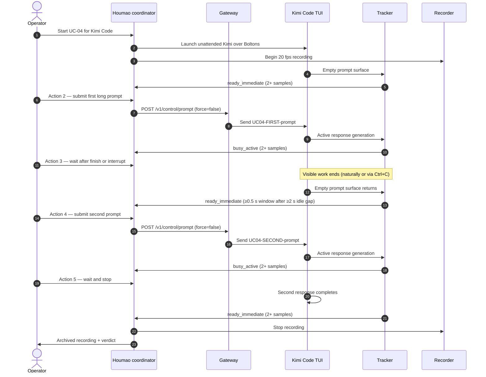

# Use Case 04: Verify Kimi Code Ready-Busy-Ready Transition

## Actor Goal

As a Houmao developer, I want a focused, repeatable Kimi Code exercise that forces the tracker to report `ready`, then `busy`, then `ready` again, so that I can distinguish a detector that never returns to ready from one that merely misses transient ready windows in fast recordings.

## Use Case

This is a short, deterministic cycle aimed at the Kimi Code tracker profile. Earlier long-horizon replay showed the tracker reporting almost every Kimi ST03 sample as `busy_active` and only three samples as `ready_immediate`. That result is compatible with two very different defects:

1. the detector profile cannot recognize a ready Kimi surface at all; or
2. the recorded session happened to capture only busy surfaces because the operator submitted the next prompt before the ready window persisted for one sample.

UC-04 removes the timing ambiguity. It submits two independent prompts with a deliberate, operator-paced gap between them. The first prompt creates a long active turn; the operator either lets the turn finish naturally or explicitly interrupts it, then waits well past the visible end of work before submitting the second prompt. If the tracker cannot report `ready_immediate` during that forced idle gap, the profile has a genuine ready-state recognition defect. If it can, the earlier result was an artifact of fast back-to-back operations in the long-horizon session.

The cycle is intentionally simpler than [UC-03](uc-03-qualify-prompt-admission-readiness.md). UC-03 proves the full admission boundary across providers and surfaces. UC-04 isolates one transition family for Kimi Code and makes the ready window large enough to survive any plausible sampling jitter.

## Supported Actions

### Start a Ready Kimi Code Session

Launch a fresh Kimi Code TUI over a Boltons copy and confirm the initial surface is ready.

- context
  - Actor **has** a managed Kimi Code agent role, a fresh Boltons checkout, and a 20 fps terminal recorder.
  - System **has** the current Kimi Code tracker profile, gateway direct prompt control, and sample-by-sample state capture.
- intent
  - Actor **wants** a known ready starting point for the transition cycle.
  - Actor **wonders** "Does the tracker agree that a freshly launched, empty Kimi prompt is ready for input?"
- action
  - Actor then **asks** the system to launch the agent, attach the gateway, and record until two consecutive samples are labeled `ready_immediate` by both the tracker and independent inspection.
- result
  - Actor **gets** a launched session, a recording baseline, and a confirmed ready window of at least two samples.

### Submit the First Long Prompt

Send a prompt guaranteed to produce a multi-second active turn.

- context
  - Actor **has** a confirmed ready Kimi Code session and a unique first canary.
  - System **has** non-forced gateway prompt control and per-sample tracker output.
- intent
  - Actor **wants** to drive the surface from `ready_immediate` into a sustained `busy_active` state.
  - Actor **wonders** "Does the tracker immediately recognize that Kimi is processing a new turn?"
- action
  - Actor then **asks** the system to submit the first long prompt through gateway control and record until two consecutive samples show `busy_active`.
- result
  - Actor **gets** a recorded busy interval, the prompt input event, and tracker evidence of the active turn.

### Wait for the First Turn to End and Then Wait Some More

Force a long idle gap after the first active turn before the second prompt.

- context
  - Actor **has** an active Kimi turn in progress and the original prompt text.
  - System **has** transcript/pane snapshot capture, the stability predicate used by the tracker, and the ability to send `Ctrl+C` to the provider TUI.
- intent
  - Actor **wants** a deliberate, inspectable ready gap before the next prompt so that a detector which needs time to decay from `busy` to `ready` has time to do so.
  - Actor **wonders** "If I wait long enough after Kimi finishes — or after I interrupt it — does the tracker eventually label the surface ready again?"
- action
  - Actor then **asks** the system to do one of the following and then wait:
    - **Path A (natural settle):** Wait until the response visibly stops changing, then continue waiting without further input for at least `max(2.0 seconds, 4 × capture_interval)`.
    - **Path B (interrupt then settle):** Press `Ctrl+C` once, observe the turn terminate, then continue waiting without further input for at least `max(2.0 seconds, 4 × capture_interval)`.
  - During the entire idle gap, independent inspection must label the surface `ready_immediate` for a contiguous window of at least `max(0.5 second, 2 × capture_interval)`.
- result
  - Actor **gets** the elapsed ready window, its sample ids, the chosen path (natural or interrupt), and the tracker labels inside the gap. A zero-length or missing ready window here is a hard failure.

### Submit the Second Prompt

Send a second independent prompt to re-enter the busy state.

- context
  - Actor **has** a confirmed post-turn ready window and a unique second canary distinct from the first.
  - System **has** the same gateway control and recorder used in action 2.
- intent
  - Actor **wants** to verify the tracker can leave ready and enter busy a second time.
  - Actor **wonders** "Is the ready-to-busy transition repeatable, or did the first prompt contaminate tracker state?"
- action
  - Actor then **asks** the system to submit the second prompt and record until two consecutive samples show `busy_active`.
- result
  - Actor **gets** a second recorded busy interval and proof that the tracker accepted a new prompt from a ready state.

### Wait for the Second Turn to Settle and Stop

Close the cycle cleanly and preserve the recording.

- context
  - Actor **has** a second active Kimi turn and a recording that already contains one complete ready-busy-ready-busy cycle.
  - System **has** session stop and artifact archival.
- intent
  - Actor **wants** to confirm the tracker returns to ready after the second turn as well.
  - Actor **wonders** "Does the detector recover to ready consistently, or does it drift?"
- action
  - Actor then **asks** the system to wait for the second turn to finish, verify a final ready window of at least two samples, stop the session, and archive the recording.
- result
  - Actor **gets** a complete recording with two ready-busy-ready transitions, per-sample labels, and a pass/fail verdict.

## Main Flow

## Durable Outputs

- One 20 fps asciinema recording of the full Kimi session.
- Per-sample tracker timeline (`tracker-timeline.ndjson`) and replay schedules.
- Independent operator labels for the five action windows.
- A comparison report showing tracker labels vs. independent labels for every sample.
- A verdict record with the length and sample ids of every ready window.

## Acceptance Criteria

A run passes only when all of the following hold:

1. Action 1 produces a contiguous `ready_immediate` window of at least two samples before the first prompt.
2. Action 2 produces a contiguous `busy_active` window of at least two samples after the first prompt.
3. Action 3 produces a contiguous `ready_immediate` window of at least 0.5 seconds (or 2× capture interval, whichever is larger), observed after the first turn visibly ends and after an additional idle gap of at least 2.0 seconds (or 4× capture interval, whichever is larger). The turn may end naturally or after a single `Ctrl+C` interrupt.
4. Action 4 produces a contiguous `busy_active` window of at least two samples after the second prompt.
5. Action 5 produces a final contiguous `ready_immediate` window of at least two samples.
6. No non-forced prompt is admitted while the independent label is `busy_active`, `busy_draft`, or `busy_overlay`.
7. No provider-native queue, pending-follow-up, or steering signature appears for either prompt.

If criteria 3 fails, the defect is classified as **ready-state recognition failure** in the Kimi Code profile. If criteria 1 or 5 fails, the defect is classified as **initial or drifted false busy**.

## Assumptions and Open Questions

- Assumes the current Kimi Code unattended launch produces a stable empty prompt surface within the readiness deadline.
- Assumes the long prompts used in actions 2 and 4 reliably generate active response generation long enough for two 20 Hz samples.
- Open question: if the first prompt leaves a retained follow-up pane or draft, should the operator clear it before action 3, or should the test fail and expose the provider behavior?
- Open question: should the same test be repeated for Codex and Claude to confirm the transition family is not Kimi-specific, or should UC-04 remain Kimi-only because the ambiguity was found there?
