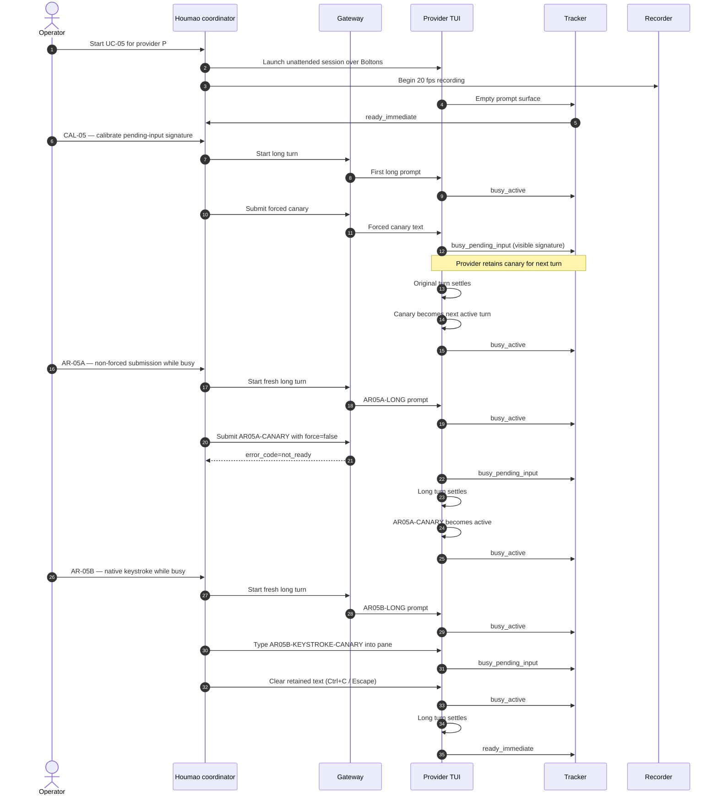

# Use Case 05: Detect Pending Instruction State

## Actor Goal

As a Houmao developer, I want the shared TUI tracker to recognize when a provider CLI has retained a user prompt for the next turn, so that downstream admission logic can reject a second prompt until the pending one is consumed or explicitly cleared.

## Use Case

Claude Code, Codex CLI, and Kimi Code all queue or append user input when it is submitted while the CLI is busy. The exact visible manifestation differs by provider and version:

- Claude Code may show a `Messages to be submitted after next tool call` or `Pending` row below the active status, or it may open a retained follow-up editor.
- Codex CLI may show a `Messages to be submitted after next tool call` line, a pending-input header, or a composer-like area above the active transcript.
- Kimi Code may show a follow-up composer pane, a queued message chip, or a retained prompt in the input area that is clearly not the current turn's prompt.

UC-05 defines a new tracker posture, `busy_pending_input`, for any busy interval during which independently visible provider evidence shows that user text has already been accepted for a later turn. The tracker must report `busy_pending_input` instead of ordinary `busy_active` whenever such evidence is present, and it must clear back to `busy_active` once the pending input is consumed and the surface returns to a normal busy state without queued user text.

This use case is layered over [UC-03](uc-03-qualify-prompt-admission-readiness.md). UC-03 proves that a non-forced prompt is refused while the provider is busy. UC-05 proves that the tracker can additionally detect the *reason* a second prompt must be refused: the CLI already holds user text for the next turn. Without this distinction, `houmao-mgr` would need a separate memory of every prompt it submitted, which fails when the pending text came from the user interacting directly inside the tmux pane.

## Supported Actions

### Calibrate Provider-Native Pending-Input Signatures

For each maintained provider, force-submit a canary while a long turn is active and record the exact visible signatures that mean "this text is queued for the next turn."

- context
  - Actor **has** a disposable unattended provider session, a long turn prompt, a unique forced canary, and a 20 fps recorder.
  - System **has** provider-specific parsers, the current tracker profile, and per-sample pane snapshots.
- intent
  - Actor **wants** a deterministic, version-anchored catalog of visual signatures for `busy_pending_input`.
  - Actor **wonders** "What does this provider show after I submit text while it is busy, and how can the tracker distinguish that from active-turn input?"
- action
  - Actor then **asks** the system to start a long turn, wait for independently visible `busy_active`, submit the canary once with `--force`, and observe until the original turn settles and the canary is either consumed or remains visible as queued text.
- result
  - Actor **gets** a calibration record with provider/version, the exact canary, the active sample range when the canary was submitted, the first sample where a pending-input signature appears, the signature class (`status_row_pending`, `composer_pane`, `retained_editor`, `queued_chip`, `header_pending`, `transcript_annotated`, or `other`), and the sample range where the canary becomes the active turn.

### Detect Pending Input After Direct Submission

Submit a prompt through non-forced gateway control while the provider is busy and verify the tracker labels the resulting surface `busy_pending_input`.

- context
  - Actor **has** an attached gateway, a recorded provider session in an active turn, and a unique non-forced canary.
  - System **has** the current tracker profile, direct prompt control, and structured refusal output.
- intent
  - Actor **wants** proof that the tracker sees queued text even when the gateway correctly refuses a second prompt.
  - Actor **wonders** "Does the tracker report `busy_pending_input` as soon as the refused canary appears in the provider's retention surface?"
- action
  - Actor then **asks** the system to start a long turn, submit the first canary non-forcedly and confirm it starts, wait for `busy_active`, submit a second canary non-forcedly, observe the gateway refusal, and continue recording until the first turn ends.
- result
  - Actor **gets** a recording where the second canary must not start a new turn but must produce a visible pending-input signature, and the tracker must label every sample in that signature range `busy_pending_input`.

### Detect Pending Input From Native TUI Interaction

Type text directly into the provider TUI while busy and verify the tracker detects the retained draft or queued message.

- context
  - Actor **has** a recorded provider session in an active turn and a unique typed canary.
  - System **has** the current tracker profile and the ability to inject keystrokes into the tmux pane.
- intent
  - Actor **wants** proof that the tracker detects pending user text even when the gateway did not submit it.
  - Actor **wonders** "If the operator types inside the tmux pane while the CLI is busy, does the tracker report `busy_pending_input`?"
- action
  - Actor then **asks** the system to start a long turn, wait for `busy_active`, type the canary into the provider input area without pressing Enter, or type and press Enter if the provider visibly queues the input, and continue recording until the first turn ends.
- result
  - Actor **gets** a recording where the typed canary creates a visible retained or queued state, and the tracker labels the corresponding samples `busy_pending_input`.

### Clear Pending Input and Return to Ready

After a pending-input interval, clear the retained text and verify the tracker eventually reports `ready_immediate`.

- context
  - Actor **has** a recorded provider session showing `busy_pending_input` and a way to clear the provider's retention surface (`Ctrl+C`, `Escape`, or the provider-specific discard shortcut).
  - System **has** the current tracker profile and per-sample state capture.
- intent
  - Actor **wants** proof that `busy_pending_input` clears cleanly and does not permanently pin the surface as busy.
  - Actor **wonders** "If I cancel the pending text, does the tracker return to `busy_active` while the current turn continues, and then to `ready_immediate` after the turn settles?"
- action
  - Actor then **asks** the system to issue the provider-appropriate clear gesture, wait until the pending signature disappears, wait for the active turn to settle, and then wait for the configured stability window.
- result
  - Actor **gets** a transition sequence `busy_pending_input → busy_active → ready_immediate`, with sample ranges for each phase and no residual pending signature.

## Independent Behavioral Ground Truth

The operator labels native recordings without seeing tracker output. Pending-input labels use these values:

| Label | Native evidence | Required `surface.ready_posture` | Behavioral validation |
| --- | --- | --- | --- |
| `busy_active` | Current response, tool action, spinner, transcript growth, or other active-turn evidence; no retained or queued user text for a later turn | `no` | A forced canary submitted now is retained, steered, or refused rather than starting immediately; no pending-input signature is visible |
| `busy_pending_input` | Same active-turn evidence plus a visible provider-native signature that user text has been accepted for the next turn | `no` | The retained canary is not part of the current turn and becomes active only after the current turn settles or is interrupted |
| `busy_draft` | User-authored draft is present in the prompt editor but has not been submitted to the provider's queue | Any value except `yes` | Non-forced control must preserve the draft and refuse the outside prompt |
| `busy_overlay` | Slash menu, selector, copy-mode surface, or another non-submit-ready overlay is visible | Any value except `yes` | Non-forced control must preserve the surface and refuse the outside prompt |
| `ready_immediate` | Supported empty prompt surface, no draft, overlay, current active evidence, retained follow-up, or unresolved provider work | `yes` | A unique non-forced canary becomes the next independent active turn immediately |

A span with a visible pending-input signature that is labeled `busy_active` is a classification failure because the tracker missed the reason admission must remain closed. A span without a visible pending-input signature that is labeled `busy_pending_input` is a false-pending failure because it blocks admission on evidence that does not exist.

## Provider-Specific Signature Catalogue

The calibration action produces a versioned catalogue. Initial expected classes:

| Provider | Expected signature | Notes |
| --- | --- | --- |
| Claude Code | `status_row_pending` or `retained_editor` | Look for queued-message row or follow-up editor below the active transcript |
| Codex CLI | `header_pending` or `status_row_pending` | Look for pending-input header or queued-message line |
| Kimi Code | `composer_pane` or `queued_chip` | Look for follow-up composer pane or queued message chip |

The tracker profile is allowed to use provider-specific parsed-surface sidecars as long as every signature class maps to one canonical `busy_pending_input` posture and the public state surface remains provider-agnostic.

## Main Flow

## Acceptance Criteria

UC-05 passes for a provider only when all of the following hold:

1. CAL-05 produces a stable, version-anchored signature class for `busy_pending_input` and a sample range proving the canary is retained for the next turn.
2. AR-05A: the non-forced second canary is refused by the gateway and produces a visible pending-input signature; the tracker labels every signature sample `busy_pending_input`.
3. AR-05A: after the first turn settles, the retained canary becomes the next active turn; the tracker labels those samples `busy_active`, not `ready_immediate`.
4. AR-05B: typing into the busy TUI creates a visible retained state and the tracker labels it `busy_pending_input`.
5. AR-05B: clearing the retained state returns the tracker to `busy_active` while the current turn continues, and then to `ready_immediate` after the turn settles and the stability window passes.
6. No sample with a visible pending-input signature is labeled `busy_active` or `ready_immediate`.
7. No sample without a visible pending-input signature is labeled `busy_pending_input`.
8. The public state surface exposes `turn_phase=busy_pending_input` and `surface.ready_posture=no` during pending-input spans.
9. Calibration, AR-05A, and AR-05B are each run once per maintained provider/version.

## Durable Outputs

- `calibration/<provider>/pending-input-signature.json`: provider version, signature class, exact canary, sample ranges, and representative frame paths.
- `sessions/<provider>/ar-05a/scenario.json`: operations, canaries, timing configuration, and resource ownership.
- `sessions/<provider>/ar-05a/recording/`: manifest, cast, 20 fps pane snapshots, input events, gateway command trace, and independent labels.
- `sessions/<provider>/ar-05a/tracked-state.ndjson`: per-sample public state and parsed-surface sidecar evidence.
- `sessions/<provider>/ar-05b/scenario.json`, `recording/`, and `tracked-state.ndjson`: same shape for the native-keystroke case.
- `issues/<provider>-<procedure>-<first-divergence>.md`: minimal source frames, expected label, actual label, and the visible pending-input signature.
- `context/features/2026-07-11-tui-state-tracking-test-plan/test-reports/<ts>-pending-instruction-state.md`: provider matrix, signature catalogue, false-pending and missed-pending counts, and release recommendation.

## Assumptions and Open Questions

- Assumes each provider exposes at least one deterministic visual signature when it retains user input for the next turn.
- Assumes the provider does not immediately start a second independent turn while the first is still active; if CAL-05 observes `immediate_independent_turn`, the provider requires a readiness-semantics review before UC-05 can apply.
- Open question: should `busy_pending_input` be a distinct `turn_phase` value or a modifier on `busy_active`? This use case treats it as a distinct phase so admission logic can test it directly.
- Open question: if the provider combines pending input with a draft overlay (for example, a slash menu open inside the queued composer), should the tracker report `busy_overlay` or `busy_pending_input`? The conservative rule is `busy_overlay` because it blocks submission for a different reason, but the report should note the overlap.
- Open question: should the tracker attempt to count pending messages (one, two, more) or only detect presence? UC-05 only requires presence detection; counting may be added later if admission logic needs it.
