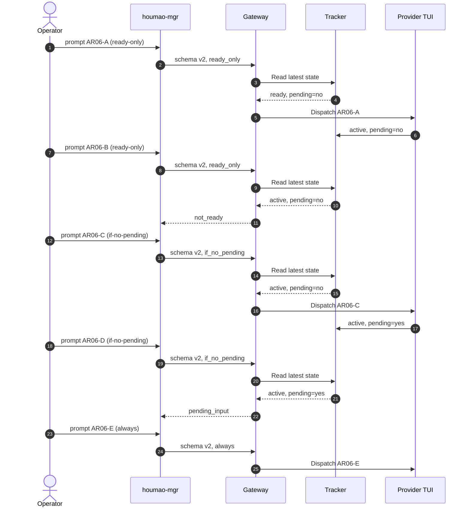

# Use Case 06: Apply Gateway Prompt Admission Policies to Pending Instructions

## Actor Goal

As a Houmao operator, I want to choose whether a prompt requires a fully ready TUI, only an empty provider-native pending queue, or no tracked TUI guard, so that each caller can state its own tolerance for busy and queued provider state.

## Use Case

UC-05 establishes the public `surface.pending_input=yes|no|unknown` observation. UC-06 consumes that observation through the direct prompt-control path used by `houmao-mgr agents single|self ... gateway prompt`.

The command exposes one admission policy:

| CLI value | API value | Intended caller behavior |
|---|---|---|
| `ready-only` | `ready_only` | Submit only when the existing stable prompt-ready predicate passes and pending input is decisively `no`. This is the default. |
| `if-no-pending` | `if_no_pending` | Permit submission while busy, editing, or unstable, but back off when pending input is `yes` or `unknown`. |
| `always` | `always` | Submit regardless of tracked readiness and pending input. |

Provider-native pending input is independent from an unsubmitted composer draft, a durable gateway request, and a Houmao explicit-prompt note. The provider TUI observation remains authoritative after dispatch.

Admission is observational. Houmao does not reserve an empty provider queue slot or hold a lock while the CLI repaints. Two closely spaced `if-no-pending` requests may both dispatch while the latest observation still says `no`; later calls react after the tracker observes `yes`.

## Supported Actions

### Submit With Ready-Only

- context
  - Actor **has** an attached unattended TUI agent, a stable ready surface, `surface.pending_input=no`, and a unique canary.
- intent
  - Actor **wants** the canary to start immediately as a new independent turn.
- action
  - Actor then **asks** the system to run `gateway prompt --admission-policy ready-only --prompt "{{PROMPT}}"`.
- result
  - Actor **gets** a schema-v2 success response with `admission_policy=ready_only`, and the canary starts immediately.

### Refuse Ready-Only While Busy

- context
  - Actor **has** a current active turn and `surface.pending_input=no`.
- intent
  - Actor **wants** full prompt-ready protection.
- action
  - Actor then **asks** the system to submit a ready-only canary.
- result
  - Actor **gets** HTTP/CLI refusal with `error_code=not_ready`, and the provider receives no canary input.

### Submit If No Pending While Busy

- context
  - Actor **has** a current active turn and a decisive `surface.pending_input=no` observation.
- intent
  - Actor **wants** to submit during the busy turn only when the provider has no submitted prompt waiting.
- action
  - Actor then **asks** the system to run `gateway prompt --admission-policy if-no-pending --prompt "{{PROMPT}}"`.
- result
  - Actor **gets** success with `admission_policy=if_no_pending`; the provider may retain or steer the prompt according to its native behavior.
  - The Houmao prompt note records explicit-input provenance but does not set `surface.pending_input`.

### Refuse If No Pending After Queue Observation

- context
  - Actor **has** a current active turn with provider-owned queued-prompt structure and `surface.pending_input=yes`.
- intent
  - Actor **wants** to avoid stacking another prompt.
- action
  - Actor then **asks** the system to submit a second `if-no-pending` canary.
- result
  - Actor **gets** `error_code=pending_input`, `admission_policy=if_no_pending`, and no provider input event for that canary.

### Fail Closed on Unknown

- context
  - Actor **has** a cropped, ambiguous, or unsupported queue surface with `surface.pending_input=unknown`.
- intent
  - Actor **wants** a conditional submission.
- action
  - Actor then **asks** the system to submit with `ready-only` from an otherwise ready surface or with `if-no-pending` from any posture.
- result
  - Actor **gets** `error_code=pending_input_unknown`, and the provider receives no canary input.

### Submit Always While Pending

- context
  - Actor **has** a current active turn with `surface.pending_input=yes`.
- intent
  - Actor explicitly **wants** provider submission regardless of readiness and existing queued input.
- action
  - Actor then **asks** the system to run `gateway prompt --admission-policy always --prompt "{{PROMPT}}"`.
- result
  - Actor **gets** success with `admission_policy=always`; structural gateway checks still apply.

### Exercise the Pre-Repaint Window

- context
  - Actor **has** a busy-no-pending observation and two unique canaries ready for immediate consecutive submission.
- intent
  - Actor **wants** to verify that the policy is observational rather than an atomic reservation.
- action
  - Actor then **asks** the system to issue two `if-no-pending` calls before the next provider repaint, wait for tracked pending input to become `yes`, retry conditionally, and then submit once with `always`.
- result
  - Both pre-repaint calls may succeed.
  - The later conditional call refuses after observed `yes`.
  - The later `always` call succeeds.

## CLI and HTTP Interface

```text
houmao-mgr agents single --agent-id {{AGENT_ID}} gateway prompt \
  --prompt "{{PROMPT}}" \
  --admission-policy <ready-only|if-no-pending|always>
```

The default is `ready-only`. `agents self gateway prompt` exposes the same option. There is no force flag or alias.

```http
POST {{GATEWAY_BASE_URL}}/v1/control/prompt
Content-Type: application/json

{"schema_version":2,"prompt":"{{PROMPT}}","admission_policy":"if_no_pending"}
```

Schema version 1 and payloads containing `force` fail strict validation. Success and structured refusal payloads report `admission_policy`; neither shape contains `forced`.

Nondefault policies apply only to TUI direct prompt control. Native headless targets reject `if_no_pending` and `always` so their overlap protection remains intact. TUI `chat_session.mode=new` also requires `ready_only`.

All policies enforce attachment, connectivity, reconciliation, target-selector, execution-override, and adapter-compatibility checks before tracked-state policy evaluation.

## Main Flow



## Acceptance Criteria

UC-06 passes for a provider only when all of the following hold:

1. `ready-only` succeeds on stable ready/no-pending and refuses busy/no-pending with `not_ready`.
2. `if-no-pending` succeeds on busy/no-pending and refuses observed pending `yes` with `pending_input`.
3. Both conditional policies fail closed with `pending_input_unknown` when they reach an `unknown` pending check.
4. `always` dispatches on busy/pending while structural checks remain enforceable.
5. The CLI maps hyphenated values to underscore API enums and reports the selected policy in plain, fancy, and JSON output.
6. Removed `--force`, schema version 1, and a request `force` field are rejected without translation.
7. Gateway event records include the policy plus tracked readiness and pending facts used by the decision.
8. A Houmao prompt note does not change pending input before the provider surface repaints.
9. Two pre-repaint conditional calls may both succeed; a later observed `yes` changes only later admission decisions.
10. Native headless nondefault policies and TUI new-session nondefault policies are rejected.
11. Claude, Codex, and Kimi runs use unattended mode and record every tmux session. Gemini is excluded.

## Durable Outputs

- `sessions/<provider>/uc06/recording/`: the complete terminal recording, input events, and manifest.
- `sessions/<provider>/uc06/gateway-decisions.ndjson`: request policy, command result, tracked facts, timestamps, and provider-input correlation.
- `sessions/<provider>/uc06/tracked-state.ndjson`: current state and transition history including `surface_pending_input`.
- `sessions/<provider>/uc06/review/`: aligned pane, tracked-state, gateway-decision, and CLI-result video assets.
- `context/features/2026-07-11-tui-state-tracking-test-plan/test-reports/<ts>-uc06-live-admission-qualification.md`: provider versions, non-secret credential/proxy posture, commands, recordings, videos, mismatches, and verdicts.

All temporary projects and output artifacts live under a fresh `tmp/<subdir>` root. Codex inherits and records the configured proxy environment used for the run without hard-coding its current port into product code or generic skill guidance.

## Assumptions

- UC-05 has qualified pending-input detection for the selected provider/version.
- The latest tracked snapshot is sufficient for an explicitly observational admission decision.
- Provider queue count remains diagnostic-only; the public field stays binary tristate presence.
- The durable gateway request surface remains independent and intentionally does not use this direct-control policy.
