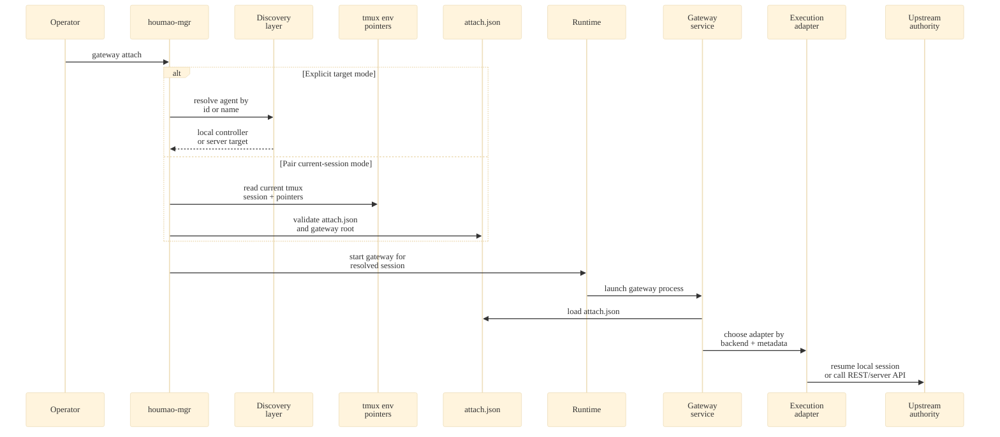
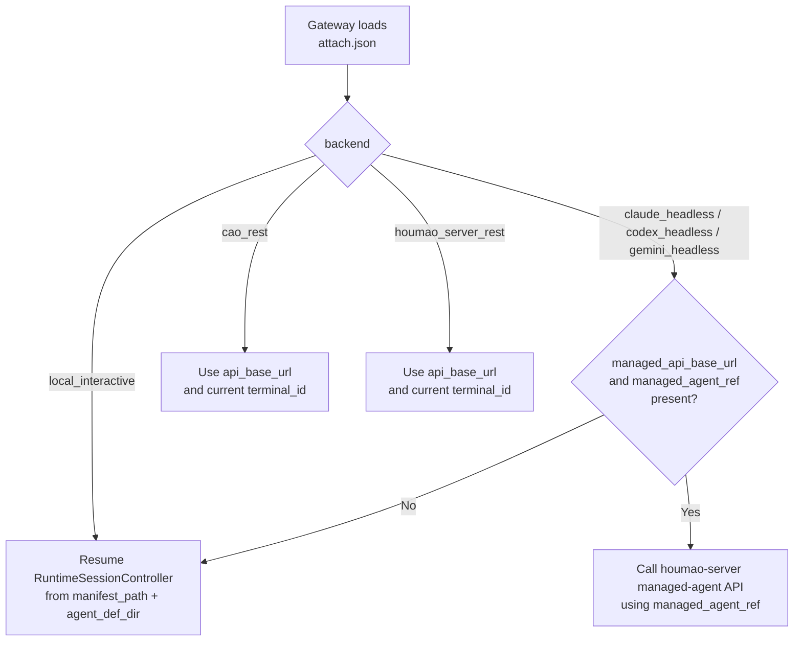
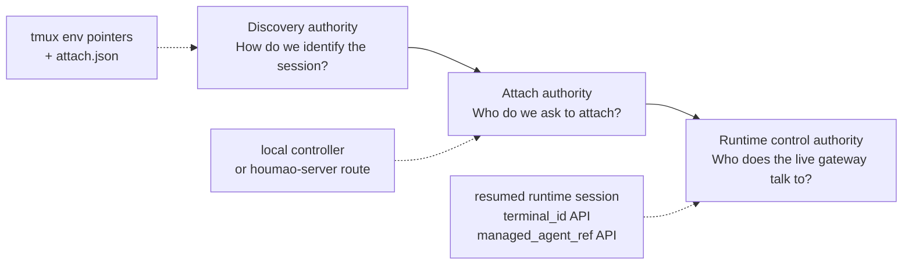

# Explore Log: current agent gateway attach contract

**Date:** 2026-03-26
**Topic:** How the agent gateway currently finds and attaches to an agent
**Mode:** `openspec-explore`

## Short Answer

Today, the gateway does not discover an agent by scanning tmux state or guessing from live processes.

It attaches through a stable authority chain:

1. runtime publishes gateway capability,
2. tmux env points to one strict `gateway/attach.json`,
3. attach flow resolves the target from that contract,
4. the gateway service loads that contract and chooses one backend-specific execution adapter,
5. the adapter talks to the actual upstream control authority.

That means the real contract is not just "attach to tmux session". It is "attach through persisted authority", and that authority differs by backend family.

## Current Attach Model



## What The Stable Contract Contains

The common envelope is `GatewayAttachContractV1`.

Shared fields:

- `schema_version`
- `attach_identity`
- `backend`
- `tmux_session_name`
- `working_directory`
- `backend_metadata`

Runtime-owned extension fields:

- `manifest_path`
- `agent_def_dir`
- `runtime_session_id`
- `desired_host`
- `desired_port`

Stable publication happens in two places:

- tmux env:
  - `AGENTSYS_GATEWAY_ATTACH_PATH`
  - `AGENTSYS_GATEWAY_ROOT`
- filesystem:
  - `<session-root>/gateway/attach.json`

The important point is that `attach.json` is already the real source of truth. The tmux env only points at it.

## The Real Upstream Authority Depends On Backend



## How Target Resolution Works Today

### 1. Runtime-owned local attach

When `houmao-mgr` resolves a local runtime-owned managed agent, it resumes the `RuntimeSessionController` from the manifest path in the local registry record and calls `controller.attach_gateway(...)`.

In this branch, the gateway later finds the upstream agent by:

- loading `attach.json`,
- reading `manifest_path` and `agent_def_dir`,
- resuming the runtime session locally,
- using that resumed controller as the control authority.

This is session-resume authority, not server-route authority.

### 2. Pair-managed current-session attach

When the operator runs `houmao-mgr agents gateway attach` inside the target tmux session for `houmao_server_rest`, the CLI:

- reads the current tmux session name,
- loads `AGENTSYS_GATEWAY_ATTACH_PATH` and `AGENTSYS_GATEWAY_ROOT`,
- validates that those pointers match the runtime-owned gateway subtree,
- requires `attach.json.backend == "houmao_server_rest"`,
- treats `backend_metadata.api_base_url` and `backend_metadata.session_name` as the authoritative attach target,
- resolves that managed agent through `houmao-server`,
- calls the managed-agent gateway attach route on that server.

In this branch, attach-time targeting is server-managed, not local-runtime-managed.

### 3. REST-backed gateway runtime

After startup, the gateway service for `cao_rest` and `houmao_server_rest` uses the REST adapter.

That adapter does not keep using `session_name` as its operational control handle. Instead it uses:

- `api_base_url`, and
- the current `terminal_id` read from the manifest when available.

So for pair-managed attach there are already two distinct authorities:

- attach-time authority: `api_base_url + session_name`
- runtime control authority: `api_base_url + terminal_id`

### 4. Server-managed native headless gateway

For native headless backends, `backend_metadata` may also carry:

- `managed_api_base_url`
- `managed_agent_ref`

When those fields are present together, the gateway does not resume the headless session locally. It proxies requests back through `houmao-server` using the managed-agent API.

This is a third authority model: server-managed agent authority embedded into the attach contract.

## The Important Conceptual Split

The current system really has three layers, even though the docs often talk about "gateway attach" as one thing.



This is why the contract feels blurry right now: those three roles are present, but not named explicitly.

## What Is Clear Today

- Stable attachability is intentionally separate from a live running gateway.
- `attach.json` is the canonical persisted contract.
- tmux env is pointer-level authority, not semantic authority.
- current-session pair attach is intentionally fail-closed and does not guess alternative targets.
- backend-specific metadata already determines how the gateway reaches the upstream session after startup.

## What Is Not Yet Clear Enough

These are the parts I think should be defined explicitly in the contract language.

### 1. What exactly is the "agent" being attached to?

Depending on backend, the gateway is really attaching to one of:

- a runtime-owned session manifest,
- a server-managed agent alias,
- a current terminal id behind a REST-backed runtime,
- a managed headless agent ref.

Those are not the same thing.

### 2. Which fields are discovery fields versus execution fields?

Today `attach.json` mixes:

- stable identity,
- local resume pointers,
- server routing metadata,
- preferred listener defaults.

That works, but it obscures which fields are authoritative for which phase.

### 3. Is `session_name` or `terminal_id` the true pair-managed contract?

For `houmao_server_rest`:

- the attach CLI targets `session_name`,
- the running gateway appears to operate against `terminal_id`.

That is workable, but the handoff boundary should be stated clearly.

## Recommended Framing For OpenSpec

If we want this contract to be clearer, I would define it in terms of explicit authority roles:

- `discovery authority`
  - how the operator or runtime resolves the intended session
- `attach authority`
  - which control plane receives the attach action
- `runtime control authority`
  - which handle the live gateway uses to inspect, prompt, or interrupt

Then the backend-specific contract becomes much easier to state.

Example normalization:

- `local_interactive`
  - discovery authority: local registry record or tmux session pointers
  - attach authority: local runtime controller
  - runtime control authority: resumed local runtime session
- `houmao_server_rest`
  - discovery authority: tmux session pointers and `attach.json`
  - attach authority: `houmao-server` managed-agent route via `session_name`
  - runtime control authority: REST terminal via `terminal_id`
- server-managed headless
  - discovery authority: runtime-owned attach artifacts
  - attach authority: `houmao-server`
  - runtime control authority: `managed_agent_ref`

## Bottom Line

Currently, the gateway finds and attaches to an agent through persisted contract authority, not through live discovery heuristics.

The contract already works, but it is really a family of backend-specific authority chains hidden inside one common `attach.json` envelope.

That is the part worth making explicit in OpenSpec.

## Q&A

### Q1. When gateway attach is requested, which tmux env does it look for?

Short answer: there is no single answer today, because different phases look at different env groups.

For the initial current-session pair attach request, the CLI looks for only the stable attachability pointers:

- `AGENTSYS_GATEWAY_ATTACH_PATH`
- `AGENTSYS_GATEWAY_ROOT`

Those are the env vars used by `houmao-mgr agents gateway attach` when it is run inside a `houmao_server_rest` tmux session without an explicit agent selector. They are pointer-level authority only. They tell the CLI where the persisted `attach.json` and gateway root live.

Example shape:

```bash
AGENTSYS_GATEWAY_ATTACH_PATH=/home/huangzhe/.houmao/runtime/sessions/local_interactive/local_interactive-20260326-044538Z-db7894e3/gateway/attach.json
AGENTSYS_GATEWAY_ROOT=/home/huangzhe/.houmao/runtime/sessions/local_interactive/local_interactive-20260326-044538Z-db7894e3/gateway
```

For a pair-managed `houmao_server_rest` session, the values would look the same structurally, but the session-root path would be under `sessions/houmao_server_rest/<session-id>/...`.

> Issue: `AGENTSYS_GATEWAY_ATTACH_PATH` is redundant. Given `AGENTSYS_GATEWAY_ROOT`, the attach contract path can already be derived as `<gateway-root>/attach.json`.

For explicit `--agent-name` or `--agent-id` attach, the CLI does not need tmux env to find the target. It resolves the managed agent through registry or server authority first, then attaches through that resolved target.

After a gateway is already attached, later request or discovery paths look at a different tmux env group for live gateway bindings:

- `AGENTSYS_AGENT_GATEWAY_HOST`
- `AGENTSYS_AGENT_GATEWAY_PORT`
- `AGENTSYS_GATEWAY_STATE_PATH`
- `AGENTSYS_GATEWAY_PROTOCOL_VERSION`

Those are not the env vars used to discover stable attachability. They are used to find an already-running live gateway.

Example shape:

```bash
AGENTSYS_AGENT_GATEWAY_HOST=127.0.0.1
AGENTSYS_AGENT_GATEWAY_PORT=35015
AGENTSYS_GATEWAY_STATE_PATH=/home/huangzhe/.houmao/runtime/sessions/local_interactive/local_interactive-20260326-044538Z-db7894e3/gateway/state.json
AGENTSYS_GATEWAY_PROTOCOL_VERSION=v1
```

These values answer the question "where is the live gateway HTTP surface right now?", not "how do I find the stable attach contract for this session?".

For same-session foreground gateway launch, the runtime also exports another env group into the auxiliary gateway window:

- `AGENTSYS_GATEWAY_EXECUTION_MODE`
- `AGENTSYS_GATEWAY_TMUX_WINDOW_ID`
- `AGENTSYS_GATEWAY_TMUX_WINDOW_INDEX`
- `AGENTSYS_GATEWAY_TMUX_PANE_ID`

Those are runtime-to-gateway process env vars, not the operator-facing attach-discovery contract.

Example shape:

```bash
AGENTSYS_GATEWAY_EXECUTION_MODE=tmux_auxiliary_window
AGENTSYS_GATEWAY_TMUX_WINDOW_ID=@621
AGENTSYS_GATEWAY_TMUX_WINDOW_INDEX=1
AGENTSYS_GATEWAY_TMUX_PANE_ID=%624
```

These values answer the question "which tmux window or pane is hosting this foreground gateway process?".

So the clearest way to say it is:

- attach discovery env: `AGENTSYS_GATEWAY_ATTACH_PATH`, `AGENTSYS_GATEWAY_ROOT`
- live gateway env: `AGENTSYS_AGENT_GATEWAY_HOST`, `AGENTSYS_AGENT_GATEWAY_PORT`, `AGENTSYS_GATEWAY_STATE_PATH`, `AGENTSYS_GATEWAY_PROTOCOL_VERSION`
- same-session foreground process env: `AGENTSYS_GATEWAY_EXECUTION_MODE`, `AGENTSYS_GATEWAY_TMUX_WINDOW_ID`, `AGENTSYS_GATEWAY_TMUX_WINDOW_INDEX`, `AGENTSYS_GATEWAY_TMUX_PANE_ID`

## Source Notes

Primary files inspected during this exploration:

- `src/houmao/agents/realm_controller/gateway_models.py`
- `src/houmao/agents/realm_controller/gateway_storage.py`
- `src/houmao/agents/realm_controller/runtime.py`
- `src/houmao/agents/realm_controller/gateway_service.py`
- `src/houmao/srv_ctrl/commands/agents/gateway.py`
- `src/houmao/srv_ctrl/commands/managed_agents.py`
- `src/houmao/server/service.py`
- `docs/reference/gateway/contracts/protocol-and-state.md`
- `docs/reference/gateway/operations/lifecycle.md`
- `openspec/specs/brain-launch-runtime/spec.md`
