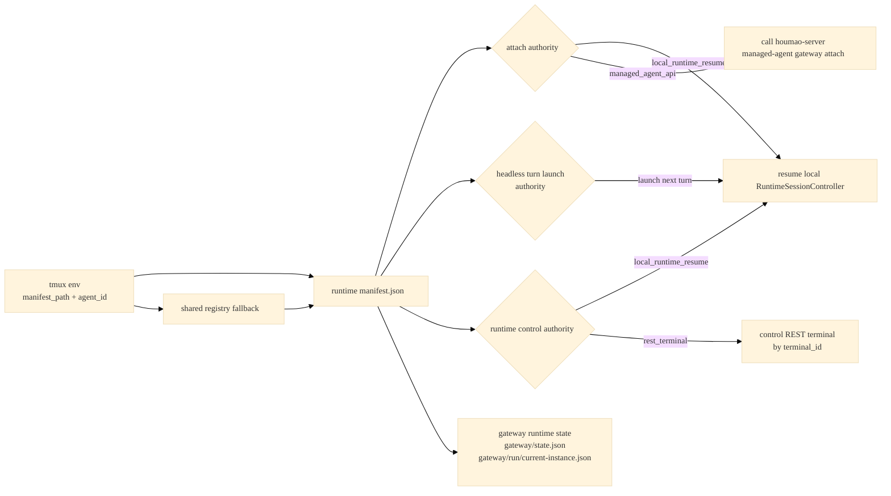
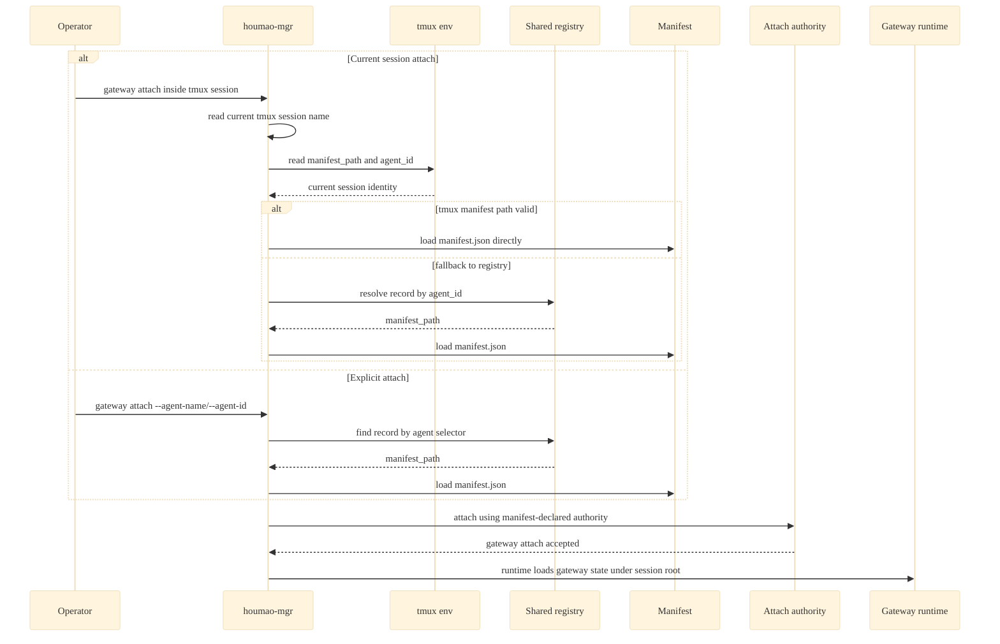

# Explore Log: manifest-driven gateway attach design

**Date:** 2026-03-26
**Topic:** Make gateway attach depend on the runtime manifest instead of tmux env pointers, and unify tmux-backed `local_interactive`, native headless, and `houmao_server_rest` manifest shape
**Mode:** `openspec-explore`

## Short Answer

The clean design is:

- make `manifest.json` the only stable attach authority,
- keep tmux env limited to the authoritative agent id plus an optional direct manifest pointer,
- make the shared registry the cross-session discovery index,
- stop using tmux env vars as gateway-root or attach-contract pointers,
- redefine `gateway_manifest.json` as outward-facing gateway bookkeeping rather than gateway-owned truth,
- split process identity cleanly: agent pid in `manifest.json` when a live worker process exists, gateway pid in `gateway_manifest.json`,
- make tmux-backed `local_interactive`, native headless, and `houmao_server_rest` share one typed manifest shape,
- reserve tmux window `0` for the managed agent surface, including native headless console output,
- add a tmux-session-local relaunch contract so gateways and operators can relaunch attached agents without rebuilding the brain home,
- require relaunch to use the current tmux session env plus manifest-owned secret-free launch posture instead of copied launcher artifacts in shared registry,
- require relaunch to reuse tmux window `0` rather than creating a new window; if the user repurposes window `0`, that is their fault,
- require the manifest to contain enough relaunch authority for native headless future turns even when no worker process is currently live,
- make attach authority and runtime control authority explicit in the manifest instead of implied by backend-specific duplication.

Today authority is split across four places:

- tmux env pointer vars
- `gateway/gateway_manifest.json`
- `manifest.json`
- duplicated `manifest.backend_state`

That is why the current contract feels indirect and harder to reason about.

## Current Problem

The current design has two different kinds of redundancy.

### 1. Discovery redundancy

Current-session pair attach does not start from the manifest directly. It starts from tmux session env pointers:

- `AGENTSYS_GATEWAY_ATTACH_PATH`
- `AGENTSYS_GATEWAY_ROOT`

In today's implementation, those only point to `gateway/attach.json`, which then points back to the runtime session manifest. Under the current proposed design, that outward-facing file becomes `gateway/gateway_manifest.json` and stops acting as stable authority.

So the stable chain today is:

```text
tmux env -> gateway_manifest.json -> manifest.json -> actual backend authority
```

That is one layer too many.

### 2. Manifest redundancy

`SessionManifestPayloadV3` already has typed backend sections such as:

- `local_interactive`
- `houmao_server`

but it also persists a parallel untyped `backend_state` blob and the runtime resume path cross-checks them.

That means the manifest already has dual authority internally before the gateway layer even enters the picture.

## Design Goal

The new stable chain for current-session attach should be:

```text
tmux env (manifest_path override or agent_id) -> manifest.json -> attach authority / control authority
```

Or, for explicit attach:

```text
agent selector -> shared registry -> manifest.json -> attach authority / control authority
```

The gateway should never need to discover attachability from gateway-root pointer envs or `gateway_manifest.json`.

## Proposed Authority Model

The design gets much simpler if the contract names the phases explicitly.

- `discovery authority`
  - how the system identifies which logical session the operator means
- `attach authority`
  - which control plane receives the attach action
- `runtime control authority`
  - which upstream handle the live gateway uses after startup



This is the main design idea: current-session discovery should prefer the tmux-published manifest path directly, and only fall back to registry resolution by agent id when the direct manifest pointer is unavailable or invalid. Attach semantics still come from the manifest. Relaunch semantics come from the manifest plus the effective env already published in the owning tmux session. For native headless sessions, the manifest must also describe how later turns are relaunched, because attach must remain valid even between turns when no worker process is live.

## Critical Follow-Up: Relaunch Without Rebuild

One critical follow-up emerged after the original note: an attached gateway must be able to relaunch the agent it manages, both for TUI sessions and for native headless sessions.

That rules out using the existing build-time `houmao-mgr agents launch` path as the recovery path, because that path rebuilds the brain home. It also rules out inventing a `launcher/` subtree under shared registry, because the registry is supposed to stay pointer-oriented and secret-free.

The better contract is:

- add `houmao-mgr agents relaunch` as the operator-facing relaunch surface,
- make gateway-managed relaunch use the same internal runtime primitive,
- keep `manifest.json` as the secret-free relaunch contract,
- keep the effective launch env and home selector in the owning tmux session env,
- keep shared registry as a locator only,
- always reuse tmux window `0` for relaunch and never create a new tmux window.

In short:

```text
relaunch
  -> resolve manifest from tmux env or registry fallback
  -> load manifest-owned relaunch posture
  -> use current tmux session env for effective launch env
  -> respawn the managed agent surface in window 0
```

## Proposed Attach Flow

### Current-session attach for tmux-backed sessions, including native headless

Instead of the current stable attach flow:

1. read `AGENTSYS_GATEWAY_ATTACH_PATH`
2. read `AGENTSYS_GATEWAY_ROOT`
3. load `gateway_manifest.json`
4. derive manifest and backend authority from there

use:

1. read current tmux session name with `tmux display-message -p '#S'`
2. read `AGENTSYS_MANIFEST_PATH` and `AGENTSYS_AGENT_ID` from that tmux session
3. if `AGENTSYS_MANIFEST_PATH` is present, absolute, and points to a valid manifest:
4. use that manifest directly
5. otherwise resolve exactly one fresh shared-registry record by `agent_id`
6. load the manifest from `record.runtime.manifest_path`
7. validate `manifest.tmux.session_name` matches the current tmux session
8. validate `manifest.agent_id` matches the published env value when that env value is present
9. if the backend is native headless, keep window `0` reserved for headless console output and keep any gateway surface away from window `0`
10. perform attach using authority declared by the manifest

That makes current-session attach depend on two tmux-published values:

- `AGENTSYS_MANIFEST_PATH`
- `AGENTSYS_AGENT_ID`

with clear precedence:

- prefer `AGENTSYS_MANIFEST_PATH` when valid
- fall back to registry lookup by `AGENTSYS_AGENT_ID`

This gives a direct local recovery path even if the shared registry is stale, unavailable, or temporarily broken.

For native headless sessions, current-session attach should still assume the operator is inside the owning tmux session. The attach target is the logical persisted headless session, not necessarily a currently running worker process, so a missing live `agent_pid` must not make attach invalid.

### Explicit attach

Explicit `--agent-name` or `--agent-id` already wants registry-first resolution. Keep that, but make the manifest the stable attach authority after resolution.

So both paths converge:



The important effect is that attach does not need to trust `gateway_manifest.json` as an input authority. Current-session attach can keep working even if the shared registry is not accessible as long as the tmux session still publishes a valid manifest path.

If `gateway_manifest.json` is retained for compatibility or tooling, gateway attach should regenerate it from manifest-derived authority and overwrite it forcefully on every attach action.

The intended role is:

- `manifest.json` tells the system what is true
- `gateway_manifest.json` tells outside readers what the gateway wants them to know
- the gateway itself should keep operational state in memory instead of treating `gateway_manifest.json` as its own mutable working store

## Proposed Manifest V4

The right refactor is not just "rename or fold `gateway_manifest.json` into the manifest". The better change is to make the manifest own one typed runtime authority model and stop persisting duplicated backend data in both typed sections and `backend_state`.

### Structural direction

Keep one shared top-level envelope, but replace backend-specific duplication with a more normalized layout:

- `runtime`
  - runtime-owned session identity and paths
  - agent process pid when a live worker process exists
- `tmux`
  - tmux binding for tmux-backed sessions
  - primary window role metadata, with window `0` reserved for the managed agent surface
- `interactive`
  - common interactive session state shared by `local_interactive` and `houmao_server_rest`
- `agent_launch_authority`
  - secret-free relaunch posture for tmux-backed sessions
  - combines with the effective env published inside the owning tmux session
  - remains valid between native headless turns
- `gateway_authority`
  - attach authority
  - runtime control authority

### Example shape for `local_interactive`

```json
{
  "schema_version": 4,
  "backend": "local_interactive",
  "tool": "claude",
  "role_name": "assistant",
  "created_at_utc": "2026-03-26T05:35:32+00:00",
  "brain_manifest_path": "/abs/brain/manifest.yaml",
  "working_directory": "/abs/workdir",
  "agent_name": "agent-foo",
  "agent_id": "agent-foo",
  "runtime": {
    "session_id": "local-interactive-1",
    "job_dir": "/abs/workdir/.houmao/jobs/local-interactive-1",
    "agent_def_dir": "/abs/agent_def",
    "agent_pid": 12345,
    "registry_generation_id": "gen-1",
    "registry_launch_authority": "runtime"
  },
  "tmux": {
    "session_name": "agent-foo",
    "primary_window_index": 0,
    "primary_window_role": "agent_surface"
  },
  "interactive": {
    "turn_index": 3,
    "role_bootstrap_applied": true,
    "working_directory": "/abs/workdir"
  },
  "agent_launch_authority": {
    "kind": "tmux_session_env_exec",
    "surface": "interactive",
    "window_index": 0,
    "pane_index": 0
  },
  "gateway_authority": {
    "attach": {
      "kind": "local_runtime_resume"
    },
    "control": {
      "kind": "local_runtime_resume"
    }
  }
}
```

### Example shape for native headless between turns

```json
{
  "schema_version": 4,
  "backend": "codex_headless",
  "tool": "codex",
  "role_name": "assistant",
  "created_at_utc": "2026-03-26T05:35:32+00:00",
  "brain_manifest_path": "/abs/brain/manifest.yaml",
  "working_directory": "/abs/workdir",
  "agent_name": "agent-headless",
  "agent_id": "agent-headless-id",
  "runtime": {
    "session_id": "codex-headless-1",
    "job_dir": "/abs/workdir/.houmao/jobs/codex-headless-1",
    "agent_def_dir": "/abs/agent_def",
    "agent_pid": null,
    "registry_generation_id": "gen-1",
    "registry_launch_authority": "runtime"
  },
  "tmux": {
    "session_name": "agent-headless",
    "primary_window_index": 0,
    "primary_window_role": "headless_console"
  },
  "agent_launch_authority": {
    "kind": "tmux_session_env_exec",
    "surface": "headless",
    "window_index": 0,
    "pane_index": 0,
    "output_contract": "headless-turn-v1"
  },
  "gateway_authority": {
    "attach": {
      "kind": "local_runtime_resume"
    },
    "control": {
      "kind": "local_runtime_resume"
    }
  }
}
```

### Example shape for `houmao_server_rest`

```json
{
  "schema_version": 4,
  "backend": "houmao_server_rest",
  "tool": "claude",
  "role_name": "assistant",
  "created_at_utc": "2026-03-26T05:35:32+00:00",
  "brain_manifest_path": "/abs/brain/manifest.yaml",
  "working_directory": "/abs/workdir",
  "agent_name": "agent-foo",
  "agent_id": "agent-foo-id",
  "runtime": {
    "session_id": "houmao-server-rest-1",
    "job_dir": "/abs/workdir/.houmao/jobs/houmao-server-rest-1",
    "agent_def_dir": "/abs/agent_def",
    "agent_pid": 23456,
    "registry_generation_id": "gen-1",
    "registry_launch_authority": "runtime"
  },
  "tmux": {
    "session_name": "agent-foo",
    "primary_window_index": 0,
    "primary_window_role": "agent_surface",
    "window_name": "agent-foo"
  },
  "interactive": {
    "turn_index": 3,
    "role_bootstrap_applied": false,
    "working_directory": "/abs/workdir"
  },
  "agent_launch_authority": {
    "kind": "tmux_session_env_exec",
    "surface": "interactive",
    "window_index": 0,
    "pane_index": 0
  },
  "gateway_authority": {
    "attach": {
      "kind": "managed_agent_api",
      "api_base_url": "http://127.0.0.1:8531",
      "managed_agent_ref": "agent-foo-id"
    },
    "control": {
      "kind": "rest_terminal",
      "api_base_url": "http://127.0.0.1:8531",
      "terminal_id": "term-123",
      "parsing_mode": "claude"
    }
  }
}
```

## Unification Rule

This is the exact point that should be made explicit:

- `local_interactive`, native headless, and `houmao_server_rest` should share the same outer manifest schema
- `local_interactive` and `houmao_server_rest` should share the same interactive-state section schema
- all three should share `agent_launch_authority`, while native headless may omit the interactive-state section
- native headless may have no live `runtime.agent_pid` between turns
- all three should differ mainly in declared gateway authority mode and control mode

That is a better form of unification than the current design, where both share only the outer envelope but then diverge into:

- `local_interactive`
- `houmao_server`
- duplicated `backend_state`

## What To Remove

### Remove stable tmux attach pointer envs from the protocol

These should no longer be part of stable attach discovery:

- `AGENTSYS_GATEWAY_ATTACH_PATH`
- `AGENTSYS_GATEWAY_ROOT`

The current tmux session should instead publish only:

- `AGENTSYS_MANIFEST_PATH`
- `AGENTSYS_AGENT_ID`

The current tmux session name is still useful for validation, but the gateway-root pointer env vars should be retired.

### Remove `gateway/gateway_manifest.json` as stable authority

Keep `gateway_manifest.json`, but only as a derived artifact.

Contract rule:

- `gateway_manifest.json` is never the source of truth for attach resolution
- gateway attach derives its contents from the resolved manifest plus current attach inputs
- gateway attach overwrites `gateway_manifest.json` forcefully on every attach action
- readers must treat `manifest.json` as authoritative when there is any disagreement
- `gateway_manifest.json` exists for external bookkeeping, compatibility, and operator-visible publication
- the gateway process should not rely on `gateway_manifest.json` as its own mutable runtime memory
- `gateway_manifest.json` publishes the current gateway pid for outside readers

That gives a useful local compatibility file without allowing stale `gateway_manifest.json` to become stable authority again.

### What `gateway_manifest.json` should contain under this contract

`gateway_manifest.json` should contain only externally useful published facts and preferences, such as:

- stable session identity to display or correlate
- backend kind
- tmux session name
- manifest path reference
- current gateway pid
- published attach or control summary that other components may need
- desired listener preferences that operators or wrapper tooling may inspect

It should not be the place where the gateway stores its own evolving internal working state. For that:

- transient execution state stays in memory inside the gateway process
- live runtime publication belongs in `state.json` and `run/current-instance.json`
- stable attach authority remains in `manifest.json`

### Remove manifest dual-authority duplication

For the new manifest version:

- remove `backend_state` from the stable public contract
- stop storing the same logical fields in both typed sections and `backend_state`

The manifest should be typed authority, not typed-plus-blob authority.

### Process identity split

The process-pid split should be explicit in the contract:

- `manifest.json` contains the agent process pid when a live worker process exists
- `gateway_manifest.json` contains the gateway process pid

For native headless sessions, `runtime.agent_pid` may be empty or `null` between turns because the worker process exits when the turn ends. That does not make the session non-attachable as long as the manifest still carries valid headless turn-launch authority.

Reasoning:

- the agent pid belongs to runtime session truth, so it belongs with the manifest
- the gateway pid belongs to what the gateway is publishing about itself for other readers
- this keeps process identity aligned with ownership instead of scattering pids across unrelated files

## Shared Registry Impact

The registry becomes a discovery index, not an alternate attach contract.

Recommended registry rule:

- keep `runtime.manifest_path`
- keep `runtime.session_root`
- keep `runtime.agent_def_dir` until the manifest owns it durably
- keep `terminal.session_name`
- keep `agent_name` and `agent_id`
- drop stable `gateway.attach_path`
- drop stable `gateway.gateway_root`
- do not add `launcher/` subdirs, copied credentials, or session-local relaunch scripts to registry
- keep live gateway endpoint/status fields only when a gateway is actually attached

That gives one clear separation:

- current tmux env answers "which exact session am I inside right now?"
- registry answers "which session do you mean across all live sessions?"
- manifest answers "how do I attach and control it?"

## Important Design Decisions

### 1. `houmao_server_rest` should attach by managed agent ref, not by session name

Today current-session pair attach resolves through persisted `session_name`, but the gateway runtime later controls the upstream terminal through `terminal_id`.

That is workable, but the attach key should be more explicit and more stable. The strongest candidate is:

- `managed_agent_ref = agent_id`

So the pair attach authority becomes:

- `api_base_url`
- `managed_agent_ref`

and the runtime control authority becomes:

- `api_base_url`
- `terminal_id`

That makes the handoff explicit instead of implicit.

### 2. `agent_def_dir` must be owned by the manifest

Local runtime resume still needs `agent_def_dir` to reload role packages and rebuild the controller. If the design wants manifest-driven attach, that path cannot live only in `gateway_manifest.json` or only in the registry forever.

So the manifest must own:

- `runtime.agent_def_dir`

Otherwise local resume still depends on outside metadata and the manifest is not actually self-sufficient.

### 3. Agent pid belongs in the manifest, gateway pid belongs in `gateway_manifest.json`

This should be a contract rule, not just an implementation detail.

- `manifest.json.runtime.agent_pid` is the agent-side process identity when a live worker process exists
- `gateway_manifest.json.gateway_pid` is the gateway-side published process identity

That matches the ownership model used elsewhere in this design:

- manifest owns session truth
- `gateway_manifest.json` owns outward-facing gateway bookkeeping

### 4. Native headless attach stays tmux-local and window `0` stays reserved

Native headless attach should not become a special non-tmux path in this design.

- the operator is still assumed to be inside the owning tmux session
- `AGENTSYS_MANIFEST_PATH` and `AGENTSYS_AGENT_ID` remain the discovery contract
- tmux window `0` remains reserved for headless console output
- any same-session gateway surface must stay off window `0`
- attach must not assume a currently live headless worker process
- the manifest plus current tmux session env must be sufficient to relaunch the next headless turn even when `runtime.agent_pid` is empty

### 5. Relaunch is a separate surface from build-time launch

The current `houmao-mgr agents launch` contract is the wrong recovery surface because it rebuilds the brain home.

So the design should add:

- `houmao-mgr agents relaunch` as the operator-facing relaunch command,
- one shared internal relaunch primitive reused by gateway-managed recovery,
- no registry-owned launcher directory,
- no copied plain-text credentials outside the owning tmux session,
- no search for a replacement tmux window when window `0` has been repurposed.

## Suggested Transition Strategy

If this becomes an OpenSpec change, I would stage it in this order:

1. introduce `SessionManifestPayloadV4`
2. add normalized `runtime`, `tmux`, `interactive`, manifest-owned `agent_launch_authority`, and `gateway_authority` sections, including nullable `runtime.agent_pid`
3. teach runtime resume and gateway service to read V4 manifest authority first
4. switch explicit attach and registry-backed flows to manifest-first resolution
5. switch current-session attach to prefer `AGENTSYS_MANIFEST_PATH` and fall back to `AGENTSYS_AGENT_ID` plus registry-backed manifest resolution
6. add `houmao-mgr agents relaunch` plus a shared internal relaunch primitive that uses manifest posture plus tmux session env
7. make gateway attach regenerate and force-overwrite `gateway_manifest.json` from manifest-derived authority, including published `gateway_pid`
8. keep native headless window `0` reserved for console output, keep gateway surfaces off that window, and make relaunch reuse that same window instead of creating another one
9. remove stable tmux attach pointer env vars from docs and code
10. later remove V3-only duplication paths

## Bottom Line

The design should not be "attach through tmux env pointers that eventually lead to the manifest."

It should be:

- discover the current session through tmux-published `manifest_path` when available,
- fall back to tmux-published `agent_id` plus shared registry when the direct manifest pointer is unavailable,
- discover other sessions through explicit selector plus shared registry,
- treat the manifest as the only stable attach authority,
- treat relaunch as a separate tmux-backed recovery surface that reuses the existing built home,
- use manifest-owned relaunch posture plus the owning tmux session env for relaunch,
- treat `gateway_manifest.json` as a force-refreshed derived artifact written by attach,
- treat `gateway_manifest.json` as "what the gateway publishes for others", not "what the gateway remembers for itself",
- treat gateway runtime files as ephemeral runtime state only.

That gives a much clearer contract and makes `local_interactive`, native headless, and `houmao_server_rest` look like three authority modes inside one tmux-backed session model instead of three almost-separate systems.

## Proposed Tmux Identity Contract

For tmux-backed sessions, including native headless, the published stable env contract should be:

- `AGENTSYS_MANIFEST_PATH`
- `AGENTSYS_AGENT_ID`
- nothing else for gateway attach discovery

In repo terms:

- `AGENTSYS_MANIFEST_PATH` already exists and should remain the preferred direct manifest pointer
- `AGENTSYS_AGENT_ID` is the only new stable gateway-attach discovery env addition
- shared registry remains the fallback path when the direct manifest pointer is missing or unusable

Example shape:

```bash
AGENTSYS_MANIFEST_PATH=/home/huangzhe/.houmao/runtime/sessions/houmao_server_rest/houmao-server-rest-1/manifest.json
AGENTSYS_AGENT_ID=agent-foo-id
```

The design intent is:

- `AGENTSYS_MANIFEST_PATH` is the preferred direct pointer to stable runtime state for the current tmux session
- `AGENTSYS_AGENT_ID` is the authoritative operator-facing identity
- shared registry resolves that id to the current manifest path and runtime metadata when the direct manifest pointer path cannot be used
- this same contract applies even when the session is native headless and no worker process is currently live

Those env vars should be validated against the manifest on every current-session attach request, and the fallback registry record should be used only when the direct manifest pointer is missing or invalid.

## Source Notes

Primary files inspected during this exploration:

- `src/houmao/agents/realm_controller/boundary_models.py`
- `src/houmao/agents/realm_controller/manifest.py`
- `src/houmao/agents/realm_controller/runtime.py`
- `src/houmao/agents/realm_controller/gateway_models.py`
- `src/houmao/agents/realm_controller/gateway_storage.py`
- `src/houmao/agents/realm_controller/gateway_service.py`
- `src/houmao/agents/realm_controller/registry_models.py`
- `src/houmao/srv_ctrl/commands/agents/gateway.py`
- `src/houmao/srv_ctrl/commands/managed_agents.py`
- `docs/reference/managed_agent_api.md`
