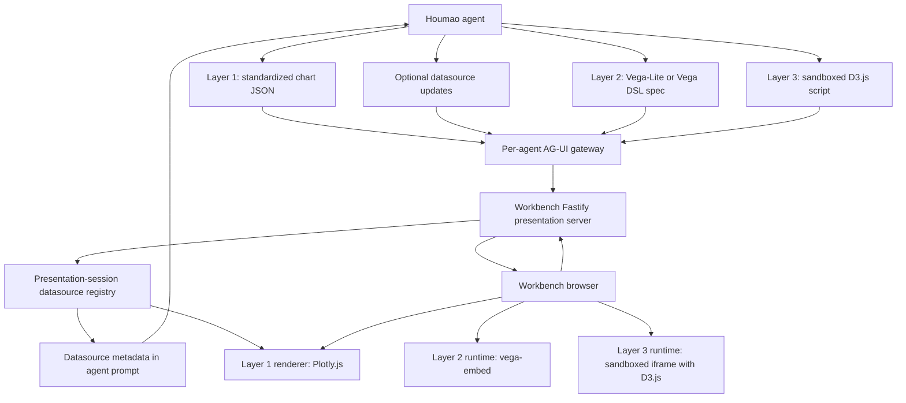

# AG-UI Advanced Graphing Capability Plan

## Context

The current Houmao AG-UI implementation has a standard AG-UI event transport, a set of Houmao typed components, a compatibility `houmao_render_graphic` path, and a workbench renderer path that has recently experimented with Layer 1 template graphics. This plan supersedes the earlier renderer direction for graphing: Layer 1 should no longer support Recharts, Vega-Lite, or Apache ECharts as template backends. Layer 1 should focus on Plotly.js only: the standardized template schema should align with Plotly.js trace, layout, and config concepts as much as possible while remaining a curated Houmao contract. Layer 1 charts may use static inline data or dynamic presentation-server-managed datasources. Dynamic datasource contents remain in the bundled GUI backend's presentation sessions; the agent prompt should receive datasource metadata such as ids, scopes, column schemas, versions, and row counts so the agent can write Plotly chart bindings without receiving or restating volatile rows. Vega-Lite moves out of Layer 1 and becomes the Layer 2 DSL path, where Python Altair can generate the Vega-Lite JSON that the GUI renders with `vega-embed`. Layer 3 becomes sandboxed D3.js scripted graphics, where an agent can send JavaScript that uses D3 inside an isolated runtime.

This document is about graphing capability. Trusted media components such as PDF viewers or video players remain useful, but they should be tracked as a separate presentation/media catalog plan rather than mixed into the graphing layers.

## Revised Layer Model



The split is intentional:

- Layer 1 gives agents a stable renderer-neutral chart object for ordinary charts, using either inline static data or bindings to presentation-server-managed datasources.
- Layer 2 gives agents a declarative graphics DSL through Vega-Lite and, later, direct Vega.
- Layer 3 gives agents scripted graphics freedom through D3.js, but only inside a sandboxed runtime.

## Layer 1: Template Graphics

Layer 1 accepts one standardized Houmao chart JSON schema and renders it with Plotly.js. Recharts, Vega-Lite, and Apache ECharts should be removed from the planned Layer 1 backend set. Vega-Lite is reserved for Layer 2.

The core schema is the source of truth. It should be Plotly-aligned, but it should not be the complete raw Plotly.js builtin schema. Using the full Plotly schema directly would turn Layer 1 into an unrestricted Plotly DSL and make security validation, capability limits, future compatibility, and agent guidance much harder. The better target is a curated Plotly-like subset: trace-like series, layout-like axes and legends, config-like interaction knobs, and explicit allowlists for supported chart families.

Layer 1 supports two data modes:

- Static data: the agent embeds literal arrays or small inline tables in the chart payload. This is the default for one-off summaries and immutable snapshots.
- Dynamic data: the chart payload references presentation-server-managed datasources by stable id. The GUI backend owns the current rows, resolves trace bindings into bounded Plotly arrays or materializations, and refreshes the browser Plotly chart when the datasource changes.

Dynamic datasource contents should not be pushed into ordinary prompt context or browser state. Instead, the presentation server should expose compact datasource metadata in the AG-UI prompt contract so the agent can choose the right datasource and columns. Metadata should include datasource id, scope, kind, column names and types, optional semantic descriptions, row count, version, update mode, freshness, and any access limits. The prompt metadata is descriptive and may be stale by the time a chart renders, so the chart binding must remain robust when rows are added, removed, or replaced.

A renderer-specific `extra` field may refine rendering for one backend, but the chart must remain renderable from the standardized fields alone. Unsupported `extra` keys and unsupported fields inside a known backend block are ignored or reported as non-fatal renderer warnings.

Recommended Python backend libraries:

- `pydantic`: authoritative payload models and JSON Schema generation.
- `jsonschema`: optional JSON Schema validation when validating schemas exported to other processes.
- Plotly schema metadata can be used as a reference when naming fields and generating allowlists, but the exported Houmao schema remains curated.

Recommended TypeScript GUI libraries:

- `zod` or generated validators for browser-side runtime validation.
- `plotly.js` or a scoped Plotly bundle for the renderer.

Suggested tool name:

- `houmao.graphic.template`

Example payload:

```json
{
  "schemaVersion": 1,
  "chartType": "bar",
  "renderer": {
    "preferred": "plotly"
  },
  "title": "Build Results",
  "traces": [
    {
      "type": "bar",
      "name": "Build Results",
      "x": ["passed", "failed"],
      "y": [42, 2]
    }
  ],
  "layout": {
    "xaxis": { "title": { "text": "Status" } },
    "yaxis": { "title": { "text": "Count" } },
    "legend": { "visible": true }
  },
  "config": {
    "displayModeBar": false,
    "responsive": true
  },
  "extra": {
    "plotly": {
      "layout": {
        "bargap": 0.25
      }
    }
  }
}
```

Example dynamic datasource metadata shown to the agent:

```json
{
  "id": "gui.selection.metrics",
  "scope": "pane",
  "kind": "table",
  "version": 18,
  "rowCount": 240,
  "updateMode": "replace",
  "columns": [
    { "name": "timestamp", "type": "datetime", "description": "Sample time" },
    { "name": "component", "type": "string", "description": "System component" },
    { "name": "latency_ms", "type": "number", "description": "Observed latency in milliseconds" }
  ]
}
```

Example dynamic Plotly template payload:

```json
{
  "schemaVersion": 1,
  "chartType": "line",
  "renderer": {
    "preferred": "plotly"
  },
  "title": "Latency Over Time",
  "dataRefs": [
    {
      "id": "gui.selection.metrics",
      "required": true
    }
  ],
  "traces": [
    {
      "type": "scatter",
      "mode": "lines+markers",
      "name": "Latency",
      "source": {
        "dataRef": "gui.selection.metrics",
        "x": { "column": "timestamp" },
        "y": { "column": "latency_ms" },
        "text": { "column": "component" }
      }
    }
  ],
  "layout": {
    "xaxis": { "title": { "text": "Time" } },
    "yaxis": { "title": { "text": "Latency (ms)" } }
  },
  "config": {
    "responsive": true
  }
}
```

The GUI compiles dynamic `source` bindings into ordinary Plotly trace arrays before rendering. It should use `Plotly.react` as the default refresh path and may use `Plotly.extendTraces` internally for append-only streams. These Plotly update APIs are renderer internals, not fields that agents call directly.

Layer 1 does not support custom user templates. If a user wants a custom template, backend-native grammar, or complex interaction beyond the standardized chart object, they should use Layer 2 or Layer 3. The `extra` field must not become a backdoor for arbitrary Vega-Lite, Vega, unrestricted Plotly figures, React, HTML, JavaScript callbacks, remote data loading, or full trace/spec replacement.

Good `extra.plotly` uses include margins, axis formatting, legend placement, tooltip style, color hints, line interpolation, point radius, bar radius, and narrowly allowed Plotly layout refinements.

## Layer 2: Vega DSL Graphics

Layer 2 is locked to the Vega ecosystem and gives the agent full declarative graphics freedom within that ecosystem. Vega-Lite should be the default DSL. Direct Vega can be added as an advanced path because it is lower-level and broader.

Python Altair fits here. The agent can use Altair to author a chart in Python, call `chart.to_dict()` or `chart.to_json()`, and send that Vega-Lite spec to the GUI. The GUI renders the spec through `vega-embed`. If the system needs raw Vega instead of Vega-Lite, `vl-convert-python` can compile Vega-Lite to Vega as an optional helper.

Recommended primary library stack:

- Python: `altair` for agent-side and helper-side Vega-Lite authoring.
- Python: `jsonschema` for shape validation.
- Python: optional `vl-convert-python` for preflight compilation or Vega export.
- TypeScript GUI: `vega`, `vega-lite`, and `vega-embed` for browser rendering.

Suggested tool names:

- `houmao.graphic.vegalite`
- `houmao.graphic.vega`

Example Vega-Lite payload generated from Altair:

```json
{
  "schemaVersion": 1,
  "library": "vega-lite",
  "specVersion": "6",
  "title": "Latency by Component",
  "spec": {
    "mark": "bar",
    "encoding": {
      "x": { "field": "component", "type": "nominal" },
      "y": { "field": "p95_ms", "type": "quantitative" }
    },
    "data": {
      "values": [
        { "component": "api", "p95_ms": 123 },
        { "component": "worker", "p95_ms": 87 }
      ]
    }
  }
}
```

Layer 2 should allow interactive charts through Vega-Lite and Vega, such as selections, parameters, tooltips, filtering, zooming where supported, and linked views. It should reject or restrict remote `data.url` by default; prefer inline data or gateway artifact references. It should not allow arbitrary HTML, script tags, iframe content, or JavaScript execution outside the Vega runtime.

## Layer 3: D3.js Scripted Graphics

Layer 3 gives agents scripted graphics freedom through D3.js. The agent sends JavaScript that conforms to a narrow renderer interface. The GUI runs that code in a sandboxed iframe with a provided D3 runtime, never in the workbench's main React tree.

This layer is powerful enough to express custom layouts, force graphs, bespoke interactions, transitions, hierarchical visualizations, and anything else that does not fit Layer 1 or Layer 2. It is also untrusted code execution, so it must be disabled by default until sandboxing and policy are in place.

Recommended Python backend role:

- Use `pydantic` to validate a script manifest, data payload, dependency declarations, requested permissions, and size limits.
- Do not execute generated JavaScript in the Python gateway.
- If preflight is required, run a Node or Bun verifier out of process with explicit time, file, network, and memory limits.

Recommended TypeScript GUI libraries:

- `d3` as the only initially approved graphics scripting dependency.
- A sandboxed iframe runtime controlled by the workbench.
- Optional `esbuild-wasm` only if the project later supports TypeScript or module bundling in browser.
- `zod` for validating the script payload before rendering.

Suggested tool name:

- `houmao.graphic.d3_script`

Suggested payload:

```json
{
  "schemaVersion": 1,
  "title": "Dependency Force Graph",
  "scriptKind": "d3-module",
  "data": {
    "nodes": [
      { "id": "gateway" },
      { "id": "workbench" }
    ],
    "links": [
      { "source": "gateway", "target": "workbench" }
    ]
  },
  "code": "export function render(ctx) { const { d3, container, data, width, height } = ctx; const svg = d3.select(container).append('svg').attr('width', width).attr('height', height); svg.selectAll('circle').data(data.nodes).enter().append('circle').attr('r', 8).attr('cx', (_, i) => 32 + i * 80).attr('cy', height / 2); }"
}
```

Suggested renderer interface:

```ts
export interface HoumaoD3RenderContext {
  d3: typeof import("d3");
  container: HTMLElement;
  data: unknown;
  width: number;
  height: number;
  theme: "light" | "dark";
  emit?: (event: { type: string; payload?: unknown }) => void;
}

export function render(context: HoumaoD3RenderContext): void | (() => void);
```

Layer 3 should require explicit enablement and clear GUI trust state. A production version should consider signed script bundles, dependency pinning, network-disabled iframes by default, `postMessage`-only communication, no parent DOM access, no localStorage access, a hard timeout, a memory budget, and an unload control.

## Capability Model

Expose the layers independently in AG-UI capabilities so a GUI can choose behavior before any run starts.

```json
{
  "houmao": {
    "presentation": {
      "templateGraphics": {
        "supported": true,
        "schemaVersion": 1,
        "schemaStyle": "plotly_aligned_curated_subset",
        "renderers": ["plotly"],
        "defaultRenderer": "plotly",
        "extraPolicy": "renderer_scoped_ignored_when_unsupported",
        "dataModes": ["inline_static", "datasource_binding"]
      },
      "dataSources": {
        "supported": true,
        "kinds": ["table"],
        "scopes": ["pane", "thread", "workspace"],
        "updates": ["replace", "append", "patchRows", "deleteRows", "clear"],
        "promptMetadata": {
          "included": true,
          "includesRows": false,
          "fields": ["id", "scope", "kind", "version", "rowCount", "updateMode", "columns"]
        }
      },
      "vegaDsl": {
        "supported": true,
        "libraries": [
          { "name": "vega-lite", "versions": ["6"], "pythonAuthoring": ["altair"] },
          { "name": "vega", "versions": ["6"], "advanced": true }
        ],
        "renderer": "vega-embed",
        "remoteData": "disabled_by_default"
      },
      "d3Script": {
        "supported": false,
        "planned": true,
        "library": "d3",
        "sandbox": "iframe",
        "requiresExplicitEnablement": true,
        "network": "disabled_by_default"
      }
    }
  }
}
```

The capability response should avoid saying simply `generatedGraphics: true` once the layers exist. That single flag hides important renderer, DSL, and sandbox differences.

## Design Principles

- Keep transport permissive enough to carry standard AG-UI events, but keep renderers explicit.
- Keep each layer discoverable through schema or capability metadata.
- Keep Layer 1 standardized, even when `extra` adds backend hints.
- Keep dynamic datasource contents in server-owned presentation sessions, but expose datasource metadata in prompts so agents can write stable Plotly bindings.
- Keep Vega-Lite out of Layer 1 so Altair-generated specs have a clean Layer 2 home.
- Move custom scripted charts to Layer 3, not Layer 1 `extra`.
- Run D3 scripts only in a sandboxed iframe, never in the workbench main React tree.
- Prefer gateway artifact ids or inline data over arbitrary remote URLs.
- Treat every GUI payload as untrusted until validated and rendered inside the appropriate boundary.
