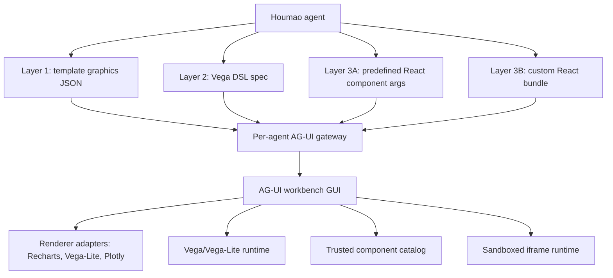

# AG-UI Advanced Presentation Capability Plan

## Context

The current Houmao AG-UI implementation has three relevant presentation paths. The live gateway can carry standard AG-UI tool-call events and validates protocol shape, routing, batch size, and locally checkable tool-call order. The Houmao typed component authoring path is narrower: agents fill predefined schemas such as `houmao.chart.bar`, `houmao.chart.line`, `houmao.chart.pie`, `houmao.table`, `houmao.metric_grid`, and `houmao.dashboard`. The compatibility `houmao_render_graphic` path is broader on the Python side because it accepts `svg`, `html_fragment`, `image_url`, `image_data_uri`, and `chart_json`, but the current workbench only renders safe SVG.

This plan consolidates future graphics and media support into three user-facing layers. Layer 1 is standardized chart intent with selectable renderer backends. Layer 2 is raw Vega ecosystem DSL. Layer 3 is React component presentation, split into predefined trusted components and future custom sandboxed React.



## Layer 1: Template Graphics

Layer 1 accepts one standardized Houmao chart JSON schema. The user or GUI may choose the rendering backend. Initial backends should include Recharts and Vega-Lite, with Plotly added early for feedback. Additional backends can be added later without changing the core schema.

The core schema is the source of truth. A renderer-specific `extra` field may refine rendering for one backend, but the chart must remain renderable from the standardized fields alone. Unsupported `extra` keys and unsupported fields inside a known backend block are ignored or reported as non-fatal renderer warnings.

Recommended Python backend libraries:

- `pydantic`: authoritative payload models and JSON Schema generation.
- `jsonschema`: optional JSON Schema validation when validating schemas exported to other processes.

Recommended TypeScript GUI libraries:

- `zod` or generated validators for browser-side runtime validation.
- `recharts` for native React chart rendering.
- `vega`, `vega-lite`, and `vega-embed` for the Vega-Lite adapter.
- `plotly.js` or a scoped Plotly wrapper for the Plotly adapter when that backend is enabled.

Suggested tool name:

- `houmao.graphic.template`

Example payload:

```json
{
  "schemaVersion": 1,
  "chartType": "bar",
  "renderer": {
    "preferred": "recharts",
    "fallback": ["vega-lite", "plotly"]
  },
  "title": "Build Results",
  "data": {
    "values": [
      { "status": "passed", "count": 42 },
      { "status": "failed", "count": 2 }
    ]
  },
  "encoding": {
    "x": { "field": "status", "type": "nominal", "title": "Status" },
    "y": { "field": "count", "type": "quantitative", "title": "Count" }
  },
  "interactions": {
    "tooltip": true,
    "legend": true
  },
  "extra": {
    "recharts": {
      "barRadius": [3, 3, 0, 0],
      "margin": { "top": 8, "right": 18, "bottom": 18, "left": 4 }
    },
    "vega-lite": {
      "config": {
        "axis": { "labelFontSize": 12 }
      }
    },
    "plotly": {
      "layout": {
        "bargap": 0.25
      }
    }
  }
}
```

Layer 1 does not support custom user templates. If a user wants a custom template or a backend-native specification, they should use Layer 2. The `extra` field must not become a backdoor for arbitrary Vega, Vega-Lite, Plotly, React, HTML, JavaScript callbacks, remote data loading, or full trace/spec replacement.

Good `extra` uses include renderer margins, axis formatting, legend placement, tooltip style, color hints, line interpolation, point radius, bar radius, and narrowly allowed backend layout fragments.

## Layer 2: Vega DSL Graphics

Layer 2 is locked to the Vega ecosystem and gives the agent full declarative graphics freedom within that ecosystem. It accepts raw Vega-Lite and, later if needed, raw Vega specs. Vega-Lite should be the default. Direct Vega should be treated as advanced because it is lower-level and broader.

Recommended primary library stack:

- Python: `altair` for authoring examples and helper-side normalization of Vega-Lite specs.
- Python: `jsonschema` and optionally `vl-convert-python` for schema and compilation preflight.
- TypeScript: `vega`, `vega-lite`, and `vega-embed` or `react-vega` for browser rendering.

Suggested tool names:

- `houmao.graphic.vegalite`
- `houmao.graphic.vega`

Example Vega-Lite payload:

```json
{
  "schemaVersion": 1,
  "library": "vega-lite",
  "specVersion": "6",
  "title": "Latency by Component",
  "spec": {
    "mark": "bar",
    "encoding": {
      "x": { "field": "component", "type": "nominal" },
      "y": { "field": "p95_ms", "type": "quantitative" }
    },
    "data": {
      "values": [
        { "component": "api", "p95_ms": 123 },
        { "component": "worker", "p95_ms": 87 }
      ]
    }
  }
}
```

Layer 2 should allow interactive charts through Vega-Lite and Vega, such as selections, parameters, tooltips, filtering, zooming where supported, and linked views. It should reject or restrict remote `data.url` by default; prefer inline data or gateway artifact references. It should not allow arbitrary HTML, script tags, iframe content, or JavaScript execution outside the Vega runtime.

## Layer 3: React Components

Layer 3 covers React presentation surfaces and has two sublayers. The first sublayer is a trusted component catalog shipped by the GUI. The second is fully custom agent-authored React, planned but disabled until a sandboxed runtime and policy are ready.

### Layer 3A: Predefined Component Catalog

Predefined components are trusted GUI code addressed by component id. The agent supplies only validated JSON props. This layer is intended for complex media and UI presentation that does not fit chart grammars.

Recommended component families:

- `houmao.media.pdf_viewer`
- `houmao.media.video_player`
- `houmao.media.audio_player`
- `houmao.media.image_viewer`
- `houmao.media.gallery`
- `houmao.ui.tabs`
- `houmao.ui.split_panel`
- `houmao.ui.dashboard`

Example payload:

```json
{
  "schemaVersion": 1,
  "component": "houmao.media.pdf_viewer",
  "props": {
    "source": {
      "kind": "gateway_artifact",
      "artifactId": "paper-main"
    },
    "initialPage": 3,
    "highlights": [
      { "page": 3, "text": "main result" }
    ]
  }
}
```

The GUI should prefer gateway artifact ids over arbitrary URLs. Each component owns a props schema, renderer, loading state, and fallback. PDF rendering can use PDF.js-backed components. Video and audio can use native media elements, Vidstack, or Media Chrome depending on the desired UI surface.

### Layer 3B: Custom React Components

Custom React gives maximum freedom and should be treated as untrusted code execution. The agent emits a small React component bundle that conforms to a narrow interface, and the GUI renders it in a sandboxed iframe, not inside the workbench's main React tree. This layer is planned for future support and should be advertised as unsupported or disabled until implemented.

Recommended Python backend role:

- Use `pydantic` to validate a component manifest, source file list, props schema, dependency allowlist, requested permissions, and size limits.
- Do not execute generated JavaScript in the Python gateway.
- If preflight is required, run a Node or Bun verifier out of process with a temporary workspace and explicit time, file, and network limits.

Recommended TypeScript GUI libraries:

- `@codesandbox/sandpack-react` for a fast first implementation of sandboxed React previews.
- `esbuild-wasm` for a tighter custom browser-side TSX compiler if the project later needs complete control over the iframe runtime.
- `zod` for validating the component manifest before rendering.

Suggested tool name:

- `houmao.component.react_bundle`

Suggested component interface:

```ts
export interface HoumaoGraphicComponentProps {
  data: unknown;
  width: number;
  height: number;
  theme: "light" | "dark";
  emit?: (event: { type: string; payload?: unknown }) => void;
}
```

Layer 3B should require explicit enablement and clear GUI trust state. A production version should consider signed component bundles, dependency pinning, network-disabled iframes by default, `postMessage`-only communication, and a hard timeout or unload control.

## Capability Model

Expose the layers independently in AG-UI capabilities so a GUI can choose behavior before any run starts.

```json
{
  "houmao": {
    "presentation": {
      "templateGraphics": {
        "supported": true,
        "schemaVersion": 1,
        "renderers": ["recharts", "vega-lite", "plotly"],
        "extraPolicy": "renderer_scoped_ignored_when_unsupported"
      },
      "vegaDsl": {
        "supported": true,
        "libraries": [
          { "name": "vega-lite", "versions": ["6"] },
          { "name": "vega", "versions": ["6"], "advanced": true }
        ],
        "remoteData": "disabled_by_default"
      },
      "catalogComponents": {
        "supported": true,
        "components": ["houmao.media.pdf_viewer", "houmao.media.video_player", "houmao.media.image_viewer"]
      },
      "customReact": {
        "supported": false,
        "planned": true,
        "sandbox": "iframe",
        "requiresExplicitEnablement": true
      }
    }
  }
}
```

The capability response should avoid saying simply `generatedGraphics: true` once the layers exist. That single flag hides important renderer, DSL, media, and sandbox differences.

## Design Principles

- Keep transport permissive enough to carry standard AG-UI events, but keep renderers explicit.
- Keep each layer discoverable through schema or capability metadata.
- Keep Layer 1 standardized, even when `extra` adds backend hints.
- Ignore unsupported `extra` safely rather than failing cross-renderer fallback.
- Move custom templates and backend-native specs to Layer 2, not Layer 1.
- Prefer catalog components over custom React when the requested visual can be expressed with trusted GUI code.
- Do not inject raw HTML, SVG, or React into the main workbench DOM.
- Treat agent-authored presentation artifacts as display artifacts, not as a way to control Houmao agent lifecycle, credentials, mailbox state, memory, or tmux sessions.
