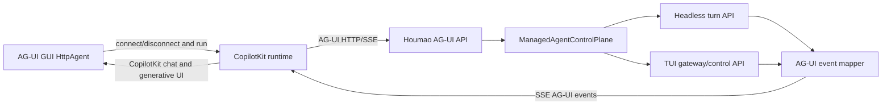

# AG-UI Integration Design

## Context

Houmao should support AG-UI as a separate set of APIs on the agent gateway so AG-UI enabled GUI tools can communicate with Houmao agents without replacing the existing Houmao control, request, turn, memory, or mail APIs.

The local AG-UI reference source lives at `extern/orphan/ag-ui`. The protocol input model is `RunAgentInput` in `extern/orphan/ag-ui/sdks/python/ag_ui/core/types.py`, and the event model is in `extern/orphan/ag-ui/sdks/python/ag_ui/core/events.py`. AG-UI clients post JSON to a configured URL and expect a streaming `text/event-stream` response. The Python encoder writes each event as an SSE frame containing camelCase JSON.

The local CopilotKit reference source lives at `extern/orphan/copilotkit`. The relevant path for a CopilotKit GUI is a CopilotKit runtime that registers an AG-UI `HttpAgent` pointed at an external AG-UI endpoint. The runtime exposes `/agent/{agentId}/run` and `/agent/{agentId}/connect`, and it can proxy to a backend AG-UI endpoint with `new HttpAgent({ url })`. CopilotKit renders generated UI mainly through AG-UI tool calls and activity messages:

- `useComponent` registers a display-only React component as a frontend tool. The agent calls that tool name and CopilotKit renders the component from the tool arguments.
- `useRenderTool` registers a renderer for backend tool calls and gets `inProgress`, `executing`, and `complete` states from streamed tool-call events plus tool results.
- `openGenerativeUI` enables CopilotKit's `generateSandboxedUi` path. The runtime middleware watches for a `generateSandboxedUi` tool call, parses streamed tool arguments, and emits `open-generative-ui` activity events that the React renderer mounts inside a sandboxed iframe.

## Design Goal

Treat AG-UI as a presentation and streaming protocol adapter over Houmao's existing managed-agent control planes. Do not add a second scheduler, a separate runtime path, or a parallel agent ownership model. The AG-UI layer should translate between AG-UI `RunAgentInput` plus AG-UI events and Houmao's existing managed-agent prompt, headless turn, TUI control, and gateway request flows.

Houmao agent lifecycle remains owned by Houmao. An external GUI must not start, stop, restart, or otherwise manage the actual Houmao agent process. GUI lifecycle maps to connect and disconnect semantics: the GUI connects to an existing Houmao agent, subscribes to AG-UI compatible events, submits task runs when the user asks for work, and disconnects by closing the stream or explicitly detaching a GUI session. AG-UI `RUN_STARTED` and `RUN_FINISHED` describe a task run, not the lifetime of the Houmao agent.

## First Milestone: CopilotKit Graphics

The first milestone is to let a running Houmao agent send task-specific generated graphics to a CopilotKit GUI. This milestone should prove the end-to-end path without giving the GUI process lifecycle control.

The recommended MVP contract is an AG-UI tool-call based graphics artifact:

- Houmao recognizes or creates a structured graphics artifact from a task result.
- The AG-UI adapter emits a tool call named `houmao_render_graphic`.
- The tool arguments carry a small typed payload such as `title`, `description`, `format`, `content`, `contentUrl`, `altText`, and `metadata`.
- `format` starts with safe display formats: `svg`, `html_fragment`, `image_url`, `image_data_uri`, and `chart_json`.
- CopilotKit registers a `useRenderTool({ name: "houmao_render_graphic" })` renderer that displays the artifact inline in chat.
- The stream may include normal assistant text before or after the tool call, but the graphic itself travels as structured tool-call arguments and result, not as unstructured Markdown.

This path is simpler than full open-ended CopilotKit UI generation and gives Houmao control over artifact shape, validation, sanitization, and test coverage.

Open Generative UI can be a second path inside the same milestone only if we need truly open-ended HTML/CSS/JS graphics. In that mode Houmao emits a `generateSandboxedUi` tool call with arguments in CopilotKit's expected order: `initialHeight`, `placeholderMessages`, `css`, `html`, `jsFunctions`, and `jsExpressions`. CopilotKit's `openGenerativeUI` runtime middleware then converts the streamed tool call into `open-generative-ui` activity events. This should be treated as higher risk because generated JavaScript, external CDN use, and sandbox function exposure need stricter policy.

## Rollout Stages

Split the implementation into two stages.

Stage 1 adds AG-UI support to the live per-agent gateway. In this stage, GUI tools talk directly to one existing Houmao agent through that agent's gateway URL. This is the smallest useful surface because it avoids central routing, keeps the event stream close to the agent runtime, and proves the CopilotKit graphics path first.

Stage 1 endpoints:

- `POST /v1/ag-ui/connect`
- `POST /v1/ag-ui/runs`
- `DELETE /v1/ag-ui/connections/{connection_id}`
- `GET /v1/ag-ui/capabilities`

Stage 2 adds AG-UI routes to `houmao-passive-server`. In this stage, GUI tools can target stable agent-scoped URLs resolved by the passive server. The passive server should remain a thin facade: it resolves `agent_ref`, proxies AG-UI streams to the live per-agent gateway, and detaches on disconnect. It must not own the Houmao agent lifecycle.

Stage 2 endpoints:

- `POST /houmao/agents/{agent_ref}/ag-ui/connect`
- `POST /houmao/agents/{agent_ref}/ag-ui/runs`
- `DELETE /houmao/agents/{agent_ref}/ag-ui/connections/{connection_id}`
- `GET /houmao/agents/{agent_ref}/ag-ui/capabilities`

The passive-server stage should not duplicate AG-UI event mapping. The live gateway should remain the source of truth for AG-UI run admission, connect replay, graphics artifact mapping, and capability calculation. Passive-server code should add streaming proxy support for `text/event-stream` and preserve upstream status codes where possible.

## API Surface

Expose AG-UI under its own namespace so it does not blur existing Houmao API contracts.

Stage 2 passive-server routes:

- `POST /houmao/agents/{agent_ref}/ag-ui/connect`
- `POST /houmao/agents/{agent_ref}/ag-ui/runs`
- `DELETE /houmao/agents/{agent_ref}/ag-ui/connections/{connection_id}`
- `GET /houmao/agents/{agent_ref}/ag-ui/capabilities`

Stage 1 live per-agent gateway routes:

- `POST /v1/ag-ui/connect`
- `POST /v1/ag-ui/runs`
- `DELETE /v1/ag-ui/connections/{connection_id}`
- `GET /v1/ag-ui/capabilities`

The AG-UI TypeScript `HttpAgent` can target either run endpoint directly. The central server route is the stable GUI-facing URL when a client knows an agent reference. The live gateway route is useful for local tools that already discovered a specific gateway base URL.

The connect endpoint is a GUI attachment stream. It should accept the same core `RunAgentInput` envelope plus an optional `lastSeenEventId`, but it must not submit a prompt or create an agent run. It replays recent compacted AG-UI events for the requested thread/session, emits a current Houmao status snapshot, and then follows live events until the GUI disconnects. The primary disconnect mechanism is the SSE connection closing. The explicit delete endpoint exists for clients that need deterministic cleanup of a connection record.

When CopilotKit sits in front of Houmao, there are two possible bridge designs:

- Use CopilotKit's standard runtime plus `HttpAgent` for `/run`, and rely on CopilotKit's own in-memory runner for `/connect` replay. This is enough for a simple chat and graphics demo, but it does not attach to live Houmao events unless a run has gone through that CopilotKit runtime.
- Add a small CopilotKit-side custom agent or runner that maps `/agent/{agentId}/connect` to Houmao's AG-UI connect endpoint. This is the better fit for Houmao because the GUI connects to the actual already-running Houmao agent.

## Proposed Module Shape

Add a small `houmao.ag_ui` package:

- `models.py`: wrap or import AG-UI protocol models.
- `encoder.py`: emit AG-UI SSE frames with camelCase JSON.
- `prompt.py`: convert AG-UI messages, state, context, forwarded props, and resume payloads into a Houmao prompt.
- `mapper.py`: map Houmao headless and TUI events to AG-UI events.
- `service.py`: resolve the target agent control plane, admit the run, submit the prompt or turn, and stream mapped AG-UI events.
- `connection.py`: manage GUI attachment sessions, replay recent events, follow active streams, and detach on disconnect without interrupting the Houmao agent.
- `graphics.py`: validate Houmao graphics artifacts and map them to CopilotKit-compatible AG-UI tool calls.
- `routes.py`: shared FastAPI route wiring for the central server and live gateway where practical.

The preferred dependency choice is to add `ag-ui-protocol>=0.1.19,<0.2` and keep it behind the adapter boundary. The local Python SDK is small and depends mainly on Pydantic, which Houmao already uses. If package stability becomes a concern, Houmao can copy only the minimal AG-UI models needed for the MVP, but that should be a deliberate tradeoff because it creates protocol drift risk.

## Input Mapping

The adapter should build one Houmao prompt from AG-UI input:

- Use the latest user message or tool result as the main prompt body.
- Include prior AG-UI messages as conversation context when needed.
- Render `state`, `context`, `forwardedProps`, and `resume` as structured prompt context.
- Ignore AG-UI activity messages as agent input.
- Accept plain text as the first-class content path.
- Treat multimodal input as future work unless the target Houmao backend explicitly supports it. Unsupported inline binary content should produce a clear validation error or AG-UI `RUN_ERROR`.

The adapter should whitelist any forwarded props that map to Houmao execution settings. It should not pass arbitrary `forwardedProps` directly into runtime controls.

## Event Mapping

Every admitted AG-UI run should emit `RUN_STARTED` first and end with exactly one terminal event: `RUN_FINISHED` or `RUN_ERROR`.

For headless agents, submit a `HoumaoHeadlessTurnRequest` and stream observed turn events:

- `assistant` maps to `TEXT_MESSAGE_START`, `TEXT_MESSAGE_CONTENT`, and `TEXT_MESSAGE_END`.
- `reasoning` maps to AG-UI reasoning events only when the backend exposes reasoning content that is safe to surface.
- `action_request` maps to `TOOL_CALL_START`, `TOOL_CALL_ARGS`, and `TOOL_CALL_END`.
- `action_result` maps to `TOOL_CALL_RESULT`.
- `progress` and `diagnostic` map to `CUSTOM` or `ACTIVITY_SNAPSHOT`.
- Successful completion maps to `RUN_FINISHED` with a success outcome.
- Runtime failure maps to `RUN_ERROR`.

For TUI agents, support a lower-fidelity stream because TUI control does not expose the same semantic event stream as headless mode:

- Emit `RUN_STARTED`.
- Emit a `STATE_SNAPSHOT` with managed-agent and TUI status.
- Stream status changes as `ACTIVITY_SNAPSHOT` or `CUSTOM` events.
- Emit a final `TEXT_MESSAGE_*` sequence from the parsed terminal surface or dialog tail when available.
- Emit `RUN_FINISHED` or `RUN_ERROR` based on the control-plane outcome.

Headless agents should be the primary high-fidelity AG-UI target for the first implementation. TUI support should remain compatible but explicitly lower fidelity.

For CopilotKit graphics, the mapper should emit a complete AG-UI tool-call sequence:

1. `TOOL_CALL_START` with `toolCallName: "houmao_render_graphic"`.
2. One or more `TOOL_CALL_ARGS` chunks containing the JSON graphics payload.
3. `TOOL_CALL_END`.
4. Optional `TOOL_CALL_RESULT` with a small result string or normalized artifact summary.

The tool call should belong to an assistant message so CopilotKit's chat renderer can find it through the assistant message `toolCalls` list and pair it with a later tool message when a result exists.

## Capabilities

Add a capabilities endpoint so GUI tools can choose behavior before starting a run. The response should describe:

- HTTP SSE streaming support.
- Whether the target is headless or TUI.
- Text input support.
- Multimodal input support, initially false unless a backend proves otherwise.
- State snapshot support.
- State delta support, initially false.
- Reasoning event support, based on backend and safety policy.
- Tool call visibility.
- Client-provided frontend tool execution, initially false.
- CopilotKit graphics artifact support via `houmao_render_graphic`.
- Optional Open Generative UI support via `generateSandboxedUi`, initially false unless explicitly enabled and tested.
- Houmao custom metadata such as agent ref, transport, gateway status, and supported endpoints.

## Tool Interop

AG-UI client-provided tools need careful handling. The frontend sends tool definitions in `RunAgentInput.tools`, but Houmao does not yet have a backend-neutral way to execute frontend tools during a model run.

MVP behavior should not claim full frontend tool execution. It may include tool definitions as prompt context or reject tool execution requests clearly. A later phase can add interrupt and resume support:

1. The agent requests a frontend tool call.
2. Houmao emits AG-UI `TOOL_CALL_*` events.
3. Houmao ends the run with an interrupt outcome.
4. The GUI executes the tool.
5. The GUI resumes with a tool message or AG-UI `resume` payload.
6. Houmao injects the result into the next prompt.

Provider-native tool support can be added per backend later where the backend exposes a suitable mechanism.

## Error and Concurrency Semantics

Use HTTP errors before a run is admitted:

- `404` for missing agents.
- `409` for busy agents when the run cannot be admitted.
- `422` for invalid AG-UI input.
- `503` when the target transport is unavailable.

After a run is admitted and `RUN_STARTED` has been sent, report runtime failures through AG-UI `RUN_ERROR` rather than throwing from the stream.

Use Houmao's existing admission and active-turn rules. For MVP, reject overlapping AG-UI runs for the same target agent instead of keeping long-lived queued streams. Client disconnect should stop streaming to that client. It should not interrupt the underlying Houmao turn unless an explicit abort policy requests interruption.

CopilotKit's stop control should be treated the same way for the first milestone. A GUI stop action detaches the GUI from the task stream by default. It must not kill the Houmao agent process. Mapping stop to a Houmao interrupt should require an explicit opt-in policy because interruption changes the agent's work, while disconnect only changes the GUI subscription.

## Security and Data Boundaries

The AG-UI API should remain a narrow adapter. It should not expose mailbox content, memory, raw terminal history, credentials, or unmanaged forwarded props by default. State snapshots should use a namespaced Houmao object and should redact anything outside the AG-UI contract. Keep loopback-oriented gateway binding behavior unchanged unless a separate change expands remote GUI access.

## Test Plan

Add focused coverage for:

- AG-UI route registration on the central server and live gateway.
- AG-UI connect route behavior: replay, live follow, disconnect cleanup, and no prompt submission.
- `RunAgentInput` validation with camelCase JSON.
- SSE encoder output and content type.
- Prompt conversion from messages, state, context, forwarded props, and resume payloads.
- Headless event mapping for assistant text, reasoning, tool calls, tool results, progress, completion, and failures.
- TUI stream mapping for status snapshots and final text output.
- Graphics artifact validation and `houmao_render_graphic` event sequencing.
- Optional `generateSandboxedUi` event sequencing when Open Generative UI is enabled.
- Capabilities for headless and TUI agents.
- Busy-agent, missing-agent, invalid-input, unavailable-transport, and post-admission runtime error behavior.
- Client disconnect behavior.

## OpenSpec Change Direction

This should become a new OpenSpec change, likely named `add-ag-ui-gateway-api`, with requirements for:

- A separate AG-UI run endpoint that accepts `RunAgentInput`.
- A separate AG-UI connect endpoint that attaches a GUI to an existing Houmao agent without creating, starting, stopping, or interrupting that agent.
- Valid AG-UI SSE event streams.
- Headless event mapping.
- TUI-compatible lower-fidelity streaming.
- CopilotKit-compatible graphics artifact streaming.
- Capabilities discovery.
- Deterministic error, concurrency, and disconnect semantics.
