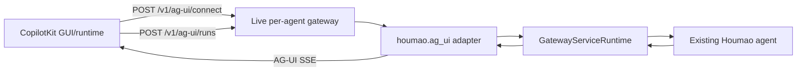

# Per-Agent AG-UI Integration Roadmap

## Scope

This roadmap covers stage 1 of AG-UI integration: add AG-UI support to the live per-agent gateway so a GUI can talk directly to one existing Houmao agent. Stage 2, adding `houmao-passive-server` as a stable facade, should wait until this per-agent path is working and tested.

The first user-facing milestone is CopilotKit graphics: a running Houmao agent can send task-specific generated graphics to a CopilotKit GUI through AG-UI events. The GUI connects to the agent; it does not manage the Houmao agent lifecycle.

Current status:

- Milestone 1 is implemented for the live per-agent gateway attachment surface: `/v1/ag-ui/capabilities`, `/v1/ag-ui/connect`, `/v1/ag-ui/runs`, and explicit connection detachment are registered, with conservative state-snapshot connect semantics and lifecycle-detach behavior.
- Milestone 2 is implemented in commit `f88b4873`: `/v1/ag-ui/runs` now admits one task through the existing gateway request queue, streams AG-UI SSE lifecycle/output events, maps headless canonical events and lower-fidelity TUI observations, validates `houmao_render_graphic` artifacts, and reports run/graphics capabilities when supported.
- Milestone 3 is implemented in `add-ag-ui-e2e-smoke-and-demo`: AG-UI streams now emit safe diagnostics and active counts, deterministic gateway E2E covers run-id artifact lookup and graphics reconstruction, the supported headless gateway demo owns the live AG-UI text smoke command, the opt-in Bun Playwright browser fixture validates renderer behavior, docs cover direct gateway setup, and passive-server readiness tests define future SSE proxy expectations.
- Remaining stage 1 work is compacted connect replay if needed. Stage 2 can now start from a concrete passive-server proxy contract.

## Non-Negotiable Semantics

- The Houmao agent lifecycle remains owned by Houmao.
- `connect` means GUI attachment to an existing agent event stream.
- `disconnect` means GUI detachment from the stream.
- `RUN_STARTED` and `RUN_FINISHED` describe one task run, not the lifetime of the Houmao agent.
- CopilotKit stop/abort should detach by default. It should interrupt a Houmao run only when an explicit policy opts into interruption.
- The per-agent gateway is the source of truth for AG-UI event mapping and capabilities.

## Milestone 1: Protocol Surface and GUI Attachment

Goal: create the AG-UI protocol boundary in the per-agent gateway and let a GUI attach to an existing Houmao agent without submitting work or managing lifecycle.

Deliverables:

- AG-UI model and encoder boundary under `houmao.ag_ui`.
- Live gateway routes registered under `/v1/ag-ui`.
- A capabilities endpoint that reports conservative support.
- `POST /v1/ag-ui/connect` streams AG-UI-compatible status and replay events.
- GUI disconnect closes only the stream subscription.
- Explicit disconnect cleans up connection bookkeeping.
- Unit tests validate route presence, model parsing, SSE framing, and connect semantics.

Todo:

- [ ] Decide whether to depend on `ag-ui-protocol>=0.1.19,<0.2` or vendor minimal models.
- [ ] Add `houmao.ag_ui.models` wrappers or imports for `RunAgentInput`, events, and capability payloads.
- [ ] Add `houmao.ag_ui.encoder` for `data: <camelCase-json>\n\n` SSE frames.
- [ ] Add route wiring for `GET /v1/ag-ui/capabilities`.
- [ ] Add route shells for `POST /v1/ag-ui/connect`, `POST /v1/ag-ui/runs`, and `DELETE /v1/ag-ui/connections/{connection_id}`.
- [ ] Return explicit conservative capabilities: HTTP SSE true, text input true, state snapshots true, state deltas false, frontend tool execution false, graphics artifact support planned or false until Milestone 2.
- [ ] Add tests for camelCase request parsing and event encoding.
- [ ] Add route inventory tests for the per-agent gateway app.
- [ ] Add `houmao.ag_ui.connection` to track connection IDs, thread IDs, and subscribers.
- [ ] Define the connect request body as `RunAgentInput` plus optional `lastSeenEventId`.
- [ ] Emit an initial `STATE_SNAPSHOT` with namespaced Houmao status for the connected agent.
- [ ] Add an event replay source for recent compacted AG-UI events, even if the first implementation replays only the current state snapshot.
- [ ] Add live-follow support for task events produced after the connection starts.
- [ ] Treat HTTP/SSE disconnect as GUI detachment only.
- [ ] Implement `DELETE /v1/ag-ui/connections/{connection_id}` as explicit GUI detachment.
- [ ] Keep connect unavailable or degraded for transports that cannot produce any useful state, with clear capability flags.
- [ ] Add tests for connect replay, live follow, explicit disconnect, client disconnect, and no prompt submission.

Verification test cases:

- `test_ag_ui_routes_registered`: create the per-agent gateway app and assert `/v1/ag-ui/connect`, `/v1/ag-ui/runs`, `/v1/ag-ui/connections/{connection_id}`, and `/v1/ag-ui/capabilities` are registered with the expected methods.
- `test_ag_ui_capabilities_are_conservative`: call capabilities on a fake runtime and assert SSE, text input, and state snapshots are true while state deltas, frontend tool execution, and Open Generative UI are false unless explicitly enabled.
- `test_run_agent_input_accepts_camel_case`: parse a request body with `threadId`, `runId`, `forwardedProps`, `parentRunId`, and `messages`, then assert the internal model preserves the expected values.
- `test_sse_encoder_uses_ag_ui_json_frame`: encode a simple event and assert the bytes start with `data: `, end with a double newline, omit `None` fields, and use camelCase field names.
- `test_connect_emits_state_snapshot_without_prompt_submission`: call `/v1/ag-ui/connect` with a fake runtime and assert the stream emits an AG-UI state snapshot, while the adapter's prompt submission method is never called.
- `test_connect_disconnect_does_not_interrupt_agent`: start a connect stream, close the client connection, and assert no interrupt, abort, prompt, or stop method is invoked on the runtime.
- `test_explicit_disconnect_removes_connection_only`: create a connection, call `DELETE /v1/ag-ui/connections/{connection_id}`, and assert connection bookkeeping is removed while the fake agent remains active.
- `test_connect_unavailable_transport_reports_clear_error`: run connect against a fake transport with no usable observation state and assert the response is a deterministic error or a degraded capability response, not a task submission.

Done when:

- The live gateway exposes AG-UI endpoints.
- The capabilities endpoint is useful to a GUI client.
- Unsupported operations fail clearly without starting a Houmao task.
- A CopilotKit-side attach can observe an existing Houmao agent through the per-agent gateway.
- Closing the GUI stream leaves the Houmao agent and any active task alone.

## Milestone 2: Run Streaming and CopilotKit Graphics

Goal: accept AG-UI `RunAgentInput`, submit a task through the existing gateway control plane, and stream Houmao output as AG-UI events, including CopilotKit-renderable graphics.

Deliverables:

- `POST /v1/ag-ui/runs` accepts AG-UI input and returns an AG-UI SSE stream.
- Run admission follows existing Houmao busy and availability rules.
- Prompt conversion is deterministic and test-covered.
- Runtime errors after run admission become AG-UI `RUN_ERROR` events.
- Headless canonical events map to AG-UI lifecycle, text, reasoning, tool, progress, and terminal events.
- TUI output maps to a lower-fidelity but compatible AG-UI stream.
- `houmao_render_graphic` artifacts stream as CopilotKit-compatible AG-UI tool calls.
- Capabilities report graphics support when enabled.

Todo:

- [x] Add `houmao.ag_ui.prompt` to convert AG-UI messages, state, context, `forwardedProps`, and `resume` into a Houmao prompt.
- [x] Use the latest user message or tool result as the primary prompt body.
- [x] Include prior messages, state, context, and resume data as structured prompt context.
- [x] Whitelist forwarded props that may map to Houmao execution settings.
- [x] Reject or explicitly degrade unsupported multimodal content.
- [x] Add `houmao.ag_ui.service` run orchestration on top of `GatewayServiceRuntime`.
- [x] Emit `RUN_STARTED` after the run is admitted.
- [x] Return HTTP errors before admission for invalid input, unavailable transport, and busy agent.
- [x] Emit `RUN_ERROR` for post-admission failures.
- [x] Ensure overlapping AG-UI runs for the same agent are rejected unless a later design adds queued streams.
- [x] Add tests for prompt conversion, admission errors, post-admission errors, and disconnect behavior during an active run.
- [x] Add `houmao.ag_ui.mapper` for headless event mapping.
- [x] Map assistant output to `TEXT_MESSAGE_START`, `TEXT_MESSAGE_CONTENT`, and `TEXT_MESSAGE_END`.
- [x] Map safe reasoning output to AG-UI reasoning events, or redact it when policy requires.
- [x] Map action requests to `TOOL_CALL_START`, `TOOL_CALL_ARGS`, and `TOOL_CALL_END`.
- [x] Map action results to `TOOL_CALL_RESULT`.
- [x] Map progress and diagnostics to `ACTIVITY_SNAPSHOT` or `CUSTOM`.
- [x] Add TUI mapping for state snapshots, activity updates, and final text from the parsed terminal surface.
- [x] Add `houmao.ag_ui.graphics` with a typed artifact schema: `title`, `description`, `format`, `content`, `contentUrl`, `altText`, and `metadata`.
- [x] Support initial graphics formats: `svg`, `html_fragment`, `image_url`, `image_data_uri`, and `chart_json`.
- [x] Emit graphics as a complete `houmao_render_graphic` tool-call sequence.
- [x] Ensure the graphics tool call belongs to an assistant message so CopilotKit can render it from the message `toolCalls` list.
- [x] Add tests for every event mapping path and for the exact graphics event sequence.
- [x] Add a tiny CopilotKit renderer fixture or example using `useRenderTool({ name: "houmao_render_graphic" })`.

Verification test cases:

- `test_run_rejects_invalid_ag_ui_input_before_stream`: post malformed AG-UI input to `/v1/ag-ui/runs` and assert an HTTP validation error, with no `RUN_STARTED` event and no prompt submission.
- `test_run_rejects_busy_agent_before_stream`: configure the fake runtime as busy, post a valid run, and assert a deterministic busy response before any SSE frame is emitted.
- `test_run_emits_started_then_finished_for_success`: submit a simple user message and assert the stream contains `RUN_STARTED`, mapped assistant text events, and exactly one `RUN_FINISHED`.
- `test_run_runtime_failure_becomes_run_error_after_admission`: make the fake runtime fail after admission and assert the stream emits `RUN_STARTED` followed by `RUN_ERROR`, not an unhandled HTTP stream failure.
- `test_prompt_conversion_includes_messages_state_context_and_resume`: feed a `RunAgentInput` with prior messages, current user message, state, context, forwarded props, and resume data, then assert the generated Houmao prompt contains the expected structured sections.
- `test_forwarded_props_are_whitelisted`: pass allowed and disallowed forwarded props, then assert only the allowed execution settings reach the runtime.
- `test_multimodal_input_degrades_explicitly`: pass image or document content to an unsupported backend and assert a clear validation error or `RUN_ERROR`, not silent data loss.
- `test_headless_assistant_event_maps_to_text_sequence`: map a canonical headless assistant event and assert AG-UI text start, content, and end events share the same message ID.
- `test_headless_tool_call_maps_to_ag_ui_tool_sequence`: map a canonical action request and action result, then assert `TOOL_CALL_START`, `TOOL_CALL_ARGS`, `TOOL_CALL_END`, and `TOOL_CALL_RESULT` are emitted with stable IDs.
- `test_reasoning_is_redacted_when_policy_disallows_it`: map a reasoning event under a no-reasoning policy and assert no reasoning content is surfaced.
- `test_tui_output_maps_to_lower_fidelity_stream`: feed fake TUI state and final parsed surface text, then assert state/activity events plus final text events are emitted without claiming headless-level tool semantics.
- `test_graphics_artifact_emits_copilotkit_tool_call`: map a `houmao_render_graphic` artifact and assert the stream emits a complete tool-call sequence with JSON args matching the artifact payload.
- `test_graphics_artifact_rejects_unsafe_format`: pass an unsupported format or unsafe inline content and assert validation fails before emission.
- `test_graphics_tool_call_is_attached_to_assistant_message`: build a stream with text plus a graphic and assert CopilotKit-compatible assistant message reconstruction contains the tool call in `toolCalls`.

Done when:

- [x] A GUI can submit one task to an existing Houmao agent through `/v1/ag-ui/runs`.
- [x] The endpoint behaves like a streaming AG-UI agent without bypassing Houmao's existing run controls.
- [x] A CopilotKit GUI can render a Houmao-generated graphic inline from an AG-UI run stream.
- [x] Text, lifecycle, and terminal events still behave correctly around the graphic.

## Milestone 3: Hardening, Demo, and Passive-Server Readiness

Goal: make the per-agent AG-UI path reliable enough to use as the basis for the passive-server facade.

Status: implemented by OpenSpec change `add-ag-ui-e2e-smoke-and-demo`. The local workspace did not run the live managed-agent smoke because `tests/fixtures/auth-bundles/codex/yunwu-openai/` contains no usable credential files; the deterministic gateway E2E and optional browser smoke did run.

Deliverables:

- Deterministic AG-UI gateway E2E against a live per-agent gateway app/runtime surface.
- Safe diagnostics and active counts for AG-UI runs and connections.
- Documentation for per-agent gateway URLs, CopilotKit-style setup, renderer expectations, known limits, and lifecycle semantics.
- Manual live AG-UI text-smoke command in the supported single-agent headless gateway demo pack.
- Opt-in Bun Playwright browser smoke for deterministic `houmao_render_graphic` rendering.
- Passive-server readiness tests for future SSE proxy behavior.

Todo:

- [x] Add structured logging for AG-UI connect, disconnect, run admission, run completion, and stream errors.
- [x] Add counters or lightweight diagnostics for active AG-UI connections and active AG-UI runs.
- [x] Add a manual CopilotKit-style demo configuration that points an `HttpAgent` at `/v1/ag-ui/runs`.
- [x] Decide that no custom connect bridge is needed for the first direct run demo.
- [x] Verify client abort detaches by default and does not enqueue a Houmao interrupt.
- [x] Document the per-agent gateway endpoints and example CopilotKit runtime setup.
- [x] Document known limits: lower-fidelity TUI streams, no frontend tool execution, no state deltas, conservative multimodal support, deterministic graphics, and GUI-detach lifecycle behavior.
- [x] Run focused unit tests for `houmao.ag_ui` and gateway route tests.
- [x] Add deterministic generated-graphics E2E and opt-in browser smoke coverage.
- [x] Define the next stage as passive-server AG-UI SSE proxying.

Verification test cases:

- `test_ag_ui_diagnostics_report_active_connections_and_runs`: create fake active connect and run streams, then assert gateway diagnostics report accurate AG-UI counts without exposing private state.
- `test_stream_error_is_logged_and_terminal_event_is_emitted`: force an encoder or mapping error and assert the error is logged and the client receives a deterministic terminal event when the stream has already started.
- `test_copilotkit_graphics_smoke_stream`: run a deterministic gateway task that emits a structured graphic artifact and assert a CopilotKit-style event collector can reconstruct one assistant message and one `houmao_render_graphic` tool call.
- `test_stop_defaults_to_detach_not_interrupt`: simulate a CopilotKit stop or client abort and assert the connection is detached while the fake Houmao task is not interrupted.
- `test_documented_curl_examples_match_routes`: exercise the documented per-agent gateway route examples against the FastAPI app or a route inventory helper to prevent docs drift.
- `test_no_sensitive_state_in_snapshots`: generate a state snapshot from a runtime that includes memory, mailbox, terminal history, and credentials, then assert AG-UI state redacts or omits those fields.
- `test_manual_demo_contract_fixture`: validate the demo fixture or example CopilotKit runtime configuration points to `/v1/ag-ui/runs`, registers `houmao_render_graphic`, and does not require passive-server routes.
- `test_stage_two_proxy_contract_can_be_satisfied`: use a fake upstream AG-UI gateway stream and assert a proposed passive-server proxy can preserve content type, status, and event bytes. This remains a readiness test or spike until stage 2 starts.

Done when:

- [x] Stage 1 can be demonstrated without the passive server.
- [x] The lifecycle boundary is documented and tested.
- [x] The passive-server stage has a concrete integration target.

## Cross-Milestone Todo

- [ ] Keep AG-UI adapter code separate from existing Houmao HTTP contracts.
- [ ] Keep lifecycle semantics visible in route docs and tests.
- [ ] Prefer small model and mapper tests over broad integration tests until the event contract stabilizes.
- [ ] Avoid exposing mailbox, memory, raw terminal history, credentials, or unmanaged forwarded props through AG-UI state.
- [ ] Treat generated graphics as untrusted content and sanitize or sandbox by format.
- [ ] Keep Open Generative UI optional until JavaScript, CDN, and sandbox-function risks have explicit policy.

## Main Unknowns

- Resolved: Houmao uses `ag-ui-protocol>=0.1.19,<0.2` behind the `houmao.ag_ui` adapter boundary instead of vendoring minimal models for the first implementation.
- Where Houmao should persist compacted AG-UI events for connect replay, if replay beyond current status is required in stage 1.
- Whether CopilotKit can use its standard runtime plus `HttpAgent` for the first demo, or whether we need a small custom connect bridge immediately.
- Resolved for the first graphics path: Houmao recognizes explicit structured canonical action or result payloads named `houmao_render_graphic`; Markdown scraping and file/artifact conventions remain future work.
