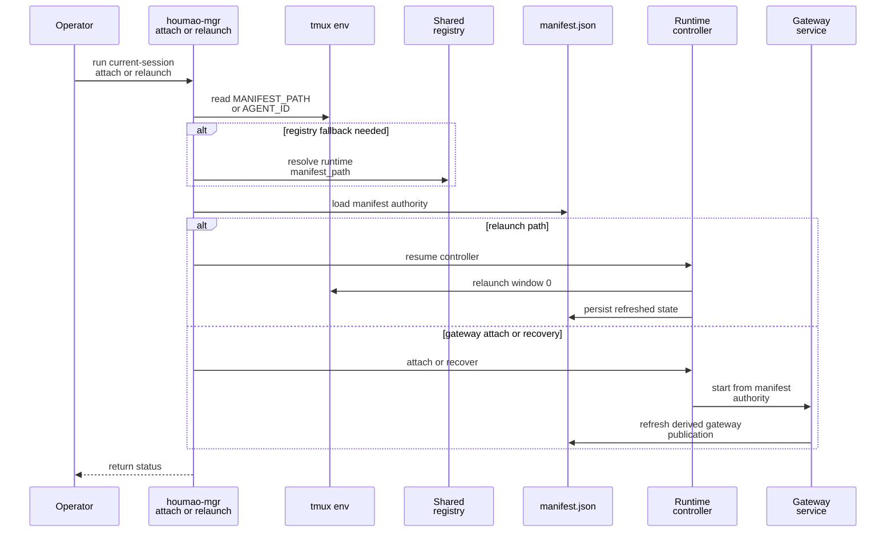

# Plan: Finish Manifest-First Gateway Cutover

## HEADER
- **Purpose**: Finish the remaining work split across `openspec/changes/refactor-gateway-attach-manifest-authority` and `openspec/changes/retire-legacy-runtime-cao-surfaces` by treating the newer change as the active execution vehicle, carrying forward any still-unique unfinished gateway-authority work, and then closing the older change as superseded. This plan assumes the code already landed for manifest-first discovery, relaunch, registry cleanup, and legacy-surface retirement remains the baseline and the remaining work is concentrated in gateway startup authority, internal artifact scoping, recovery wiring, and integration coverage.
- **Status**: Draft
- **Date**: 2026-03-26
- **Dependencies**:
  - `magic-context/instructions/planning/make-implementation-plan.md`
  - `openspec/changes/refactor-gateway-attach-manifest-authority/proposal.md`
  - `openspec/changes/refactor-gateway-attach-manifest-authority/design.md`
  - `openspec/changes/refactor-gateway-attach-manifest-authority/tasks.md`
  - `openspec/changes/retire-legacy-runtime-cao-surfaces/proposal.md`
  - `openspec/changes/retire-legacy-runtime-cao-surfaces/design.md`
  - `openspec/changes/retire-legacy-runtime-cao-surfaces/tasks.md`
  - `src/houmao/agents/realm_controller/runtime.py`
  - `src/houmao/agents/realm_controller/gateway_service.py`
  - `src/houmao/agents/realm_controller/gateway_storage.py`
  - `src/houmao/agents/realm_controller/session_authority.py`
  - `src/houmao/srv_ctrl/commands/managed_agents.py`
  - `src/houmao/server/service.py`
  - `tests/unit/agents/realm_controller/test_gateway_support.py`
  - `tests/integration/agents/realm_controller/test_gateway_runtime_contract.py`
  - `tests/integration/server/test_managed_agent_gateway_contract.py`
  - `tests/integration/srv_ctrl/test_cli_shape_contract.py`
- **Target**: Runtime, gateway, and managed-agent maintainers plus AI assistants closing the two overlapping OpenSpec changes.

---

## 1. Purpose and Outcome

The goal is to finish the manifest-first gateway migration without letting two overlapping OpenSpec changes continue to compete for ownership. Success means there is one clear active change, gateway startup and recovery are fully manifest-backed for supported flows, `attach.json` is explicitly internal-only rather than part of the supported control contract, integration coverage exists for the missing relaunch and attach paths, and the older refactor change can be archived as superseded instead of being worked independently.

The expected output is not just code. The output is: a reconciled OpenSpec backlog, a completed manifest-first gateway startup and recovery path, updated tests that prove the supported contract end to end, and a clean change-management story where `retire-legacy-runtime-cao-surfaces` owns the remaining implementation work and `refactor-gateway-attach-manifest-authority` is reduced to a historical input and superseded record.

## 2. Implementation Approach

### 2.1 High-level flow

1. Reconcile change ownership before more implementation:
   - Treat `retire-legacy-runtime-cao-surfaces` as the only active execution backlog.
   - Use `refactor-gateway-attach-manifest-authority` as a source of still-open technical details, not as a second implementation queue.
2. Carry over any still-unique unfinished work from the older change into the newer one:
   - `3.2` manifest-first gateway startup.
   - `3.4` remaining `houmao_server_rest` attach/control alignment, if still incomplete.
   - `3.5` and `3.6` gateway-managed recovery and reserved window `0` verification.
   - `4.2` integration coverage.
3. Finish manifest-first gateway startup so the runtime and gateway companion stop treating `attach.json` or `gateway_manifest.json` as their primary authority source.
4. Narrow `attach.json` to an internal bootstrap artifact only:
   - keep it if internal runtime or server startup still needs it,
   - remove any supported external control logic that still treats it as authority.
5. Wire gateway-managed recovery onto the already-landed tmux-backed relaunch primitive and prove that recovery and operator relaunch both preserve window `0`.
6. Close the missing integration tests and then update the OpenSpec task files to reflect actual completion state.
7. Archive or explicitly supersede `refactor-gateway-attach-manifest-authority` once every remaining unique concern is either completed or moved into the newer change.

### 2.2 Sequence diagram (steady-state usage)

### 2.3 Change reconciliation rules

Use the following mapping so there is no parallel drift:

| Older change task | Finish vehicle |
| --- | --- |
| `refactor 2.5` tmux-backed relaunch posture | Already partially landed; close through the newer change's recovery and integration work |
| `refactor 3.2` gateway startup from manifest authority | Move under `retire 2.1` |
| `refactor 3.3` registry fallback without gateway pointers | Already completed under `retire 4.1` |
| `refactor 3.4` pair attach/control alignment | Keep as an explicit sub-thread under `retire 2.1` if still open |
| `refactor 3.5` shared relaunch primitive | Already partially landed; finish under `retire 2.3` |
| `refactor 3.6` reserved window `0` contract | Finish under `retire 2.3` plus integration coverage |
| `refactor 4.1` unit coverage | Already partially completed; only keep the still-missing cases |
| `refactor 4.2` integration coverage | Keep under `retire 5.2` |
| `refactor 4.3` docs and guidance | Already largely completed under `retire 4.2` and `4.3` |

The planning rule is simple: if a task is still real, it should live in the newer change. If it is already done or superseded, it should not remain as a separate execution target in the older change.

### 2.4 Technical focus areas

The remaining implementation should concentrate on four seams that are still visibly unresolved in the codebase:

1. **Gateway startup authority**
   - `src/houmao/agents/realm_controller/gateway_service.py` still builds the runtime from `--gateway-root` and immediately loads `attach.json`.
   - That is the main unfinished authority cutover.
2. **Internal versus external artifact roles**
   - `attach.json` still exists and still feeds internal startup and offline-status paths.
   - That is acceptable only if it is explicitly internal and no supported external reader depends on it as authority.
3. **Gateway-managed recovery**
   - `RuntimeSessionController.relaunch()` exists, but gateway-managed recovery is not yet proven to use it end to end.
   - The remaining work is wiring and integration proof, not designing a second relaunch surface.
4. **Integration evidence**
   - The missing contract proof is in integration tests, not unit tests:
     - current-session pair attach,
     - native headless between-turn attach,
     - `houmao-mgr agents relaunch`,
     - gateway recovery against reserved window `0`.

## 3. Files to Modify or Add

- **context/plans/plan-finish-manifest-first-gateway-cutover.md** capture the finish strategy and reconciliation rules for the two overlapping changes.
- **openspec/changes/retire-legacy-runtime-cao-surfaces/tasks.md** update the active execution backlog so any still-unique unfinished work from the older change is owned here explicitly.
- **openspec/changes/refactor-gateway-attach-manifest-authority/tasks.md** mark items as done, superseded, or moved once the carry-over decision is explicit.
- **openspec/changes/refactor-gateway-attach-manifest-authority/proposal.md** or related archive metadata update only if needed to record that the change is superseded rather than independently completed.
- **src/houmao/agents/realm_controller/gateway_service.py** replace gateway-root plus `attach.json` startup authority with manifest-first startup inputs for supported flows.
- **src/houmao/agents/realm_controller/gateway_storage.py** keep `gateway_manifest.json` derived, narrow `attach.json` to internal bootstrap semantics, and centralize any compatibility-only bootstrap helpers.
- **src/houmao/agents/realm_controller/runtime.py** finish gateway recovery wiring, manifest-first gateway startup integration, and any remaining reserved-window enforcement paths.
- **src/houmao/agents/realm_controller/session_authority.py** extend or tighten manifest authority resolution if pair attach/control still has unresolved gaps.
- **src/houmao/srv_ctrl/commands/managed_agents.py** remove any remaining supported control/status fallback that treats `attach.json` as operator-facing authority.
- **src/houmao/server/service.py** move server-managed headless metadata publication off the public authority path if it still depends on mutating `attach.json`.
- **tests/unit/agents/realm_controller/test_gateway_support.py** add targeted unit coverage for manifest-first startup inputs, derived publication refresh, and internal bootstrap-only artifact behavior.
- **tests/integration/agents/realm_controller/test_gateway_runtime_contract.py** add or extend integration cases for native headless between-turn attach, runtime-owned gateway startup, and reserved-window relaunch behavior.
- **tests/integration/server/test_managed_agent_gateway_contract.py** add or extend pair-managed current-session attach and recovery coverage.
- **tests/integration/srv_ctrl/test_cli_shape_contract.py** add coverage for `houmao-mgr agents relaunch` as an active supported command and current-session behavior where applicable.
- **docs/reference/** update only if the remaining gateway startup and internal-artifact decisions require clarifying text beyond the already-landed doc cleanup.

## 4. TODOs (Implementation Steps)

- [ ] **Reconcile OpenSpec ownership** Update the newer change so it explicitly owns any still-real unfinished work from the older change, then mark the older change as superseded-in-practice rather than continuing to execute against both task lists.
- [ ] **Audit remaining authority readers** Inventory every remaining reader of `attach.json` and `gateway_manifest.json`, and classify each as supported external authority, derived publication, or internal bootstrap use.
- [ ] **Finish manifest-first gateway startup** Refactor gateway startup so supported runtime behavior comes from manifest authority first, with `gateway_root` only locating assets rather than defining startup behavior.
- [ ] **Internalize `attach.json`** Keep `attach.json` only where bootstrap state is still internally necessary, and remove or replace any supported operator/control path that still treats it as public authority.
- [ ] **Close pair attach/control gaps** Verify whether `houmao_server_rest` still has any attach or control logic that bypasses manifest authority, and fold any remaining fixes into the active change.
- [ ] **Wire gateway recovery to relaunch** Make gateway-managed recovery call the same relaunch primitive already used by `houmao-mgr agents relaunch`, including window `0` reuse for TUI and native headless sessions.
- [ ] **Prove reserved window semantics** Add focused tests that show operator relaunch and gateway recovery both preserve tmux window `0` as the managed-agent surface and keep gateway activity off that window.
- [ ] **Add integration coverage for missing flows** Implement the still-missing integration cases for pair current-session attach, native headless between-turn attach, manifest-first gateway startup, and relaunch through `houmao-mgr agents relaunch`.
- [ ] **Refresh OpenSpec task state** Mark the completed items accurately in the newer change, reduce the older change to done or superseded items, and prepare it for archive once no unique unfinished tasks remain.
- [ ] **Archive the older change** Run the normal OpenSpec archive flow for `refactor-gateway-attach-manifest-authority` only after every unique unfinished item is either completed or carried forward into the newer change.

## 5. Verification

- [ ] **Task reconciliation check** Confirm every unchecked item in `refactor-gateway-attach-manifest-authority` is either completed, explicitly moved into `retire-legacy-runtime-cao-surfaces`, or intentionally dropped as superseded.
- [ ] **Targeted unit check** Run focused realm-controller unit suites covering gateway support, runtime relaunch, and manifest authority readers.
- [ ] **Gateway integration check** Run `pixi run pytest tests/integration/agents/realm_controller/test_gateway_runtime_contract.py` after the startup and recovery work lands.
- [ ] **Pair integration check** Run `pixi run pytest tests/integration/server/test_managed_agent_gateway_contract.py` after pair attach/control alignment is finished.
- [ ] **CLI integration check** Run `pixi run pytest tests/integration/srv_ctrl/test_cli_shape_contract.py` to prove `houmao-mgr agents relaunch` and the supported command tree still match the intended operator surface.
- [ ] **Regression unit check** Re-run the already-touched manifest, registry, managed-agent, passive-server, and CLI unit suites so the finish work does not regress the contract cleanup already committed.
- [ ] **Manual tmux smoke check** Launch one pair-managed session and one native headless session, verify current-session attach works via manifest discovery, verify relaunch reuses window `0`, and verify gateway recovery does not route back through build-time launch.
