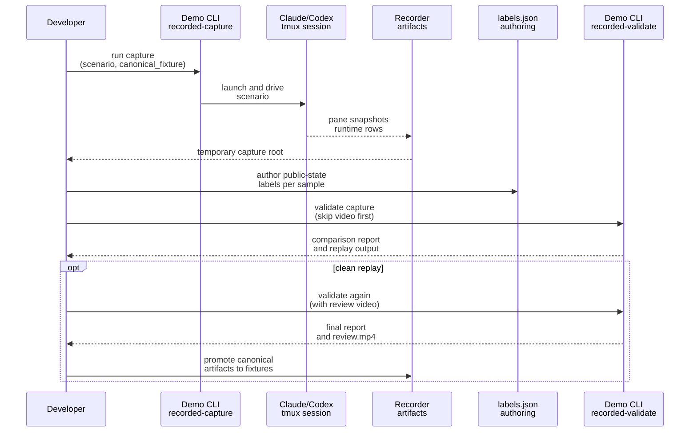

# Plan: Re-capture and Re-label Shared TUI Demo Corpus

## HEADER
- **Purpose**: Re-author the shared tracked-TUI demo fixture corpus so the committed recordings reflect the current canonical capture posture and carry fresh human-authored labels for tracker correctness checks.
- **Status**: Draft
- **Date**: 2026-03-22
- **Dependencies**:
  - `scripts/demo/shared-tui-tracking-demo-pack/README.md`
  - `scripts/demo/shared-tui-tracking-demo-pack/GT_STATE_COMPARISON_CONTRACT.md`
  - `scripts/demo/shared-tui-tracking-demo-pack/demo-config.toml`
  - `scripts/demo/shared-tui-tracking-demo-pack/scenarios/`
  - `src/houmao/demo/shared_tui_tracking_demo_pack/driver.py`
  - `src/houmao/demo/shared_tui_tracking_demo_pack/recorded.py`
  - `src/houmao/demo/shared_tui_tracking_demo_pack/groundtruth.py`
  - `tests/fixtures/shared_tui_tracking/recorded/`
- **Target**: Shared TUI tracking developers and AI assistants refreshing the canonical recorded-fixture corpus.

---

## 1. Purpose and Outcome

The goal is to replace the current committed recorded corpus with freshly captured sessions that match the current canonical demo capture posture, then label those sessions against the tracker's public-state contract and re-promote them as the regression baseline. Success means the committed fixtures are no longer historical `0.25s` recordings, but newly captured `0.2s` recordings produced through the current demo workflow and accompanied by complete `labels.json` coverage for every sample.

The plan assumes the scope is the current first-wave fixture matrix already documented by the demo pack: four Claude cases and three Codex cases. The expected outputs are refreshed committed fixture directories under `tests/fixtures/shared_tui_tracking/recorded/`, updated fixture metadata and recorder manifests, and a clean validation pass for both strict GT replay and cadence-sweep checks.

## 2. Implementation Approach

### 2.1 High-level flow

1. Use the existing scenario matrix as the recapture source of truth and run captures with the current `canonical_fixture` profile so the new corpus aligns with the current `0.2s` default posture.
2. Capture every case into temporary authoring roots under `tmp/demo/shared-tui-tracking-demo-pack/authoring/<tool>/<case>/capture` rather than writing directly into the committed fixture tree.
3. Inspect `recording/pane_snapshots.ndjson`, `runtime_observations.ndjson`, and `recording/input_events.ndjson` for each temporary capture and author a complete `recording/labels.json` that describes public tracked state, not raw visual intuition.
4. Run `recorded-validate --skip-video` on each labeled capture until the comparison is clean, and only then run full validation with video generation for the candidate canonical fixture.
5. Promote only the canonical replay-grade artifacts into `tests/fixtures/shared_tui_tracking/recorded/<tool>/<case>/`, preserving the fixture-manifest and recorder-manifest data from the fresh capture.
6. Re-run corpus validation and named sweeps from the committed fixture tree to confirm the promoted corpus works as the new regression baseline.

### 2.2 Labeling and drift handling

The corpus refresh should follow the tracker contract in `GT_STATE_COMPARISON_CONTRACT.md`, which means labels must encode public tracked state after tracker-owned timing semantics such as settle windows. If a scenario's observed behavior drifts from its historical intent, the label set should match the actual observed public state, and the deviation should be recorded in authoring notes or README updates rather than forcing the label to fit the old expectation.

The highest-risk case remains `codex_interrupted_after_active`, because the current authoring notes already document that Codex can fall into an ambiguous feedback-oriented surface rather than a clean interrupted-ready surface. That case should be recaptured and labeled from actual observation first, then judged on whether the refreshed capture still serves the intended transition-family coverage or whether the scenario itself needs follow-up revision after the corpus refresh is complete.

### 2.3 Sequence diagram (steady-state usage)

## 3. Files to Modify or Add

- **tests/fixtures/shared_tui_tracking/recorded/claude/claude_explicit_success/** replace canonical fixture artifacts with the fresh `0.2s` capture and updated labels.
- **tests/fixtures/shared_tui_tracking/recorded/claude/claude_interrupted_after_active/** replace canonical fixture artifacts and preserve the newly observed interruption behavior.
- **tests/fixtures/shared_tui_tracking/recorded/claude/claude_slash_menu_recovery/** replace canonical fixture artifacts and confirm the ambiguous overlay span is fully labeled.
- **tests/fixtures/shared_tui_tracking/recorded/claude/claude_tui_down_after_active/** replace canonical fixture artifacts and confirm runtime-observation alignment for the TUI-down span.
- **tests/fixtures/shared_tui_tracking/recorded/codex/codex_explicit_success/** replace canonical fixture artifacts with the fresh `0.2s` capture and updated labels.
- **tests/fixtures/shared_tui_tracking/recorded/codex/codex_interrupted_after_active/** replace canonical fixture artifacts and reassess whether the refreshed behavior still represents the intended interrupted case.
- **tests/fixtures/shared_tui_tracking/recorded/codex/codex_tui_down_after_active/** replace canonical fixture artifacts and confirm runtime-observation alignment for the TUI-down span.
- **scripts/demo/shared-tui-tracking-demo-pack/README.md** update authoring notes only if refreshed captures expose drift that should become documented operator guidance.
- **context/logs/** optionally add a short execution log for the recapture batch if the run uncovers scenario drift or tool-version-specific caveats worth preserving outside commit messages.

## 4. TODOs (Implementation Steps)

- [ ] **Confirm capture posture** Use `recorded-capture --profile canonical_fixture` for all recaptures and verify the temporary authoring roots stay under `tmp/demo/shared-tui-tracking-demo-pack/authoring/...`.
- [ ] **Scout Claude live behavior** Run the live watch flow for Claude if prompt timing or submit timing needs a quick sanity check before re-capturing the Claude cases.
- [ ] **Scout Codex live behavior** Run the live watch flow for Codex if prompt timing, submit timing, or interruption behavior needs confirmation before re-capturing the Codex cases.
- [ ] **Re-capture Claude fixture set** Capture `claude_explicit_success`, `claude_interrupted_after_active`, `claude_slash_menu_recovery`, and `claude_tui_down_after_active` into temporary authoring roots.
- [ ] **Re-capture Codex fixture set** Capture `codex_explicit_success`, `codex_interrupted_after_active`, and `codex_tui_down_after_active` into temporary authoring roots.
- [ ] **Author full labels for each capture** Write `recording/labels.json` for every temporary capture with complete non-overlapping coverage across the full tracked field set.
- [ ] **Validate each capture without video** Run `recorded-validate --skip-video` for each case and fix labels or recapture until strict GT mismatches are eliminated.
- [ ] **Generate full review outputs** Re-run `recorded-validate` with video enabled for each clean case and inspect the summary report, issues, and review video before promotion.
- [ ] **Promote canonical artifacts** Copy only `fixture_manifest.json`, `runtime_observations.ndjson`, `recording/manifest.json`, `recording/pane_snapshots.ndjson`, `recording/input_events.ndjson` when applicable, and `recording/labels.json` into the committed fixture tree.
- [ ] **Refresh notes if scenario drift is real** Update the demo README or an execution log if a refreshed capture reveals stable behavior changes that operators should know about.
- [ ] **Re-verify the promoted corpus** Run corpus validation and named sweeps against the committed fixture tree after promotion and investigate any remaining transition-contract regressions.

## 5. Verification

- [ ] **Per-case recorder manifest check** Confirm every promoted `recording/manifest.json` reports `sample_interval_seconds = 0.2` and carries the fresh capture timestamps and observed tool version.
- [ ] **Per-case label coverage check** Confirm every promoted `recording/labels.json` expands successfully with no missing coverage, no overlaps, and no invalid state fields.
- [ ] **Per-case strict replay check** Run `recorded-validate --skip-video` on every promoted fixture and confirm zero comparison mismatches.
- [ ] **Per-case review artifact check** Run full `recorded-validate` with video for every promoted fixture and confirm the review output renders and matches the intended labeled state progression.
- [ ] **Corpus replay check** Run `scripts/demo/shared-tui-tracking-demo-pack/run_demo.sh recorded-validate-corpus` and confirm the committed fixture corpus validates cleanly end to end.
- [ ] **Sweep regression check** Run `scripts/demo/shared-tui-tracking-demo-pack/run_demo.sh recorded-sweep --sweep capture_frequency` on each promoted fixture, or at minimum one representative case per transition family, and confirm contracts still hold.
