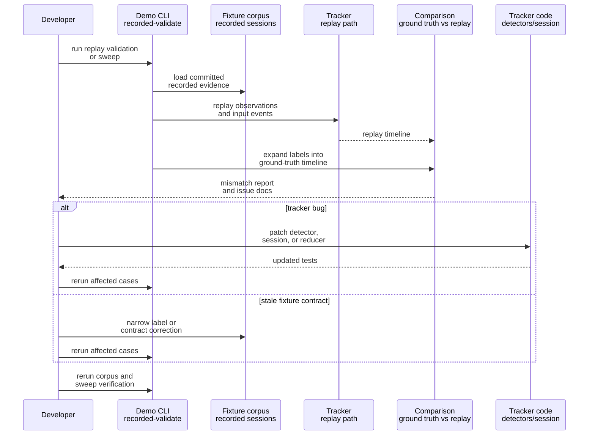

# Plan: Replay Shared TUI Demo and Fix State-Tracking Bugs

## HEADER
- **Purpose**: Use the committed shared TUI demo corpus as a replay harness to find correctness bugs in public tracked-state replay, fix those bugs in the tracker stack, and re-verify the demo corpus and cadence sweeps. This plan assumes the refreshed canonical fixtures are already in place and the next phase is bug-finding and bug-fixing, not fixture authoring.
- **Status**: In Progress (2026-03-22 baseline replay clean; debug-observability gap fixed)
- **Date**: 2026-03-22
- **Dependencies**:
  - `scripts/demo/shared-tui-tracking-demo-pack/README.md`
  - `scripts/demo/shared-tui-tracking-demo-pack/GT_STATE_COMPARISON_CONTRACT.md`
  - `scripts/demo/shared-tui-tracking-demo-pack/demo-config.toml`
  - `src/houmao/demo/shared_tui_tracking_demo_pack/driver.py`
  - `src/houmao/demo/shared_tui_tracking_demo_pack/recorded.py`
  - `src/houmao/demo/shared_tui_tracking_demo_pack/comparison.py`
  - `src/houmao/demo/shared_tui_tracking_demo_pack/sweep.py`
  - `src/houmao/shared_tui_tracking/reducer.py`
  - `src/houmao/shared_tui_tracking/session.py`
  - `src/houmao/shared_tui_tracking/apps/claude_code/`
  - `src/houmao/shared_tui_tracking/apps/codex_tui/`
  - `tests/fixtures/shared_tui_tracking/recorded/`
  - `tests/unit/demo/test_shared_tui_tracking_demo_pack.py`
- **Target**: Shared TUI tracking developers and AI assistants investigating replay correctness regressions in the demo pack.

---

## 1. Purpose and Outcome

The goal is to treat the committed demo corpus as a stable replay-grade regression harness and use it to expose bugs in shared TUI state tracking. Success means replaying the corpus surfaces concrete divergences, those divergences are triaged into tracker bugs versus fixture-contract problems, tracker bugs are fixed in code, and the committed replay checks become clean again under the current demo contract.

The expected output is not new capture data. The output is a set of tracker-side fixes, any narrowly justified fixture-contract corrections if evidence proves a label or contract is stale, updated unit coverage for the bug class, and clean demo verification across strict replay and relevant sweeps. The central question throughout the work is: does the tracker's public state match the human-authored public-state contract for the committed sessions?

## 2. Implementation Approach

### 2.1 High-level flow

1. Start from the committed fixture corpus under `tests/fixtures/shared_tui_tracking/recorded` and run replay validation and sweeps to establish the current failure set.
2. Triage every failing case using the demo artifacts the harness already produces: `comparison.md`, `comparison.json`, `replay_timeline.ndjson`, `groundtruth_timeline.ndjson`, issue docs, and review video when needed.
3. Classify each failure before editing code:
   - tracker bug in detector, reducer, runtime/state merge, or public-state session logic
   - stale fixture contract or label problem
   - sweep-only robustness boundary under the documented `2 Hz` floor
4. Fix tracker bugs in the smallest layer that can honestly explain the divergence:
   - detector logic for surface interpretation
   - session/reducer logic for state transitions and runtime-loss semantics
   - replay/demo glue only when the bug is in replay assembly rather than tracker logic
5. Add or update focused tests for the specific bug class before or alongside the fix so the divergence becomes reproducible without requiring repeated manual inspection of the same fixture.
6. Re-run the affected recorded validations first, then the relevant sweep cases, then the full corpus verification to confirm the fix closes the bug without regressing other transition families.
7. If a failing case proves to be a stale fixture expectation rather than a tracker bug, document the evidence, correct the fixture or contract narrowly, and then rerun the same verification chain.

### 2.2 Investigation boundaries

This pass should prefer replay from committed fixtures over new live capture. New recording should only happen if a replay failure cannot be explained from the existing evidence and the missing evidence blocks a root-cause decision. The default posture is offline investigation from the corpus already committed in the repo.

The demo's public contract remains the authority. Internal detector heuristics, raw pane text, and transient reasoning about what the tool "probably meant" are supporting evidence only. A proposed fix is only valid if it improves agreement with the authored public-state contract or proves the contract itself is stale.

### 2.3 Sequence diagram (steady-state usage)

## 3. Files to Modify or Add

- **context/plans/plan-replay-shared-tui-demo-and-fix-state-tracking-bugs.md** capture the investigation and implementation strategy for this replay-driven bug-fix pass.
- **src/houmao/shared_tui_tracking/session.py** likely touchpoint for public-state transition bugs, turn-result resets, and runtime-loss semantics.
- **src/houmao/shared_tui_tracking/reducer.py** likely touchpoint for replay-specific transition ordering, event draining, and runtime observation integration.
- **src/houmao/shared_tui_tracking/apps/claude_code/profile.py** candidate touchpoint if Claude replay divergences trace back to detector logic.
- **src/houmao/shared_tui_tracking/apps/codex_tui/profile.py** candidate touchpoint if Codex replay divergences trace back to detector logic.
- **src/houmao/shared_tui_tracking/apps/codex_tui/signals/*.py** candidate touchpoints for Codex surface-signal bugs involving ready, active, interrupted, overlays, or error interpretation.
- **src/houmao/demo/shared_tui_tracking_demo_pack/comparison.py** touch only if bug triage shows the mismatch engine itself is misclassifying replay divergence.
- **src/houmao/demo/shared_tui_tracking_demo_pack/groundtruth.py** touch only if replay inputs or label expansion are proven wrong.
- **src/houmao/demo/shared_tui_tracking_demo_pack/sweep.py** candidate touchpoint if a regression is in sweep evaluation rather than the tracker.
- **tests/unit/demo/test_shared_tui_tracking_demo_pack.py** add targeted regression tests for replay, ground-truth expansion, and sweep evaluation.
- **tests/unit/** under tracker modules add detector/session/reducer regression tests close to the fixed layer when practical.
- **tests/fixtures/shared_tui_tracking/recorded/** modify only if evidence proves a committed label or contract is stale rather than the tracker being wrong.
- **scripts/demo/shared-tui-tracking-demo-pack/README.md** update only if the investigation changes operator-facing claims, known boundaries, or debugging workflow.
- **context/logs/** optionally add a short findings log if the replay pass uncovers a non-obvious bug class or a repeated triage pattern worth preserving.

## 4. TODOs (Implementation Steps)

- [x] **Establish the current replay baseline** Run `recorded-validate-corpus` and targeted `recorded-sweep` commands from the committed fixture tree to identify the concrete failing cases and artifact roots for this pass. Result on 2026-03-22: strict corpus replay and the full committed sweep matrix were clean under the current corpus.
- [x] **Triage failures case by case** Inspect `comparison.md`, `comparison.json`, `groundtruth_timeline.ndjson`, `replay_timeline.ndjson`, and issue docs to determine the first real divergence and the likely faulty layer. Result on 2026-03-22: no replay correctness divergence reproduced; the first real blocker was missing debug-log wiring from the demo CLI into tracker logger namespaces.
- [x] **Separate tracker bugs from stale contracts** Record for each failing case whether the evidence points to detector/session/reducer logic, demo replay plumbing, or a stale fixture label/contract. Result on 2026-03-22: no stale fixture contract issue was found in the committed corpus; the confirmed issue was demo replay observability rather than tracked-state correctness.
- [x] **Create focused regression coverage** Add or update small tests that reproduce each bug class close to the layer being fixed rather than relying only on large end-to-end replay checks. Result on 2026-03-22: added unit coverage for demo-driver logging configuration so future replay runs can reliably surface tracker debug evidence.
- [ ] **Fix tracker-side replay bugs** Patch the responsible tracker layer for each confirmed bug and keep the change narrowly scoped to the observed public-state divergence.
- [ ] **Correct stale fixtures only when proven** If a failure is caused by stale labels or contract expectations, update the minimal fixture or config surface needed and document why it is not a tracker bug.
- [ ] **Rerun affected cases immediately** After each fix, rerun the failing recorded validations and any directly related sweeps before moving on to the next bug.
- [ ] **Re-verify the full corpus** Once targeted failures are resolved, rerun corpus validation and the interruption/success/TUI-down sweep set to confirm there are no cross-case regressions.
- [ ] **Refresh docs if behavior claims changed** Update README or contract docs only if the fixes alter documented guarantees, known boundaries, or recommended debugging workflow.

## 5. Verification

- [x] **Corpus replay check** Run `bash scripts/demo/shared-tui-tracking-demo-pack/run_demo.sh recorded-validate-corpus --skip-video` and confirm the committed corpus is clean or that remaining failures are explicitly understood and queued.
- [ ] **Per-bug targeted replay check** Rerun `recorded-validate` for every fixture involved in a fix and confirm mismatch count returns to zero.
- [x] **Sweep regression check** Run `recorded-sweep --sweep capture_frequency` for the affected transition families, especially interruption and TUI-down cases, and confirm contracts still hold at the documented `2 Hz` floor.
- [x] **Unit regression check** Run `pixi run python -m pytest tests/unit/demo/test_shared_tui_tracking_demo_pack.py -q` plus any nearby tracker unit tests added for the bug class.
- [x] **Static quality check** Run `pixi run ruff check` and `pixi run mypy` on the touched tracker/demo modules if code changes are made.
- [x] **Manual artifact sanity check** Inspect at least one final `comparison.md` and one sweep `summary_report.md` for each fixed bug class to confirm the reports tell the same story as the code change.
