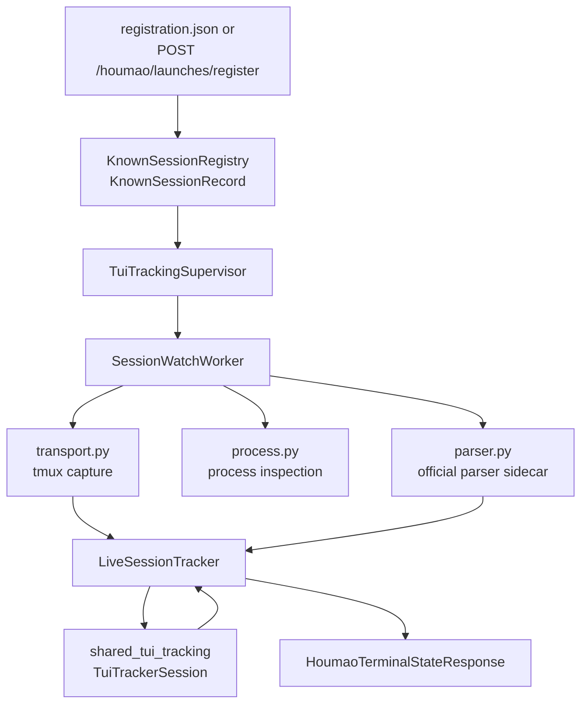

# TUI Tracking Module

`src/houmao/server/tui/` is the server-side watch-plane module for live terminal tracking in `houmao-server`.

It does not define the tracker semantics for `surface`, `turn`, or `last_turn`. Those remain owned by the shared reducer in [`../../../../src/houmao/shared_tui_tracking/`](../../../../src/houmao/shared_tui_tracking/). The server module owns the host-side concerns around that reducer: registration-backed discovery, tmux/process observation, optional parser execution, worker lifecycle, and response assembly.

## Ownership Boundary

The `server/tui` module owns:

- rebuilding the live known-session set from server-owned registration records
- manifest and shared-registry enrichment needed to admit one tracked session
- tmux pane targeting and raw pane capture
- supported-TUI process inspection
- official parser invocation for server-owned evidence
- `LiveSessionTracker`, which feeds raw snapshots and explicit input into the shared tracker and then merges the result with server-owned diagnostics, lifecycle sidecars, stability, and recent history
- supervisor and watch-worker lifecycle for the polling loop

The shared `shared_tui_tracking` module owns:

- app/profile selection
- tool/version detector resolution
- raw-snapshot reduction for tracker-owned `surface`, `turn`, and `last_turn`
- tracker-local settle timing and `surface_inference`

The surrounding server service still owns:

- HTTP routes
- registration persistence under `sessions/<session-name>/registration.json`
- terminal-alias maps and tracker lookup
- integration with managed-agent and child-CAO compatibility surfaces

## Package Map

| File | Main responsibility |
|------|---------------------|
| [`../../../../src/houmao/server/tui/__init__.py`](../../../../src/houmao/server/tui/__init__.py) | Package export surface used by `houmao.server.service` |
| [`../../../../src/houmao/server/tui/registry.py`](../../../../src/houmao/server/tui/registry.py) | Build `KnownSessionRecord` values from registration payloads, manifest metadata, and optional shared-registry enrichment |
| [`../../../../src/houmao/server/tui/transport.py`](../../../../src/houmao/server/tui/transport.py) | Resolve tmux targets and capture pane text |
| [`../../../../src/houmao/server/tui/process.py`](../../../../src/houmao/server/tui/process.py) | Inspect the pane process tree and classify supported TUI presence |
| [`../../../../src/houmao/server/tui/parser.py`](../../../../src/houmao/server/tui/parser.py) | Run the official parser stack and normalize parser-owned sidecar evidence |
| [`../../../../src/houmao/server/tui/tracking.py`](../../../../src/houmao/server/tui/tracking.py) | `LiveSessionTracker` host adapter plus server-owned lifecycle, stability, and recent-transition bookkeeping |
| [`../../../../src/houmao/server/tui/supervisor.py`](../../../../src/houmao/server/tui/supervisor.py) | `TuiTrackingSupervisor` and `SessionWatchWorker` thread orchestration |
| [`../../../../src/houmao/server/tui/turn_signals.py`](../../../../src/houmao/server/tui/turn_signals.py) | Compatibility exports for shared detector/profile types; not the semantic center of live tracking anymore |

## End-To-End Data Flow

One important asymmetry is intentional:

- raw tmux pane text is the authoritative tracker input
- parsed surface is optional server-owned evidence
- explicit input events can also enter the host adapter through `LiveSessionTracker.note_prompt_submission()`

That means parser success is no longer a precondition for tracker-owned `surface`, `turn`, or `last_turn` updates when raw capture exists.

## Identity And Version Flow

The module also owns the live session identity that the shared tracker sees.

The normal flow is:

1. `HoumaoRegisterLaunchRequest` carries `session_name`, `tool`, optional `terminal_id`, optional manifest/session-root metadata, and optional `observed_tool_version`.
2. `known_session_record_from_registration()` in [`../../../../src/houmao/server/tui/registry.py`](../../../../src/houmao/server/tui/registry.py) enriches that payload from the manifest when available.
3. Manifest enrichment prefers `launch_policy_provenance.detected_tool_version`, falls back to `launch_plan.launch_policy_provenance.detected_tool_version`, and then falls back to registration metadata.
4. `KnownSessionRecord.to_identity()` turns the result into `HoumaoTrackedSessionIdentity`.
5. `LiveSessionTracker._ensure_tracker_session_locked()` rebuilds the shared `TuiTrackerSession` whenever the resolved tool family or observed tool version changes.

That rebuild boundary is what lets the live server pick the closest-compatible detector profile instead of treating live sessions as permanently versionless.

## What `tracking.py` Still Owns

`tracking.py` is not just a thin pass-through. It still owns several server-specific behaviors around the shared reducer:

- translating low-level probe/process/parse outcomes into route-facing diagnostics
- running the server-owned ReactiveX readiness and anchored-completion sidecars
- keeping explicit-input lifecycle anchors for `operator_state`, `lifecycle_timing`, and `lifecycle_authority`
- publishing generic visible-state stability and bounded `recent_transitions`
- keeping the live in-memory state thread-safe for route reads and watch-worker updates

The key rule is that these server-owned fields are sidecars. They may explain or contextualize the tracker result, but they do not replace tracker-owned `surface`, `turn`, or `last_turn`.

## Maintenance Checklist

If you are changing this module, start with the smallest owner that should actually change:

- detector semantics or reducer priorities: edit `shared_tui_tracking` first
- manifest/session identity enrichment: edit `server/tui/registry.py`
- tmux target selection or pane capture: edit `server/tui/transport.py`
- parser evidence or parser failure handling: edit `server/tui/parser.py`
- public route payload composition and server-owned sidecars: edit `server/tui/tracking.py` and `server/models.py`
- thread orchestration or session admission/release: edit `server/tui/supervisor.py` and `server/service.py`

The most relevant tests for this package are:

- [`../../../../tests/unit/server/test_tui_registry.py`](../../../../tests/unit/server/test_tui_registry.py)
- [`../../../../tests/unit/server/test_tui_parser_and_tracking.py`](../../../../tests/unit/server/test_tui_parser_and_tracking.py)
- [`../../../../tests/unit/server/test_service.py`](../../../../tests/unit/server/test_service.py)
- [`../../../../tests/workflow/test-agent-gateway-tui-state-tracking.md`](../../../../tests/workflow/test-agent-gateway-tui-state-tracking.md)
