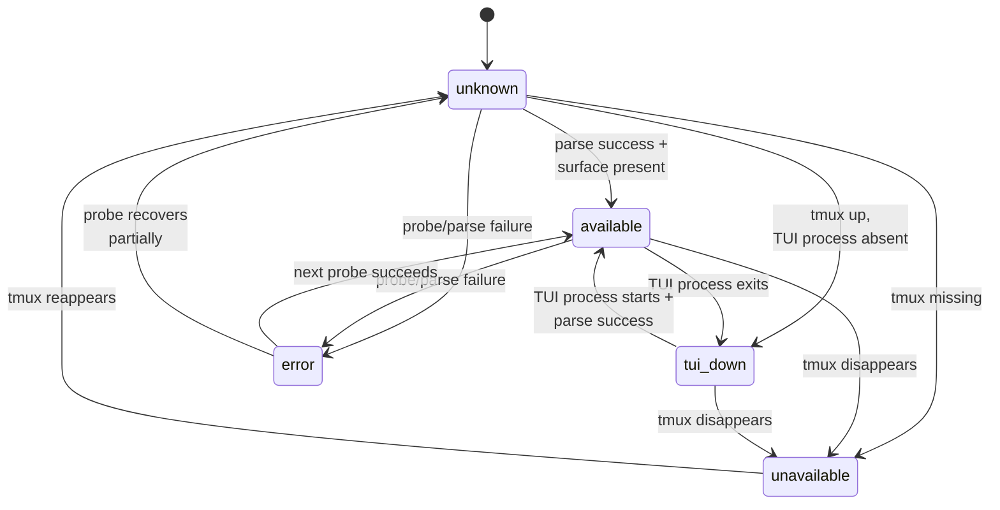
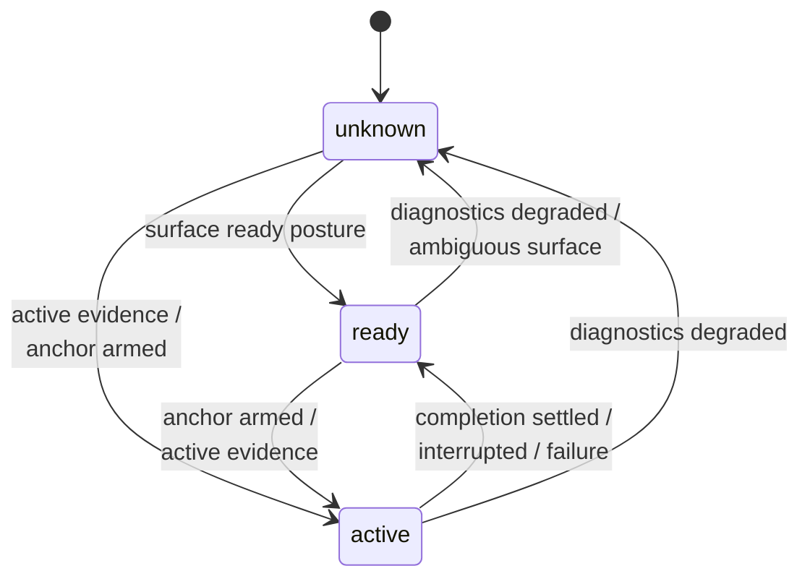
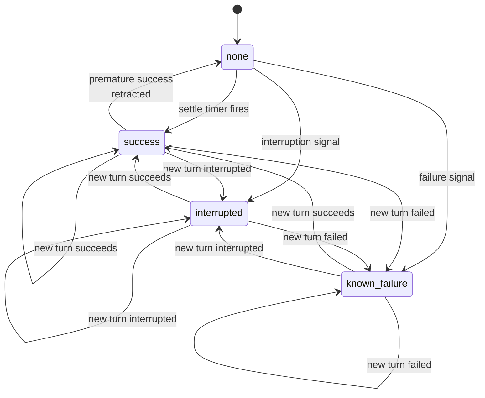

# State Reference Guide

This guide catalogs every public state value exposed by the houmao-server TUI terminal tracking system. It is designed as a standalone reference: each value entry provides an intuitive meaning, its technical derivation, and the operational implications for consumers polling `GET /houmao/terminals/{terminal_id}/state`.

> **Source of truth:** The canonical type definitions live in [`src/houmao/shared_tui_tracking/models.py`](../../../src/houmao/shared_tui_tracking/models.py). The authoritative mapping functions live in [`src/houmao/shared_tui_tracking/public_state.py`](../../../src/houmao/shared_tui_tracking/public_state.py). The server's Pydantic response models in [`src/houmao/server/models.py`](../../../src/houmao/server/models.py) re-export these types for the HTTP API surface. This guide is a human-readable companion, not a replacement for those modules.

## Architecture Note

The public state contract is now centered on one shared tracker engine plus host adapters:

- **`TuiTrackerSession`** in `src/houmao/shared_tui_tracking/session.py` owns raw-snapshot signal detection, internal Rx settle timing, and tracker-owned `surface` / `turn` / `last_turn` reduction.
- **`LiveSessionTracker`** in `src/houmao/server/tui/tracking.py` is the live server host adapter. It feeds raw captured TUI text and explicit input events into the shared session, then merges the resulting tracker state with server-owned diagnostics, lifecycle timing, authority, and visible-stability metadata.
- **`StreamStateReducer`** in `src/houmao/shared_tui_tracking/reducer.py` is now a compatibility wrapper for replay and offline consumers; it no longer owns the core state machine.

**`ManagedAgentTurnPhase` alias:** The server models import `TurnPhase` from `shared_tui_tracking.models` as `ManagedAgentTurnPhase`. This means TUI terminals and managed headless agents share the same turn vocabulary — `ready`, `active`, and `unknown` carry identical semantics regardless of the transport path.

## Detector Families

Surface observables (`accepting_input`, `editing_input`, `ready_posture`) and signal evidence (`active_evidence`, `interrupted`, `known_failure`, `success_candidate`) are produced by tool-specific tracked-TUI profiles. [`src/houmao/shared_tui_tracking/detectors.py`](../../../src/houmao/shared_tui_tracking/detectors.py) now defines the shared contract and compatibility exports, while concrete implementations live under app-owned modules such as [`src/houmao/shared_tui_tracking/apps/codex_tui/`](../../../src/houmao/shared_tui_tracking/apps/codex_tui/).

Three detector families exist:

| Family | Class | Tool | Selection |
|--------|-------|------|-----------|
| `claude_code` (version `2.1.x`) | `ClaudeCodeSignalDetectorV2_1_X` | Claude Code | Best-match by observed CLI version; highest score for `2.1.*`, fallback for other `2.*` |
| `codex_tui` | `CodexTuiSignalDetector` | Codex interactive TUI | Selected when `tool == "codex"` for tracked raw-snapshot TUI sessions |
| `unsupported_tool` | `FallbackTrackedTurnSignalDetector` | All others | Default fallback for unrecognized tools |

The selection entry point remains `select_tracked_turn_signal_detector(tool=..., observed_version=...)`, but it now resolves through the tracker-local app/profile registry with closest-compatible semver-floor matching rather than ad hoc scoring. For `codex_tui`, the resolved profile may also contribute temporal hints from a recent sliding window while keeping the single-snapshot `DetectedTurnSignals` contract intact.

The shipped Codex tracker contract is currently one `codex_tui` v1 profile. Profile-specific frame details such as latest-turn-region signatures remain private to that profile rather than widening the shared normalized signal contract.

**Why this matters:** Different tools yield different `unknown` vs `yes`/`no` distributions for the same underlying conditions. The `unsupported_tool` fallback is intentionally conservative — it produces more `unknown` values because it lacks tool-specific prompt and activity patterns. A `ready_posture=unknown` from an unsupported tool does not mean the same thing as `ready_posture=unknown` from the Claude detector.

---

## `diagnostics.availability`

Type: `TrackedDiagnosticsAvailability` — one of `available`, `unavailable`, `tui_down`, `error`, `unknown`.

This field answers: "Is the current observation sample usable for normal state interpretation?" Only when availability is `available` do the `surface`, `turn`, and `last_turn` groups carry meaningful values.

> See [state-transitions.md § Diagnostics Availability](state-transitions.md#diagnostics-availability) for the full statechart diagram with all transitions.

### `available`

**Intuitive meaning:** The tracked terminal is fully reachable and the parser produced a usable surface. This is the normal operating state.

**Derivation:** `diagnostics_availability()` returns `available` when `parse_status == "parsed"` and `parsed_surface_available` is true — meaning tmux is up, the TUI process is running, and the parser successfully interpreted the captured pane text.

**Operational implications:** All `surface`, `turn`, and `last_turn` values are meaningful. It is safe to poll for turn state and act on the results. Sending input via `POST /houmao/terminals/{terminal_id}/input` is viable (subject to `turn.phase`).

### `unavailable`

**Intuitive meaning:** The tracked tmux session does not exist. The terminal may have been destroyed or was never created.

**Derivation:** Returns `unavailable` when `transport_state == "tmux_missing"`.

**Operational implications:** No tracking is possible. Surface and turn values will be `unknown`/`none`. Do not send input — there is no terminal to receive it. Wait for the tmux session to appear, or investigate whether the session was terminated.

### `tui_down`

**Intuitive meaning:** The tmux session is reachable, but the supported TUI process (e.g., Claude, Codex) is not running inside the tracked pane.

**Derivation:** Returns `tui_down` when `process_state == "tui_down"` and transport is healthy.

**Operational implications:** The pane exists but contains stale scrollback, not a live TUI. Surface and turn values reflect the last captured state before the process exited — treat them as stale. Do not send input. Monitor for the TUI process to restart.

### `error`

**Intuitive meaning:** Something went wrong during the current observation cycle — a probe failure, a parse failure, or an unexpected runtime error.

**Derivation:** Returns `error` when any of `probe_error_present`, `parse_error_present` are true, or when `transport_state`, `process_state`, or `parse_status` indicate a probe or parse error.

**Operational implications:** The current sample is untrustworthy. Surface and turn values may not reflect reality. This is often transient — a single bad cycle. Wait for the next poll cycle and check if the error persists. If it does, inspect `diagnostics.probe_error` and `diagnostics.parse_error` for details.

### `unknown`

**Intuitive meaning:** The server is still watching, but the current sample cannot be confidently classified. This includes situations like unsupported tools where the server has no parser, or partially recovered states.

**Derivation:** Returns `unknown` as the default when none of the more specific conditions match — typically when `process_state == "unsupported_tool"` or `parse_status == "unsupported_tool"`, or when the parse succeeded but no surface was produced.

**Operational implications:** Do not assume the terminal is ready or broken. Surface and turn values are at best approximate. Wait for a more definitive state before taking action.

---

## `surface` Observables

The `surface` group contains three foundational observables that describe what is directly visible in the TUI right now. All three are `Tristate` values: `yes`, `no`, or `unknown`.

These values are **profile-produced** — they come from tool-specific tracked-TUI profile logic, not from the reducer or mapping helpers. Different profile families may produce different tristate distributions for the same underlying TUI conditions.

### `surface.accepting_input`

Whether typed input would currently land in the TUI's prompt area.

#### `yes`

**Intuitive meaning:** The TUI has a visible, active prompt area that will accept typed characters.

**Derivation:** These values are now derived from raw snapshot text by the selected detector profile. For Claude: the detector found a `❯` prompt line. For Codex: the detector found a live `›` prompt without an approval overlay. Fallback detectors remain conservative and may leave the value as `unknown`.

**Operational implications:** Text sent to the tmux pane will reach the prompt. This does not necessarily mean the TUI is *ready for submission* — it may be in an editing state or showing a menu.

#### `no`

**Intuitive meaning:** The TUI's input area is closed or blocked. Typed characters will not reach a prompt.

**Derivation:** Raw-text detector profiles emit `no` when the visible surface clearly blocks prompt input, for example approval prompts, trust dialogs, or other modal overlays. If the detector cannot prove that block from raw text alone, it stays conservative and returns `unknown`.

**Operational implications:** Do not send input. It will not reach the intended prompt. Wait for the input mode to change.

#### `unknown`

**Intuitive meaning:** The detector cannot confidently determine whether input would reach a prompt.

**Derivation:** No prompt was found by the detector, or no parsed surface is available. Common with unsupported tools.

**Operational implications:** Treat as uncertain. Do not assume input will be received. Wait for a more definitive reading.

### `surface.editing_input`

Whether prompt-area input is actively being edited — i.e., there is user-entered text in the prompt.

#### `yes`

**Intuitive meaning:** The prompt area contains user-entered text that has not been submitted.

**Derivation:** For Claude: a `❯` prompt line exists and its text content is non-empty. For Codex: a `›` prompt line exists with non-empty text.

**Operational implications:** A human or automation has typed into the prompt but not yet submitted. Sending additional input may append to or conflict with the existing text.

#### `no`

**Intuitive meaning:** The prompt area is visible but empty — ready for new input.

**Derivation:** For Claude: a `❯` prompt line exists but its text content is empty. For Codex: a `›` prompt line exists with empty text.

**Operational implications:** The prompt is clean and ready for input. This is the expected state before sending a new prompt.

#### `unknown`

**Intuitive meaning:** The detector cannot determine whether text is being edited.

**Derivation:** No prompt was found, the visible surface is ambiguous, or the tool/profile is unsupported.

**Operational implications:** Treat as uncertain.

### `surface.ready_posture`

Whether the visible surface looks ready for an immediate submit — the prompt is visible, the TUI is not actively working, and no ambiguous interactive UI is blocking.

#### `yes`

**Intuitive meaning:** The TUI appears idle with a clean prompt, ready to accept and process a new submission.

**Derivation:** Raw-text detector profiles emit `yes` when a prompt is visible, the surface is not actively working, and no ambiguous overlay is present. Claude and Codex use their own prompt/activity heuristics; fallback profiles stay conservative.

**Operational implications:** The terminal is ready to receive and begin processing a new prompt. This is the ideal state for sending input via `POST /houmao/terminals/{terminal_id}/input`.

#### `no`

**Intuitive meaning:** The TUI is actively working or its input is closed.

**Derivation:** Detector profiles emit `no` when the raw surface clearly shows active work or a blocked prompt. The Claude profile still prefers `unknown` over `no` when the posture is not confidently classifiable.

**Operational implications:** Do not send new prompts. The TUI is either processing a turn or in a state that cannot accept submissions.

#### `unknown`

**Intuitive meaning:** The detector cannot confidently determine whether the TUI is ready for submission.

**Derivation:** Common causes: no prompt is visible, the footer shows an interrupt indicator (suggesting active work), ambiguous interactive UI is present (menus, selection boxes, permission prompts), or the tool is unsupported.

**Operational implications:** Do not assume readiness. Wait for `ready_posture=yes` before sending input.

---

## `turn.phase`

Type: `TurnPhase` (aliased as `ManagedAgentTurnPhase` in server models) — one of `ready`, `active`, `unknown`.

This field answers: "What is the current turn posture?" It is intentionally narrower than the internal reducer graph — ambiguous states collapse into `unknown` rather than exposing implementation-specific phases.

> See [state-transitions.md § Turn Phase](state-transitions.md#turn-phase) for the full statechart diagram with all transitions.

### `ready`

**Intuitive meaning:** The TUI appears ready for another turn — no active work is in progress, and the surface looks ready for submission.

**Derivation:** The standalone tracker session returns `ready` when the current raw surface is classified as ready and there is no stronger active or ambiguous evidence. The live server publishes that tracker-owned turn posture together with separate server-owned diagnostics and lifecycle metadata.

**Operational implications:** It is safe to send a new prompt via `POST /houmao/terminals/{terminal_id}/input`. The terminal is idle and waiting for the next instruction.

### `active`

**Intuitive meaning:** A turn is currently in flight — the agent is working on a prompt.

**Derivation:** The standalone tracker session returns `active` when explicit input has armed tracker authority or when the detector reports active evidence such as thinking lines, tool activity, or interruptable work footers.

**Operational implications:** Do not send new input — the agent is processing the current prompt. Poll for turn completion. You may observe `last_turn.result` changing to `success`, `interrupted`, or `known_failure` when the turn ends.

### `unknown`

**Intuitive meaning:** The system cannot confidently classify the posture as ready or active.

**Derivation:** Returns `unknown` when: (1) diagnostics availability is `error`, `tui_down`, or `unavailable`; (2) the detector reports `ambiguous_interactive_surface` (menus, permission dialogs, slash commands); or (3) neither ready nor active evidence is present.

**Operational implications:** Do not assume the terminal is ready. Wait for the state to resolve to `ready` or `active`. If it persists, check `diagnostics.availability` for underlying issues.

---

## `last_turn.result`

Type: `TrackedLastTurnResult` — one of `success`, `interrupted`, `known_failure`, `none`.

This field answers: "What was the outcome of the most recent completed turn?" It is **sticky** — it only updates when a tracked turn reaches a terminal outcome, not on every poll cycle.

> See [state-transitions.md § Last-Turn Result](state-transitions.md#last-turn-result) for the full statechart diagram with all transitions.

### `success`

**Intuitive meaning:** The most recent turn completed successfully — the agent produced an answer and the surface returned to a ready posture.

**Derivation:** The reducer arms a success timer when the detector reports `success_candidate`. If the surface remains stable through the settle window (no further changes, no errors, no interruptions), the timer fires and promotes the result to `success`. The signature of the success surface is recorded so a later change to the same surface can retract a premature success.

**Operational implications:** The turn is done. Check `stability.stable_for_seconds` to confirm the result is settled. You can send a new prompt. Note: a premature success may be retracted if the surface proves to still be evolving within the same anchor — always verify stability before acting.

### `interrupted`

**Intuitive meaning:** The most recent turn was interrupted — the user or system halted the agent's work before completion.

**Derivation:** The detector saw a tool-specific interruption signature (e.g., Claude's `⎿ Interrupted · What should Claude do instead?` pattern followed by a prompt, or Codex's interruption text). The reducer immediately promotes to `interrupted` and cancels any pending success timer.

**Operational implications:** The agent stopped before completing. The prompt is typically ready for a new instruction. Previous partial work may be visible in the TUI output.

### `known_failure`

**Intuitive meaning:** The most recent turn ended with a recognized failure — the agent encountered a supported error pattern.

**Derivation:** The detector saw a tool-specific failure signature (e.g., Claude's colored error status line followed by a prompt). The reducer immediately promotes to `known_failure` and cancels any pending success timer.

**Operational implications:** The turn failed. Inspect the TUI output for error details. The prompt is typically ready for a retry or a different instruction.

### `none`

**Intuitive meaning:** No terminal turn result has been recorded yet — the tracker is in its initial state or a premature success was retracted.

**Derivation:** This is the initial value. It also reappears if a previously recorded `success` is invalidated because the surface changed after the settle window (the success was premature).

**Operational implications:** No completed turn to act on. Wait for a turn to complete.

---

## `last_turn.source`

Type: `TrackedLastTurnSource` — one of `explicit_input`, `surface_inference`, `none`.

This field answers: "How was the most recent completed turn initiated?"

### `explicit_input`

**Intuitive meaning:** The turn was initiated through the server API — a consumer sent input via `POST /houmao/terminals/{terminal_id}/input` and the server armed an explicit turn anchor.

**Derivation:** The standalone tracker returns `explicit_input` when the most recent terminal outcome is still attributed to an explicit `on_input_submitted()` event.

**Operational implications:** The server has full lifecycle authority over this turn. Settle guarantees are tighter because the exact submission timestamp is known.

### `surface_inference`

**Intuitive meaning:** The turn was inferred from direct tmux interaction — someone typed into the TUI directly (bypassing the server API), and the tracker inferred a new turn from surface changes.

**Derivation:** The standalone tracker returns `surface_inference` when it had to infer turn ownership from raw-surface activity rather than from an explicit input event.

**Operational implications:** The server did not initiate this turn, so it has less precise timing. Settle times may be slightly longer because the exact submission moment is estimated from surface changes rather than known precisely.

### `none`

**Intuitive meaning:** No turn source has been recorded — the tracker is in its initial state.

**Derivation:** This is the initial value, paired with `last_turn.result=none`.

**Operational implications:** No completed turn to attribute. Wait for a turn to complete.
