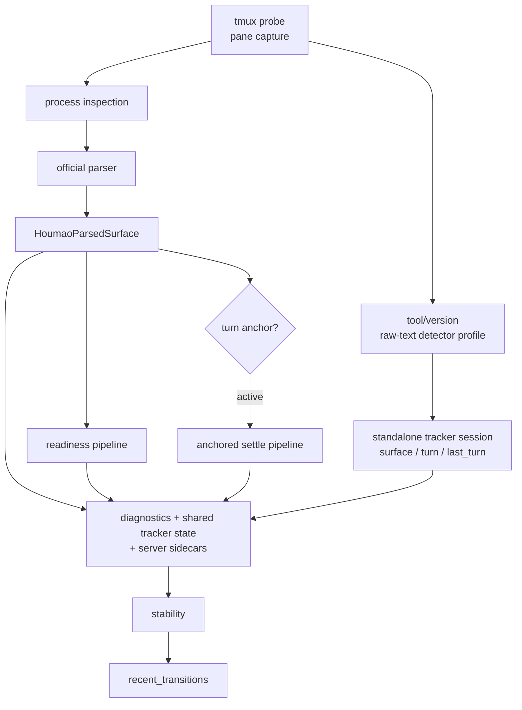

# Houmao Server State Tracking

`houmao-server` owns the public tracked-state contract for supported interactive TUIs, but it is no longer always the component that runs the live tracker. Clients and dashboards consume `HoumaoTerminalStateResponse`; they do not run a second reducer. Interactive Codex tracking now resolves through the `codex_tui` tracked-TUI family, while headless backend names such as `codex_app_server` remain outside this subsystem.

There are now two live-tracking execution modes behind the same public models:

- Direct fallback: `houmao-server` runs the tracker locally for eligible managed TUI sessions.
- Gateway-owned tracking: an attached healthy per-agent gateway runs the live tracker for that one session, and `houmao-server` projects the gateway state back through the same server routes.

This keeps one public state contract while enforcing single-owner tracking authority during attach, detach, and gateway health transitions.

The public models live in [`src/houmao/server/models.py`](../../../src/houmao/server/models.py), which re-exports core types from [`src/houmao/shared_tui_tracking/models.py`](../../../src/houmao/shared_tui_tracking/models.py). The standalone tracker engine now lives in [`src/houmao/shared_tui_tracking/session.py`](../../../src/houmao/shared_tui_tracking/session.py), while [`src/houmao/server/tui/tracking.py`](../../../src/houmao/server/tui/tracking.py) acts as the live host adapter that merges shared tracker state with server-owned diagnostics and lifecycle metadata. Timed readiness and completion behavior still reuse the shared ReactiveX lifecycle kernel in [`src/houmao/lifecycle/rx_lifecycle_kernel.py`](../../../src/houmao/lifecycle/rx_lifecycle_kernel.py). For the file-by-file package layout of the server watch plane, see [internals/tui_tracking_module.md](internals/tui_tracking_module.md).

## Public Contract

> For the full definition of each state value (intuitive meaning, technical derivation, operational implications), see the [State Reference Guide](state-reference.md). For state transition diagrams and operation acceptability, see the [State Transitions Guide](state-transitions.md).

The public state is intentionally small:

| Field | Values | Meaning |
|-------|--------|---------|
| `diagnostics.availability` | `available`, `unavailable`, `tui_down`, `error`, `unknown` | Whether the current sample is usable for normal tracked-state interpretation |
| `surface.accepting_input` | `yes`, `no`, `unknown` | Whether typed input would currently land in the prompt area |
| `surface.editing_input` | `yes`, `no`, `unknown` | Whether prompt-area input is actively being edited now |
| `surface.ready_posture` | `yes`, `no`, `unknown` | Whether the visible surface looks ready for immediate submit |
| `turn.phase` | `ready`, `active`, `unknown` | Current turn posture |
| `last_turn.result` | `success`, `interrupted`, `known_failure`, `none` | Most recent completed terminal outcome |
| `last_turn.source` | `explicit_input`, `surface_inference`, `none` | Where that recorded terminal turn came from |
| `chat_context` | `current`, `degraded`, `unknown` | Whether the current chat context is healthy, recoverably degraded, or unknown |
| `stability` | `signature`, `stable`, `stable_for_seconds`, `stable_since_utc` | Generic visible-state stability for the published response |
| `recent_transitions` | bounded list of `HoumaoRecentTransition` | Recent visible state changes kept in memory for diagnostics |

Low-level observation detail still remains available alongside the simplified model:

- `transport_state`
- `process_state`
- `parse_status`
- optional `probe_error`
- optional `parse_error`
- nullable `parsed_surface`
- optional `probe_snapshot`
- tracked-session metadata such as `tracked_session.observed_tool_version`

Server-owned lifecycle sidecars still remain available for consumers that need timing or authority detail:

- `operator_state`
- `lifecycle_timing`
- `lifecycle_authority`

`lifecycle_timing` now includes the configured stale-active and final stable-active recovery windows in addition to readiness unknown and anchored completion timing.

Those lower-level fields are diagnostic evidence, not the primary consumer-facing lifecycle vocabulary.

## End-To-End Flow

> A more detailed state composition flowchart reflecting the `shared_tui_tracking/` module extraction is maintained in [state-transitions.md § State Composition](state-transitions.md#state-composition).

One tracking cycle moves through these layers:



`LiveSessionTracker.record_cycle()` keeps the internal timing and anchor bookkeeping, but it now maps those internals into the simplified public contract rather than exposing readiness/completion/authority terms directly. The standalone tracker session may combine single-snapshot detector output with profile-owned temporal hints over a recent sliding window before those public fields are published.

## Mapping Rules

### Diagnostics

`diagnostics.availability` is derived from the low-level observation outcome:

- `error`: probe or parse failed for this sample
- `unavailable`: tracked tmux target is gone
- `tui_down`: tmux is reachable but the supported TUI process is not running
- `available`: parser produced a supported parsed surface
- `unknown`: the server is still watching, but the sample is not classifiable confidently enough for normal interpretation

### Foundational Surface Observables

`surface.accepting_input`, `surface.editing_input`, and `surface.ready_posture` are built from raw tmux pane text through the shared tracker’s tool/version detector profile. Parsed surface data is published as server-owned sidecar evidence and does not feed tracker authority.

Important consequences:

- progress indicators are supporting evidence only; they are not required for `turn.phase=active`
- ambiguous interactive UI such as menus, selection boxes, permission prompts, or slash-command pickers degrades to `unknown` unless stronger active or terminal evidence exists
- unexplained churn may still change diagnostics, surface observables, stability, or transitions without creating a turn
- full tmux scrollback may still be captured for parser and history use, but current activity cues do not have to trust arbitrary historical rows

For Codex, the tracker intentionally splits the surface into two scopes:

- the prompt-scoped latest-turn region for interruption, success context, and temporal transcript growth
- the live-edge tail for current status-row and tool-cell activity

That split prevents stale historical `• Working (... esc to interrupt)` rows far above the prompt from pinning `turn.phase=active` when the current surface is already prompt-ready.

Prompt-adjacent Codex compact/server error cells are recoverable degraded-context evidence. They set current-error diagnostics and block success candidacy for that surface, but they do not force prompt readiness away from ready when the prompt/composer facts are otherwise ready. Historical compact/server error cells in long scrollback do not affect current `chat_context`.

### Turn Phase

`turn.phase` is intentionally narrower than the internal reducer graph:

- `ready`: the surface looks ready for another turn now
- `active`: there is enough evidence that a turn is currently in flight
- `unknown`: the server cannot safely classify the posture as `ready` or `active`

Explicit server-owned input acceptance is enough to arm an active turn immediately. Direct interactive prompting can still become `active` through shared-tracker raw-snapshot evidence without any parser-derived bridge.

There are two host-owned corrections on top of the shared tracker. The narrow stale-active correction clears an unanchored session after it stays submit-ready for the configured stale-active recovery window while the shared tracker is still stuck on stale `status_row` evidence. The final stable-active correction uses a longer default 20-second window and clears a stable false-active posture when raw TUI evidence and published state stop changing while independent parser evidence still says the prompt is idle/freeform and input-ready. These recoveries:

- require parsed submit-ready posture plus `surface.accepting_input=yes` and `surface.editing_input=no`
- keep the 5-second narrow recovery limited to unanchored stale `status_row` evidence
- allow the final 20-second recovery to correct `surface.ready_posture=no`
- stop anchored completion monitoring when final recovery expires a stale active anchor
- do not manufacture `last_turn.result=success`
- preserve recoverable error diagnostics such as `chat_context=degraded` when recovery corrects a false active state

### Last Turn

`last_turn` is sticky and only changes when a tracked turn reaches a terminal outcome:

- `success`: the latest answer-bearing ready surface passed the settle window and has no current interrupt, failure, or advisory blocker
- `interrupted`: the detector saw a supported current interruption signature
- `known_failure`: the detector saw a specifically supported failure signature
- `none`: no terminal result has been recorded yet

Two clarifications matter:

- success does not require a `Worked for <duration>`-style marker on every turn
- a premature success may be retracted if a later observation proves the same turn surface was still evolving; the tracker keeps the success anchor alive briefly to allow that correction before expiry

## Turn Sources And Server Anchors

The public `last_turn.source` field and the server-owned lifecycle anchor state are related, but they are not the same thing.

The shared tracker can publish two turn sources:

| Source | How it is armed | Public source |
|--------|-----------------|---------------|
| `terminal_input` | `POST /houmao/terminals/{terminal_id}/input` succeeds and the service calls `note_prompt_submission()` | `explicit_input` |
| `surface_inference` | raw tmux snapshots show enough active/success evidence for the shared tracker to infer a direct in-terminal turn | `surface_inference` |

Separately, the server still owns explicit-input lifecycle anchors for parser-fed `operator_state`, `lifecycle_timing`, and `lifecycle_authority`.

- `explicit_input` can arm both the shared tracker and the server-owned lifecycle anchor.
- `surface_inference` is tracker-owned only. It can produce public `last_turn.source=surface_inference` while server-owned `lifecycle_authority.turn_anchor_state` remains `absent`.
- Parser-derived surface churn does not arm tracker authority. Parsed surface remains server-owned evidence and lifecycle input only.
- Observed tool version for tracker profile selection comes from tracked-session metadata, primarily manifest launch-policy provenance with graceful fallback when unavailable.

## Stability And Recent Transitions

`stability` is generic visible-state stability, not public completion vocabulary.

The stability signature includes:

- diagnostics
- parsed surface
- foundational surface observables
- public `turn`
- public `last_turn`

Any change resets `stable_since_utc` and `stable_for_seconds`.

`recent_transitions` is a bounded in-memory change log. It now records public transition facts such as:

- `diagnostics_availability`
- `surface_accepting_input`
- `surface_editing_input`
- `surface_ready_posture`
- `turn_phase`
- `last_turn_result`
- `last_turn_source`

The low-level transport/process/parse fields remain attached for debugging and coarse managed-agent availability projection.

Because stale-active and final stable-active recovery change the published `surface` / `turn` fields, they also reset visible-state stability just like any other public-state change.

## Maintainer Validation

Maintainer-facing validation is replay-grade and content-first:

```text
live tmux pane + runtime liveness
            |
            v
   content-first groundtruth
            ^
            | compare
     ReactiveX replay reducer
```

Use the `scripts/explore/claude-code-state-tracking/` workflow to compare groundtruth against replayed observations. When detector behavior is refined, capture the stable matcher change in `openspec/changes/.../tui-signals/` rather than leaving it implicit in code alone.
