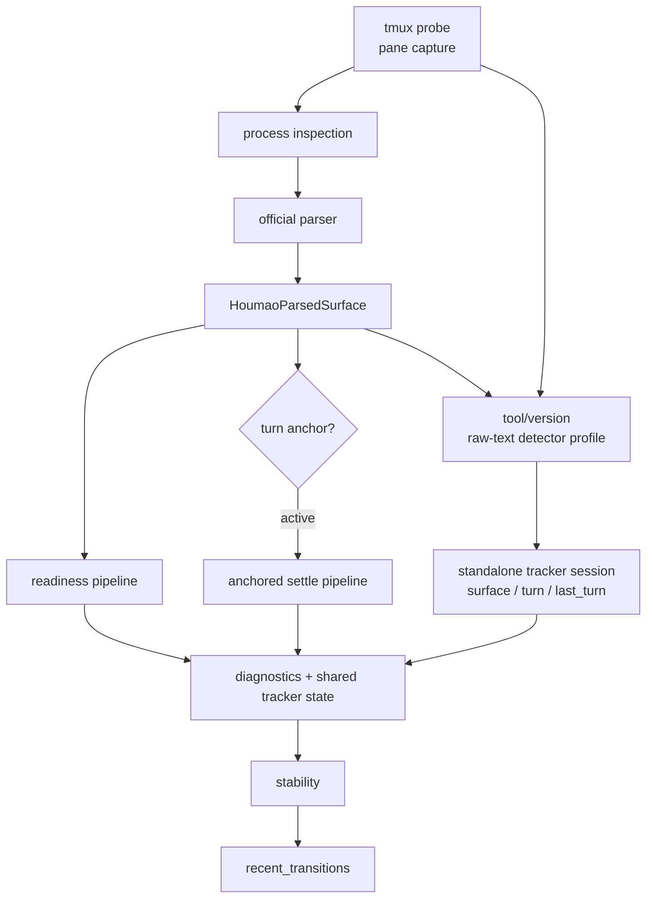

# Houmao Server State Tracking

`houmao-server` owns live tracked state for supported interactive TUIs. Clients, dashboards, and demo packs consume `HoumaoTerminalStateResponse`; they do not run a second reducer. Interactive Codex tracking now resolves through the `codex_tui` tracked-TUI family, while headless backend names such as `codex_app_server` remain outside this subsystem.

The public models live in [`src/houmao/server/models.py`](../../../src/houmao/server/models.py), which re-exports core types from [`src/houmao/shared_tui_tracking/models.py`](../../../src/houmao/shared_tui_tracking/models.py). The standalone tracker engine now lives in [`src/houmao/shared_tui_tracking/session.py`](../../../src/houmao/shared_tui_tracking/session.py), while [`src/houmao/server/tui/tracking.py`](../../../src/houmao/server/tui/tracking.py) acts as the live host adapter that merges shared tracker state with server-owned diagnostics and lifecycle metadata. Timed readiness and completion behavior still reuse the shared ReactiveX lifecycle kernel in [`src/houmao/lifecycle/rx_lifecycle_kernel.py`](../../../src/houmao/lifecycle/rx_lifecycle_kernel.py).

## Public Contract

> For the full definition of each state value (intuitive meaning, technical derivation, operational implications), see the [State Reference Guide](state-reference.md). For state transition diagrams and operation acceptability, see the [State Transitions Guide](state-transitions.md).

The public state is intentionally small:

| Field | Values | Meaning |
|-------|--------|---------|
| `diagnostics.availability` | `available`, `unavailable`, `tui_down`, `error`, `unknown` | Whether the current sample is usable for normal tracked-state interpretation |
| `surface.accepting_input` | `yes`, `no`, `unknown` | Whether typed input would currently land in the prompt area |
| `surface.editing_input` | `yes`, `no`, `unknown` | Whether prompt-area input is actively being edited now |
| `surface.ready_posture` | `yes`, `no`, `unknown` | Whether the visible surface looks ready for immediate submit |
| `turn.phase` | `ready`, `active`, `unknown` | Current turn posture |
| `last_turn.result` | `success`, `interrupted`, `known_failure`, `none` | Most recent completed terminal outcome |
| `last_turn.source` | `explicit_input`, `surface_inference`, `none` | Where that recorded terminal turn came from |
| `stability` | `signature`, `stable`, `stable_for_seconds`, `stable_since_utc` | Generic visible-state stability for the published response |
| `recent_transitions` | bounded list of `HoumaoRecentTransition` | Recent visible state changes kept in memory for diagnostics |

Low-level observation detail still remains available alongside the simplified model:

- `transport_state`
- `process_state`
- `parse_status`
- optional `probe_error`
- optional `parse_error`
- nullable `parsed_surface`
- optional `probe_snapshot`

Those lower-level fields are diagnostic evidence, not the primary consumer-facing lifecycle vocabulary.

## End-To-End Flow

> A more detailed state composition flowchart reflecting the `shared_tui_tracking/` module extraction is maintained in [state-transitions.md § State Composition](state-transitions.md#state-composition).

One tracking cycle moves through these layers:



`LiveSessionTracker.record_cycle()` keeps the internal timing and anchor bookkeeping, but it now maps those internals into the simplified public contract rather than exposing readiness/completion/authority terms directly. The standalone tracker session may combine single-snapshot detector output with profile-owned temporal hints over a recent sliding window before those public fields are published.

## Mapping Rules

### Diagnostics

`diagnostics.availability` is derived from the low-level observation outcome:

- `error`: probe or parse failed for this sample
- `unavailable`: tracked tmux target is gone
- `tui_down`: tmux is reachable but the supported TUI process is not running
- `available`: parser produced a supported parsed surface
- `unknown`: the server is still watching, but the sample is not classifiable confidently enough for normal interpretation

### Foundational Surface Observables

`surface.accepting_input`, `surface.editing_input`, and `surface.ready_posture` are built from the tool detector plus the parsed surface.

Important consequences:

- progress indicators are supporting evidence only; they are not required for `turn.phase=active`
- ambiguous interactive UI such as menus, selection boxes, permission prompts, or slash-command pickers degrades to `unknown` unless stronger active or terminal evidence exists
- unexplained churn may still change diagnostics, surface observables, stability, or transitions without creating a turn

### Turn Phase

`turn.phase` is intentionally narrower than the internal reducer graph:

- `ready`: the surface looks ready for another turn now
- `active`: there is enough evidence that a turn is currently in flight
- `unknown`: the server cannot safely classify the posture as `ready` or `active`

Explicit server-owned input acceptance is enough to arm an active turn immediately. Direct interactive prompting can still become `active` through guarded surface inference plus later turn evidence.

### Last Turn

`last_turn` is sticky and only changes when a tracked turn reaches a terminal outcome:

- `success`: the latest answer-bearing ready surface passed the settle window and has no current interrupt, failure, or advisory blocker
- `interrupted`: the detector saw a supported current interruption signature
- `known_failure`: the detector saw a specifically supported failure signature
- `none`: no terminal result has been recorded yet

Two clarifications matter:

- success does not require a `Worked for <duration>`-style marker on every turn
- a premature success may be retracted if a later observation proves the same turn surface was still evolving; the tracker keeps the success anchor alive briefly to allow that correction before expiry

## Turn Anchors

The tracker still uses anchors internally, but they are now an implementation detail behind the public turn model.

Anchors are armed from two sources:

| Source | How it is armed | Public source |
|--------|-----------------|---------------|
| `terminal_input` | `POST /houmao/terminals/{terminal_id}/input` succeeds and the service calls `note_prompt_submission()` | `explicit_input` |
| `surface_inference` | direct interactive tmux input changed the surface enough that the tracker can safely infer a submitted turn | `surface_inference` |

The guarded `surface_inference` path is intentionally narrow. The tracker requires:

1. no active anchor
2. a previous parsed surface
3. the previous surface was submit-ready
4. the previous visible state was already stable
5. the current projection materially grew relative to the previous one

This keeps repaint churn, cursor motion, and small prompt edits from manufacturing turn semantics.

## Stability And Recent Transitions

`stability` is generic visible-state stability, not public completion vocabulary.

The stability signature includes:

- diagnostics
- parsed surface
- foundational surface observables
- public `turn`
- public `last_turn`

Any change resets `stable_since_utc` and `stable_for_seconds`.

`recent_transitions` is a bounded in-memory change log. It now records public transition facts such as:

- `diagnostics_availability`
- `surface_accepting_input`
- `surface_editing_input`
- `surface_ready_posture`
- `turn_phase`
- `last_turn_result`
- `last_turn_source`

The low-level transport/process/parse fields remain attached for debugging and coarse managed-agent availability projection.

## Maintainer Validation

Maintainer-facing validation is replay-grade and content-first:

```text
live tmux pane + runtime liveness
            |
            v
   content-first groundtruth
            ^
            | compare
     ReactiveX replay reducer
```

Use the `scripts/explore/claude-code-state-tracking/` workflow to compare groundtruth against replayed observations. When detector behavior is refined, capture the stable matcher change in `openspec/changes/.../tui-signals/` rather than leaving it implicit in code alone.
