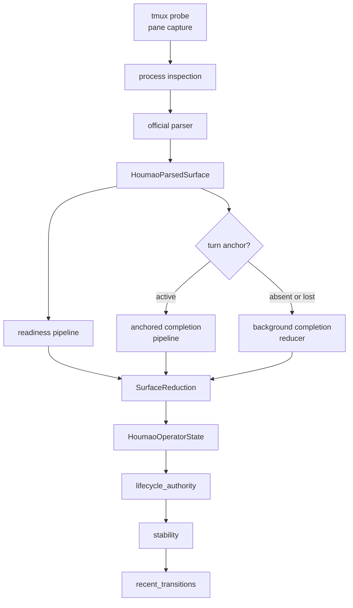
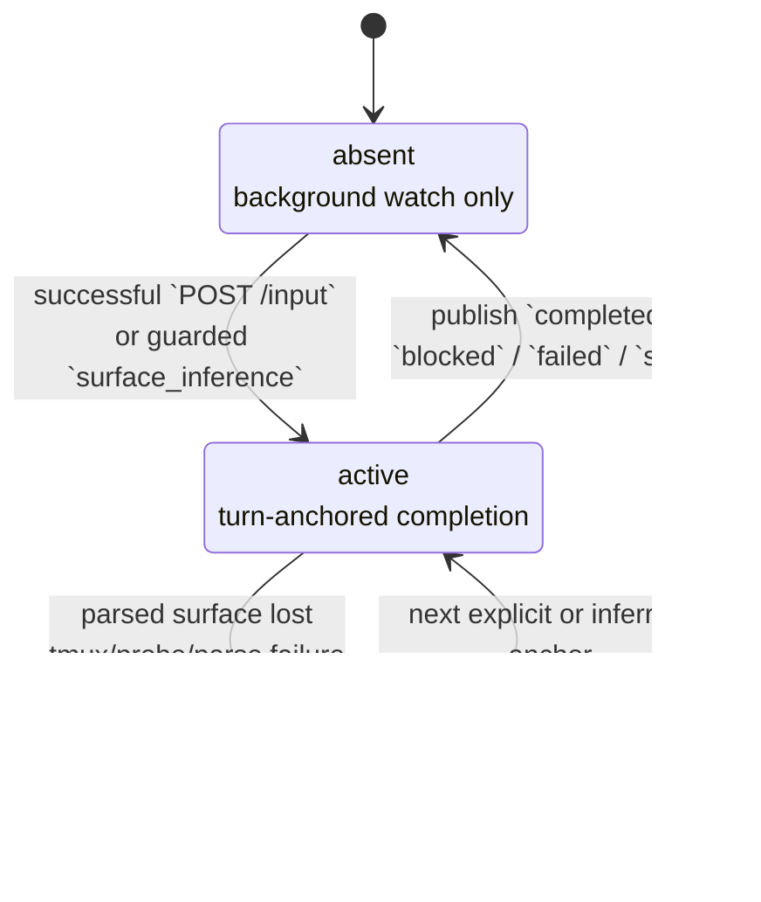

# Houmao Server State Tracking

`houmao-server` owns live tracked state for supported interactive TUIs. Clients, dashboards, and demo packs consume `HoumaoTerminalStateResponse`; they do not run a second lifecycle reducer.

The public models live in [`src/houmao/server/models.py`](../../src/houmao/server/models.py). The core implementation is `LiveSessionTracker` in [`src/houmao/server/tui/tracking.py`](../../src/houmao/server/tui/tracking.py). Anchored readiness and completion timing reuse the shared ReactiveX kernel in [`src/houmao/lifecycle/rx_lifecycle_kernel.py`](../../src/houmao/lifecycle/rx_lifecycle_kernel.py).

## End-To-End Flow

One tracking cycle moves through these layers:

In code, this flow is driven by `LiveSessionTracker.record_cycle()`. Each cycle:

1. Records direct observation state: tmux transport, process inspection, parser outcome, and optional parsed surface.
2. Emits one `LifecycleObservation` into the shared readiness pipeline whenever a parsed surface exists.
3. Uses either the anchored completion pipeline or the conservative background reducer for completion state.
4. Builds the public `operator_state`, `lifecycle_timing`, `lifecycle_authority`, `stability`, and `recent_transitions` payloads.

## Core Definitions

These definitions are exact and are reused across the tracker and the shared lifecycle kernel.

| Term | Exact rule |
|------|------------|
| `submit_ready` | `availability == "supported" and business_state == "idle" and input_mode == "freeform"` |
| `operator_blocked` | `availability == "supported" and business_state == "awaiting_operator"` |
| `unknown_for_stall` | `availability == "unknown"` or `availability == "supported" and business_state == "unknown"` |
| `post_submit_activity` | `saw_working or saw_projection_change` inside one anchored completion cycle |
| `projection_changed` | In anchored mode, whether the normalized projection changed relative to the anchor baseline; in background mode this stays `False` |
| visible stability | Whether the full operator-visible response signature has remained unchanged for `stability_threshold_seconds` |

Two details matter for subtle cases:

- `input_mode == "unknown"` by itself does not enter the unknown-to-stalled path if `business_state` is still known.
- `baseline_invalidated` can freeze the effective projection key inside an anchored cycle so later comparisons stop using the original anchor baseline when the parser says the earlier baseline is no longer valid.

## Public State Axes

`HoumaoTerminalStateResponse` intentionally exposes multiple layers instead of collapsing everything into one status string.

| Axis | Values | Meaning |
|------|--------|---------|
| `transport_state` | `tmux_up`, `tmux_missing`, `probe_error` | Whether tmux capture succeeded and the tracked pane still exists |
| `process_state` | `tui_up`, `tui_down`, `unsupported_tool`, `probe_error`, `unknown` | What the live process inspection says about the tracked pane |
| `parse_status` | `parsed`, `skipped_tui_down`, `unsupported_tool`, `transport_unavailable`, `probe_error`, `parse_error` | Parser outcome for the current cycle |
| `operator_state.status` | `ready`, `processing`, `waiting_user_answer`, `completed`, `tui_down`, `unavailable`, `error`, `unknown` | Operator-facing summary derived from the lower-level axes plus lifecycle reduction |
| `operator_state.readiness_state` | `ready`, `waiting`, `blocked`, `failed`, `unknown`, `stalled` | Shared readiness classification |
| `operator_state.completion_state` | `inactive`, `in_progress`, `candidate_complete`, `completed`, `waiting`, `blocked`, `failed`, `unknown`, `stalled` | Completion classification, with stronger states available only while turn-anchored |
| `lifecycle_authority.completion_authority` | `turn_anchored`, `unanchored_background` | Whether completion semantics are driven by an explicit or inferred turn anchor |
| `lifecycle_authority.turn_anchor_state` | `active`, `absent`, `lost` | Whether an anchor is armed, not present, or was lost before terminal completion |
| `stability` | `signature`, `stable`, `stable_for_seconds`, `stable_since_utc` | Generic visible-state stability, separate from completion timing |
| `recent_transitions` | bounded list of `HoumaoRecentTransition` | Recent visible state changes kept in memory for diagnostics |

## Initial State

When a tracked session is first admitted, the tracker publishes an explicit initial state instead of leaving the terminal state absent.

| Field | Initial value |
|-------|---------------|
| `transport_state` | `tmux_missing` |
| `process_state` | `unknown` |
| `parse_status` | `transport_unavailable` |
| `operator_state.status` | `unknown` |
| `operator_state.readiness_state` | `unknown` |
| `operator_state.completion_state` | `inactive` |
| `operator_state.detail` | `Live tracking has not recorded an observation yet.` |
| `lifecycle_authority.completion_authority` | `unanchored_background` |
| `lifecycle_authority.turn_anchor_state` | `absent` |
| `stability.stable` | `False` |
| `stability.stable_for_seconds` | `0.0` |
| `recent_transitions` | empty list |

This means “the tracker exists, but no successful live observation has been recorded yet.”

## Turn Anchor Lifecycle

Completion can be authoritative only when the tracker has a turn anchor.

`LiveSessionTracker` arms anchors from two sources:

| Source | How it is armed | Why it exists |
|--------|-----------------|---------------|
| `terminal_input` | `POST /terminals/{terminal_id}/input` succeeds, `app.py` calls `service.note_prompt_submission()`, and the tracker arms one anchor | This is the authoritative server-owned input path |
| `surface_inference` | Direct interactive tmux input changed the surface enough that the tracker can safely infer a turn started | This repairs the common “typed directly into tmux” path without requiring every prompt to flow through the HTTP input route |

The guarded `surface_inference` path is intentionally narrow. The tracker infers an anchor only when all of these are true:

1. No active anchor exists.
2. A previous parsed surface exists.
3. The previous surface was `submit_ready`.
4. The previous visible state was already stable.
5. The current normalized projection differs from the previous one.
6. The growth is material: at least `48` added characters or at least `2` added lines.

This is why idle UI repaint churn or tiny prompt-line edits do not create false completion cycles.

## Readiness Reduction

Readiness is always fed from parsed observations. It does not require an anchor.

The shared readiness pipeline classifies each observation in this priority order:

| Priority | Condition | Result |
|----------|-----------|--------|
| 1 | `availability in {"unsupported", "disconnected"}` | `failed` |
| 2 | `operator_blocked` | `blocked` |
| 3 | `unknown_for_stall` | `unknown`, then `stalled` if the unknown timeout elapses |
| 4 | `submit_ready` | `ready` |
| 5 | anything else | `waiting` |

Important timing rules:

- The unknown timer runs only while the current classification is `unknown`.
- Any known observation cancels the pending stall timer.
- `stalled` is not a parser state; it is a timing state emitted by the shared kernel after `unknown_to_stalled_timeout_seconds`.

## Completion Reduction

Completion splits into two modes.

### Background Completion

When `completion_authority == "unanchored_background"`, the tracker stays conservative and refuses to claim `candidate_complete` or `completed`.

The background reducer is exact:

| Rule order | Condition | Result |
|------------|-----------|--------|
| 1 | `readiness_state == "failed"` | `failed` |
| 2 | `readiness_state == "blocked"` | `blocked` |
| 3 | `readiness_state == "unknown"` | `unknown` |
| 4 | `readiness_state == "stalled"` | `stalled` |
| 5 | `business_state == "working"` | `in_progress` |
| 6 | `submit_ready` | `inactive` |
| 7 | anything else | `waiting` |

This means a passive background watch can still report `processing`, `blocked`, `failed`, `unknown`, or `stalled`, but it intentionally suppresses authoritative completion.

### Anchored Completion

When `completion_authority == "turn_anchored"`, the tracker uses the shared anchored completion pipeline. That pipeline accumulates post-submit evidence and can emit `candidate_complete` or `completed`.

Anchored classification order is:

| Priority | Condition | Result |
|----------|-----------|--------|
| 1 | `availability in {"unsupported", "disconnected"}` | `failed` |
| 2 | `operator_blocked` | `blocked` |
| 3 | `unknown_for_stall` | `unknown`, then `stalled` if the unknown timeout elapses |
| 4 | `business_state == "working"` | `in_progress` |
| 5 | `submit_ready and post_submit_activity` | `candidate_complete` |
| 6 | anything else | `waiting` |

`post_submit_activity` is sticky within one anchor and is satisfied by either of these signals:

- the parser ever reported `business_state == "working"` after the anchor was armed
- the normalized projection changed relative to the anchored baseline

`candidate_complete` becomes `completed` only after the candidate signature stays unchanged for `completion_stability_seconds`. The current signature includes:

- completion classification status
- `availability`
- `business_state`
- `input_mode`
- the current normalized projection key
- whether `saw_working` has happened
- whether `saw_projection_change` has happened

Any change to that signature resets the candidate timer. This is why a transient ready-looking surface can still stay `candidate_complete` instead of immediately flipping to `completed`.

## Operator Status Mapping And Precedence

`operator_state.status` is a separate summary layer built after reduction. The mapping order matters because probe and parser failures override lifecycle summaries.

| Priority | Condition | `operator_state.status` | Meaning |
|----------|-----------|-------------------------|---------|
| 1 | probe error or probe-related transport/process failure | `error` | Direct probing failed |
| 2 | `transport_state == "tmux_missing"` | `unavailable` | Tracked tmux session is gone |
| 3 | `process_state == "tui_down"` | `tui_down` | tmux is present but the supported TUI process is not |
| 4 | unsupported tool | `unknown` | No official live parser exists for this tool |
| 5 | parse error | `error` | Parser failed this cycle |
| 6 | no parsed surface | `unknown` | No authoritative parsed surface exists for this cycle |
| 7 | `completion_state == "completed"` | `completed` | Stable terminal completion was observed |
| 8 | readiness or completion is `stalled` | `unknown` | The live state stayed unknown long enough to stall |
| 9 | `readiness_state == "blocked"` | `waiting_user_answer` | The tool is asking for operator input |
| 10 | `completion_state == "candidate_complete"` | `ready` | The tool looks done, but the stability window is still running |
| 11 | `completion_state == "in_progress"` or `business_state == "working"` | `processing` | The tool is actively working |
| 12 | `readiness_state == "ready"` | `ready` | The tool is submit-ready |
| 13 | anything else | `unknown` | Fallback summary |

Two intentional consequences follow from this mapping:

- `candidate_complete` still shows `status="ready"` because the tool is visibly ready for input again; the stronger completion nuance is preserved in `completion_state`.
- `stalled` maps to `status="unknown"` because the stall is a timing diagnosis, not a dedicated operator-facing UI mode.

## Stability And Recent Transitions

Visible stability is independent from completion.

For each published state, the tracker serializes a visible signature that includes:

- `transport_state`
- `process_state`
- `parse_status`
- probe and parse errors
- the full `parsed_surface`
- the reduced `operator_state`
- the full `lifecycle_authority`

If any of those change, the signature changes, `stable_since_utc` resets, and `stable_for_seconds` starts over from `0.0`. `stable=True` means the visible signature has remained unchanged for at least `stability_threshold_seconds`.

This is why a newly armed turn anchor resets visible stability even before the parser reports a new surface: the visible authority changed.

`recent_transitions` is a bounded in-memory change log, not a second reducer. The tracker appends a new transition only when one of these visible fields changes:

- `transport_state`
- `process_state`
- `parse_status`
- `operator_status`
- `readiness_state`
- `completion_state`
- `projection_changed`
- `completion_authority`
- `turn_anchor_state`
- `completion_monitoring_armed`
- `probe_error`
- `parse_error`
- `surface_business_state`
- `surface_input_mode`
- `surface_ui_context`

## Worked Examples

The examples below mirror the live tracker behavior tested in `tests/unit/server/test_tui_parser_and_tracking.py`.

### Example 1: Passive Ready Watch

No prompt has been submitted through the server, and no inferred anchor exists yet.

| Step | Observation | Authority | Readiness | Completion | Operator status | Notes |
|------|-------------|-----------|-----------|------------|-----------------|-------|
| 1 | parsed surface is `supported/idle/freeform` | `unanchored_background`, `absent` | `ready` | `inactive` | `ready` | Ready surface under passive watch |
| 2 | same surface stays unchanged long enough | `unanchored_background`, `absent` | `ready` | `inactive` | `ready` | `stability.stable` flips to `True`, but completion still stays inactive |

This is the normal baseline before any turn starts.

### Example 2: Explicit Server Input Turn

The prompt is submitted through the server HTTP route.

| Step | Observation | Authority | Readiness | Completion | Operator status | Notes |
|------|-------------|-----------|-----------|------------|-----------------|-------|
| 1 | ready baseline | `unanchored_background`, `absent` | `ready` | `inactive` | `ready` | Initial state |
| 2 | `POST /terminals/{id}/input` succeeds | `turn_anchored`, `active` | `ready` | `inactive` | `ready` | Anchor is armed immediately |
| 3 | parser reports `business_state="working"` | `turn_anchored`, `active` | `waiting` | `in_progress` | `processing` | Work is now active |
| 4 | surface returns to `submit_ready` and projection changed | `turn_anchored`, `active` | `ready` | `candidate_complete` | `ready` | Candidate timer starts at `0.0` |
| 5 | same candidate signature survives the stability window | `turn_anchored`, `active` | `ready` | `completed` | `completed` | Published terminal completion |
| 6 | next unchanged ready cycle | `unanchored_background`, `absent` | `ready` | `inactive` | `ready` | Anchor expires after the terminal publish |

This is the strongest path because the server knows exactly when the turn started.

### Example 3: Direct Tmux Prompt With Inferred Anchor

The operator types directly into tmux instead of using `POST /input`.

| Step | Observation | Authority | Completion | Notes |
|------|-------------|-----------|------------|-------|
| 1 | previous ready surface is already stable | `unanchored_background`, `absent` | `inactive` | Required baseline for inference |
| 2 | current ready surface grows by at least `48` chars or `2` lines | `turn_anchored`, `active` | often `candidate_complete` | Tracker arms `source="surface_inference"` |
| 3 | later stable candidate window elapses | `turn_anchored`, `active` | `completed` | Direct tmux prompting can still yield authoritative completion |

The current regression fix lives here: without this guarded inference path, direct tmux prompting never armed a completion anchor and remained stuck in background mode.

### Example 4: Small Ready-Surface Churn

The previous surface was stable and ready, but the new surface changed only a little, such as `prompt ready` becoming `prompt ready!`.

| Observation | Authority | Completion | Notes |
|-------------|-----------|------------|-------|
| small projection change without material growth | `unanchored_background`, `absent` | `inactive` | No inferred anchor is created |

This intentionally filters out idle UI noise and tiny repaint churn.

### Example 5: Waiting For Operator Input

The parser reports `availability="supported"` and `business_state="awaiting_operator"`.

| Authority | Readiness | Completion | Operator status | Notes |
|-----------|-----------|------------|-----------------|-------|
| background or anchored | `blocked` | `blocked` | `waiting_user_answer` | Blocked is a direct parser-derived state, not a timeout |

If this happens during an anchored cycle, the anchor is treated as terminal and expires after publish.

### Example 6: Unknown To Stalled

Assume `unknown_to_stalled_timeout_seconds = 5.0`.

| Step | Observation | Readiness | Completion | Notes |
|------|-------------|-----------|------------|-------|
| 1 | parser reports `availability="unknown"`, `business_state="unknown"` at `t=10.0` | `unknown` | `unknown` | Unknown timer starts |
| 2 | parser reports the same unknown surface at `t=16.0` | `stalled` | `stalled` | Unknown lasted `6.0` seconds, so stalled is emitted |

`stalled` is always a timing state layered on top of repeated unknown observations.

### Example 7: Lost Anchor

An anchor is active, but before terminal completion the authoritative parsed surface disappears because tmux vanished, the TUI exited, or a probe/parse failure invalidated the cycle.

| Observation | Authority | Notes |
|-------------|-----------|-------|
| active anchor + authoritative parsed surface lost | `unanchored_background`, `lost` | `anchor_lost_at_utc` and `anchor_loss_reason` explain why authoritative completion ended |

`lost` is diagnostic. It means the server no longer claims authoritative completion for that turn.

## Debugging The Tracker

The tracker can emit dense NDJSON traces when `HOUMAO_TRACKING_DEBUG_ROOT` is set. The debug sink lives in [`src/houmao/server/tracking_debug.py`](../../src/houmao/server/tracking_debug.py). The main streams are:

- `app-input.ndjson`
- `service-prompt-submission.ndjson`
- `tracker-anchor.ndjson`
- `tracker-cycle.ndjson`
- `tracker-reduction.ndjson`
- `tracker-operator-state.ndjson`
- `tracker-stability.ndjson`
- `tracker-transition.ndjson`

Those traces are useful when you need to prove whether a state change came from parser output, anchor ownership, stability timing, or transition publication.

## Source References

- [`src/houmao/server/tui/tracking.py`](../../src/houmao/server/tui/tracking.py)
- [`src/houmao/lifecycle/rx_lifecycle_kernel.py`](../../src/houmao/lifecycle/rx_lifecycle_kernel.py)
- [`src/houmao/server/models.py`](../../src/houmao/server/models.py)
- [`src/houmao/server/service.py`](../../src/houmao/server/service.py)
- [`src/houmao/server/app.py`](../../src/houmao/server/app.py)
- [`tests/unit/server/test_tui_parser_and_tracking.py`](../../tests/unit/server/test_tui_parser_and_tracking.py)
