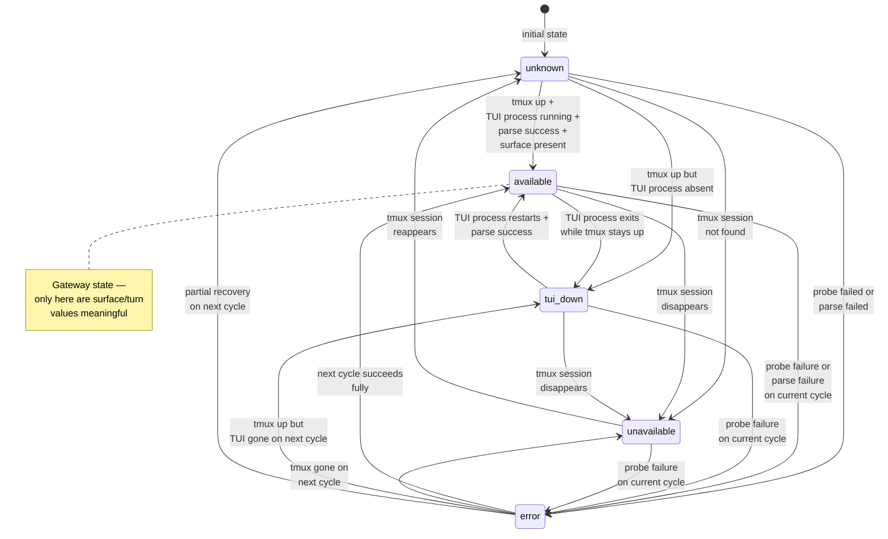
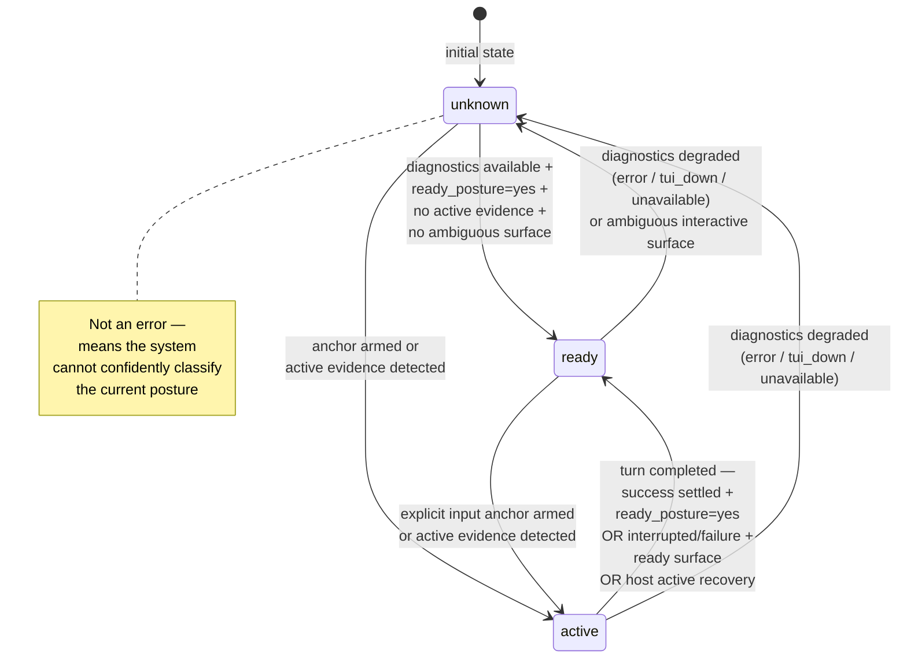
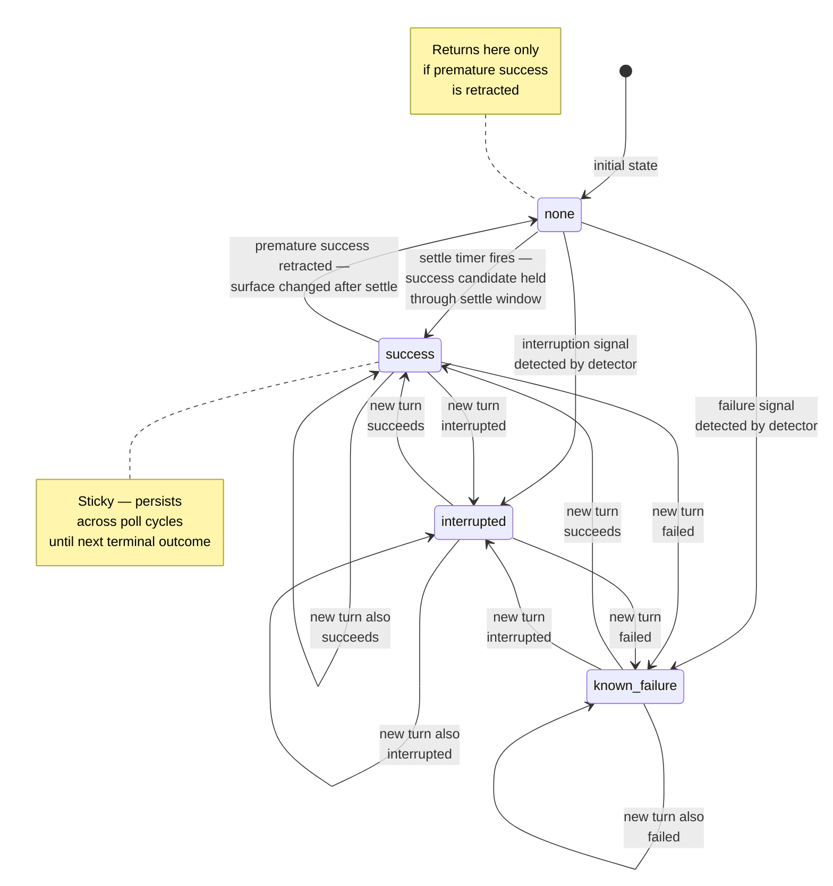
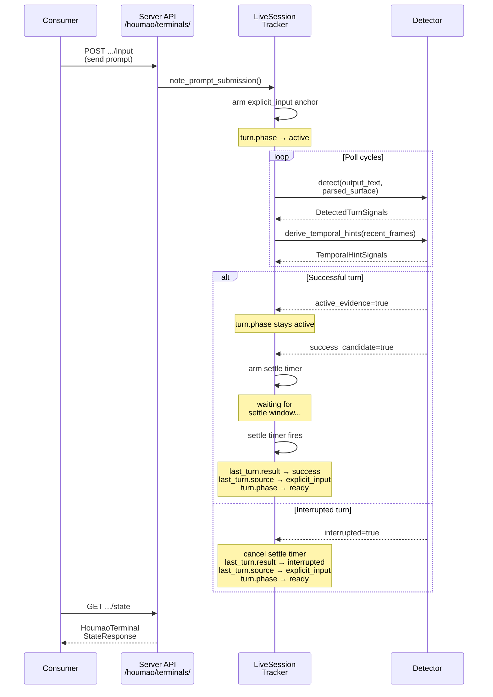
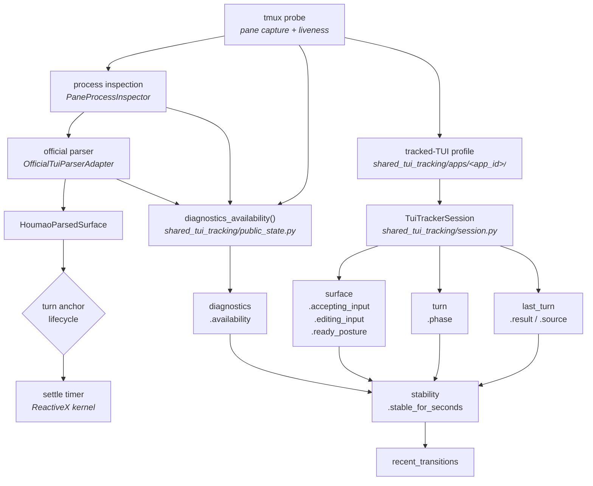

# State Transitions and Operations Guide

This guide documents how houmao-server state values change over time and what operations are appropriate in each state. It is **diagram-first**: read the statecharts and sequence diagram to understand the state model visually, then consult the prose sections for operational details.

For the definition of each individual state value, see the [State Reference Guide](state-reference.md). For the internal pipeline architecture, see [State Tracking](state-tracking.md).

> **Source of truth:** Tracker-owned transition logic is implemented in [`src/houmao/shared_tui_tracking/session.py`](../../../src/houmao/shared_tui_tracking/session.py) together with the shared detector/profile contract in [`src/houmao/shared_tui_tracking/detectors.py`](../../../src/houmao/shared_tui_tracking/detectors.py) and app-owned implementations such as [`src/houmao/shared_tui_tracking/apps/codex_tui/`](../../../src/houmao/shared_tui_tracking/apps/codex_tui/). The live server tracker in [`src/houmao/server/tui/tracking.py`](../../../src/houmao/server/tui/tracking.py) feeds that shared session and then merges the result with server-owned diagnostics and lifecycle metadata.

---

## Diagnostics Availability

All five `diagnostics.availability` values and their transitions. The entry state is `unknown`. Only `available` enables meaningful surface and turn tracking — all other states degrade `surface` and `turn` values.

---

## Turn Phase

All three `turn.phase` values and their transitions. The entry state is `unknown`.

---

## Last-Turn Result

All four `last_turn.result` values and their transitions. The entry state is `none`. The `last_turn` value is **sticky** — it only changes when a tracked turn reaches a terminal outcome, not on every poll cycle.

---

## Turn Lifecycle Sequence

A complete turn lifecycle from the consumer's perspective, showing both the successful and interrupted paths.

---

## State Composition

How low-level observations compose upward through the pipeline into public state groups. This reflects the shared module extraction — detectors and mapping helpers live in `shared_tui_tracking/`, not inside the server module.

---

## Operation Acceptability

What operations are acceptable for major state combinations, using Houmao-native routes.

| `diagnostics.availability` | `turn.phase` | Send input (`POST /houmao/terminals/{id}/input`) | Poll state (`GET /houmao/terminals/{id}/state`) | Expect meaningful results |
|---|---|---|---|---|
| `available` | `ready` | **Yes** — terminal is idle and ready | Yes | Yes — all state groups are meaningful |
| `available` | `active` | **No** — agent is working | Yes — poll for turn completion | Yes — watch for `last_turn.result` to change |
| `available` | `unknown` | **Wait** — posture is ambiguous | Yes — may resolve shortly | Partial — surface values may be approximate |
| `unavailable` | any | **No** — no terminal to receive input | Yes — monitor for recovery | No — values are stale or default |
| `tui_down` | any | **No** — TUI process is not running | Yes — monitor for TUI restart | No — values reflect last observation before exit |
| `error` | any | **No** — current sample is untrustworthy | Yes — may be transient | No — wait for recovery |
| `unknown` | any | **Wait** — state is not classifiable | Yes — may resolve shortly | No — insufficient data |

---

## Stability and Timing

### `stable_for_seconds`

The `stability.stable_for_seconds` field indicates how long the current public state has remained unchanged. Consumers should use this to avoid acting on transient states.

**Practical guidance:**
- A `last_turn.result=success` with `stable_for_seconds` above the settle window threshold indicates a truly settled outcome
- Acting on an unstable success (low `stable_for_seconds`) risks seeing the result retracted — the settle window may not have elapsed yet
- For `turn.phase=ready`, stability confirms the TUI has been idle, not just momentarily between outputs

### Premature Success Retraction

The reducer records the surface signature when a success settles. If a subsequent observation under the same anchor shows a different surface but the detector still reports `success_candidate`, the previous success is retracted (`last_turn.result` reverts to `none`) before the new candidate is evaluated. This prevents a premature success from persisting when the TUI was actually still producing output.

### Settle Window

The settle window is a configurable duration in the standalone `TuiTrackerSession` (`TrackerConfig.settle_seconds`) during which a `success_candidate` surface must remain stable before being promoted to `success`. If any of the following occur during the window, the pending success is cancelled:

- Diagnostics degrade (availability leaves `available`)
- An `interrupted` signal is detected
- A `known_failure` signal is detected
- `active_evidence` reappears
- The surface signature changes (surface is still evolving)

---

## Turn Anchor Effects

### `explicit_input` vs `surface_inference`

The two anchor sources have different timing characteristics:

**`explicit_input`** — armed immediately when the server receives `POST /houmao/terminals/{terminal_id}/input` and calls `note_prompt_submission()`:
- The exact submission timestamp is known
- `turn.phase` transitions to `active` immediately
- Settle timing starts from a precise anchor point
- This is the preferred path for automation

**`surface_inference`** — armed by the tracker when it detects that a direct tmux interaction has produced a new turn:
- The tracker uses raw tmux snapshots plus tool/version detector rules; parser-derived surface growth is not part of this authority path
- The submission moment is estimated from surface changes, not known precisely
- Settle times may be slightly longer due to the estimation uncertainty
- This path keeps repaint churn, cursor motion, and small prompt edits from manufacturing turn semantics

---

## Reducer Transition Rules

The standalone `TuiTrackerSession` in `shared_tui_tracking/session.py` applies a strict priority chain when processing each raw snapshot. The compatibility `StreamStateReducer` wrapper and the live server host adapter both reuse that same core behavior. Server-owned diagnostics, parser sidecars, and lifecycle enrichment are published alongside this reducer output; they do not become reducer inputs.

### Priority Chain

Each observation is processed through these checks in order. The first matching condition determines the output:

1. **Interrupted signal** — If the detector reports `interrupted=true`, emit `turn.phase=ready` and `last_turn.result=interrupted`. Cancel any pending success timer. Clear the armed turn source.

2. **Known failure signal** — If the detector reports `known_failure=true`, emit `turn.phase=ready` and `last_turn.result=known_failure`. Cancel any pending success timer. Clear the armed turn source.

3. **Active evidence** — If the detector reports `active_evidence=true`, emit `turn.phase=active`. Cancel any pending success timer. If no turn source is armed yet, arm `surface_inference`.

4. **Success candidate** — If the detector reports `success_candidate=true`, emit `turn.phase=ready` and arm or retain the settle timer. If a previous settled success exists with a different surface signature, retract it first.

5. **Default** — No strong signal matched. Cancel any pending success timer. Emit `turn.phase=ready` if `ready_posture=yes`, otherwise `turn.phase=unknown`.

### Host-Side Stale-Active Recovery

After the shared tracker publishes its `surface` / `turn` / `last_turn` fields, the live host adapter may still apply one corrective step for unanchored sessions.

That recovery exists to handle stale active evidence that survived in tmux history after the visible surface has already become submit-ready again. The current Codex tracker is the main case that benefits from it.

The host adapter recovers `turn.phase=active` to `turn.phase=ready` only when all of the following remain true through the configured recovery window:

- diagnostics remain `available`
- parsed surface is submit-ready (`availability=supported`, `business_state=idle`, `input_mode=freeform`)
- public surface remains `accepting_input=yes` and `editing_input=no`
- the session is unanchored (`lifecycle_authority.turn_anchor_state=absent`)
- remaining shared-tracker active reasons are limited to stale-like `status_row` evidence

This correction does not set `last_turn.result=success`. It only fixes the public readiness posture.

### Success Timer

When a `success_candidate` is detected, the reducer arms a settle timer for the configured settle window duration. The timer fires only if:
- The latest signals still report `success_candidate`
- No `current_error_present`
- The surface signature has not changed since arming

On fire, the reducer emits `last_turn.result=success` with the appropriate turn source and clears the armed tracker source.

### Cancellation

The success timer is cancelled whenever the priority chain reaches a step before the success_candidate check — i.e., diagnostics degradation, interrupted, known_failure, or active_evidence all cancel a pending success.
