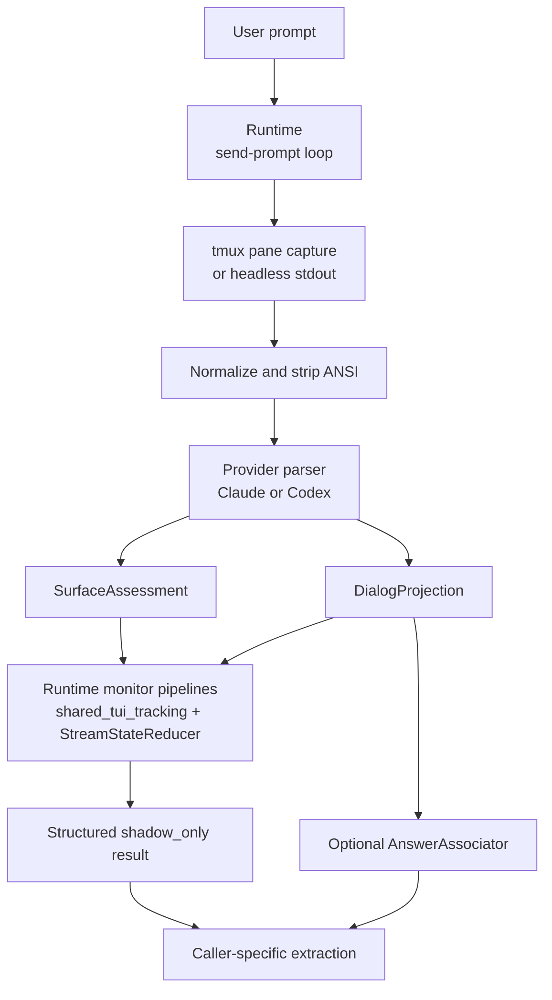

# TUI Parsing Architecture

The TUI parsing stack exists because the transport surface delivers raw terminal text, not a structured turn protocol. For `local_interactive` sessions the runtime reads tmux pane snapshots; for headless sessions it reads process stdout. Both paths produce the same stable state/projection artifacts that higher layers can reason about over time.

## Core Design Boundary

The stack is intentionally split so each layer owns one kind of responsibility:

| Layer | Owns | Must not own |
|------|------|--------------|
| Snapshot transport (tmux pane capture / headless stdout) | fetching terminal snapshots and sending input | deciding whether visible text is the answer for the prompt |
| Provider parser | classifying one snapshot and selecting the projector that will produce visible-dialog output | submit-aware lifecycle across multiple snapshots |
| Runtime monitor pipelines | pre-submit readiness, post-submit lifecycle, stability timing, and stalled recovery over ordered observations | provider-specific regexes or prompt chrome rules |
| Optional associator | caller-owned extraction heuristics over projected dialog | provider-owned state detection |

This separation is the key outcome of `decouple-shadow-state-from-answer-association`: provider parsing remains centralized and version-aware, while prompt-to-answer association becomes explicit and optional.

The projection stage is also modular. Shared core code owns normalization and final assembly, while each provider parser owns version-aware projector selection and may swap projector instances without changing the rest of the runtime lifecycle stack.

## End-To-End Flow

## Major Modules

| File | Role |
|------|------|
| `backends/shadow_parser_core.py` | shared dataclasses, anomaly types, projector protocol, projection metadata, preset registry helpers, shared projection assembly |
| `backends/claude_code_shadow.py` | Claude-specific parser, preset families, state detection, projector selection, dialog projection heuristics |
| `backends/codex_shadow.py` | Codex-specific parser, output-family detection, state detection, projector selection, dialog projection heuristics |
| `shared_tui_tracking/session.py` | standalone tracker session with internal Rx timers, detector profile resolution, and thread-safe live API |
| `shared_tui_tracking/reducer.py` | `StreamStateReducer` compatibility wrapper for replay and batch reduction |
| `shared_tui_tracking/detectors.py` | shared detector/profile contracts and compatibility exports |
| `shared_tui_tracking/apps/<app_id>/` | per-tool detector profile implementations (Claude Code, Codex TUI, unsupported-tool fallback) |
| `backends/cao_rx_monitor.py` | legacy readiness/completion monitor pipelines for shadow-only sessions, post-submit evidence accumulation, stability timers, stalled recovery, and terminal result types |
| `backends/cao_rest.py` | legacy poll loops, parser invocation, pipeline subscription, payload shaping, and error translation |
| `backends/shadow_answer_association.py` | optional caller-side association helpers such as `TailRegexExtractAssociator` |

## Why The Parser Returns Two Artifacts

One normalized snapshot becomes two first-class artifacts:

- `SurfaceAssessment`: what the tool appears to be doing right now
- `DialogProjection`: the visible dialog-oriented transcript with TUI chrome removed

This split matters because the runtime needs both answers independently:

- “Is it safe to submit input or declare completion?” comes from `SurfaceAssessment`.
- “What shadow text changed after submit?” comes from `DialogProjection`, with the current runtime monitor keying lifecycle evidence off `normalized_text` after pipeline normalization rather than off `dialog_text`.

Treating those concerns as separate artifacts prevents the parser from making unstable claims such as “this exact text is definitely the final answer for the latest prompt.”

## Parser Versus Runtime Ownership

The provider parser is responsible for one-snapshot interpretation:

- version-aware preset selection
- version-aware projector selection
- supported versus unsupported output-family detection
- disconnected/error-like surface detection
- provider-specific `ui_context` classification
- dialog projection boundaries and projection metadata

The runtime is responsible for ordered-snapshot interpretation:

- waiting for safe pre-submit readiness
- recording the pre-submit normalized-text baseline
- creating `ShadowObservation` values for each poll result
- accumulating post-submit activity from `business_state = working` and normalized shadow-text changes
- promoting continuous unknown runs into `stalled` and clearing them on known observations
- deciding whether the turn is blocked, failed, waiting, candidate-complete, or complete

The runtime monitor is split intentionally:

- the `shared_tui_tracking/` package owns the standalone tracker session, detector profiles, and reducer for raw-snapshot reduction and turn/surface/last-turn classification
- `cao_rx_monitor.py` owns the legacy full-stream lifecycle logic and time-based operators for shadow-only sessions
- `cao_rest.py` owns the synchronous I/O boundary, deadlines, and error mapping for shadow-only sessions
- `tests/unit/agents/realm_controller/test_cao_rx_monitor.py` is the main executable reference for the legacy pipeline timing semantics

`ShadowParserStack` sits at the boundary: it resolves the provider parser and can pass through a projector override, but it does not own provider-specific projection logic itself.

## Result Surface

A successful `shadow_only` completion exposes structured runtime/parser output instead of a shadow-mode `output_text` alias. The caller-facing payload is built around:

- `surface_assessment`
- `dialog_projection`
- `projection_slices`
- `parser_metadata`
- `mode_diagnostics`

That result surface is deliberately neutral: it exposes what the runtime observed, while leaving prompt-specific answer extraction to higher layers. Downstream code that needs reliable machine parsing should prefer explicit schema/sentinel contracts over assuming exact `dialog_text` recovery.
