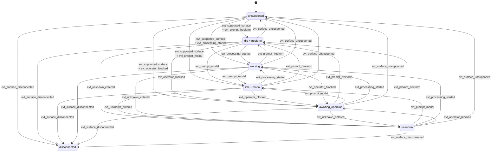

# Claude Parsing Contract

Claude-specific parsing lives in `backends/claude_code_shadow.py`. The parser is responsible for one-snapshot interpretation of captured pane output and returns `ClaudeSurfaceAssessment` plus `ClaudeDialogProjection`.

For the concrete on-screen cues currently used by the maintained tracked-TUI workflow, see [Claude Signals](claude-signals.md).

## Claude-Specific Surface Vocabulary

Claude extends the shared `ui_context` vocabulary with provider-specific contexts:

- `normal_prompt`
- `selection_menu`
- `slash_command`
- `trust_prompt`
- `error_banner`
- `unknown`

The provider also uses the shared `availability`, `business_state`, and `input_mode` values:

- availability: `supported`, `unsupported`, `disconnected`, `unknown`
- business state: `idle`, `working`, `awaiting_operator`, `unknown`
- input mode: `freeform`, `modal`, `closed`, `unknown`

## What The Claude Parser Detects

The Claude parser names its evidence in terms that map cleanly to the contract notes:

- supported output family
- idle prompt lines
- processing spinner lines
- selection or approval UI
- slash-command context
- trust prompt context
- error banner context
- disconnected signals

The parser does not emit a primitive readiness state. Runtime derives `submit_ready` only when the snapshot is supported, `business_state = idle`, `input_mode = freeform`, and the active context is a normal prompt rather than a blocking menu or trust flow.

## Claude Parser State Transition Graph

Claude parser-state transitions are evaluated across ordered snapshots. The parser owns the transition facts, while runtime decides what those facts mean for turn lifecycle.

The graph shows parser-state transitions only. It does not mean a turn is complete when Claude returns to `idle + freeform`; runtime completion still belongs to the readiness/completion monitor described in [Runtime Lifecycle](runtime-lifecycle.md).

## Claude State Meanings

| State | Meaning | Main Claude signals |
|------|---------|---------------------|
| `idle + freeform` | Claude looks idle and exposes a normal prompt | idle prompt line is visible and no stronger blocking or processing signal applies |
| `idle + modal` | Claude is idle, but the active surface is still slash-command or another constrained prompt | active slash-command surface is visible |
| `working` | Claude is actively processing or generating | spinner or other processing evidence is present |
| `awaiting_operator` | Claude is blocked on explicit user approval, trust, selection, or setup | selection menu, trust prompt, or setup block is visible |
| `unknown` | Claude output is still supported, but not classifiable into a safer stronger state | supported surface with no ready, working, or waiting evidence |
| `unsupported` | snapshot does not match a supported Claude output family | supported-output-family detector fails |
| `disconnected` | terminal appears detached or unavailable | disconnected signal is present |

The parser derives `ui_context` and `input_mode` from one bounded active-surface pass. Blocking surfaces win over slash-command context, slash-command wins over freeform prompt recovery, and `working` may coexist with either `freeform` or `modal` input modes.

## Claude Transition Events

| Event | Detection | Claude-specific interpretation |
|------|-----------|-------------------------------|
| `evt_supported_surface` | `availability` becomes `supported` | a supported Claude TUI family is recognized |
| `evt_surface_unsupported` | `availability` becomes `unsupported` | parser no longer trusts the snapshot shape |
| `evt_surface_disconnected` | `availability` becomes `disconnected` | detached or disconnected Claude surface is visible |
| `evt_processing_started` | `business_state` changes to `working` | Claude spinner or equivalent processing signal appears |
| `evt_prompt_freeform` | `business_state` is `idle` and `input_mode` is `freeform` | idle prompt becomes visible without blocking trust/menu state |
| `evt_prompt_modal` | `business_state` is `idle` and `input_mode` is `modal` | slash-command UI is active |
| `evt_operator_blocked` | `business_state` changes to `awaiting_operator` | selection menu, trust prompt, or setup block appears |
| `evt_unknown_entered` | `business_state` changes to `unknown` while `availability=supported` | Claude surface is still recognized but no safe stronger state matches |
| `evt_context_changed` | `ui_context` changes across snapshots | for example `normal_prompt` to `slash_command` or `trust_prompt` |
| `evt_normalized_text_changed` | `DialogProjection.normalized_text` changes across snapshots | the closer-to-source visible Claude snapshot text changed |

These events describe parser observations, not runtime lifecycle decisions. The runtime monitor consumes the shared parser outputs from this page; current completion evidence keys off normalized shadow text after pipeline normalization rather than `dialog_text`.

## Preset And Version Selection

Claude is version-aware. The parser selects a preset through this order:

1. `AGENTSYS_CLAUDE_CODE_VERSION` (or the legacy `AGENTSYS_CAO_CLAUDE_CODE_VERSION`)
2. banner detection from `Claude Code vX.Y.Z`
3. latest known preset fallback

Current preset milestones in code are:

| Version floor | Preset id | Notes |
|--------------|-----------|-------|
| `0.0.0` | `claude_shadow_v0` | oldest baseline kept for compatibility |
| `2.1.0` | `claude_shadow_v1` | widened idle prompt support |
| `2.1.62` | `claude_shadow_v2` | current visible marker baseline in code |

If no exact preset exists for a detected version, the registry uses floor lookup and records `unknown_version_floor_used`.

## Supported Output Families

The Claude parser treats these output variants as first-class supported families:

- `claude_prompt_idle_v1`
- `claude_response_marker_v1`
- `claude_waiting_menu_v1`
- `claude_spinner_v1`

Unsupported snapshots fail explicitly rather than being treated as “probably still processing.”

## Projection Boundaries

Claude dialog projection removes Claude-specific TUI chrome such as:

- ANSI styling
- banner/version lines
- prompt-only idle lines
- spinner lines
- separator lines

Projection preserves visible dialog content in order, including:

- visible user prompt text
- visible assistant response lines
- menu text that matters when Claude is waiting for user input

`dialog_text` therefore means “visible dialog-oriented transcript,” not “the answer for the last prompt.”

The current runtime lifecycle monitor does not use `dialog_text` as its post-submit diff surface. It keys change evidence off normalized shadow text and keeps `dialog_text` for human-facing transcript views and caller-owned extraction patterns.

## Claude-Specific Blocking And Drift Cases

The most important Claude-only contexts to remember are:

- `trust_prompt`: onboarding or approval flow blocks generic completion
- `selection_menu`: Claude is waiting for an explicit choice
- `slash_command`: the current editable Claude prompt is still inside slash-command interaction, so the surface is not just a normal prompt

Historical slash-command or model-switch output may remain visible in `dialog_text` after Claude returns to a fresh `❯` prompt. That history must not keep the recovered surface classified as `slash_command`; `input_mode` should follow the newest active prompt instead.

When the scrollback shrinks below the stored baseline offset, the parser marks `baseline_invalidated = true` and attaches the shared anomaly. That signal is diagnostic: it tells runtime and callers that the visible transcript was redrawn or truncated relative to the pre-submit baseline.

## What Claude Must Not Claim

The Claude parser must not claim that projected dialog uniquely identifies the answer for the most recent prompt. Its contract stops at:

- state assessment
- dialog projection
- parser metadata and anomalies
- provider-specific evidence

If a caller wants prompt-specific extraction, it must add that layer explicitly on top of the projected dialog.
