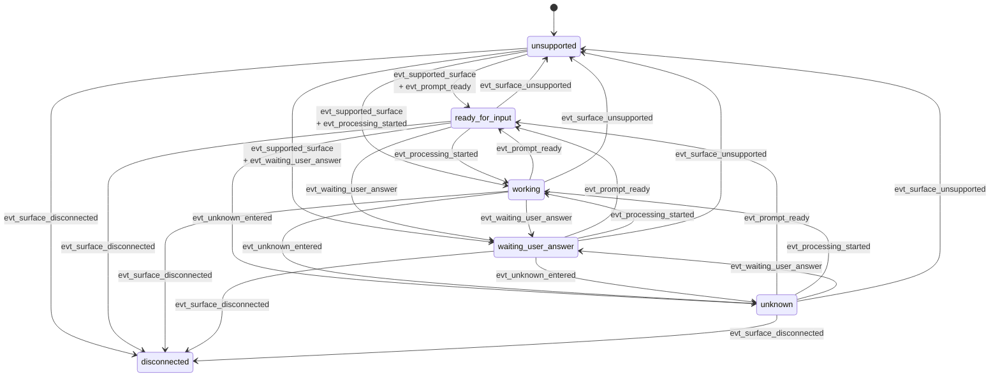

# Claude Parsing Contract

Claude-specific parsing lives in `backends/claude_code_shadow.py`. The parser is responsible for one-snapshot interpretation of CAO `mode=full` output and returns `ClaudeSurfaceAssessment` plus `ClaudeDialogProjection`.

## Claude-Specific Surface Vocabulary

Claude extends the shared `ui_context` vocabulary with provider-specific contexts:

- `normal_prompt`
- `selection_menu`
- `slash_command`
- `trust_prompt`
- `error_banner`
- `unknown`

The provider also uses the shared `availability` and `activity` values:

- availability: `supported`, `unsupported`, `disconnected`, `unknown`
- activity: `ready_for_input`, `working`, `waiting_user_answer`, `unknown`

## What The Claude Parser Detects

The Claude parser names its evidence in terms that map cleanly to the contract notes:

- supported output family
- idle prompt lines
- processing spinner lines
- selection or approval UI
- slash-command context
- trust prompt context
- error banner context
- disconnected signals

The parser builds `accepts_input = true` only when the snapshot is supported, the activity is `ready_for_input`, and the context is a normal prompt rather than a blocking menu or trust flow.

## Claude Parser State Transition Graph

Claude parser-state transitions are evaluated across ordered snapshots. The parser owns the transition facts, while runtime decides what those facts mean for turn lifecycle.

The graph shows parser-state transitions only. It does not mean a turn is complete when Claude returns to `ready_for_input`; that completion meaning belongs to runtime `TurnMonitor`.

## Claude State Meanings

| State | Meaning | Main Claude signals |
|------|---------|---------------------|
| `ready_for_input` | Claude looks idle and safe for the next prompt | idle prompt line is visible and no stronger blocking or processing signal applies |
| `working` | Claude is actively processing or generating | spinner or other processing evidence is present |
| `waiting_user_answer` | Claude is blocked on explicit user approval or selection | selection menu or trust prompt block is visible |
| `unknown` | Claude output is still supported, but not classifiable into a safer stronger state | supported surface with no ready, working, or waiting evidence |
| `unsupported` | snapshot does not match a supported Claude output family | supported-output-family detector fails |
| `disconnected` | terminal appears detached or unavailable | disconnected signal is present |

The parser applies priority so `disconnected` and `unsupported` win over normal prompt-like states, and blocking states win over `working` or `ready_for_input`.

## Claude Transition Events

| Event | Detection | Claude-specific interpretation |
|------|-----------|-------------------------------|
| `evt_supported_surface` | `availability` becomes `supported` | a supported Claude TUI family is recognized |
| `evt_surface_unsupported` | `availability` becomes `unsupported` | parser no longer trusts the snapshot shape |
| `evt_surface_disconnected` | `availability` becomes `disconnected` | detached or disconnected Claude surface is visible |
| `evt_processing_started` | `activity` changes to `working` | Claude spinner or equivalent processing signal appears |
| `evt_prompt_ready` | `activity` changes to `ready_for_input` with `accepts_input=true` | idle prompt becomes visible without blocking trust/menu state |
| `evt_waiting_user_answer` | `activity` changes to `waiting_user_answer` | selection menu or trust prompt appears |
| `evt_unknown_entered` | `activity` changes to `unknown` while `availability=supported` | Claude surface is still recognized but no safe stronger state matches |
| `evt_context_changed` | `ui_context` changes across snapshots | for example `normal_prompt` to `slash_command` or `trust_prompt` |
| `evt_projection_changed` | `DialogProjection.dialog_text` changes across snapshots | visible projected Claude dialog changed |

These events describe parser observations, not runtime lifecycle decisions. Runtime uses them as inputs to `TurnMonitor`.

## Preset And Version Selection

Claude is version-aware. The parser selects a preset through this order:

1. `AGENTSYS_CAO_CLAUDE_CODE_VERSION`
2. banner detection from `Claude Code vX.Y.Z`
3. latest known preset fallback

Current preset milestones in code are:

| Version floor | Preset id | Notes |
|--------------|-----------|-------|
| `0.0.0` | `claude_shadow_v0` | oldest baseline kept for compatibility |
| `2.1.0` | `claude_shadow_v1` | widened idle prompt support |
| `2.1.62` | `claude_shadow_v2` | current visible marker baseline in code |

If no exact preset exists for a detected version, the registry uses floor lookup and records `unknown_version_floor_used`.

## Supported Output Families

The Claude parser treats these output variants as first-class supported families:

- `claude_prompt_idle_v1`
- `claude_response_marker_v1`
- `claude_waiting_menu_v1`
- `claude_spinner_v1`

Unsupported snapshots fail explicitly rather than being treated as “probably still processing.”

## Projection Boundaries

Claude dialog projection removes Claude-specific TUI chrome such as:

- ANSI styling
- banner/version lines
- prompt-only idle lines
- spinner lines
- separator lines

Projection preserves visible dialog content in order, including:

- visible user prompt text
- visible assistant response lines
- menu text that matters when Claude is waiting for user input

`dialog_text` therefore means “visible dialog-oriented transcript,” not “the answer for the last prompt.”

## Claude-Specific Blocking And Drift Cases

The most important Claude-only contexts to remember are:

- `trust_prompt`: onboarding or approval flow blocks generic completion
- `selection_menu`: Claude is waiting for an explicit choice
- `slash_command`: the current editable Claude prompt is still inside slash-command interaction, so the surface is not just a normal prompt

Historical slash-command or model-switch output may remain visible in `dialog_text` after Claude returns to a fresh `❯` prompt. That history must not keep the recovered surface classified as `slash_command`; `accepts_input` should follow the newest active prompt instead.

When the scrollback shrinks below the stored baseline offset, the parser marks `baseline_invalidated = true` and attaches the shared anomaly. That signal is diagnostic: it tells runtime and callers that the visible transcript was redrawn or truncated relative to the pre-submit baseline.

## What Claude Must Not Claim

The Claude parser must not claim that projected dialog uniquely identifies the answer for the most recent prompt. Its contract stops at:

- state assessment
- dialog projection
- parser metadata and anomalies
- provider-specific evidence

If a caller wants prompt-specific extraction, it must add that layer explicitly on top of the projected dialog.
