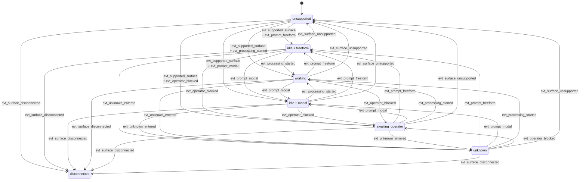

# Codex Parsing Contract

Codex-specific parsing lives in `backends/codex_shadow.py`. The parser is responsible for one-snapshot interpretation of CAO `mode=full` output and returns `CodexSurfaceAssessment` plus `CodexDialogProjection`.

## Codex-Specific Surface Vocabulary

Codex extends the shared `ui_context` vocabulary with these provider-specific values:

- `normal_prompt`
- `selection_menu`
- `slash_command`
- `approval_prompt`
- `error_banner`
- `unknown`

The provider reuses the shared `availability`, `business_state`, and `input_mode` values:

- availability: `supported`, `unsupported`, `disconnected`, `unknown`
- business state: `idle`, `working`, `awaiting_operator`, `unknown`
- input mode: `freeform`, `modal`, `closed`, `unknown`

`approval_prompt` is the main Codex-specific distinction: it captures approval or trust flows that are similar in behavior to Claude’s trust prompt, but with Codex-specific text and menu shapes.

## What The Codex Parser Detects

The Codex parser uses signals for:

- supported output families
- idle prompt lines
- processing or progress signals
- selection menus
- approval or trust prompts
- slash-command UI
- error banners
- disconnected states
- visible assistant output in both label-style and TUI-style layouts

As with Claude, runtime derives `submit_ready` only when the surface is supported, `business_state = idle`, `input_mode = freeform`, and no blocking UI context is active.

## Codex Parser State Transition Graph

Codex parser-state transitions are also evaluated across ordered snapshots. The parser owns the transition facts, while runtime decides what those facts mean for turn lifecycle.

The graph shows parser-state transitions only. It does not mean a turn is complete when Codex returns to `idle + freeform`; completion remains a runtime `TurnMonitor` concern.

## Codex State Meanings

| State | Meaning | Main Codex signals |
|------|---------|--------------------|
| `idle + freeform` | Codex looks idle and exposes a normal prompt | idle prompt line is visible and no stronger blocking or processing signal applies |
| `idle + modal` | Codex is idle, but the active surface is still slash-command or another constrained prompt | active slash-command surface is visible |
| `working` | Codex is actively processing or generating | processing signal or progress output is present |
| `awaiting_operator` | Codex is blocked on explicit user approval, trust, selection, or login/setup | selection menu, approval prompt, or login/setup block is visible |
| `unknown` | Codex output is still supported, but not classifiable into a safer stronger state | supported surface with no ready, working, or waiting evidence |
| `unsupported` | snapshot does not match a supported Codex output family | supported-output-family detector fails |
| `disconnected` | terminal appears detached or unavailable | disconnected signal is present |

Codex uses the same high-level business-state priority as Claude, but the concrete prompts and output families differ, especially around approval prompts and label-style versus TUI-style dialog.

## Codex Transition Events

| Event | Detection | Codex-specific interpretation |
|------|-----------|------------------------------|
| `evt_supported_surface` | `availability` becomes `supported` | a supported Codex output family is recognized |
| `evt_surface_unsupported` | `availability` becomes `unsupported` | parser no longer trusts the snapshot shape |
| `evt_surface_disconnected` | `availability` becomes `disconnected` | detached or disconnected Codex surface is visible |
| `evt_processing_started` | `business_state` changes to `working` | Codex processing or progress signal appears |
| `evt_prompt_freeform` | `business_state` is `idle` and `input_mode` is `freeform` | idle prompt becomes visible without a blocking menu or approval prompt |
| `evt_prompt_modal` | `business_state` is `idle` and `input_mode` is `modal` | slash-command UI is active |
| `evt_operator_blocked` | `business_state` changes to `awaiting_operator` | selection menu, approval prompt, or login/setup block appears |
| `evt_unknown_entered` | `business_state` changes to `unknown` while `availability=supported` | Codex surface is still recognized but no safe stronger state matches |
| `evt_context_changed` | `ui_context` changes across snapshots | for example `normal_prompt` to `approval_prompt` or `slash_command` |
| `evt_projection_changed` | `DialogProjection.dialog_text` changes across snapshots | visible projected Codex dialog changed |

These events describe parser observations, not runtime lifecycle decisions. Runtime uses them as inputs to `TurnMonitor`.

## Preset And Version Selection

Codex is also version-aware. Preset selection uses this order:

1. `AGENTSYS_CAO_CODEX_VERSION`
2. banner detection from Codex version strings
3. latest known preset fallback

Current preset milestones in code are:

| Version floor | Preset id | Notes |
|--------------|-----------|-------|
| `0.1.0` | `codex_shadow_v1` | label-style and prompt/waiting baselines |
| `0.98.0` | `codex_shadow_v2` | adds supported TUI bullet-style assistant output |

Unknown newer versions use floor lookup and record the shared version anomaly in parser metadata.

## Supported Output Families

The Codex parser explicitly supports more than one visible transcript family:

- `codex_label_v1`
- `codex_tui_bullet_v1`
- `codex_waiting_approval_v1`
- `codex_prompt_idle_v1`

This matters because Codex may present assistant content either as labeled transcript lines or as TUI bullet output. The parser contract promises support for both families when they match the supported preset range.

## Projection Boundaries

Codex dialog projection removes UI chrome such as:

- ANSI styling
- prompt and footer chrome
- progress/spinner lines
- shortcut/footer lines
- menu framing that does not belong in projected dialog

Projection preserves visible dialog content such as:

- label-style assistant output
- bullet-style assistant output
- visible user prompt text that remains on screen
- approval/menu text when Codex is blocked on user input

The result is still projected visible dialog, not authoritative answer association.

## Codex-Specific Blocking And Drift Cases

Codex commonly blocks in two ways:

- `selection_menu`: menu-style selection UI is visible
- `approval_prompt`: Codex is asking for approval or directory trust

`slash_command` should only apply while the current editable Codex prompt is still inside slash-command interaction. Historical `/model` output or other command results that remain visible in projected dialog must not keep a later recovered normal prompt in a blocked slash-command state.

The parser also handles both historical label-style output and newer TUI-style bullet output, which makes variant detection especially important when Codex changes its visible UI.

As with Claude, baseline shrinkage sets `baseline_invalidated = true` for diagnostics.

## What Codex Must Not Claim

The Codex parser must not claim that visible assistant text is automatically the authoritative answer for the last prompt. Its responsibilities stop at:

- state assessment
- dialog projection
- parser metadata and anomalies
- provider-specific evidence

Anything stronger belongs in a caller-owned association layer.
