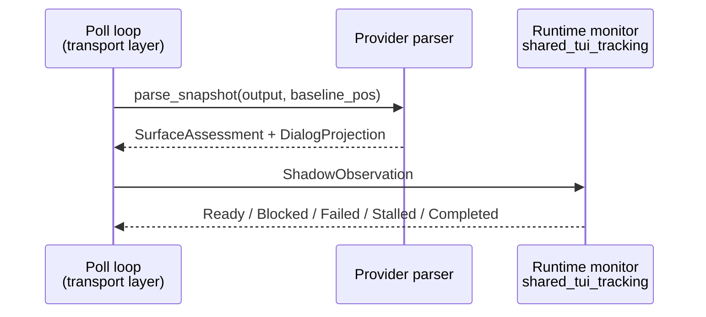
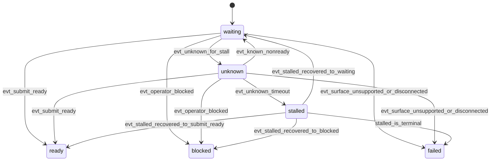

# Runtime Lifecycle And State Transitions

The runtime-owned lifecycle monitor for tracked TUI turns is split across two layers:

- The `shared_tui_tracking/` package provides `StreamStateReducer` and `TuiTrackerSession` for raw-snapshot reduction, detector profile resolution, and turn lifecycle tracking.
- For legacy shadow-only sessions, `backends/cao_rx_monitor.py` owns readiness/completion classification, post-submit evidence accumulation, stability timing, and stalled recovery.

This page documents the readiness and completion semantics that sit above provider parsing.

## Runtime Observation Flow

The important boundary is that provider parsers still classify one snapshot, while the runtime monitor interprets an ordered stream of `ShadowObservation` values over time.

## Two Monitoring Phases

The runtime monitor operates in two phases:

- `readiness`: pre-submit polling, where runtime waits until the surface looks safe for prompt submission
- `completion`: post-submit polling, where runtime decides whether the turn is still waiting, in progress, blocked, stalled, failed, or complete

The monitor is no longer one mutable class. Each phase is a ReactiveX pipeline that classifies the full observation stream and lets timed operators emit `stalled` or `completed` results while the transport layer keeps ownership of the synchronous I/O boundary.

## Readiness Classification Order

Readiness evaluates each observation in this deterministic priority order:

| Priority | Condition | Classification |
|------|-----------|----------------|
| 1 | `availability in {unsupported, disconnected}` | `failed` |
| 2 | `business_state = awaiting_operator` | `blocked` |
| 3 | unknown-for-stall surface | `unknown` or `stalled` path |
| 4 | derived `submit_ready` surface | `ready` |
| 5 | anything else | `waiting` |

The readiness pipeline emits terminal `ReadyResult`, `BlockedResult`, `FailedResult`, or `StalledResult` values. When `stalled_is_terminal = false`, the transport layer keeps polling after a stalled emission and lets the next known observation recover the state.

## Completion Classification Order

Completion classifies each observation in this deterministic priority order:

| Priority | Condition | Classification |
|------|-----------|----------------|
| 1 | update post-submit evidence from `business_state = working` and normalized shadow-text change | evidence accumulator only |
| 2 | `availability in {unsupported, disconnected}` | `failed` |
| 3 | `business_state = awaiting_operator` | `blocked` |
| 4 | unknown-for-stall surface | `unknown` or `stalled` path |
| 5 | `business_state = working` | `in_progress` |
| 6 | `submit_ready` plus previously-seen post-submit activity | `candidate_complete` |
| 7 | anything else | `waiting` |

```mermaid
stateDiagram-v2
    [*] --> Waiting
    state "waiting" as Waiting
    state "in_progress" as InProgress
    state "candidate_complete" as CandidateComplete
    state "unknown" as Unknown
    state "stalled" as Stalled
    state "completed" as Completed
    state "blocked" as Blocked
    state "failed" as Failed

    Waiting --> InProgress: evt_working_seen
    Waiting --> CandidateComplete: evt_submit_ready_with_activity
    Waiting --> Blocked: evt_operator_blocked
    Waiting --> Failed: evt_surface_unsupported_or_disconnected
    Waiting --> Unknown: evt_unknown_for_stall

    InProgress --> CandidateComplete: evt_submit_ready_with_activity
    InProgress --> Waiting: evt_known_noncandidate
    InProgress --> Blocked: evt_operator_blocked
    InProgress --> Failed: evt_surface_unsupported_or_disconnected
    InProgress --> Unknown: evt_unknown_for_stall

    CandidateComplete --> Completed: evt_stability_window_elapsed
    CandidateComplete --> Completed: evt_completion_observer_payload
    CandidateComplete --> InProgress: evt_working_seen
    CandidateComplete --> Waiting: evt_state_signature_changed
    CandidateComplete --> Blocked: evt_operator_blocked
    CandidateComplete --> Failed: evt_surface_unsupported_or_disconnected
    CandidateComplete --> Unknown: evt_unknown_for_stall

    Unknown --> Waiting: evt_known_noncandidate
    Unknown --> InProgress: evt_stalled_recovered_to_working
    Unknown --> CandidateComplete: evt_stalled_recovered_to_candidate
    Unknown --> Blocked: evt_operator_blocked
    Unknown --> Failed: evt_surface_unsupported_or_disconnected
    Unknown --> Stalled: evt_unknown_timeout

    Stalled --> Waiting: evt_stalled_recovered_to_waiting
    Stalled --> InProgress: evt_stalled_recovered_to_working
    Stalled --> CandidateComplete: evt_stalled_recovered_to_candidate
    Stalled --> Blocked: evt_stalled_recovered_to_blocked
    Stalled --> Failed: stalled_is_terminal
```

These are conceptual runtime classifications, not parser states. Provider parsers still report snapshot properties such as `availability`, `business_state`, `input_mode`, and `DialogProjection`.

## Post-Submit Evidence And Stability Window

Completion success is intentionally stronger than “the parser says ready again.”

The completion pipeline records post-submit activity through two evidence sources:

- `business_state = working`
- normalized shadow-text change derived from `DialogProjection.normalized_text` after `normalize_projection_text()`

That second branch should be read narrowly: it means the closer-to-source normalized shadow surface changed after submit. It does not mean the runtime extracted or validated the assistant reply text.

Once post-submit activity exists, a later `submit_ready` surface becomes `candidate_complete`, not immediately `completed`. The pipeline then starts a `completion_stability_seconds` timer. Any later state-signature change resets that timer. The current signature includes:

- lifecycle classification status,
- `availability`,
- `business_state`,
- `input_mode`,
- the normalized projection key, and
- the accumulated evidence flags.

This is what prevents a transient idle flicker from becoming a false completion.

The mailbox completion observer runs on every post-submit emission after activity has started. If it returns a definitive payload, the pipeline emits `CompletedResult` immediately and bypasses the generic stability window.

## Unknown And Stalled Handling

Runtime treats both of these as unknown for stall timing:

- `availability == "unknown"`
- `availability == "supported"` with `business_state == "unknown"`

`input_mode == "unknown"` by itself keeps the surface non-ready, but does not enter the unknown-to-stalled path while the business state is still known.

The key semantic change from the old `_TurnMonitor` is that stall timing now follows the full classified-state stream:

- the timer is armed only while the current classification is `unknown`
- any known observation cancels the pending timer
- slow polls naturally stretch the effective wall-clock wait because the timer follows inter-emission gaps rather than a fixed wall-clock start timestamp

When unknown persists past the timeout:

- the pipeline emits `stalled`
- runtime records the `stalled_entered` anomaly
- `phase`, `elapsed_unknown_seconds`, and `parser_family` are attached as details

When a known state returns after stalled tracking:

- runtime records `stalled_recovered`
- `elapsed_stalled_seconds` and `recovered_to` are attached as details
- pending unknown/stalled timing is cleared before the recovered classification is handled

Whether stalled is terminal still depends on runtime policy outside the pipeline:

- `stalled_is_terminal = true`: the transport layer turns the stalled result into a failure immediately
- `stalled_is_terminal = false`: the transport layer keeps polling for recovery until an outer timeout or known state arrives

## Outcome Meanings

The runtime interprets parser observations this way:

- `business_state = awaiting_operator` means the tool needs explicit human input, so the lifecycle becomes `blocked`
- `business_state = idle` with `input_mode = modal` means the tool is not submit-ready yet, but it is not a blocked failure by itself
- `business_state = working` with `input_mode = freeform|modal` means the turn is still in progress
- `unsupported` means the parser contract does not recognize the surface, so the lifecycle becomes `failed`
- `disconnected` means the TUI surface is unavailable, so the lifecycle becomes `failed`
- `completed` means the turn is success-terminal and payload shaping can expose `dialog_projection`, `surface_assessment`, `projection_slices`, `parser_metadata`, and `mode_diagnostics`

A successful `completed` state still does not imply parser-owned answer association. It only means the runtime observed enough evidence to declare the turn finished under the shadow-mode lifecycle contract.

If a caller needs machine-reliable reply text after completion, it should define that contract explicitly with schema-shaped prompting, sentinels, or another narrow caller-owned extraction rule over the available text surfaces.

## Testing Surface

The main executable reference for these timing semantics is `tests/unit/agents/realm_controller/test_cao_rx_monitor.py`.

That suite uses `TestScheduler` to verify:

- unknown-to-stalled transition,
- stalled recovery,
- non-stalling `input_mode = unknown` with known business state,
- slow-poll inter-emission-gap timing,
- transient idle flicker reset behavior,
- normalized shadow-text change resetting the stability window, and
- mailbox observer bypass behavior.
