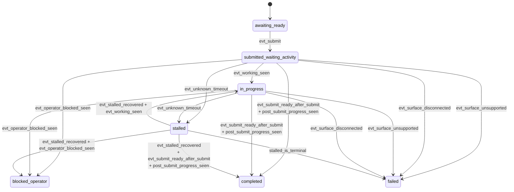

# Runtime Lifecycle And State Transitions

`TurnMonitor` is the runtime-owned state machine for CAO `shadow_only` turns. It lives in `backends/cao_rest.py` and interprets ordered parser observations before and after submit.

This page documents the runtime states, the transition events, and the success/failure rules that sit above provider parsing.

## Two Monitoring Phases

`TurnMonitor` operates in two phases:

- `readiness`: pre-submit polling, where runtime waits until the surface looks safe for prompt submission
- `completion`: post-submit polling, where runtime decides whether the turn is in progress, blocked, stalled, failed, or complete

The same monitor structure is reused across both phases, but the meaning of observations changes after submit because runtime starts tracking baseline projection text, post-submit `working`, and projection changes.

## Mermaid State Transition Graph

The diagram shows the major runtime states. The `post_submit_progress_seen` guard is shorthand for the runtime having already observed either projection change or `working` after submit.

## Runtime State Definitions

| State | Meaning | Typical entry condition |
|------|---------|-------------------------|
| `awaiting_ready` | Pre-submit monitor is still waiting for a submit-ready freeform prompt | parser reports a supported but not-yet-submittable surface, or completion-style evidence has not started yet |
| `submitted_waiting_activity` | Prompt has been submitted, but runtime has not yet seen decisive post-submit progress or completion evidence | `record_submit()` stores the pre-submit baseline projection and resets post-submit flags |
| `in_progress` | Post-submit `working` evidence has been observed | parser reports `business_state=working` after submit |
| `blocked_operator` | The tool is waiting for operator approval, trust, selection, or setup action | parser reports `business_state=awaiting_operator` |
| `stalled` | `unknown` has persisted long enough to cross the runtime stall threshold | continuous unknown duration reaches `unknown_to_stalled_timeout_seconds` |
| `completed` | Runtime has enough evidence to treat the turn as success-terminal | surface returns to `submit_ready` and runtime has also observed post-submit `working` or projection change |
| `failed` | Runtime has reached a non-recoverable outcome | unsupported surface, disconnected surface, or terminal stalled policy |

These are runtime lifecycle states, not parser states. The parser reports snapshot properties such as `availability`, `business_state`, and `input_mode`, and runtime derives readiness/blocking from those axes.

## Transition Event Definitions

The code does not implement a formal event enum, but the contract is easiest to understand in terms of conceptual transition events derived from parser observations.

| Event | Detection from observations | Typical effect |
|------|-----------------------------|----------------|
| `evt_submit` | runtime sends terminal input and calls `record_submit()` with the baseline projection | moves monitor into `submitted_waiting_activity` |
| `evt_working_seen` | post-submit `SurfaceAssessment.business_state == "working"` | sets `m_saw_working_after_submit = true` and moves runtime to `in_progress` |
| `evt_operator_blocked_seen` | post-submit `SurfaceAssessment.business_state == "awaiting_operator"` | moves runtime to `blocked_operator` |
| `evt_projection_changed` | current `DialogProjection.dialog_text` differs from the recorded pre-submit baseline | sets `m_saw_projection_change_after_submit = true` |
| `evt_submit_ready_after_submit` | current snapshot satisfies `submit_ready` after submit | may complete the turn if the post-submit evidence guard has also been satisfied |
| `evt_surface_unsupported` | `SurfaceAssessment.availability == "unsupported"` | moves runtime to `failed` |
| `evt_surface_disconnected` | `SurfaceAssessment.availability == "disconnected"` | moves runtime to `failed` |
| `evt_unknown_timeout` | `unknown_for_stall(surface_assessment)` stays true until the configured timeout elapses | emits `stalled_entered` anomaly and moves runtime to `stalled` |
| `evt_stalled_recovered` | a known state is observed after stalled tracking was active | emits `stalled_recovered` anomaly and clears unknown/stalled timers |

## Success Terminality Rule

Success terminality is intentionally stronger than “the parser says ready.” In `observe_completion()`, runtime completes only when both of these are true:

- the current surface is `submit_ready` again
- runtime has observed at least one post-submit progress signal:
  - `m_saw_projection_change_after_submit`, or
  - `m_saw_working_after_submit`

That rule avoids a common false positive: a snapshot may look idle again even though runtime never observed evidence that the new turn actually progressed.

## Unknown And Stalled Handling

Runtime treats both of these as unknown for stall timing:

- `availability == "unknown"`
- `availability == "supported"` with `business_state == "unknown"`

`input_mode == "unknown"` by itself keeps the surface non-ready, but does not enter the unknown-to-stalled path while the business state is still known.

When unknown persists past the timeout:

- the monitor enters `stalled`
- runtime records the `stalled_entered` anomaly
- `phase`, `elapsed_unknown_seconds`, and `parser_family` are attached as details

When a known state returns after stall:

- runtime records `stalled_recovered`
- `elapsed_stalled_seconds` and `recovered_to` are attached as details
- stall timers are cleared

Whether stalled is terminal depends on runtime policy outside the monitor:

- `stalled_is_terminal = true`: treat stalled as failure immediately
- `stalled_is_terminal = false`: continue polling for recovery until an outer timeout or known state arrives

## Blocked, Failed, And Completed Outcomes

The runtime interprets parser observations this way:

- `business_state = awaiting_operator` means the tool needs explicit human input, so the lifecycle becomes `blocked_operator`
- `business_state = idle` with `input_mode = modal` means the tool is not submit-ready yet, but it is not a blocked failure by itself
- `business_state = working` with `input_mode = freeform|modal` means the turn is still in progress
- `unsupported` means the parser contract does not recognize the surface, so the lifecycle becomes `failed`
- `disconnected` means the TUI surface is unavailable, so the lifecycle becomes `failed`
- `completed` means the turn is success-terminal and payload shaping can expose `dialog_projection`, `surface_assessment`, `projection_slices`, and diagnostics

A successful `completed` state still does not imply parser-owned answer association. It only means the runtime observed enough evidence to declare the turn finished under the shadow-mode lifecycle contract.
