# Agent Definitions

Houmao supports two related forms of pre-launch material:

- A **reusable Agent Definition Revision** is a portable, immutable package produced from user-owned authoring intent. It declares deploy-time inputs, runtime variables, named mindsets, optional private-workspace behavior, prompts, memo content, and complete skill directories.
- The **project agent definition directory** is the lower-level projected tree of roles, recipes, launch profiles, tool setup/auth bundles, and skills that current builders consume.

A definition deployment resolves one reusable revision into the lower-level project objects. It does not launch an agent.

## Reusable Definition Lifecycle

The maintained lifecycle has explicit ownership and review boundaries:

```mermaid
flowchart LR
    A["intent/src<br/>user requirements"] --> B["intent/derived<br/>operator interpretation"]
    B --> C["materialization preview"]
    C --> D["immutable Agent Definition Revision"]
    D --> E["Deployment Request"]
    E --> F["Deployment Plan"]
    F --> G["Agent Deployment<br/>catalog objects"]
    G --> H["explicit launch handoff"]
    H --> I["managed-agent instance"]
```



`intent/src` has one required file: `agent-def-overview.md`. It can contain all requirements directly or link to more files under the same source root. Houmao follows only overview-referenced files, rejects symbolic links and path escapes, and does not impose more contract-shaped source files.

`intent/derived` contains the operator agent's interpretation, normalized materialization mapping, confined copies of source materials, validation evidence, and digest-bound approval. Editing source or derived material invalidates prior approval. The packaged `builtin:reference-reviewer` revision provides a validation and deployment example without becoming mutable project state.

An **Agent Definition Revision** contains:

- `definition.toml`, which identifies the definition and immutable revision;
- `deploy-contract.toml`, which declares typed deploy-time inputs and structured bindings;
- `instance-contract.toml`, which declares runtime variables, named mindsets, and optional private-workspace behavior;
- `assets/`, which contains prompts, memo material, and complete Agent Skill directories;
- `provenance/`, which records materialization evidence.

The revision digest covers the semantic contents. A materialized revision is never edited in place. Change the intent, derive again, approve the new interpretation, and write another revision.

## Authoring Commands

Initialize only the required overview:

```bash
houmao-mgr project agent-definitions init-intent ./review-agent
```

After the overview and linked source materials are ready, derive the interpretation and copy complete confined skill directories:

```bash
houmao-mgr project agent-definitions derive ./review-agent \
  --interpretation-file ./review-agent/interpretation-draft.md \
  --materialization-file ./review-agent/materialization-draft.toml \
  --skill /work/reviewer-materials/skills/review-checklist
```

The normalized materialization file maps role and memo sources under `intent/src`, declares definition, deployment, and instance contracts, and lists each derived skill destination. Review the derived files, approve their exact digests, preview, write one exact immutable revision root, and validate it:

```bash
houmao-mgr project agent-definitions approve ./review-agent --approved-by operator
houmao-mgr project agent-definitions materialize ./review-agent --preview
houmao-mgr project agent-definitions materialize ./review-agent --output ./definitions/review-agent-1.0.0
houmao-mgr project agent-definitions validate ./definitions/review-agent-1.0.0
```

Reusable definition material is non-secret. Keep credentials in the project credential catalog and bind them by existing name at deployment time.

## Single Deployment

A Deployment Request chooses one exact revision, deployment/specialist/profile names, tool, existing credential, project workdir, typed input values, and optional private-workspace posture. Planning resolves exact markers, validates the final prompt, memo, skills, and contracts, records the project precondition digest, and stages an immutable plan under `.houmao/jobs/agent-definition-deployments/`.

```bash
houmao-mgr project agent-definitions plan <revision> \
  --deployment-name review-agent \
  --specialist-name review-specialist \
  --profile-name review-profile \
  --tool kimi \
  --credential kimi-coding \
  --workdir . \
  --set task_objective="review this repository"
```

Planning does not add a specialist, profile, skill, or Agent Deployment row. Apply the reviewed plan separately:

```bash
houmao-mgr project agent-definitions apply <plan.json>
```

Apply registers the owned project objects and returns `houmao-mgr project agents launch --profile <profile>`. It does not execute that launch command. Use `inspect`, `doctor`, `update`, and `remove` for the durable deployment lifecycle. Updates use another immutable revision plus fresh specialist and profile names for recoverable publication. They reject incompatible instance-contract changes while preserved instance state refers to the old contract. Removal preserves credentials and removes only deployment-owned relationships.

## Batch Deployment

Batch planning expands one immutable revision into 1 through 32 ordinary single-instance deployment plans. The user must supply missing values or explicitly delegate individual categories with `--delegate-names`, `--delegate-tools`, and `--delegate-credentials`. Delegating names does not delegate tools, credentials, deploy inputs, workspace posture, or tracked-workspace consent.

```bash
houmao-mgr project agent-definitions batch-plan <revision> \
  --count 4 \
  --set task_objective="review this repository" \
  --name-prefix review \
  --delegate-names \
  --tool kimi \
  --credential kimi-coding
houmao-mgr project agent-definitions batch-apply <batch-plan.json>
```

Every member is prepared before catalog visibility. One SQLite transaction inserts all ordinary Agent Deployment rows with a shared operation id and ordinal. The operation is recovery metadata, not a separate reusable batch object. Batch apply returns one launch handoff per member and launches none of them.

## Per-Instance Runtime State

Definition-deployed agents keep canonical state in `.houmao/memory/agents/<agent-id>/state.sqlite`. The store binds opaque agent id, deployment identity, exact instance-contract digest, launch attempts, runtime-variable revisions, mindset revisions and snapshots, and private-workspace association.

Launch collects and validates runtime values, initializes a revision-one state for a new agent, and renders prompt and memo consumers from one launch snapshot. A skill declared as a live runtime-variable consumer must read the current value at use time:

```bash
houmao-mgr agents self instance-state variables get <key>
```

Verified managed self has read-only `variables list|get|explain`. A human operator uses an explicit target and compare-and-set mutation:

```bash
houmao-mgr agents single --agent-id <id> instance-state variables set <key> \
  --value <value> \
  --expected-revision <revision>
```

Named mindsets are revisioned question sets. Skills that require a mindset take one atomic snapshot before substantive work and stop if it fails:

```bash
houmao-mgr agents self instance-state mindsets snapshot --skill <skill-name>
```

The operator can inspect and update named mindsets with an explicit `agents single --agent-id|--agent-name` target. Runtime variables and mindsets reject secret-bearing declarations.

## Optional Private Workspaces

An Agent Definition Revision may declare no private workspace, an optional private workspace, or a required one. Workspace activation, launch selection, execution workdir (`project-root` or `private-root`), and Git tracking posture are separate choices.

The default root is project-contained at `.houmao/private-agents/<agent-id>/`. `houmao-agent-workspace.toml` holds stable identity, topology, semantic path bindings, tracking posture, and the SQLite index location. `houmao-agent-workspace.sqlite` holds mutable generation, materialization, projection, and cleanup records. Growing records and mutable digests never belong in TOML.

Agents resolve semantic labels read-only:

```bash
houmao-mgr agents self instance-state workspace resolve workspace.artifacts
```

Operators use explicit-target `inspect`, `validate`, `doctor`, `remap`, `materialize`, `tracking`, `project-mindset`, and confirmed `cleanup` operations. Remapping uses an expected generation and rejects escapes, symbolic-link traversal, reserved files, type mismatches, and collisions.

Private workspaces are local-untracked by default through a Houmao-owned block in `.git/info/exclude`. Houmao verifies effective ignore behavior and refuses untracked posture when content is already indexed. `tracked-permitted` removes only Houmao's owned ignore block; it does not stage or commit files. This individual workspace contract is separate from the multi-agent topology managed by `houmao-utils-workspace-mgr`.

## Project Agent Definition Directory

The lower-level **agent definition directory** is the source tree Houmao parses before it resolves selectors, builds runtime homes, or launches agents. The canonical layout is prompt-only roles plus named recipes, shared launch profiles, and tool-scoped setup/auth bundles. Auth display names are catalog metadata; the file-backed auth trees use opaque bundle refs internally.

For skill-driven human-operator work, start at `$houmao-admin-entrypoint agent-definition ...`. Advanced users may call `$houmao-shared-routines agent-definition ...` directly. The parent-scoped child is `houmao-shared-routines->houmao-agent-definition`, not a standalone installed skill. The admin frame keeps the project or native-agent root explicit and routes credential changes separately.

For repo-local workflows, the supported path is `houmao-mgr project init`, which creates:

```text
<repo>/
└── .houmao/
    ├── .gitignore
    ├── houmao-config.toml
    ├── catalog.sqlite
    ├── content/
    └── agents/   # compatibility projection, materialized on demand
```

The whole `.houmao/` overlay is local-only by default because `.houmao/.gitignore` contains `*`.

CI or controlled automation can bypass the default `<cwd>/.houmao` location by setting `HOUMAO_PROJECT_OVERLAY_DIR=/abs/path`. When that env var is set, Houmao treats `/abs/path` itself as the overlay root and resolves `houmao-config.toml`, `catalog.sqlite`, `agents/`, and `mailbox/` directly under that directory.

Ambient overlay discovery is controlled separately by `HOUMAO_PROJECT_OVERLAY_DISCOVERY_MODE`:

- `ancestor` is the default and searches for the nearest ancestor `.houmao/houmao-config.toml`, stopping at the Git repository boundary.
- `cwd_only` skips parent search and inspects only `<cwd>/.houmao/houmao-config.toml`.

This discovery-mode env only affects ambient lookup. It does not override `HOUMAO_PROJECT_OVERLAY_DIR`.

Commands that need an agent-definition root resolve it with this precedence:

1. explicit CLI `--agent-def-dir`
2. `HOUMAO_NATIVE_AGENT_ROOT`
3. `HOUMAO_PROJECT_OVERLAY_DIR`
4. ambient project-overlay discovery under `HOUMAO_PROJECT_OVERLAY_DISCOVERY_MODE`
5. default `<pwd>/.houmao/agents`

`HOUMAO_PROJECT_OVERLAY_DIR` must be an absolute path. If it points at an overlay that already contains `houmao-config.toml`, that selected overlay becomes the discovery anchor. If it points at an overlay directory without config yet, project-aware fallback paths come from `<overlay-root>/agents` until you initialize it. When `HOUMAO_PROJECT_OVERLAY_DISCOVERY_MODE` is unset, Houmao uses `ancestor`. When it is set to `cwd_only`, ambient discovery ignores parent overlays and falls back to `<cwd>/.houmao/agents` if no cwd-local overlay config exists.

Maintained project-aware local-state commands reuse that same active overlay for other defaults too: runtime state lands under `<active-overlay>/runtime`, managed-agent memory roots land under `<active-overlay>/memory/agents/<agent-id>/`, and filesystem mailbox state lands under `<active-overlay>/mailbox` unless an explicit CLI or env override wins first.

## Directory Layout

```text
<repo>/
└── .houmao/
    ├── houmao-config.toml
    ├── catalog.sqlite
    ├── content/
    │   ├── prompts/
    │   ├── auth/
    │   ├── skills/
    │   └── setups/
    ├── agents/                       # compatibility projection, materialized on demand
    │   ├── skills/
    │   │   └── <skill>/SKILL.md
    │   ├── roles/
    │   │   └── <role>/system-prompt.md
    │   ├── presets/
    │   │   └── <recipe>.yaml
    │   ├── launch-profiles/
    │   │   └── <profile>.yaml
    │   ├── tools/
    │   │   └── <tool>/
    │   │       ├── adapter.yaml
    │   │       ├── setups/
    │   │       │   └── <setup>/...
    │   │       └── auth/
    │   │           └── <opaque-bundle-ref>/...
    └── mailbox/                      # optional, created only when mailbox workflows are enabled
```

`houmao-mgr project init` seeds the managed content roots and the SQLite catalog. It does not create `.houmao/agents/`, `.houmao/mailbox/`, or `.houmao/easy/` unless you opt into workflows that need those paths explicitly.

The repo-local project surface is intentionally split into three views:

- `houmao-mgr project agents ...` for low-level filesystem-oriented source management
- `houmao-mgr project ...` for higher-level specialist and instance authoring
- `houmao-mgr project mailbox ...` for project-scoped mailbox-root operations against `.houmao/mailbox`

## Directory Reference

### `catalog.sqlite`

The canonical semantic store for project-local specialists, roles, recipes, launch profiles, setup profiles, skill packages, auth profiles, and managed content references. Advanced operators can inspect stable read views such as `v_specialists`, `v_presets`, `v_launch_profiles`, and `v_content_refs` directly with SQLite tooling.

### `content/`

Managed file-backed payload storage. Large text blobs and tree-shaped payloads such as prompt files, auth bundles, skill packages, and setup bundles live here even though their semantic relationships are owned by `catalog.sqlite`.

### `skills/`

Reusable capability packages projected into runtime homes. Under `.houmao/agents/` this is now a compatibility projection fed from `catalog.sqlite` and `.houmao/content/`.

### `roles/<role>/system-prompt.md`

The role prompt and behavior policy for one logical agent role. The file is canonical even for promptless roles and may be intentionally empty to mean "no system prompt."

### `presets/<recipe>.yaml`

The compatibility-projected declarative recipe file. The filename supplies the recipe name, and the YAML stores:

- required `role`
- required `tool`
- required `setup`
- `skills`
- optional `auth`
- optional `launch` (`prompt_mode`, `model`, `env_records`, `overrides`, and `system_skills`)
- optional `mailbox`
- optional `extra`

`launch.system_skills` is the source-owned managed system-skill policy for homes built from that recipe. Omit it to keep the managed-launch `agent` default, use `mode: replace` with `packs: [agent]` or another complete pack list for exact selection, use `mode: extend` for additive pack policy over the default, or use `mode: none` to install no Houmao system-skill packs. Stored `sets` and individual `skills` selectors are obsolete.

### `launch-profiles/<profile>.yaml`

The compatibility-projected reusable birth-time launch profile. Project profiles and native launch dossiers share the same underlying catalog model but remain distinct by source lane:

- project profiles are specialist-backed and managed through `project profile ...`
- native launch dossiers are recipe-backed and managed through `internals native-agent launch-dossiers ...`

Both lanes still project into the same `launch-profiles/<name>.yaml` compatibility area, but management remains lane-bounded; use the command family that matches the stored lane rather than treating the shared projection path as one unified CRUD surface.

For the shared conceptual model — easy versus explicit lanes, the precedence chain, managed system-skill policy, prompt overlays, gateway mail-notifier appendix defaults, and profile provenance reporting — see [Launch Profiles](launch-profiles.md).

### `tools/<tool>/adapter.yaml`

The tool adapter defines how Houmao projects setup files, skills, and auth material into the runtime home, plus the tool-specific launch contract.

Maintained starter tool families are `claude`, `codex`, and `kimi`. The Kimi adapter uses `KIMI_CODE_HOME`, launches `kimi`, projects selected skills into `skills`, copies OAuth material from `config.toml` and `credentials/kimi-code.json` when present, and allowlists Kimi env-model variables such as `KIMI_MODEL_NAME` and `KIMI_MODEL_API_KEY`.

### `tools/<tool>/setups/<setup>/`

Secret-free setup bundles for one tool. The canonical file-backed payloads live under `.houmao/content/setups/`; the `.houmao/agents/tools/<tool>/setups/` tree is the compatibility projection that builders and runtime currently consume.

### `tools/<tool>/auth/<bundle-ref>/`

Local-only auth bundles for one tool. The canonical file-backed payloads live under `.houmao/content/auth/<tool>/<bundle-ref>/`; the `.houmao/agents/tools/<tool>/auth/<bundle-ref>/` tree is the compatibility projection that legacy file-based flows still read. The operator-facing auth name is stored separately in the catalog and can be renamed without changing these directory basenames.

### `.houmao/mailbox/`

Optional project-local mailbox root. `houmao-mgr project init` does not create it by default. Enable it only when you want repo-scoped mailbox registrations and direct mailbox reads through `houmao-mgr project mailbox ...`.

## Committed vs. Local-Only

| Directory | Committed | Description |
|---|---|---|
| `.houmao/catalog.sqlite` | ❌ No | Canonical project-local semantic catalog |
| `.houmao/content/` | ❌ No | Managed prompt/auth/skill/setup payload store |
| `.houmao/agents/skills/` | ❌ No | Repo-local reusable capability packages |
| `.houmao/agents/roles/` | ❌ No | Repo-local role prompts |
| `.houmao/agents/presets/` | ❌ No | Repo-local named recipes |
| `.houmao/agents/launch-profiles/` | ❌ No | Repo-local launch-profile projection |
| `.houmao/agents/tools/<tool>/adapter.yaml` | ❌ No | Local copy of the tool projection and launch contract |
| `.houmao/agents/tools/<tool>/setups/` | ❌ No | Local copy of secret-free setup bundles |
| `.houmao/agents/tools/<tool>/auth/` | ❌ No | Local-only auth bundles projected by opaque bundle ref |
| `.houmao/mailbox/` | ❌ No | Optional project-local mailbox root |

Generated runtime homes, manifests, mailbox state, and managed-agent memory are also local-only operator state. When maintained build and launch flows place runtime artifacts under `.houmao/runtime`, mailbox state under `.houmao/mailbox`, and memory roots under `.houmao/memory/agents/<agent-id>/`, those subtrees remain overlay-local runtime state rather than tracked project source.

## How The Pieces Connect

1. Houmao persists project-local semantic objects in `.houmao/catalog.sqlite` and stores prompt/auth/skill/setup payloads under `.houmao/content/`.
2. When current builders or launchers need a file tree, Houmao materializes the `.houmao/agents/` compatibility projection from the catalog plus managed content refs.
3. `houmao-mgr project agents launch --specialist <name>` resolves the compiled specialist to the projected recipe whose YAML declares the matching `role`, provider-derived `tool`, and `setup: default`.
4. The resolved preset selects project skills, setup, default auth, and optional launch/mailbox settings, including durable `launch.env_records` and managed `launch.system_skills` policy when present. If `launch.prompt_mode` is omitted, current build and launch flows resolve that omission to the unattended default; use `as_is` explicitly for pass-through startup posture.
5. `BrainBuilder` combines the recipe with `tools/<tool>/adapter.yaml`, the selected setup bundle, the effective auth bundle, launch-profile-owned prompt or mailbox defaults when present, any durable `launch.env_records`, and the resolved managed system-skill policy to materialize a runtime home. On reused homes, unselected current Houmao-owned system-skill paths are removed while unrelated user skills remain.
6. The runtime pairs the built manifest with `roles/<role>/system-prompt.md` and launches the session on the requested backend.

## Authoring Paths

The compatibility `.houmao/agents/` tree can still be inspected directly, but project-local truth now lives in the catalog and managed content store. The main UX layers are:

- `project specialist create ...` is the primary project-local authoring path when you want one reusable specialist persisted into the catalog and projected into the compatibility tree.
- `project profile ...` is the higher-level authoring path when you want reusable specialist-backed birth-time defaults without duplicating the specialist itself.
- `internals native-agent recipes ...` is the canonical low-level authoring path for named recipes; `project agents presets ...` remains the compatibility alias for the same resources.
- `internals native-agent launch-dossiers ...` is the low-level authoring path for reusable recipe-backed birth-time launch profiles.
- for maintained easy launch paths, `project specialist create ...` persists unattended launch posture by default; pass `--no-unattended` to persist `launch.prompt_mode: as_is` instead.
- persistent non-credential launch env belongs to specialist config via repeatable `project specialist create --env-set NAME=value`, which projects into `launch.env_records` and survives relaunch.
- specialist-owned managed system-skill policy belongs to the recipe launch payload via repeatable `project specialist create|set --system-skill-pack admin|agent`, which projects into `launch.system_skills`.
- `project agents launch|stop ...` is the higher-level runtime lifecycle path when you want to materialize or stop managed-agent instances from those compiled specialists.
- one-off runtime env belongs to `project agents launch --env-set NAME=value|NAME`; it applies to the current live session only and is dropped by relaunch.
- `project agents ...` is the low-level maintenance surface when you want to inspect or mutate the compatibility projection directly.
