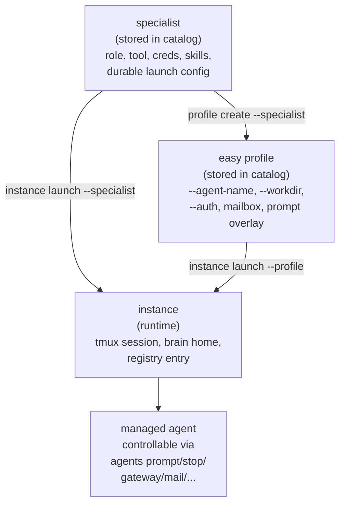

# Easy Specialists

The easy lane is the higher-level, opinionated path for project-local agents. It is built on three project-local objects: the **specialist** (the source definition), the optional **easy profile** (reusable birth-time launch configuration over one specialist), and the **instance** (the running managed agent). Specialists alone are enough for one-off setups; easy profiles add persistent launch context when the same specialist needs the same recurring `--name`, `--workdir`, mailbox, or auth lane each time.

For the shared semantic model that ties easy profiles to explicit recipe-backed launch profiles — including the precedence chain, prompt overlays, and how provenance flows into runtime metadata — see [Launch Profiles](launch-profiles.md).

## When to Use Each Easy-Lane Object

Houmao keeps the easy lane intentionally separate from the explicit `recipe + launch-profile` lane so that operators who want a smaller authoring surface do not have to answer every low-level launch question.

| Approach | Best for | What you author |
|---|---|---|
| **Easy specialist alone** | One-off setups, fast iteration, single-tool agents where the launch context changes every time. | One specialist plus repeated `--specialist`, `--name`, `--workdir`, `--auth` on each launch. |
| **Easy specialist + easy profile** | The same specialist relaunched with the same managed-agent name, working directory, credential lane, mailbox, and launch posture. | One specialist plus one or more easy profiles authored over that specialist. |
| **Explicit recipe + launch-profile** | Teams that need precise control over the underlying recipe (skills list, setup bundle, prompt-mode default, mailbox-source declaration) and over the full birth-time launch contract. | A recipe authored through `project agents recipes ...` plus a launch profile authored through `project agents launch-profiles ...`. |

An easy specialist is still a convenience layer over the full recipe system. Under the hood, `specialist create` generates the same projection structure (`roles/<name>/`, `tools/<tool>/auth/<creds>/`, the recipe under `.houmao/agents/presets/<name>.yaml`) that the low-level `project agents recipes ...` commands produce — it just does it in one step.

## Specialist → Easy Profile → Instance → Managed Agent



- A **specialist** is a stored source definition. It lives in the project catalog at `.houmao/catalog.sqlite` with content under `.houmao/content/`. The compatibility projection lands under `.houmao/agents/roles/<name>/` and `.houmao/agents/presets/<name>-<tool>-default.yaml`.
- An **easy profile** is an optional reusable birth-time launch configuration that targets exactly one specialist. It lives in the same shared launch-profile catalog family that backs explicit recipe-backed launch profiles, with `profile_lane=easy_profile`. The compatibility projection lands under `.houmao/agents/launch-profiles/<name>.yaml`.
- An **instance** is a running managed agent launched from either a specialist directly or from an easy profile. It gets its own tmux session, brain home, and registry entry.
- An instance IS a managed agent — it appears in `agents list`, can be targeted by `agents prompt`, `agents gateway`, `agents mail`, and all other managed-agent commands.

## Creating a Specialist

```bash
houmao-mgr project easy specialist create \
  --name my-reviewer \
  --tool claude \
  --system-prompt-file ./prompts/reviewer.md \
  --api-key "$ANTHROPIC_API_KEY"
```

Key options:

| Option | Default | Description |
|---|---|---|
| `--name` | Required | Specialist name. Used as the role name and default auth display name. |
| `--tool` | Required | Tool lane: `claude`, `codex`, or `gemini`. |
| `--system-prompt` / `--system-prompt-file` | None | Inline prompt text or path to a prompt markdown file. |
| `--credential` | `<name>-creds` | Auth display name. Defaults to `<specialist-name>-creds`. |
| `--api-key` | None | API key for the selected tool. |
| `--setup` | `default` | Preset setup name within the tool's setup bundles. |
| `--with-skill` | None | Repeatable. Path to a skill directory (must contain `SKILL.md`). |
| `--env-set` | None | Repeatable. Persistent environment variable as `NAME=value`. |
| `--no-unattended` | False | Use `prompt_mode: as_is` instead of the default `unattended` mode. |
| `--model` | None | Optional launch-owned default model name. |
| `--reasoning-level` | None | Optional launch-owned tool/model-specific reasoning preset index. |

Those two flags set the **launch-owned default** model selection that is written into the specialist-backed launch profile. After the agent is already running, headless prompt routes also support one-turn overrides through `houmao-mgr agents prompt`, `houmao-mgr agents gateway prompt`, and `houmao-mgr agents turn submit` with the same `--model` plus optional `--reasoning-level` shape. Those runtime overrides apply only to the submitted headless turn and never rewrite the specialist, launch profile, or persisted manifest defaults.

Claude-specific auth inputs now support four maintained credential lanes plus separate optional bootstrap state:

- API-key lane: `--api-key`
- Auth-token lane: `--claude-auth-token`
- OAuth-token lane: `--claude-oauth-token`
- Vendor login-state lane: `--claude-config-dir /path/to/claude-config-root`, which imports `.credentials.json` and companion `.claude.json` when present
- Optional bootstrap-only state: `--claude-state-template-file /path/to/claude_state.template.json`

`--claude-state-template-file` is not itself a credential-providing method. It only carries reusable Claude runtime bootstrap state. Optional `--base-url`, `--model`, and `--reasoning-level` can be layered onto any supported Claude credential lane. `--claude-model` remains available only as a temporary compatibility alias for `--model` on Claude specialists.

`--reasoning-level` is not a portable `1..10` scale anymore. It is interpreted relative to the resolved tool and model, one preset step at a time, and higher unused numbers saturate to that runtime's highest maintained Houmao preset.

Current maintained ladders:

- Claude: `1=low`, `2=medium`, `3=high`, and `4=max` only on models that support Claude `max`; higher numbers saturate to the highest supported Claude preset.
- Codex: current maintained Codex coding models such as `gpt-5.4`, `gpt-5.3-codex`, and `gpt-5.2-codex` use `1=low`, `2=medium`, `3=high`, `4=xhigh`; higher numbers saturate to `xhigh`. `0` and `minimal` are used only when the resolved Codex model ladder explicitly supports those native efforts.
- Gemini 3 models: Houmao preset rows currently map `1=(thinkingLevel LOW, thinkingBudget 1024)`, `2=(MEDIUM, 4096)`, `3=(HIGH, 16384)`; higher numbers saturate to the highest maintained row.
- Other Gemini models: `0=thinkingBudget 0`, `1=512`, `2=2048`, `3=4096`, `4=8192`, `5=16384`; higher numbers saturate to `16384`.

If you need finer vendor-native tuning than those maintained Houmao presets, omit `--reasoning-level` and manage the native tool config or environment directly.

For the file-level handling rules, including what `.credentials.json` vs `.claude.json` means and how to validate the lane locally, see [Claude Vendor Login Files](../reference/claude-vendor-login-files.md).

Example Claude specialist using maintained vendor login state:

```bash
houmao-mgr project easy specialist create \
  --name claude-reviewer \
  --tool claude \
  --system-prompt "You are a Claude-based code reviewer." \
  --claude-config-dir ~/.claude
```

Gemini-specific auth inputs now support two maintained lanes:

- API-key lane: `--api-key` with optional `--base-url` to persist `GEMINI_API_KEY` plus `GOOGLE_GEMINI_BASE_URL`.
- OAuth lane: `--gemini-oauth-creds /path/to/oauth_creds.json` to persist the Gemini CLI OAuth credential file. You can also combine this with the API-key lane in one specialist or auth bundle; Houmao preserves explicit API-key and endpoint settings instead of overwriting them.

Gemini easy specialists now follow the same easy unattended default as Claude and Codex: by default Houmao persists `launch.prompt_mode: unattended`, and `--no-unattended` remains the explicit opt-out to `as_is`. Gemini stays headless-only on the easy instance surface, so launch Gemini specialists with `houmao-mgr project easy instance launch --headless`.

Example Gemini specialist:

```bash
houmao-mgr project easy specialist create \
  --name gemini-reviewer \
  --tool gemini \
  --system-prompt "You are a Gemini-based code reviewer." \
  --api-key "$GEMINI_API_KEY" \
  --base-url https://gemini.example.test \
  --gemini-oauth-creds ./secrets/oauth_creds.json
```

## Editing a Specialist

Use `specialist set` for ordinary changes to an existing specialist. It patches the catalog-backed definition, rematerializes the `.houmao/agents/` compatibility projection, and preserves unspecified fields.

```bash
houmao-mgr project easy specialist set \
  --name my-reviewer \
  --system-prompt-file ./prompts/reviewer-v2.md \
  --with-skill ./skills/repo-map \
  --remove-skill old-notes \
  --prompt-mode unattended
```

Common patch options:

| Option | Effect |
|---|---|
| `--system-prompt` / `--system-prompt-file` | Replace the stored prompt from inline text or a file. |
| `--clear-system-prompt` | Store an empty prompt. |
| `--with-skill <dir>` | Import a skill directory and add it to the specialist. |
| `--add-skill <name>` / `--remove-skill <name>` | Add or remove an already projected project skill by name. |
| `--clear-skills` | Remove all skills from this specialist. Shared skill content remains available to other specialists. |
| `--setup <name>` | Switch to a different setup bundle for the specialist's current tool lane. |
| `--credential <name>` | Switch to another existing credential display name for the specialist's current tool lane. |
| `--prompt-mode unattended|as_is` / `--clear-prompt-mode` | Replace or clear the stored operator prompt mode. |
| `--model`, `--clear-model`, `--reasoning-level`, `--clear-reasoning-level` | Patch the launch-owned default model selection. |
| `--env-set NAME=value` / `--clear-env` | Replace the stored specialist env mapping, or clear it. |

`specialist set` requires at least one update or clear flag. It does not rename a specialist and does not move a specialist between tool lanes; create a new specialist when the name or tool lane should change. Changes affect future launches and profiles resolved from the updated specialist definition. Already-running easy instances keep their current runtime state.

## Easy Profiles

An easy profile is reusable, specialist-backed birth-time launch configuration. It targets exactly one specialist and stores the launch context that the same specialist would otherwise need to be re-typed for: managed-agent identity, working directory, auth override, prompt-mode override, durable env records, declarative mailbox config, launch posture, an optional prompt overlay, an optional gateway mail-notifier appendix default, and an optional memo seed for managed memory.

```bash
houmao-mgr project easy profile create \
  --name reviewer-default \
  --specialist my-reviewer \
  --agent-name reviewer-1 \
  --workdir /repos/review-target \
  --auth my-reviewer-creds \
  --prompt-mode unattended \
  --gateway-mail-notifier-appendix-text "Prioritize release-blocking mail." \
  --no-gateway
```

Key options:

| Option | Default | Description |
|---|---|---|
| `--name` | Required | Easy profile name. |
| `--specialist` | Required | Source specialist name. The profile targets exactly one specialist. |
| `--agent-name` | None | Optional default managed-agent name; lets later `instance launch --profile` omit `--name`. |
| `--agent-id` | None | Optional default managed-agent id. |
| `--workdir` | None | Optional default working directory. |
| `--auth` | None | Optional default auth display-name override. The stored relationship resolves through auth-profile identity, so later auth rename stays valid. |
| `--prompt-mode` | None | Optional `unattended` or `as_is` operator prompt-mode override. |
| `--env-set` | None | Repeatable durable launch env record (`NAME=value`). |
| `--mail-transport` | None | Optional declarative mailbox transport (`filesystem` or `stalwart`). |
| `--mail-root`, `--mail-principal-id`, `--mail-address`, `--mail-base-url`, `--mail-jmap-url`, `--mail-management-url` | None | Optional declarative mailbox identity and endpoints (Stalwart-only fields apply only when `--mail-transport stalwart`). |
| `--headless` | False | Persist headless launch as the default posture. |
| `--no-gateway` | False | Persist gateway auto-attach disabled. |
| `--gateway-port` | None | Persist one fixed loopback gateway port for launches from this profile. |
| `--managed-header`, `--no-managed-header` | `inherit` | Store managed prompt-header policy for launches from this profile. |
| `--managed-header-section SECTION=enabled|disabled` | Section defaults | Repeatable stored policy for one managed-header section. Supported sections are `identity`, `memo-cue`, `houmao-runtime-guidance`, `automation-notice`, `task-reminder`, and `mail-ack`. |
| `--prompt-overlay-mode` | None | Optional `append` or `replace` prompt overlay. |
| `--prompt-overlay-text` | None | Inline prompt-overlay text. |
| `--prompt-overlay-file` | None | Path to a prompt-overlay text file (stored as managed file-backed content). |
| `--gateway-mail-notifier-appendix-text` | None | Optional runtime guidance seeded into gateway mail-notifier state when launching from this profile. It does not enable notifier polling. |
| `--memo-seed-text`, `--memo-seed-file`, `--memo-seed-dir` | None | Optional managed-memory memo seed. Use text or file for one memo file, or a directory containing `houmao-memo.md` and/or `pages/`. |

Easy profiles are stored as the same kind of catalog object that backs explicit recipe-backed launch profiles, but the easy lane keeps the authoring surface smaller and intentionally specialist-backed. The persisted profile lives in the catalog with `profile_lane=easy_profile` and `source_kind=specialist`, and projects into `.houmao/agents/launch-profiles/<name>.yaml` for low-level inspection.

Easy profile creation may also store managed prompt-header policy. `--managed-header` stores whole-header `enabled`, `--no-managed-header` stores whole-header `disabled`, and omitting both stores `inherit`, which falls back to Houmao's default enabled managed-header behavior later at launch time. Repeatable `--managed-header-section SECTION=enabled|disabled` stores sparse section policy; omitted sections use their section defaults.

Easy profiles may also store gateway mail-notifier appendix text through `--gateway-mail-notifier-appendix-text`. `profile set` preserves the stored appendix when the flag is omitted and removes it with `--clear-gateway-mail-notifier-appendix`. The stored appendix seeds runtime gateway notifier state on launches from the profile, but later live notifier edits such as `houmao-mgr agents gateway mail-notifier enable --appendix-text ...` remain runtime-owned and do not rewrite the easy profile.

Easy profiles may store a memo seed through `--memo-seed-text`, `--memo-seed-file`, or `--memo-seed-dir`. `profile set` supports the same seed inputs for replacing the stored seed and `--clear-memo-seed` to remove the stored seed. Memo seeds always replace only the components represented by the seed source: text and file seeds touch only `houmao-memo.md`, while directory seeds touch `houmao-memo.md` only when that file is present and touch pages only when `pages/` is present. Omitted memo-seed inputs are preserved on patch edits and cleared on same-name replacement.

Manage existing easy profiles with:

```bash
houmao-mgr project easy profile list
houmao-mgr project easy profile get --name reviewer-default
houmao-mgr project easy profile set --name reviewer-default --workdir /repos/next-target
houmao-mgr project easy profile remove --name reviewer-default
```

`profile set` patches stored easy-profile defaults for future launches while preserving unspecified fields such as mailbox config, prompt overlay, gateway mail-notifier appendix, or memo seed. Use it for ordinary edits instead of removing and recreating the profile.

If the profile should be rebuilt over a different specialist or should intentionally drop old optional defaults, run `project easy profile create --name reviewer-default --specialist <specialist> ... --yes`. Same-name replacement is lane-bounded: an easy-profile replacement cannot replace an explicit recipe-backed launch profile with the same name.

`profile remove` deletes only the easy profile definition. It does not remove the specialist that the profile targeted.

When no active project overlay exists, `project easy profile create` ensures `<cwd>/.houmao` exists before persisting the profile, matching the bootstrap behavior of `project easy specialist create`.

## Launching an Instance

You can launch from a specialist directly, or from a stored easy profile. Exactly one of `--specialist` and `--profile` is required, and the two selectors are mutually exclusive.

```bash
# Direct specialist launch — supply launch context every time.
houmao-mgr project easy instance launch \
  --specialist my-reviewer \
  --name reviewer-1 \
  --workdir ../review-target

# Easy-profile launch — defaults come from the stored profile.
houmao-mgr project easy instance launch --profile reviewer-default
```

When `--profile` is used, the command derives the source specialist from the stored profile, applies easy-profile-stored defaults (managed-agent identity, workdir, auth override, prompt mode, durable env records, declarative mailbox config, headless and gateway posture, prompt overlay, any gateway mail-notifier appendix default, and any stored memo seed), and uses the active project overlay as the authoritative source context. Auth remains user-facing by display name even though the stored profile resolves it through auth-profile identity. `--name` may be omitted when the profile stores a default managed-agent name; otherwise `--name` is still required.

Stored gateway mail-notifier appendix defaults are written into the launched session's runtime notifier state while polling remains disabled. Stored memo seeds are applied before prompt composition and provider startup, so the launched agent begins with the represented `houmao-memo.md` and/or `pages/` state already present. Direct specialist launches do not apply these profile-backed defaults because there is no profile to resolve.

Direct launch-time overrides such as `--auth`, `--workdir`, `--name`, `--mail-transport`, `--mail-root`, `--mail-account-dir`, `--managed-header` or `--no-managed-header`, repeatable `--managed-header-section SECTION=enabled|disabled`, and `--append-system-prompt-text` or `--append-system-prompt-file` win over easy-profile defaults but **never rewrite the stored easy profile**. The next launch from the same profile sees the original stored defaults again.

By default, easy instance launch also auto-attaches a live loopback gateway for the new session on `127.0.0.1` with a system-assigned port. Use `--no-gateway` to skip that default for one launch, or `--gateway-port <port>` when you want one fixed loopback listener port on the current launch. The `--gateway-tui-*` options tune gateway-owned TUI tracking timings for the current launch only; they do not rewrite the selected specialist or easy profile. If the managed session starts but gateway attachment fails afterward, Houmao keeps the session running and reports the attach error together with the manifest/session identity so you can retry or stop it explicitly.

Key options:

| Option | Default | Description |
|---|---|---|
| `--specialist` | One of these required | Specialist name to launch from. Mutually exclusive with `--profile`. |
| `--profile` | One of these required | Easy profile name to launch from. Mutually exclusive with `--specialist`. |
| `--name` | Required (or supplied by profile) | Managed-agent instance name. Optional only when `--profile` is used and the selected profile stores a default managed-agent name. |
| `--workdir` | None | Optional runtime working directory override for the launched agent session. |
| `--headless` | False | Launch in detached/background mode. |
| `--no-gateway` | False | Skip the default launch-time gateway attach for this instance. |
| `--gateway-port` | Auto | Request one fixed loopback gateway listener port for this launch. |
| `--gateway-tui-watch-poll-interval-seconds` | Default | One-shot gateway-owned TUI watch poll interval override. |
| `--gateway-tui-stability-threshold-seconds` | Default | One-shot gateway-owned TUI stability threshold override. |
| `--gateway-tui-completion-stability-seconds` | Default | One-shot gateway-owned TUI completion stability guard-time override. |
| `--gateway-tui-unknown-to-stalled-timeout-seconds` | Default | One-shot unknown-to-stalled timeout override. |
| `--gateway-tui-stale-active-recovery-seconds` | Default | One-shot stale-active recovery safeguard-time override. |
| `--gateway-tui-final-stable-active-recovery-seconds` | Default | One-shot final stable-active recovery safeguard-time override. |
| `--managed-header`, `--no-managed-header` | Profile policy, otherwise enabled | Force-enable or disable the Houmao-managed prompt header for one launch. |
| `--managed-header-section SECTION=enabled|disabled` | Profile section policy, otherwise section defaults | Repeatable one-shot managed-header section override for this launch. |
| `--append-system-prompt-text`, `--append-system-prompt-file` | None | Mutually exclusive one-shot appendix input appended after any resolved prompt overlay for the current launch only. |
| `--session-name` | None | Optional tmux session name override. |
| `--auth` | Specialist's credential or profile default | Optional auth bundle override. |
| `--env-set` | None | Repeatable. One-off launch environment variable. |
| `--mail-transport` | None | Mailbox transport: `filesystem`. |
| `--mail-root` | None | Shared filesystem mailbox root (when using mailbox). |
| `--mail-account-dir` | None | Optional private filesystem mailbox directory to symlink into the shared root. |

Gemini specialists remain headless-only here. Use `--headless` when launching a Gemini specialist through `project easy instance launch`.

`--workdir` changes only the launched agent cwd. The selected project overlay and stored specialist remain the launch source for recipe resolution plus overlay-local runtime, managed-agent memory, and mailbox defaults.

`--no-gateway` and `--gateway-port` are mutually exclusive because one launch cannot both skip gateway attach and request a listener port. `--no-gateway` also cannot be combined with any `--gateway-tui-*` override because those timings only affect an attached gateway sidecar.

`--managed-header` and `--no-managed-header` are mutually exclusive. When neither flag is supplied, easy-instance launch inherits managed-header policy from the selected easy profile when one is present; otherwise it falls back to the default enabled behavior. `--managed-header-section SECTION=enabled|disabled` resolves per section and wins over stored profile section policy for that launch only.

`--append-system-prompt-text` and `--append-system-prompt-file` are also mutually exclusive. When supplied, the appendix is appended after any easy-profile prompt overlay inside the current launch's structured `<houmao_system_prompt>` and is not persisted back into the selected specialist or profile.

The previous easy-launch `--yolo` override was removed in 0.3.x. Startup autonomy is owned by the stored specialist `launch.prompt_mode` (or, when launching from an easy profile that overrides it, by the profile's stored prompt-mode override): `unattended` allows maintained no-prompt provider posture, while `as_is` leaves provider startup behavior untouched.

## Managing Specialists, Easy Profiles, and Instances

```bash
# Specialists
houmao-mgr project easy specialist list
houmao-mgr project easy specialist get --name my-reviewer
houmao-mgr project easy specialist remove --name my-reviewer

# Easy profiles
houmao-mgr project easy profile list
houmao-mgr project easy profile get --name reviewer-default
houmao-mgr project easy profile remove --name reviewer-default

# Instances
houmao-mgr project easy instance list
houmao-mgr project easy instance get --name reviewer-1
houmao-mgr project easy instance stop --name reviewer-1
```

`project easy instance list` and `project easy instance get` report the originating easy-profile identity in addition to the originating specialist when runtime-backed state makes both resolvable. Inspection output never includes secret credential values inline; auth is reported by display name only.

## Storage Layout

Easy-lane data is stored across the project overlay as follows:

| Location | Content |
|---|---|
| `.houmao/catalog.sqlite` | Specialist metadata, easy-profile metadata, and references to managed content. Both easy profiles and explicit launch profiles share the same catalog launch-profile family. |
| `.houmao/content/prompts/<name>.md` | System prompt file (and prompt-overlay text files when an easy profile uses `--prompt-overlay-file`). |
| `.houmao/content/auth/<tool>/<opaque-bundle-ref>/` | Auth bundle directory tree stored by opaque bundle ref. The user-facing auth display name lives in the catalog. |
| `.houmao/content/skills/<skill>/` | Skill directory copies. |
| `.houmao/agents/roles/<name>/` | Generated role projection with `system-prompt.md`. |
| `.houmao/agents/presets/<recipe>.yaml` | Generated recipe projection (also addressable through the `presets` compatibility-alias CLI). |
| `.houmao/agents/launch-profiles/<profile>.yaml` | Easy-profile and explicit launch-profile compatibility projection. |

## See Also

- [Launch Profiles](launch-profiles.md) — shared conceptual model for easy profiles and explicit recipe-backed launch profiles, including the precedence chain and prompt overlays.
- [houmao-mgr project easy](../reference/cli/houmao-mgr.md) — CLI reference for `project easy specialist`, `project easy profile`, and `project easy instance` commands.
- [Agent Definition Directory](agent-definitions.md) — full directory structure reference, including `.houmao/agents/launch-profiles/`.
- [Project-Aware Operations](../reference/system-files/project-aware-operations.md) — how commands resolve project context.
