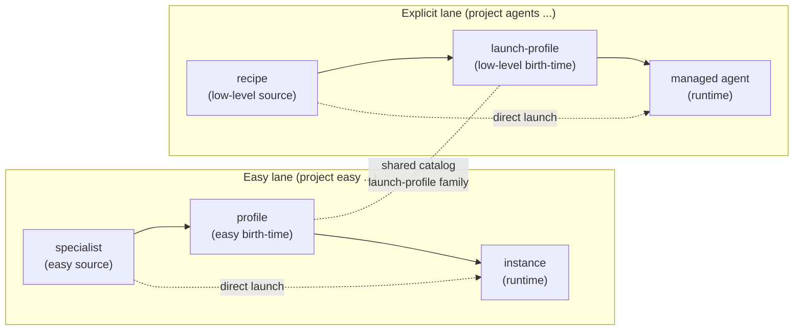
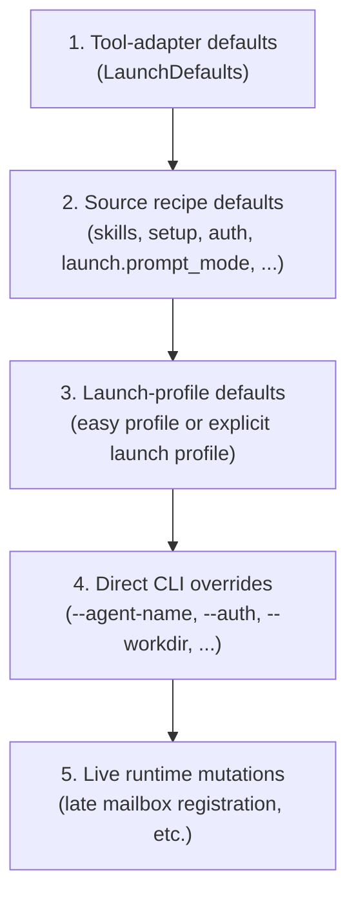

# Launch Profiles

Launch profiles are reusable, operator-owned, **birth-time** launch configuration. They are distinct from reusable source definitions (specialists, recipes), and distinct from live managed-agent instances. Persisting, listing, inspecting, or removing a launch profile does not by itself create, stop, or mutate a live instance.

This page is the conceptual home for the launch-profile model. Other docs link here instead of restating the precedence chain or the easy-versus-explicit lane split inline.

## Why Launch Profiles Exist

A specialist or a recipe answers the question *what is this agent?* — its role prompt, its tool, its skills, its setup, its default credentials. But the same specialist usually needs the same recurring **launch context**: the managed-agent name, the working directory, the credential override for this lane, the mailbox binding, the gateway posture, durable env records, an optional prompt overlay, and sometimes a reusable managed-memory memo seed.

Without a stored launch profile, an operator has to remember and re-type that launch context every time. With one, the launch context becomes a named, persisted, project-local object that both `houmao-mgr` and the system-skill-driven agent surfaces can reference by name.

## Two User-Facing Lanes Over One Shared Model

Houmao keeps the easy-versus-explicit operator split that already exists for source definitions, and surfaces launch profiles through two distinct authoring lanes:



Both lanes write into one shared catalog-backed launch-profile object family, even though the user-facing nouns differ. The split is deliberate:

- **Easy lane** uses the noun `profile`, is specialist-backed, and exposes a smaller, opinionated authoring surface. It is the right place to start when you want reusable defaults without answering every low-level launch question. CLI: `houmao-mgr project easy profile ...`.
- **Explicit lane** uses the noun `launch-profile`, is recipe-backed, and exposes the fuller low-level launch contract. It is the right place to be when you need precise control over the underlying source recipe and the full launch field set. CLI: `houmao-mgr project agents launch-profiles ...`.

A specialist-backed easy profile and a recipe-backed explicit launch profile are stored as the same kind of catalog object. The difference is the source lane (`specialist` vs `recipe`) and the profile lane (`easy_profile` vs `launch_profile`) recorded on each entry. Both lanes project into the same compatibility tree under `.houmao/agents/launch-profiles/<name>.yaml`.

## Source Versus Birth-Time Taxonomy

The four operator-authored object families and the two derived runtime objects form one consistent taxonomy:

| Object | Lane | Catalog-stored | Projected to `.houmao/agents/` | Authored by | Notes |
|---|---|---|---|---|---|
| **specialist** | easy | yes | `roles/<name>/`, `presets/<recipe>.yaml`, `tools/<tool>/auth/<bundle-ref>/` | operator (easy) | The reusable easy-lane source definition: role + tool + skills + setup + default auth + durable launch posture. |
| **recipe** | explicit | yes | `presets/<name>.yaml` | operator (explicit) | The reusable low-level source definition. The CLI surface is `project agents recipes ...`; `project agents presets ...` is a compatibility alias for the same files. |
| **easy profile** | easy | yes | `launch-profiles/<name>.yaml` | operator (easy) | Specialist-backed reusable birth-time launch configuration. Targets exactly one specialist. |
| **explicit launch profile** | explicit | yes | `launch-profiles/<name>.yaml` | operator (explicit) | Recipe-backed reusable birth-time launch configuration. Targets exactly one recipe. |
| **runtime `LaunchPlan`** | derived | no | no | system | Composed at launch time from the manifest, role, backend, and working directory. Not user-authored. Not persisted as project-local source. |
| **live managed-agent instance** | runtime | no | no | system | The running tmux-backed process plus its registry record, manifest, and gateway state. |

The two profile rows share one underlying catalog model. The CLI surfaces are split for UX reasons, not because the storage is different.

## What Launch Profiles Capture

A launch profile may store, with no inline secrets:

- a source reference (specialist for easy, recipe for explicit),
- managed-agent identity defaults (`--agent-name`, optionally `--agent-id`),
- a default working directory,
- an auth override selected by display name (the actual credentials still live in the auth bundle, while the stored relationship resolves through auth-profile identity),
- an operator prompt-mode override (`unattended` or `as_is`),
- durable non-secret env records,
- declarative mailbox configuration (transport, root, address, principal id, and Stalwart-only fields when applicable),
- launch posture defaults (`headless`, gateway auto-attach, fixed loopback gateway port),
- a relaunch-only provider chat-session policy for future `agents relaunch` operations,
- a managed prompt-header whole-header policy (`inherit`, `enabled`, or `disabled`) plus optional per-section policy (`identity`, `memo-cue`, `houmao-runtime-guidance`, `automation-notice`, `task-reminder`, and `mail-ack` set to `enabled` or `disabled`),
- a prompt overlay (mode plus inline text or a referenced file),
- an optional memo seed for managed memory (`houmao-memo.md` and/or contained `pages/`) plus one apply policy.

Inline prompt-overlay text is stored inline. File-referenced overlays are kept as managed file-backed content under the overlay-owned content roots, and the catalog stores only the reference. This keeps long prompt overlays out of the catalog database itself.

## Effective-Launch Precedence

When an operator launches from a source plus a launch profile plus direct CLI overrides, the effective launch inputs are composed from five layers in order:



Rules:

- Fields omitted by a higher-priority layer survive from the next lower-priority layer.
- Direct CLI overrides win over launch-profile defaults but **never rewrite the stored launch profile**. Overrides such as `--agent-name`, `--agent-id`, `--auth`, and `--workdir` apply to one launch and are dropped on the next launch from the same profile.
- Launch-time force takeover is also override-only. `--force [keep-stale|clean]` applies to the current `agents launch` or `project easy instance launch` invocation, never persists into the stored profile, and never changes what the next launch from that profile will request by default.
- Bare `--force` means `keep-stale`: Houmao resolves the live-owner conflict, reuses the predecessor managed home, and leaves untouched stale artifacts alone. If stale leftovers break the replacement launch, the operator must clean or correct them explicitly.
- `--force clean` is the explicit destructive variant: Houmao stops the predecessor and removes only predecessor-owned replaceable launch artifacts before rebuilding, while preserving unrelated operator-owned paths and shared mailbox message stores.
- Stored relaunch chat-session policy is not a birth-time launch default and does not affect first launch. It is carried as secret-free launch-profile provenance so later `agents relaunch` can decide whether the provider TUI should start fresh, ask the provider for its latest chat, or resume an exact provider session id.
- Live runtime mutations such as late filesystem mailbox registration are runtime-owned. They affect the running session and the runtime manifest, but they never rewrite the stored launch profile.
- For easy profiles, the easy lane compiles down through the same five layers — the specialist resolves into a recipe-backed source layer before the launch-profile layer applies.

## Relaunch Chat Sessions

A launch profile may store a relaunch-only `chat_session` policy under its projected `relaunch` block. The supported modes are:

- `new` — relaunch starts a fresh provider chat.
- `tool_last_or_new` — relaunch asks the provider CLI to continue its latest chat when supported, or create one according to the provider's native behavior.
- `exact` — relaunch resumes the exact provider chat id stored as `id`.

This policy applies only to future instances launched from the profile. It does not mutate already-running agents, recipes, specialists, or the provider's own chat store. A direct `houmao-mgr agents relaunch --chat-session-mode ...` override wins for that one relaunch and does not rewrite the stored profile.

## Prompt Overlays

A launch profile may declare a prompt overlay. The supported modes are:

- `append` — the effective role prompt is the source role prompt followed by the overlay text.
- `replace` — the effective role prompt is the overlay text instead of the source role prompt.

The effective role prompt is composed once, **before** backend-specific role injection planning begins. Resumed turns do not replay the overlay as a separate second bootstrap step. From the backend's perspective, the prompt overlay is part of the role prompt that role injection plans against.

Prompt overlays are inline text or a referenced file. File-backed overlays remain managed content under the overlay-owned content roots, and the catalog stores only the reference; the catalog does not duplicate large overlay payloads inside the SQLite store itself.

## Memo Seeds

A launch profile may also declare a **memo seed**. Unlike a prompt overlay, a memo seed does not change the role prompt. Instead it writes managed-memory content into the launched agent's fixed `houmao-memo.md` file and/or contained `pages/` tree.

Memo seeds are applied **before** prompt composition and provider startup. That means the managed prompt header, prompt overlay, and provider bootstrap all see the already-seeded `houmao-memo.md` path and page tree. Launch-time direct overrides such as `--agent-name`, `--auth`, `--workdir`, or prompt appendix flags do not rewrite the stored memo seed, and direct `agents launch --agents ...` or `project easy instance launch --specialist ...` launches do not apply one because no reusable launch profile was selected.

Supported seed source forms are:

- `--memo-seed-text` — inline memo text stored as managed file-backed content.
- `--memo-seed-file` — one UTF-8 text file stored as managed file-backed content.
- `--memo-seed-dir` — one directory tree stored as managed tree-backed content.

Directory seeds are intentionally narrow. The top level may contain only `houmao-memo.md` and/or `pages/`. `houmao-memo.md` seeds the fixed memo file. `pages/` seeds contained memory pages. All files must be UTF-8 text without NUL bytes, and symlinks are rejected.

The seed source controls which managed-memory components are replaced. Text and file seeds touch only `houmao-memo.md`. Directory seeds touch `houmao-memo.md` only when the seed directory contains `houmao-memo.md`, and touch pages only when the seed directory contains `pages/`. Omitted components are left unchanged.

Memo seeds always use source-scoped replacement semantics. A memo-only seed replaces only `houmao-memo.md` and preserves pages. A pages-only directory seed clears then rewrites only `pages/` and preserves `houmao-memo.md`. A directory seed containing both `houmao-memo.md` and `pages/` replaces both represented components.

This means `--memo-seed-text ''` stores an intentional empty memo seed for future profile-backed launches without clearing pages. `--clear-memo-seed` is different: it removes the stored profile seed configuration, so future launches do not apply a memo seed at all. To replace pages only, use `--memo-seed-dir` with a directory that contains `pages/` and omits `houmao-memo.md`; an empty `pages/` directory is an explicit request to clear pages.

Memo seeds and prompt overlays are complementary. Use a prompt overlay when you want to change the launch prompt seen by the provider. Use a memo seed when you want durable managed-memory state available inside the agent workspace from the first turn onward.

## Managed Prompt Header

Managed launches render one short Houmao-owned prompt header by default. For current managed launches, the final prompt is rooted at `<houmao_system_prompt>`, the header appears in `<managed_header>`, and the remaining prompt content appears in `<prompt_body>`. The header tells the agent that it is Houmao-managed, includes the resolved managed-agent name and id, points the agent at the resolved absolute `houmao-memo.md` file, makes memo reading mandatory before planning or acting at each prompt turn and context boundary, points the agent toward `houmao-mgr` and other supported Houmao system interfaces for Houmao-related work, and tells it to avoid unsupported ad hoc probing when a supported Houmao interface exists. The header stays general-purpose and does not name individual packaged guidance entries.

Prompt composition order is:

1. source role prompt,
2. launch-profile prompt overlay resolution,
3. one-shot launch appendix append when `agents launch` or `project easy instance launch` supplies `--append-system-prompt-text` or `--append-system-prompt-file`,
4. structured render into `<houmao_system_prompt>`,
5. backend-specific prompt injection.

That means backend-specific role injection sees one already-composed effective launch prompt. The runtime does not replay the managed header, overlay, or appendix later as separate bootstrap turns.

The launch appendix is launch-owned and append-only in this workflow. It affects only the current launch, appears after the resolved profile overlay inside `<prompt_body>`, and never rewrites the source role prompt or the stored launch profile.

The managed header is controlled by the same precedence model as other birth-time launch defaults:

- direct launch-time override via `--managed-header` or `--no-managed-header`,
- stored launch-profile policy (`inherit`, `enabled`, `disabled`),
- default enabled behavior when neither of the above forces a result.

`inherit` means "use the default enabled behavior." If you need a role to stay effectively promptless or you want one launch to skip the Houmao-owned prelude, use `--no-managed-header` for that launch or store `disabled` on the relevant launch profile.

Individual header sections are controlled separately with repeatable `--managed-header-section SECTION=enabled|disabled` on `houmao-mgr agents launch`, `houmao-mgr project easy instance launch`, `houmao-mgr project agents launch-profiles add|set`, and `houmao-mgr project easy profile create|set`. Stored profile section policy is sparse: omitted sections use their defaults, `identity`, `memo-cue`, `houmao-runtime-guidance`, and `automation-notice` default enabled, and `task-reminder` plus `mail-ack` default disabled. `--clear-managed-header-section SECTION` removes one stored section policy entry on profile `set`, and `--clear-managed-header-sections` removes all stored section policy entries. Whole-header policy remains the outer gate, so `--no-managed-header` suppresses rendering even if one or more sections resolve enabled.

## Launch-Profile Provenance In Inspection Output

When a managed agent was launched from a reusable launch profile, the build manifest and the runtime launch metadata preserve secret-free provenance sufficient for inspection and replay:

- whether the launch originated from a specialist source or a recipe source,
- whether the birth-time reusable config came from an easy profile or an explicit launch profile,
- the originating profile name when available.

Inspection commands surface that provenance:

- `houmao-mgr project easy instance list` and `houmao-mgr project easy instance get` report the originating easy-profile identity when runtime-backed state makes it resolvable, and continue to report the originating specialist when available.
- `houmao-mgr agents state` and `houmao-mgr agents list` report the same lane and profile information for explicit launch-profile-backed managed agents.
- Inspection output never includes secret credential values inline; auth is reported by display name only.

## Picking A Lane

Use the easy lane (`project easy specialist` plus `project easy profile`) when:

- you want one specialist with a small set of opinionated defaults,
- you want the same specialist relaunched with the same managed-agent name, workdir, mailbox, and credential lane each time,
- you do not want to hand-author the underlying recipe.

Use the explicit lane (`project agents recipes` plus `project agents launch-profiles`) when:

- you need precise control over the source recipe (skills list, setup bundle, prompt-mode default, mailbox-source declaration, etc.),
- you want birth-time defaults that are intentionally low-level and visible,
- the team checks recipes into the project so the easy lane's specialist convenience layer is not the right authoring surface.

Both lanes can coexist in the same project overlay. The shared catalog model keeps each lane explicit, so incompatible pre-1.0 catalog changes should be handled by recreating the affected project overlay instead of relying on an in-place migration.

## Editing Profiles

Direct launch-time overrides and stored profile edits are separate. `project easy instance launch ... --workdir <path>` or `agents launch --launch-profile <profile> --workdir <path>` affects only that launch; it does not rewrite the reusable profile.

Use the patch command for ordinary stored-default edits:

```bash
# Easy lane
houmao-mgr project easy profile set --name <profile> --workdir /repos/next-target

# Explicit lane
houmao-mgr project agents launch-profiles set --name <profile> --workdir /repos/next-target
```

Patch commands preserve unspecified stored fields, so existing mailbox config, prompt overlay, memo seed, managed-header whole-header policy, managed-header section policy, and other advanced blocks remain in place unless you pass the matching `--clear-*` option.

Use same-name replacement only when you want recreate semantics:

```bash
# Easy lane replacement
houmao-mgr project easy profile create --name <profile> --specialist <specialist> --yes

# Explicit lane replacement
houmao-mgr project agents launch-profiles add --name <profile> --recipe <recipe> --yes
```

Replacement is lane-bounded and clears omitted optional fields, including any previously stored memo seed. An easy-profile replacement cannot replace an explicit recipe-backed launch profile with the same name, and an explicit launch-profile replacement cannot replace an easy profile.

## CLI Surfaces

Canonical authoring surfaces:

```bash
# Easy lane
houmao-mgr project easy specialist create --name <name> --tool <tool> ...
houmao-mgr project easy profile create --name <profile> --specialist <name> ...
houmao-mgr project easy profile set --name <profile> ...
houmao-mgr project easy instance launch --profile <profile>           # easy-profile-backed
houmao-mgr project easy instance launch --specialist <name> --name <managed-name>

# Explicit lane
houmao-mgr project agents recipes add --name <recipe> --role <role> --tool <tool> ...
houmao-mgr project agents launch-profiles add --name <profile> --recipe <recipe> ...
houmao-mgr agents launch --launch-profile <profile>                   # launch-profile-backed
houmao-mgr agents launch --agents <selector> --provider <provider>    # direct recipe selector
```

`--profile` and `--specialist` cannot be combined on `project easy instance launch`. `--launch-profile` and `--agents` cannot be combined on `agents launch`.

`project agents presets ...` remains valid as a compatibility alias for the same files that `project agents recipes ...` administers; both names map to `.houmao/agents/presets/<name>.yaml`.

For full option tables and edge cases, see the [`houmao-mgr` CLI reference](../reference/cli/houmao-mgr.md).

## See Also

- [Easy Specialists](easy-specialists.md) — operator workflow for the easy lane (specialist → optional easy profile → instance).
- [Agent Definition Directory](agent-definitions.md) — directory layout, projection paths, and the canonical recipe authoring path.
- [Managed Agent Memory](managed-memory-dirs.md) — memory roots, free-form memo files, pages, and default paths.
- [`houmao-mgr` CLI reference](../reference/cli/houmao-mgr.md) — authoritative option tables for `project easy profile`, `project agents launch-profiles`, and `agents launch --launch-profile`.
- [Launch Overrides](../reference/build-phase/launch-overrides.md) — how launch-profile defaults compose with adapter defaults and direct overrides during build.
- [Launch Plan](../reference/run-phase/launch-plan.md) — how launch-profile-derived inputs flow through the manifest into the run-phase `LaunchPlan`.
