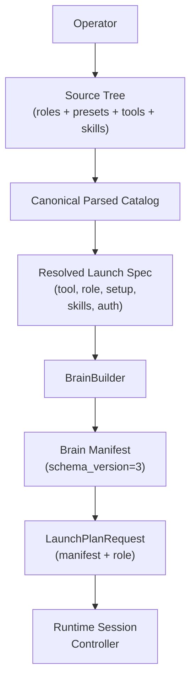

# Architecture Overview

Houmao orchestrates CLI-based agents (Codex, Claude, Gemini) as real tmux-backed processes with isolated runtime homes. The lifecycle still has two phases, but the reusable source model is now `preset + setup + auth` rather than `recipe + config-profile + credential-profile`.

## Two-Phase Lifecycle



## Build Phase

`src/houmao/agents/brain_builder.py` materializes a disposable runtime home from explicit inputs or one resolved preset.

### Key Types

**`BuildRequest`** captures what to build:

| Field | Description |
|---|---|
| `agent_def_dir` | Agent definition root |
| `tool` | CLI tool name |
| `skills` | Selected skill names |
| `setup` | Selected checked-in setup bundle |
| `auth` | Effective auth bundle |
| `preset_path` | Optional resolved preset path for provenance |
| `runtime_root` | Where to create the runtime home |
| `mailbox` | Optional mailbox binding |
| `agent_name` / `agent_id` / `home_id` | Launch-time identity metadata |

**`BuildResult`** captures what was built:

| Field | Description |
|---|---|
| `home_id` | Unique runtime-home id |
| `home_path` | Materialized runtime home |
| `manifest_path` | Emitted brain manifest path |
| `launch_helper_path` | Generated launch helper |
| `launch_preview` | Human-readable launch command |
| `manifest` | Full manifest payload |

**`AgentPreset`** is the parsed declarative preset stored at `roles/<role>/presets/<tool>/<setup>.yaml`.

**`ToolAdapter`** is the per-tool projection and launch contract stored at `tools/<tool>/adapter.yaml`.

## Run Phase

`src/houmao/agents/realm_controller/` reads the built manifest, pairs it with a role package, and resolves a backend-specific `LaunchPlan`.

### Key Types

**`LaunchPlanRequest`**

| Field | Description |
|---|---|
| `brain_manifest` | Built manifest from the build phase |
| `role_package` | Role name and system prompt |
| `backend` | Target backend kind |
| `working_directory` | Session working directory |

**`LaunchPlan`**

| Field | Description |
|---|---|
| `backend` | Target backend kind |
| `tool` | CLI tool name |
| `executable` | Tool executable |
| `args` | Final launch args |
| `working_directory` | Session working directory |
| `home_env_var` / `home_path` | Runtime-home selector |
| `env` | Final environment map |
| `role_injection` | Backend-specific prompt injection plan |
| `mailbox` | Optional resolved mailbox config |

## Source Layout

| Path | Responsibility |
|---|---|
| `src/houmao/agents/definition_parser.py` | Parse `agents/` source tree into the canonical catalog |
| `src/houmao/agents/native_launch_resolver.py` | Resolve `--agents` selectors onto presets |
| `src/houmao/agents/brain_builder.py` | Build phase: resolved inputs -> runtime home + manifest |
| `src/houmao/agents/realm_controller/launch_plan.py` | Manifest + role -> backend launch plan |
| `src/houmao/agents/realm_controller/backends/` | Backend implementations |
| `src/houmao/srv_ctrl/commands/agents/core.py` | `houmao-mgr agents launch` preset-backed flow |

## Project CLI Views

The repo-local operator surface is intentionally split into one low-level view and two user-facing convenience views:

```text
houmao-mgr project
├── init | status
├── agents
│   ├── roles ...
│   └── tools <tool> ...
├── easy
│   ├── specialist ...
│   └── instance ...
└── mailbox
    ├── init | status | register | unregister | repair | cleanup
    ├── accounts list|get
    └── messages list|get
```

- `project agents ...` maps directly to the canonical `.houmao/agents/` source tree.
- `project easy ...` lets users author reusable specialists and view running instances without hand-editing the tree.
- `project mailbox ...` mirrors the generic `houmao-mgr mailbox ...` operations, but automatically targets `<project-root>/.houmao/mailbox`.
