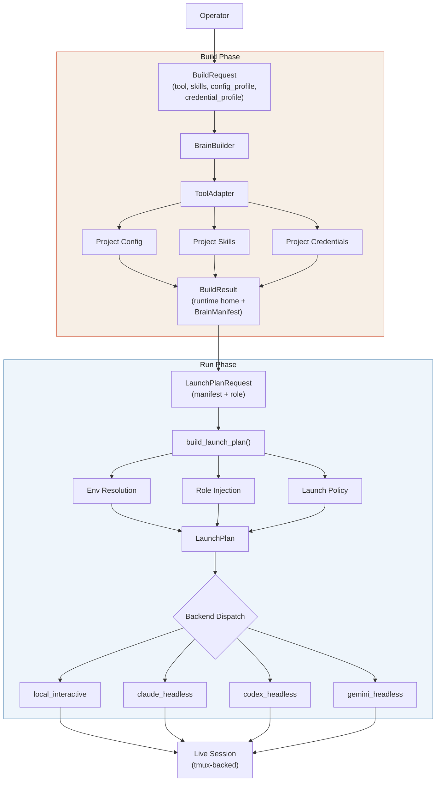
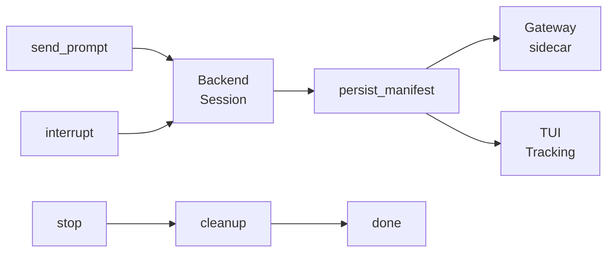

# Architecture Overview

Houmao orchestrates teams of CLI-based AI agents (Codex, Claude, Gemini) as real tmux-backed processes, each with its own isolated disk state and native CLI experience. The system follows a strict **two-phase lifecycle**: first build an agent's brain (configuration + capabilities), then run it as a live session.

## Two-Phase Lifecycle

### System Architecture

### Runtime Control Loop

## Build Phase

The build phase is driven by `BrainBuilder` in `src/houmao/agents/brain_builder.py`. It takes a `BuildRequest` — either an explicit set of parameters or a reference to a `BrainRecipe` — resolves everything against an **agent definition directory**, and produces a `BuildResult` containing a disposable runtime home on disk.

### Key Types

**`BuildRequest`** captures what to build:

| Field | Description |
|---|---|
| `agent_def_dir` | Path to the agent definition directory |
| `tool` | Which CLI tool to target (e.g., `claude`, `codex`, `gemini`) |
| `skills` | List of skill names to include |
| `config_profile` | Secret-free config profile name |
| `credential_profile` | Local-only credential profile name |
| `recipe_path` | Path to a `BrainRecipe` YAML (alternative to explicit fields) |
| `runtime_root` | Where to create the runtime home |
| `mailbox` | Optional mailbox binding for inter-agent messaging |
| `agent_name` / `agent_id` / `home_id` | Identity metadata |

**`BuildResult`** captures what was built:

| Field | Description |
|---|---|
| `home_id` | Unique identifier for this runtime home |
| `home_path` | Filesystem path to the materialized runtime home |
| `manifest_path` | Path to the emitted `BrainManifest` JSON |
| `launch_helper_path` | Path to the generated launch helper script |
| `launch_preview` | Human-readable preview of the launch command |
| `manifest` | The full manifest as a dictionary |

**`BrainRecipe`** is a declarative preset that bundles `tool` + `skills` + `config_profile` + `credential_profile` + optional `launch_overrides` into a single YAML file. Recipes live in `brains/brain-recipes/<tool>/` within the agent definition directory.

**`ToolAdapter`** defines the per-tool build and launch contract — the launch executable path, environment variable injection mode, and credential file mappings. Adapters live in `brains/tool-adapters/<tool>.yaml`.

### What the Build Phase Produces

The `BrainBuilder` materializes a **runtime home** — a disposable directory containing:

- Projected (secret-free) CLI configuration files
- Selected skill documents
- Local credential files (copied from the agent definition directory)
- A `BrainManifest` JSON describing everything the run phase needs
- A launch helper script for direct manual invocation

The runtime home is intentionally ephemeral. It can be recreated from the same inputs at any time.

## Run Phase

The run phase is owned by `RuntimeSessionController` in `src/houmao/agents/realm_controller/`. It takes the `BrainManifest` from the build phase, pairs it with a **role package** (system prompt + behavior policy), and produces a `LaunchPlan` tailored to the chosen backend.

### Key Types

**`LaunchPlanRequest`** combines a built brain with runtime parameters:

| Field | Description |
|---|---|
| `brain_manifest` | The manifest from the build phase |
| `role_package` | Role name and system prompt content |
| `backend` | Which `BackendKind` to target |
| `working_directory` | Working directory for the agent session |

**`LaunchPlan`** is the fully resolved execution plan:

| Field | Description |
|---|---|
| `backend` | Target backend kind |
| `tool` | CLI tool name |
| `executable` | Full path to the CLI executable |
| `args` | Command-line arguments |
| `working_directory` | Session working directory |
| `home_env_var` / `home_path` | Environment variable and path for the runtime home |
| `env` | Full environment variable map |
| `role_injection` | A `RoleInjectionPlan` describing how the role prompt is applied |
| `mailbox` | Optional mailbox configuration |

**`RoleInjectionPlan`** describes the backend-specific strategy for applying the role prompt:

| Field | Description |
|---|---|
| `method` | Injection strategy (e.g., native instructions, bootstrap message) |
| `role_name` | Name of the role being applied |
| `prompt` | The system prompt content |
| `bootstrap_message` | Optional first-turn message to prime the agent |

Role injection is backend-specific: Codex backends use native developer instructions, Claude headless uses appended system prompt plus a bootstrap message, and Gemini headless uses a bootstrap message.

## Backend Model

The `BackendKind` literal type in `src/houmao/agents/realm_controller/models.py` is the authoritative list of supported backends. Adding a new backend requires wiring both `launch_plan.py` and the related runtime/control surfaces.

| Backend | Description |
|---|---|
| `local_interactive` | **Primary.** Launches the agent CLI inside a tmux session for full interactive use. |
| `codex_headless` | Runs Codex CLI in headless mode (`codex exec --json`) for programmatic interaction. |
| `claude_headless` | Runs Claude CLI in headless mode (`claude -p`) for programmatic interaction. |
| `gemini_headless` | Runs Gemini CLI in headless mode (`gemini -p`) for programmatic interaction. |
| `codex_app_server` | Runs Codex in app-server mode for UI integration. |
| `cao_rest` | Legacy backend delegating to an external CAO server. Planned for removal. |
| `houmao_server_rest` | Legacy backend delegating to `houmao-server`. |

## CLI Surfaces

| Entrypoint | Role |
|---|---|
| `houmao-mgr` | **Primary management CLI.** Handles brain building, agent lifecycle (launch, prompt, stop), managed-agent gateway, mailbox, and server control. |
| `houmao-server` | HTTP server for session management, used by `houmao_server_rest` backend. |
| `houmao-passive-server` | Registry-driven stateless server with no legacy dependencies. |
| `houmao-cli` | Deprecated compatibility entrypoint. Use `houmao-mgr` instead. |
| `houmao-cao-server` | Deprecated compatibility launcher. Use `houmao-server` with `houmao-mgr` instead. |

## Source Layout

| Path | Responsibility |
|---|---|
| `src/houmao/agents/brain_builder.py` | Build phase: `BuildRequest` → `BuildResult` |
| `src/houmao/agents/realm_controller/` | Run phase: session management, backends |
| `src/houmao/agents/realm_controller/launch_plan.py` | Bridge between build-time and run-time |
| `src/houmao/agents/realm_controller/models.py` | Canonical backend and session contracts |
| `src/houmao/agents/realm_controller/backends/` | Per-backend implementations |
| `src/houmao/cao/` | CAO REST client and server launcher |
| `src/houmao/srv_ctrl/cli.py` | `houmao-mgr` entrypoint |
| `src/houmao/server/cli.py` | `houmao-server` entrypoint |
