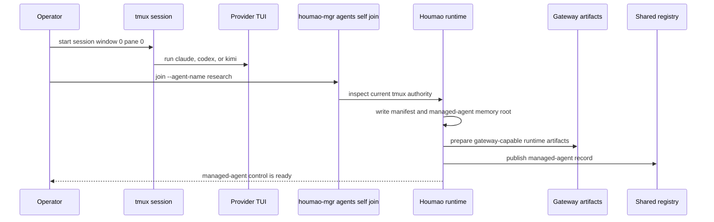

# Quickstart

Houmao is designed to be driven from the CLI agent you already use. You talk to Claude Code, Codex, Kimi, Gemini, or another supported agent surface; that agent reads Houmao system skills; the skills guide it through maintained `houmao-mgr` commands; Houmao then creates, adopts, prompts, inspects, and stops managed agents.

```text
you -> your CLI agent -> Houmao system skills -> houmao-mgr -> managed agents
```

This page starts with that agent-driven path. Direct commands remain visible later as underlying machinery, manual fallback, and source-checkout reference.

## Install Houmao and System Skills

For an installed user:

```bash
uv tool install houmao
command -v tmux
npx skills add igamenovoer/tool-skills/houmao
```

`tmux` is required because local managed agents run inside tmux-backed sessions. When `npx` is available and the target machine has internet access, the Skills CLI path points at Houmao's small release-synced `tool-skills` mirror and lets you choose which packaged skills to install.

Use Houmao's own installer when `npx` is unavailable, when working offline from an installed Houmao package, or when you need explicit projection behavior such as named sets, subset skills, explicit homes, symlink/copy mode, or retired-skill cleanup:

```bash
houmao-mgr system-skills install --tool claude,codex,kimi,gemini,copilot,universal
houmao-mgr system-skills install --tool codex --home ~/.codex --skill-set core
```

Kimi Code 0.11.0 does not expose a native system-prompt flag. Houmao projects `houmao-auto-system-prompt` into managed Kimi homes, but if Kimi has not confirmed the Houmao system prompt is loaded, invoke `houmao-auto-system-prompt` manually before substantive Kimi chat begins.

From a source checkout, run Python-based Houmao commands through Pixi. Installed-user examples such as `houmao-mgr project status` become `pixi run houmao-mgr project status`. Source checkout setup is:

```bash
pixi install
```

Then prefix Houmao commands with `pixi run`.

## Start With Your CLI Agent

Open your CLI agent from the project directory where you want Houmao state to live. Then ask:

```text
$houmao-touring start a guided tour
```

The tour inspects the current directory, checks whether a `.houmao/` project overlay already exists, looks for existing specialists, profiles, and running managed agents, then routes you toward the next useful step. It is the right first prompt when you are new or when you want Houmao to orient itself to the current workspace.

For read-only skill help before starting a workflow, ask:

```text
$houmao-touring help
$houmao-agent-definition help
$houmao-agent-email-comms help
```

Those help prompts explain what the installed skill can do without mutating project state, sending mail, changing gateway state, or changing managed-agent lifecycle state.

## First Useful Run

After the tour confirms the workspace, ask your CLI agent for an outcome instead of a command sequence:

```text
Create a Codex reviewer specialist for this repo, make a reusable project profile, launch it as reviewer-1, ask it to review the current working tree, show me its state, and then stop it when the review is complete.
```

The agent should route through Houmao skills and supported commands. Depending on existing state and your available credentials, it may:

- initialize or inspect the project overlay at `.houmao/`;
- create or select a specialist, which is the reusable role/tool/credential definition;
- create or select a project profile, which stores reusable launch defaults such as managed-agent name, workdir, auth lane, mailbox posture, prompt mode, and optional system-skill policy;
- launch a managed agent, which is the live tmux-backed or headless runtime with manifest, registry, memory, and optional gateway state;
- send a prompt through the maintained messaging or gateway surface;
- inspect state, screen posture, logs, mailbox posture, memory, or turn evidence;
- stop the managed agent when you ask it to.

The important split is that your current CLI agent remains the operator. The managed agent is the worker Houmao created or adopted. You can keep asking your current agent for higher-level outcomes:

```text
Ask reviewer-1 if the migration plan is safe, then summarize its answer.
```

```text
Create two specialists, one builder and one reviewer, prepare separate workspaces, launch both, and coordinate a review loop.
```

```text
Use houmao-agent-loop-pro to turn this multi-agent plan into a runnable loop, validate it, launch the participants, and report status from outside the loop.
```

For the concepts behind those requests, see [Easy Specialists](easy-specialists.md), [Launch Profiles](launch-profiles.md), [Managed Agent Memory](managed-memory-dirs.md), [System Skills Overview](system-skills-overview.md), and [Loop Authoring](loop-authoring.md).

## What The Agent May Run

You do not need to type these commands for the first experience, but they are the maintained surfaces the installed skills route through. Installed users run them as `houmao-mgr ...`; source checkout users run them as `pixi run houmao-mgr ...`.

Initialize or inspect the project overlay:

```bash
houmao-mgr project init
houmao-mgr project status
```

Register a simple reusable project skill, then create a specialist:

```bash
houmao-mgr project skills add \
  --name repo-notes \
  --source ./skills/repo-notes \
  --mode copy

houmao-mgr project specialist create \
  --name reviewer \
  --tool codex \
  --system-prompt "You review repository changes and report concrete risks." \
  --api-key "$OPENAI_API_KEY" \
  --skill repo-notes
```

When `--credential` is omitted, `project specialist create` derives the auth display name as `<specialist>-creds`. The stored credential payload and projected auth directories use opaque internal refs, so display names can stay friendly without becoming storage identifiers.

Create a reusable project profile and launch from it:

```bash
houmao-mgr project profile create \
  --name reviewer-default \
  --specialist reviewer \
  --agent-name reviewer-1 \
  --workdir "$PWD" \
  --prompt-mode unattended \
  --memo-seed-text "Remember that this repo prefers focused risk review."

houmao-mgr project agents launch --profile reviewer-default
```

Project profiles can store a memo seed for managed-agent memory at launch time. Use `--memo-seed-text` for inline memo content, `--memo-seed-file` for one memo file, or `--memo-seed-dir` for a directory containing `houmao-memo.md` and/or `pages/`; use `--clear-memo-seed` when patching a profile to remove the stored seed.

Launch directly from a specialist when the launch context changes each time:

```bash
houmao-mgr project agents launch \
  --specialist reviewer \
  --name reviewer-1 \
  --workdir "$PWD"
```

Prompt, inspect, and stop a running managed agent:

```bash
houmao-mgr agents single --agent-name reviewer-1 prompt \
  --prompt "Review the current working tree and list release-blocking risks."

houmao-mgr agents single --agent-name reviewer-1 state
houmao-mgr project agents stop --name reviewer-1
```

Use the gateway when you need explicit gateway lifecycle, queued requests, TUI state watching, reminders, or gateway-backed prompt delivery:

```bash
houmao-mgr agents single --agent-name reviewer-1 gateway status
houmao-mgr agents single --agent-name reviewer-1 gateway prompt \
  --prompt "Summarize your latest finding in one paragraph."
```

Mailbox state is opt-in for project overlays. Initialize the project-local mailbox root only when you need repo-scoped mailbox work:

```bash
houmao-mgr mailbox init
houmao-mgr project mailbox register \
  --address HOUMAO-reviewer-1@agents.localhost \
  --principal-id HOUMAO-reviewer-1
houmao-mgr project mailbox accounts list
```

For flag-level command details, use the [`houmao-mgr` CLI reference](../reference/cli/houmao-mgr.md), [agents gateway reference](../reference/cli/agents-gateway.md), [agents mail reference](../reference/cli/agents-mail.md), [agents mailbox reference](../reference/cli/agents-mailbox.md), and [system-skills reference](../reference/cli/system-skills.md).

## Adopt An Existing Provider TUI

Use `agents self join` when a provider session already exists and you want Houmao to wrap it instead of building a new managed home first. This is an adoption workflow, not the default first-run path.

Start your provider TUI in tmux window `0`, pane `0`:

```bash
tmux new-session -s hm-demo
claude
```

From inside that same tmux session, adopt it:

```bash
houmao-mgr agents self join --agent-name research
houmao-mgr agents self state
houmao-mgr agents self prompt --prompt "Summarize the current state."
houmao-mgr agents single --agent-name research stop
```



If the adopted session should record a different cwd than tmux window `0`, pane `0`, add `--workdir /path/to/worktree`.

Managed join auto-installs the catalog's managed-join system-skill selection into the adopted home. After join, the current-session commands under `agents self ...` can inspect, prompt, interrupt, use gateway surfaces, use mailbox surfaces, or read and edit managed memory. Selected-agent commands under `agents single --agent-name research ...` can operate the same managed agent from outside its tmux session.

## Local State And Project Roots

For maintained local-state command families such as `project agents launch`, `agents self join`, `mailbox`, and `admin cleanup runtime`, Houmao resolves runtime, managed-agent memory, and mailbox roots from one active project overlay. In project context that means `<active-overlay>/runtime`, `<active-overlay>/memory`, and `<active-overlay>/mailbox`; when no overlay exists yet and the command needs local state, Houmao bootstraps `<cwd>/.houmao` first.

Ambient overlay selection defaults to nearest-ancestor `.houmao/houmao-config.toml` discovery within the current Git boundary. Set `HOUMAO_PROJECT_OVERLAY_DISCOVERY_MODE=cwd_only` when commands run from a subdirectory should ignore a parent overlay and consider only `<cwd>/.houmao`. `HOUMAO_PROJECT_OVERLAY_DIR=/abs/path` remains the stronger explicit overlay-root override.

## Next

- [System Skills Overview](system-skills-overview.md): how Houmao-owned skills let your CLI agent operate Houmao.
- [Easy Specialists](easy-specialists.md): specialists, project profiles, and managed instances.
- [Launch Profiles](launch-profiles.md): reusable birth-time launch configuration.
- [Managed Agent Memory](managed-memory-dirs.md): memo files, pages, and memory skill routing.
- [Gateway Reference](../reference/gateway/index.md): sidecar control, request queue, and mail facade.
- [Mailbox Reference](../reference/mailbox/index.md): filesystem and Stalwart mailbox workflows.
- [`houmao-mgr` CLI Reference](../reference/cli/houmao-mgr.md): exact maintained command surfaces.
