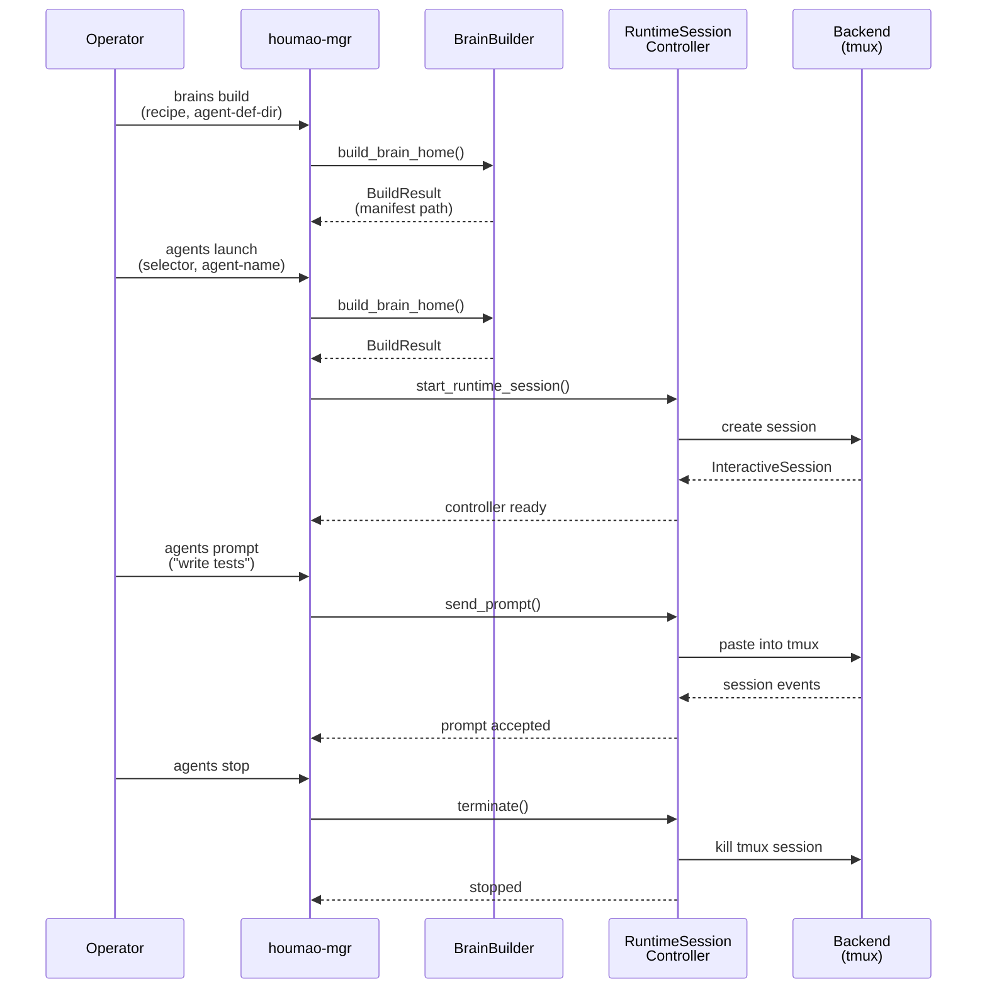

# Quickstart

This guide walks you through building an agent brain and running an interactive session using `houmao-mgr`. By the end, you will have a working agent you can send prompts to and terminate cleanly.



## Prerequisites

- Python 3.11+
- [Pixi](https://pixi.sh/) installed
- A supported CLI tool installed (`claude`, `codex`, or `gemini`)
- API credentials for your chosen tool

Install Houmao and enter the dev shell:

```bash
pixi install && pixi shell
```

## Step 1: Set Up the Agent Definition Directory

The agent definition directory contains everything Houmao needs to build and run agent brains — tool adapters, skills, configs, credentials, recipes, and roles.

Copy the template from the test fixtures:

```bash
mkdir -p .agentsys
cp -r tests/fixtures/agents/ .agentsys/agents/
```

This gives you a working directory structure with example tool adapters, skills, config profiles, recipes, and roles. See [Agent Definition Directory](agent-definitions.md) for a detailed breakdown of each component.

### Add Your Credentials

Credentials are local-only and never committed. Create the credential profile for your tool:

```bash
# For Claude
mkdir -p .agentsys/agents/brains/api-creds/claude/default/env
cat > .agentsys/agents/brains/api-creds/claude/default/env/vars.env << 'EOF'
ANTHROPIC_API_KEY=your-api-key-here
EOF

# For Codex
mkdir -p .agentsys/agents/brains/api-creds/codex/default/env
cat > .agentsys/agents/brains/api-creds/codex/default/env/vars.env << 'EOF'
OPENAI_API_KEY=your-api-key-here
EOF

# For Gemini
mkdir -p .agentsys/agents/brains/api-creds/gemini/default/env
cat > .agentsys/agents/brains/api-creds/gemini/default/env/vars.env << 'EOF'
GEMINI_API_KEY=your-api-key-here
EOF
```

## Step 2: Build a Brain

The build phase resolves a recipe against the agent definition directory and produces a runtime home with projected configs, skills, and credentials.

### Using a Recipe (Recommended)

```bash
pixi run houmao-mgr brains build \
  --agent-def-dir .agentsys/agents \
  --recipe .agentsys/agents/brains/brain-recipes/claude/default.yaml
```

### Using Explicit Parameters

If you prefer to specify each component individually instead of using a recipe:

```bash
pixi run houmao-mgr brains build \
  --agent-def-dir .agentsys/agents \
  --tool claude \
  --skill code-review \
  --skill testing \
  --config-profile default \
  --cred-profile default
```

### Build Options Reference

| Option | Description |
|---|---|
| `--agent-def-dir` | Path to the agent definition directory |
| `--recipe` | Path to a brain recipe YAML file |
| `--tool` | CLI tool name (e.g., `claude`, `codex`, `gemini`) |
| `--skill` | Skill name to include (repeatable) |
| `--config-profile` | Secret-free config profile name |
| `--cred-profile` | Local credential profile name |
| `--runtime-root` | Where to create the runtime home (default: `tmp/`) |
| `--home-id` | Explicit home ID (auto-generated if omitted) |
| `--reuse-home` | Reuse an existing runtime home instead of creating a new one |
| `--launch-overrides` | JSON string of additional launch arguments |
| `--agent-name` | Human-readable agent name |
| `--agent-id` | Unique agent identifier |

On success, the build emits the path to the generated `BrainManifest` and a launch helper script. Note the manifest path — you will need it for the next step.

## Step 3: Launch a Session

Launch an interactive managed agent using the selector-based workflow:

```bash
pixi run houmao-mgr agents launch \
  --agents gpu-kernel-coder \
  --agent-name research \
  --provider claude_code
```

This builds the brain and starts the agent CLI inside a tmux-backed session in one step. The `--agents` selector resolves the brain recipe, `--agent-name` gives the session a friendly name for later targeting, and `--provider` selects the underlying CLI tool (defaults to `claude_code`).

For headless (detached) use, add `--headless`:

```bash
pixi run houmao-mgr agents launch \
  --agents gpu-kernel-coder \
  --agent-name research \
  --provider claude_code \
  --headless
```

To skip the workspace trust confirmation prompt, add `--yolo`.

## Step 4: Send a Prompt

Once a session is running, send prompts to it by targeting the managed agent by name:

```bash
pixi run houmao-mgr agents prompt \
  --agent-name research \
  --prompt "Explain the architecture of this project."
```

You can also target by agent ID with `--agent-id`. For headless backends, the response is returned directly. For interactive backends, the prompt is sent to the tmux session.

## Step 5: Stop the Session

Stop a running managed agent cleanly:

```bash
pixi run houmao-mgr agents stop --agent-name research
```

This stops the agent CLI process and cleans up the tmux session (for interactive backends).

## End-to-End Example

Here is the full managed-agent workflow for building and running a Claude agent:

```bash
# 1. Build the brain (standalone build phase — optional when using `agents launch`)
pixi run houmao-mgr brains build \
  --agent-def-dir .agentsys/agents \
  --recipe .agentsys/agents/brains/brain-recipes/claude/default.yaml

# 2. Launch an interactive managed agent (builds + launches in one step)
pixi run houmao-mgr agents launch \
  --agents gpu-kernel-coder \
  --agent-name research \
  --provider claude_code

# 3. Send a prompt
pixi run houmao-mgr agents prompt \
  --agent-name research \
  --prompt "Hello, what can you help me with?"

# 4. Stop when done
pixi run houmao-mgr agents stop --agent-name research
```

## What's Next

- **[Architecture Overview](overview.md)** — Understand the two-phase lifecycle, backend model, and system architecture.
- **[Agent Definition Directory](agent-definitions.md)** — Deep dive into the directory layout, what each component does, and how they connect.
