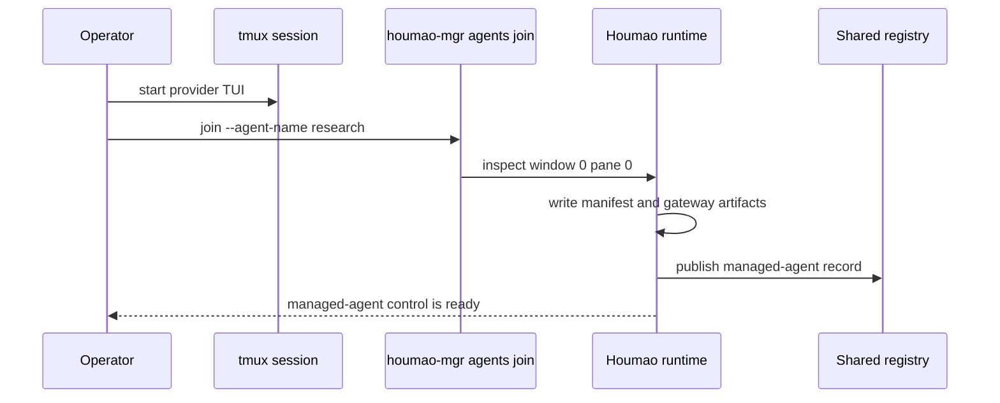

# Quickstart

This guide shows the two supported local entry points:

1. adopt an already-running provider session with `houmao-mgr agents join`
2. build and launch from a repo-local `.houmao/` overlay created by `houmao-mgr project init`

For maintained local-state command families such as `brains build`, `agents launch`, `mailbox`, `admin cleanup runtime`, and `server start`, Houmao now resolves runtime, jobs, and mailbox roots from one active project overlay. In project context that means `<active-overlay>/runtime`, `<active-overlay>/jobs`, and `<active-overlay>/mailbox`; when no overlay exists yet and the command needs local state, Houmao bootstraps `<cwd>/.houmao` first.

Ambient overlay selection defaults to nearest-ancestor `.houmao/houmao-config.toml` discovery within the current Git boundary. Set `HOUMAO_PROJECT_OVERLAY_DISCOVERY_MODE=cwd_only` when you want commands run from a subdirectory to ignore a parent overlay and consider only `<cwd>/.houmao`. `HOUMAO_PROJECT_OVERLAY_DIR=/abs/path` remains the stronger explicit overlay-root override.

## Prerequisites

- Python 3.11+
- [Pixi](https://pixi.sh/)
- A supported CLI tool installed (`claude`, `codex`, or `gemini`)
- Local auth material for the tool you want to use

```bash
pixi install && pixi shell
```

## Workflow 1: Join An Existing Session

Start your provider TUI in tmux window `0`, pane `0`:

```bash
tmux new-session -s hm-demo
claude
```

From the same tmux session:

```bash
pixi run houmao-mgr agents join --agent-name research
pixi run houmao-mgr agents state --agent-name research
pixi run houmao-mgr agents prompt --agent-name research --prompt "Summarize the current state."
pixi run houmao-mgr agents stop --agent-name research
```



Use `agents join` when the provider session already exists and you want Houmao to wrap it without rebuilding a home.

## Workflow 2: Build From A Local `.houmao/` Overlay

### Step 1: Initialize The Project Overlay

```bash
pixi run houmao-mgr project init
```

`project init` creates:

- `.houmao/houmao-config.toml`
- `.houmao/.gitignore`
- `.houmao/catalog.sqlite`
- managed `.houmao/content/prompts/`, `.houmao/content/auth/`, `.houmao/content/skills/`, and `.houmao/content/setups/`
- no `.houmao/agents/`, `.houmao/agents/compatibility-profiles/`, `.houmao/mailbox/`, or `.houmao/easy/` state until you opt into those workflows explicitly

If you need the optional compatibility metadata root pre-created, use:

```bash
pixi run houmao-mgr project init --with-compatibility-profiles
```

If you later run maintained project-aware commands from a nested subdirectory, the default behavior is still to reuse the nearest ancestor overlay you just initialized. Use `HOUMAO_PROJECT_OVERLAY_DISCOVERY_MODE=cwd_only` when you want a nested directory to behave as an independent Houmao project root and bootstrap its own `.houmao/` instead of inheriting the parent one.

### Step 2: Create One Specialist Through `project easy`

```bash
mkdir -p /tmp/notes-skill
printf '# Notes\n\nKeep responses concise and practical.\n' > /tmp/notes-skill/SKILL.md

pixi run houmao-mgr project easy specialist create \
  --name researcher \
  --system-prompt "You are a local repo assistant." \
  --tool claude \
  --api-key your-api-key-here \
  --env-set OPENAI_MODEL=claude-sonnet-4 \
  --with-skill /tmp/notes-skill
```

When `--credential` is omitted, `project easy specialist create` derives the auth bundle name as `<specialist>-creds`. In this example the generated Claude auth bundle is `researcher-creds`.

`--system-prompt` is optional for this higher-level workflow. If you omit both `--system-prompt` and `--system-prompt-file`, Houmao still writes the canonical role prompt file and treats that role as promptless.

For maintained easy launch paths, `project easy specialist create` now persists `launch.prompt_mode: unattended` by default in both the catalog-backed specialist metadata and the generated compatibility preset for Claude, Codex, and Gemini. Use `--no-unattended` when you want the specialist to persist `launch.prompt_mode: as_is` instead. Gemini remains headless-only on `project easy instance launch`, so use `--headless` for Gemini specialists.

Use repeatable `--env-set NAME=value` on `project easy specialist create` when the env is part of the specialist's durable launch semantics and should survive later relaunch. Those records are stored under `launch.env_records`, stay separate from credential env, and should not be used for secrets or auth-owned names such as `OPENAI_API_KEY`.

This higher-level flow persists semantic state in the catalog and snapshots payload content into the managed content store. It also materializes the compatibility projection tree used by the existing builders and runtime:

```text
.houmao/catalog.sqlite
.houmao/content/prompts/researcher.md
.houmao/content/auth/claude/researcher-creds/
.houmao/content/skills/notes/
.houmao/agents/roles/researcher/system-prompt.md
.houmao/agents/roles/researcher/presets/claude/default.yaml
.houmao/agents/tools/claude/auth/researcher-creds/
.houmao/agents/skills/notes/
```

Low-level maintenance still lives under `project agents ...`, but that surface now operates on the compatibility projection tree rather than the canonical semantic store. For example, add or inspect auth bundles directly with `houmao-mgr project agents tools <tool> auth ...`, or scaffold roles and presets with `houmao-mgr project agents roles ...`.

Gemini note:

- `project agents tools gemini auth add|set` and `project easy specialist create --tool gemini` both support `--api-key`, optional `--base-url`, and optional OAuth credentials via `--oauth-creds` or `--gemini-oauth-creds`.
- OAuth-backed managed Gemini homes inject the supported Google-login selector automatically, so fresh runtime homes do not depend on a user-global Gemini `settings.json`.
- Houmao-owned Gemini skills now project into `.agents/skills/`; treat `.gemini/skills/` as a compatibility path rather than the primary managed location.
- `project easy specialist create --tool gemini` now persists unattended launch posture by default; keep `--no-unattended` for explicit `as_is`.

### Step 3: Inspect The Generated Role And Preset

If you want to inspect the compiled project-local source directly:

```bash
pixi run houmao-mgr project easy specialist get --name researcher
pixi run houmao-mgr project agents roles get --name researcher
pixi run houmao-mgr project agents tools claude get
```

The specialist payload reports durable launch config, including any persisted `launch.env_records`.

### Step 4: Build A Brain Home

Using a preset:

```bash
pixi run houmao-mgr brains build \
  --preset roles/researcher/presets/claude/default.yaml
```

Key options:

| Option | Description |
|---|---|
| `--preset` | Path to a preset YAML file, resolved from the effective agent-definition root |
| `--tool` | CLI tool name |
| `--setup` | Checked-in setup bundle |
| `--auth` | Local auth bundle |
| `--skill` | Skill name to include |
| `--runtime-root` | Optional runtime root |
| `--home-id` | Optional fixed runtime-home id |
| `--reuse-home` | Allow reuse of an existing home id |

Because the local project overlay was initialized first, `brains build` discovers `.houmao/houmao-config.toml`, resolves the project-local catalog, and materializes `.houmao/agents/` automatically when the compatibility projection is needed.

Without `--runtime-root`, maintained build and launch flows now place generated homes and manifests under `.houmao/runtime`, and managed-session job dirs under `.houmao/jobs/<session-id>/`, for the same active overlay.

If the selected preset omits `launch.prompt_mode`, current builders resolve that omission to the unattended default. Set `launch.prompt_mode: as_is` explicitly when you want provider startup posture left unchanged.

If the selected preset includes `launch.env_records`, `brains build` treats those values as durable non-credential launch env. They are projected from the specialist config and persist across later relaunches, unlike one-off `project easy instance launch --env-set` input.

### Step 5: Launch A Managed Agent

Launch from the compiled bare role selector:

```bash
pixi run houmao-mgr agents launch \
  --agents researcher \
  --provider claude_code \
  --agent-name research
```

The bare selector plus provider resolves:

- `researcher` + `claude_code`
- to `.houmao/agents/roles/researcher/presets/claude/default.yaml`

You can still override discovery with `--agent-def-dir`, or override auth at launch time with `--auth`.

If you want the higher-level launch path, use:

```bash
pixi run houmao-mgr project easy instance launch \
  --specialist researcher \
  --name research \
  --env-set FEATURE_FLAG_X=1 \
  --env-set OPENAI_BASE_URL
```

That keeps the easy surface split cleanly: `specialist` manages reusable project-local config, while `instance` manages runtime lifecycle.

`project easy instance launch` does not inject prompt-mode policy on its own. It honors the stored specialist launch posture, so a specialist created with the easy default launches unattended and a specialist created with `--no-unattended` launches `as_is`.

There is no separate `--yolo` override on this surface. If you want raw provider startup behavior, store `launch.prompt_mode: as_is`; if you want maintained no-prompt startup posture, use `unattended`.

Gemini specialists remain headless-only on this surface. Use `--headless` when launching a Gemini easy specialist.

Use repeatable `--env-set` on `project easy instance launch` for one-off env on the current live session. This form accepts both `NAME=value` and inherited `NAME`, resolves inherited names from the invoking shell environment, and does not persist into specialist config or survive a later relaunch.

### Step 6: Prompt And Stop

```bash
pixi run houmao-mgr agents prompt \
  --agent-name research \
  --prompt "Explain the architecture of this project."

pixi run houmao-mgr project easy instance stop --name research
```

### Optional: Enable A Project-Local Mailbox Root

Mailbox state is opt-in for project overlays. In project context, both `houmao-mgr mailbox ...` and `houmao-mgr project mailbox ...` now target `.houmao/mailbox` by default, so you no longer need an extra mailbox-root override just to keep one repo-local workflow self-contained.

Initialize it only when you need repo-scoped mailbox work:

```bash
pixi run houmao-mgr mailbox init
pixi run houmao-mgr project mailbox register \
  --address HOUMAO-research@agents.localhost \
  --principal-id HOUMAO-research
pixi run houmao-mgr project mailbox accounts list
```

If you want easy launch to bind a filesystem mailbox account at startup instead of registering it separately, use:

```bash
pixi run houmao-mgr project easy instance launch \
  --specialist researcher \
  --name research \
  --mail-transport filesystem \
  --mail-account-dir /tmp/houmao-mailboxes/research
```

Omit `--mail-account-dir` to use the standard in-root mailbox under `mailboxes/<address>/`. The `email` transport branch is reserved but currently exits with a not-implemented error.

## Next

- [Architecture Overview](overview.md)
- [Agent Definition Directory](agent-definitions.md)
- [Easy Specialists Guide](easy-specialists.md) — when to use easy specialists vs full presets
