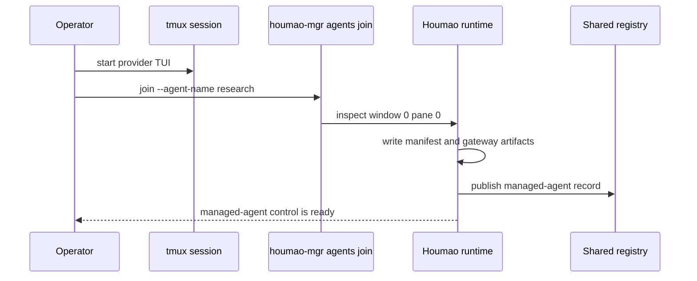

# Quickstart

This guide shows the two supported local entry points:

1. adopt an already-running provider session with `houmao-mgr agents join`
2. build and launch from a repo-local `.houmao/` overlay created by `houmao-mgr project init`

## Prerequisites

- Python 3.11+
- [Pixi](https://pixi.sh/)
- A supported CLI tool installed (`claude`, `codex`, or `gemini`)
- Local auth material for the tool you want to use

```bash
pixi install && pixi shell
```

## Workflow 1: Join An Existing Session

Start your provider TUI in tmux window `0`, pane `0`:

```bash
tmux new-session -s hm-demo
claude
```

From the same tmux session:

```bash
pixi run houmao-mgr agents join --agent-name research
pixi run houmao-mgr agents state --agent-name research
pixi run houmao-mgr agents prompt --agent-name research --prompt "Summarize the current state."
pixi run houmao-mgr agents stop --agent-name research
```



Use `agents join` when the provider session already exists and you want Houmao to wrap it without rebuilding a home.

## Workflow 2: Build From A Local `.houmao/` Overlay

### Step 1: Initialize The Project Overlay

```bash
pixi run houmao-mgr project init
```

`project init` creates:

- `.houmao/houmao-config.toml`
- `.houmao/.gitignore`
- `.houmao/catalog.sqlite`
- managed `.houmao/content/prompts/`, `.houmao/content/auth/`, `.houmao/content/skills/`, and `.houmao/content/setups/`
- no `.houmao/agents/`, `.houmao/agents/compatibility-profiles/`, `.houmao/mailbox/`, or `.houmao/easy/` state until you opt into those workflows explicitly

If you need the optional compatibility metadata root pre-created, use:

```bash
pixi run houmao-mgr project init --with-compatibility-profiles
```

### Step 2: Create One Specialist Through `project easy`

```bash
mkdir -p /tmp/notes-skill
printf '# Notes\n\nKeep responses concise and practical.\n' > /tmp/notes-skill/SKILL.md

pixi run houmao-mgr project easy specialist create \
  --name researcher \
  --system-prompt "You are a local repo assistant." \
  --tool claude \
  --api-key your-api-key-here \
  --with-skill /tmp/notes-skill
```

When `--credential` is omitted, `project easy specialist create` derives the auth bundle name as `<specialist>-creds`. In this example the generated Claude auth bundle is `researcher-creds`.

`--system-prompt` is optional for this higher-level workflow. If you omit both `--system-prompt` and `--system-prompt-file`, Houmao still writes the canonical role prompt file and treats that role as promptless.

This higher-level flow persists semantic state in the catalog and snapshots payload content into the managed content store. It also materializes the compatibility projection tree used by the existing builders and runtime:

```text
.houmao/catalog.sqlite
.houmao/content/prompts/researcher.md
.houmao/content/auth/claude/researcher-creds/
.houmao/content/skills/notes/
.houmao/agents/roles/researcher/system-prompt.md
.houmao/agents/roles/researcher/presets/claude/default.yaml
.houmao/agents/tools/claude/auth/researcher-creds/
.houmao/agents/skills/notes/
```

Low-level maintenance still lives under `project agents ...`, but that surface now operates on the compatibility projection tree rather than the canonical semantic store. For example, add or inspect auth bundles directly with `houmao-mgr project agents tools <tool> auth ...`, or scaffold roles and presets with `houmao-mgr project agents roles ...`.

### Step 3: Inspect The Generated Role And Preset

If you want to inspect the compiled project-local source directly:

```bash
pixi run houmao-mgr project easy specialist get --name researcher
pixi run houmao-mgr project agents roles get --name researcher
pixi run houmao-mgr project agents tools claude get
```

### Step 4: Build A Brain Home

Using a preset:

```bash
pixi run houmao-mgr brains build \
  --preset roles/researcher/presets/claude/default.yaml
```

Key options:

| Option | Description |
|---|---|
| `--preset` | Path to a preset YAML file, resolved from the effective agent-definition root |
| `--tool` | CLI tool name |
| `--setup` | Checked-in setup bundle |
| `--auth` | Local auth bundle |
| `--skill` | Skill name to include |
| `--runtime-root` | Optional runtime root |
| `--home-id` | Optional fixed runtime-home id |
| `--reuse-home` | Allow reuse of an existing home id |

Because the local project overlay was initialized first, `brains build` discovers `.houmao/houmao-config.toml`, resolves the project-local catalog, and materializes `.houmao/agents/` automatically when the compatibility projection is needed.

### Step 5: Launch A Managed Agent

Launch from the compiled bare role selector:

```bash
pixi run houmao-mgr agents launch \
  --agents researcher \
  --provider claude_code \
  --agent-name research
```

The bare selector plus provider resolves:

- `researcher` + `claude_code`
- to `.houmao/agents/roles/researcher/presets/claude/default.yaml`

You can still override discovery with `--agent-def-dir`, or override auth at launch time with `--auth`.

If you want the higher-level launch path, use:

```bash
pixi run houmao-mgr project easy instance launch \
  --specialist researcher \
  --name research \
  --yolo
```

That keeps the easy surface split cleanly: `specialist` manages reusable project-local config, while `instance` manages runtime lifecycle.

### Step 6: Prompt And Stop

```bash
pixi run houmao-mgr agents prompt \
  --agent-name research \
  --prompt "Explain the architecture of this project."

pixi run houmao-mgr project easy instance stop --name research
```

### Optional: Enable A Project-Local Mailbox Root

Mailbox state is opt-in for project overlays. Initialize it only when you need repo-scoped mailbox work:

```bash
pixi run houmao-mgr project mailbox init
pixi run houmao-mgr project mailbox register \
  --address AGENTSYS-research@agents.localhost \
  --principal-id AGENTSYS-research
pixi run houmao-mgr project mailbox accounts list
```

If you want easy launch to bind a filesystem mailbox account at startup instead of registering it separately, use:

```bash
pixi run houmao-mgr project easy instance launch \
  --specialist researcher \
  --name research \
  --yolo \
  --mail-transport filesystem \
  --mail-root ./.houmao/mailbox \
  --mail-account-dir /tmp/houmao-mailboxes/research
```

Omit `--mail-account-dir` to use the standard in-root mailbox under `mailboxes/<address>/`. The `email` transport branch is reserved but currently exits with a not-implemented error.

## Next

- [Architecture Overview](overview.md)
- [Agent Definition Directory](agent-definitions.md)
