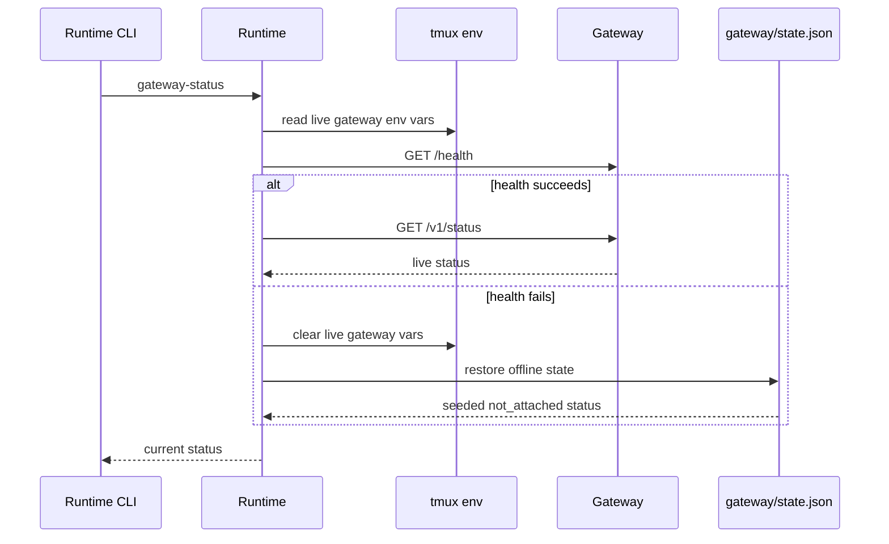

# Runtime-Managed State And Recovery

This page explains which artifacts the runtime owns, how they are published for later discovery, and where the runtime's cleanup or recovery responsibility stops.

## Mental Model

The runtime does not own every part of a live agent session, but it does own the durable envelope around it.

- Backends own provider-specific live state.
- The runtime owns the persisted manifest, session-root layout, and name-resolution rules.
- Tmux environment variables are runtime-published discovery pointers, not the full session record.
- Optional gateway artifacts are nested under the same session root because they belong to the same logical session.

Use [Agents And Runtime](../../system-files/agents-and-runtime.md) for the canonical runtime-owned filesystem inventory. This page keeps the authority and recovery boundaries that sit on top of that layout.

## Runtime-Owned Storage Layout

Authority boundaries:

- `manifest.json` is the runtime's durable session record.
- `gateway/attach.json` is internal bootstrap state for the same logical session.
- `gateway/state.json` is the last known gateway status contract.
- `gateway/run/` is ephemeral live-instance state.

## Discovery Pointers

For tmux-backed sessions, the runtime publishes discovery pointers into tmux session env.

Core runtime pointers:

- `AGENTSYS_MANIFEST_PATH`
- `AGENTSYS_AGENT_ID`
- `AGENTSYS_AGENT_DEF_DIR`

Live gateway pointers, present only while a gateway is attached:

- `AGENTSYS_AGENT_GATEWAY_HOST`
- `AGENTSYS_AGENT_GATEWAY_PORT`
- `AGENTSYS_GATEWAY_STATE_PATH`
- `AGENTSYS_GATEWAY_PROTOCOL_VERSION`

Important rule:

- tmux env helps the runtime rediscover a session quickly, but the manifest and validated live gateway artifacts remain the durable source of truth.
- For attached shared-mailbox work, callers should not scrape these gateway vars directly. The runtime-owned helper `pixi run python -m houmao.agents.mailbox_runtime_support resolve-live` is the supported surface; it prefers current process env, falls back to the owning tmux session env, and validates the live gateway binding before returning `gateway.base_url`.

## Manifest Persistence

`RuntimeSessionController.persist_manifest()` rewrites the manifest from the current backend state after control actions that can change persisted state.

That is why:

- normal prompt turns update the manifest after they finish,
- interrupt or control-input paths persist updated state when relevant,
- stop or close paths persist runtime-visible backend state after cleanup,
- resume reconstructs the runtime envelope from the manifest instead of relying on ambient caller state.

## Recovery And Cleanup Boundaries

The runtime has explicit cleanup behavior, but it is not a full supervisor for every possible failure.

Runtime-owned responsibilities:

- validate and load persisted manifests,
- resolve tmux-backed names into manifest paths,
- persist updated session state after runtime-managed actions,
- detach a live gateway during `stop-session` for tmux-backed sessions when possible,
- clear stale live gateway bindings and restore offline gateway state when a live gateway can no longer be validated.

Outside runtime-owned scope:

- full recovery from every backend-specific failure mode,
- rebuilding unsupported live gateway adapters for backends that are only gateway-capable on paper,
- mailbox transport recovery details beyond the mailbox subsystem's own contracts,
- restoring a lost tmux server from inside the runtime layer.

## Stale Pointer Handling

The runtime deliberately avoids optimistic fallback in a few places.

- Name-based tmux control does not silently fall back to the caller's ambient agent-definition directory if the session pointer is missing.
- Gateway-aware status or request flows validate live env vars structurally and then use `GET /health` before trusting a live gateway.
- If the health check fails, the runtime clears stale live gateway env vars and restores seeded offline state instead of pretending the dead instance is still usable.

## Error Boundaries

The main runtime error families reflect which layer failed:

- `SessionManifestError`: persisted manifest or strict runtime artifact is invalid or unusable.
- `LaunchPlanError`: build or launch-plan composition failed before a live session could be used.
- `Gateway*Error`: gateway lifecycle, discovery, protocol, HTTP, or support boundaries failed.
- `Mailbox*Error`: runtime-owned mailbox command parsing or readiness failed.

These classes are useful because they show whether the problem is in persisted state, discovery, or a live subsystem boundary.

## Current Implementation Notes

- Gateway capability publication is additive for runtime-owned tmux-backed sessions.
- Live gateway attach is narrower than gateway capability publication in v1.
- Gateway cleanup is integrated into tmux-backed stop flows, but legacy non-runtime manifests do not suddenly gain runtime-owned gateway teardown behavior.

## Source References

- [`src/houmao/agents/realm_controller/runtime.py`](../../../../src/houmao/agents/realm_controller/runtime.py)
- [`src/houmao/agents/realm_controller/manifest.py`](../../../../src/houmao/agents/realm_controller/manifest.py)
- [`src/houmao/agents/realm_controller/agent_identity.py`](../../../../src/houmao/agents/realm_controller/agent_identity.py)
- [`src/houmao/agents/realm_controller/errors.py`](../../../../src/houmao/agents/realm_controller/errors.py)
- [`docs/reference/system-files/agents-and-runtime.md`](../../system-files/agents-and-runtime.md)
- [`tests/unit/agents/realm_controller/test_gateway_support.py`](../../../../tests/unit/agents/realm_controller/test_gateway_support.py)
