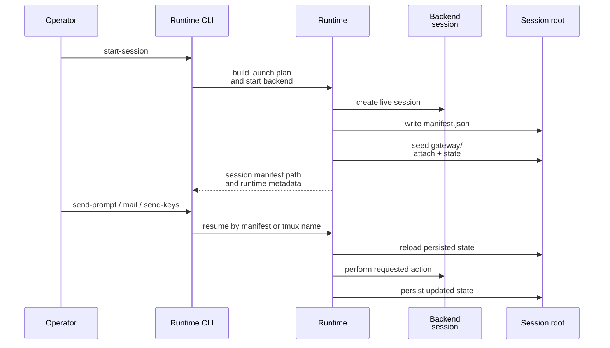
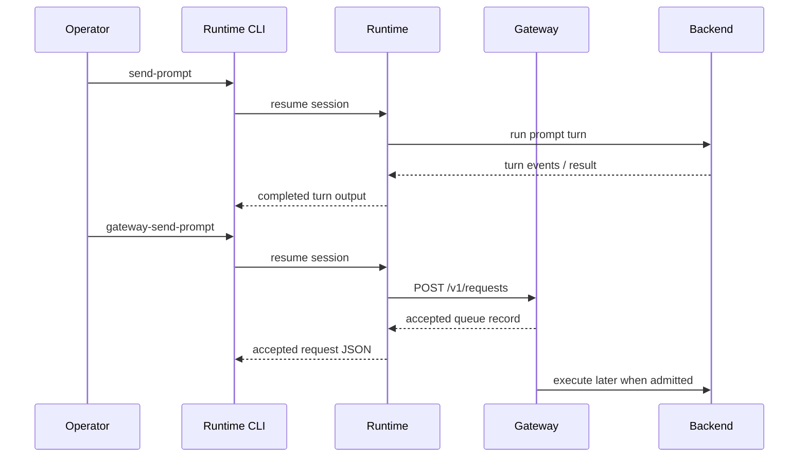

# Runtime-Managed Session And Message Flows

This page explains the runtime-managed workflows that most readers need first: starting or resuming a session, stopping it cleanly, and choosing the right message-passing path for the job.

## Mental Model

The runtime has one durable session model but several ways to talk to the live agent.

- Session lifecycle is runtime-owned: build a launch plan, start or resume a backend session, persist state, and stop it later.
- Prompt turns, raw control input, mailbox prompts, and gateway queue submissions are not interchangeable shortcuts. They exist because they differ in timing, safety, and persistence behavior.
- Gateway capability is published as part of the session model, but a live gateway is still optional.

## Session Lifecycle

The common flow is:

1. build or choose a brain manifest,
2. start a runtime-managed session,
3. persist a session manifest under the session root,
4. use later commands by manifest path or tmux name,
5. stop the session, with gateway cleanup if needed.



Practical consequences:

- Resume is manifest-driven, even when you start from a tmux name.
- Gateway capability publication happens early, but live gateway attach is separate.
- `stop-session` is the runtime-owned shutdown path; it is not only a tmux kill helper.

## Choosing A Message-Passing Path

Use the path whose guarantees match the action you need.

### `send-prompt`

Use for a normal conversational turn.

- Waits for the backend turn to reach its completion or readiness boundary.
- Persists updated backend state into the session manifest afterward.
- This remains the default high-level path even for gateway-capable sessions.

### `send-keys`

Use for raw control input into resumed sessions (currently limited to `cao_rest` backend).

- Returns after input delivery, not after turn completion.
- Designed for slash-command menus, arrow navigation, partial typing, `Escape`, and explicit control keys.
- The current implementation keeps this path limited to the legacy `cao_rest` backend.

### `mail`

Use when the session has mailbox support enabled and the work should be expressed as a mailbox operation.

- The runtime prepares a structured mailbox prompt.
- The prompt still travels through the normal prompt-turn path.
- The mailbox subsystem owns the detailed transport and helper behavior, not the runtime-managed agent page you are reading now.

### Gateway-routed requests

Use when a live gateway is already attached and you want queued control instead of synchronous turn execution.

- `gateway-send-prompt` and `gateway-interrupt` submit work into the sidecar queue.
- They return accepted queue records immediately.
- They do not auto-attach a gateway or wait for turn completion.

## Direct Versus Queued Control



The difference matters:

- direct prompt turns are synchronous from the caller's point of view,
- gateway requests are asynchronous queue submissions,
- raw control input is immediate input delivery,
- mailbox commands are synchronous prompt turns wrapped in a structured mailbox contract.

## Representative Workflows

Start a tmux-backed session:

```bash
pixi run python -m houmao.agents.realm_controller start-session \
  --agent-def-dir tests/fixtures/agents \
  --brain-manifest <runtime-root>/manifests/<home-id>.yaml \
  --role gpu-kernel-coder \
  --backend local_interactive \
  --agent-identity gpu
```

Resume by tmux name for a prompt turn:

```bash
pixi run python -m houmao.agents.realm_controller send-prompt \
  --agent-identity AGENTSYS-gpu \
  --prompt "Continue from the prior answer"
```

Send raw control input:

```bash
pixi run python -m houmao.agents.realm_controller send-keys \
  --agent-identity AGENTSYS-gpu \
  --sequence '/model<[Enter]><[Down]><[Enter]>'
```

Submit queued work through a live gateway:

```bash
pixi run python -m houmao.agents.realm_controller gateway-send-prompt \
  --agent-identity AGENTSYS-gpu \
  --prompt "Queue this through the gateway"
```

## Current Implementation Notes

- Gateway-aware queued control requires a live gateway attachment first.
- If no live gateway is attached, `gateway-status` falls back to seeded offline state instead of pretending the session is not gateway-capable.
- Tmux-backed stop flows try to detach a live gateway before terminating the backend session.
- The runtime-managed session model persists regardless of whether a gateway is attached.

## Troubleshooting

- [Troubleshooting Codex Approval Prompts (Legacy)](../troubleshoot/codex-cao-approval-prompt-troubleshooting.md): Use this when a `cao_rest`-backed Codex session starts normally but a later prompt turn stops on an approval or sandbox menu instead of completing the requested work.

## Source References

- [`src/houmao/agents/realm_controller/cli.py`](../../../../src/houmao/agents/realm_controller/cli.py)
- [`src/houmao/agents/realm_controller/runtime.py`](../../../../src/houmao/agents/realm_controller/runtime.py)
- [`src/houmao/agents/realm_controller/mail_commands.py`](../../../../src/houmao/agents/realm_controller/mail_commands.py)
- [`docs/reference/mailbox/index.md`](../../mailbox/index.md)
- [`tests/unit/agents/realm_controller/test_gateway_support.py`](../../../../tests/unit/agents/realm_controller/test_gateway_support.py)
