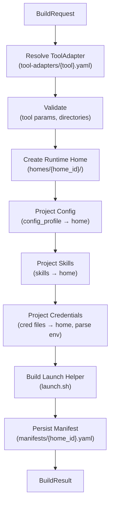
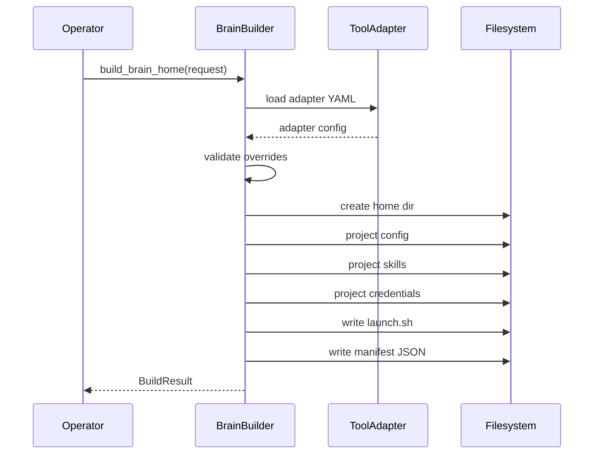

# Brain Builder

Module: `src/houmao/agents/brain_builder.py` — "Brain builder for reusable tool homes and manifests."

The brain builder is the core of the build phase. It takes a `BuildRequest` describing the desired agent brain configuration, resolves it against the agent definition directory, and produces a self-contained runtime home on disk along with a manifest and launch helper.

### Build Pipeline Overview



## BuildRequest

`BuildRequest` is a frozen dataclass that captures all inputs for a brain build.

| Field | Type | Description |
|---|---|---|
| `agent_def_dir` | `Path` | Agent definition directory root |
| `tool` | `str` | Tool identifier (`codex`, `claude`, `gemini`) |
| `skills` | `list[str]` | Skill paths or names to project |
| `config_profile` | `str` | Config profile name |
| `credential_profile` | `str` | Credential profile name |
| `recipe_path` | `Path \| None` | Source recipe file (optional) |
| `recipe_launch_overrides` | `LaunchOverrides \| None` | Launch overrides carried from the recipe |
| `runtime_root` | `Path \| None` | Where to write the built brain home |
| `mailbox` | `MailboxDeclarativeConfig \| None` | Mailbox configuration for inter-agent messaging |
| `agent_name` | `str \| None` | Canonical agent name embedded in manifest |
| `agent_id` | `str \| None` | Stable agent ID |
| `home_id` | `str \| None` | Stable home identifier for reuse |
| `reuse_home` | `bool` | Reuse existing home if `home_id` exists |
| `launch_overrides` | `LaunchOverrides \| None` | Direct launch overrides (merged on top of recipe overrides) |
| `operator_prompt_mode` | `OperatorPromptMode \| None` | Controls operator prompt injection behavior |

## BuildResult

`BuildResult` is a frozen dataclass returned by a successful build.

| Field | Type | Description |
|---|---|---|
| `home_id` | `str` | Unique identifier for the built home |
| `home_path` | `Path` | Absolute path to the runtime home directory |
| `manifest_path` | `Path` | Path to the generated manifest JSON file |
| `launch_helper_path` | `Path` | Path to the generated launch helper script |
| `launch_preview` | `str` | Human-readable preview of the launch command |
| `manifest` | `dict[str, Any]` | The full manifest dictionary |

## Build Process

`build_brain_home(request: BuildRequest) -> BuildResult` executes the following steps:

1. **Load ToolAdapter** — Reads the tool adapter YAML from `brains/tool-adapters/<tool>.yaml` in the agent definition directory.
2. **Validate launch overrides** — Checks that any recipe or direct launch overrides are compatible with the adapter's declared launch metadata.
3. **Create runtime home directory** — Allocates a new directory (or reuses an existing one when `home_id` matches and `reuse_home` is set) under `runtime_root`.
4. **Project configs** — Copies the selected config profile from `brains/cli-configs/<tool>/<profile>/` into the runtime home at the adapter's `config_destination`.
5. **Project skills** — Copies selected skill packages from `brains/skills/` into the runtime home at the adapter's `skills_destination`.
6. **Project credentials** — Maps credential files from `brains/api-creds/<tool>/<profile>/` into the runtime home according to the adapter's `credential_file_mappings`.
7. **Generate manifest JSON** — Writes a secret-free manifest describing the built brain: tool, skills, config profile, launch arguments, env var names, and paths. The manifest intentionally records env var names and local paths, not secret values.
8. **Generate launch helper script** — Writes a shell script that sets the required environment and invokes the tool executable with the resolved launch arguments.

### Build Sequence



## Key Functions

### `build_brain_home`

```python
def build_brain_home(request: BuildRequest) -> BuildResult:
    ...
```

The primary entry point. Accepts a `BuildRequest` and returns a `BuildResult` containing paths to all generated artifacts.

### `load_brain_recipe`

```python
def load_brain_recipe(path: Path) -> BrainRecipe:
    ...
```

Loads and validates a brain recipe from a YAML file. Returns a `BrainRecipe` frozen dataclass that can be used to populate a `BuildRequest`.
